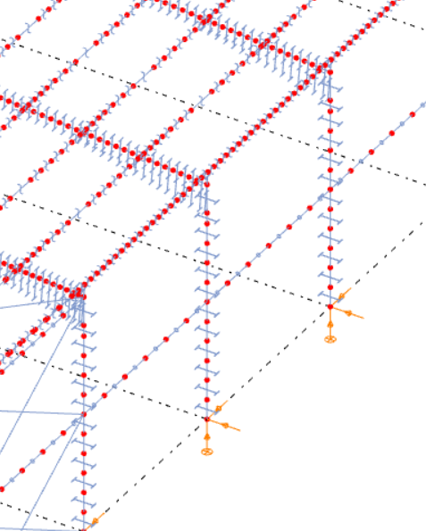
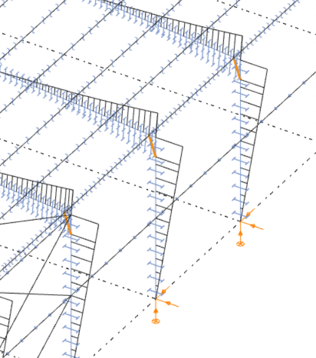
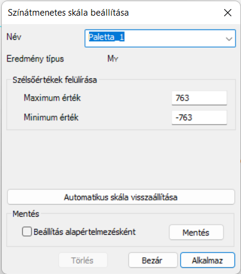
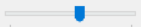
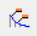
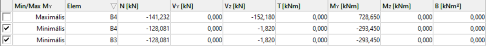
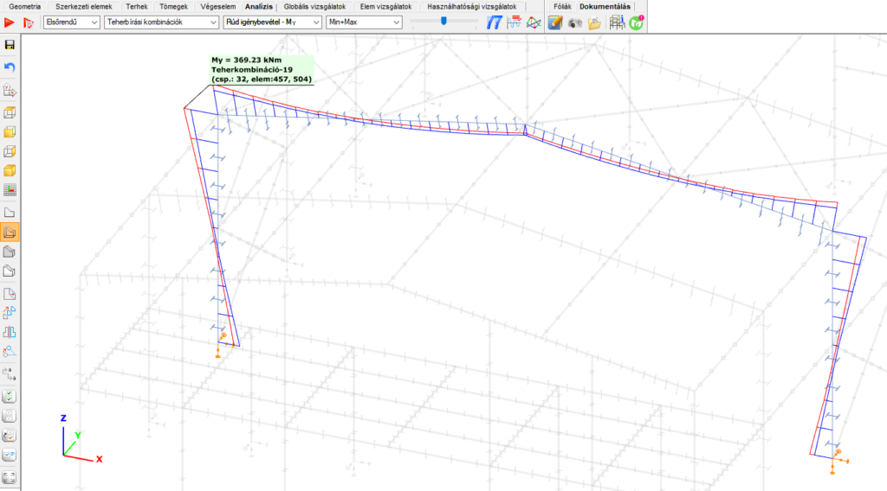
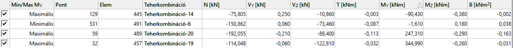
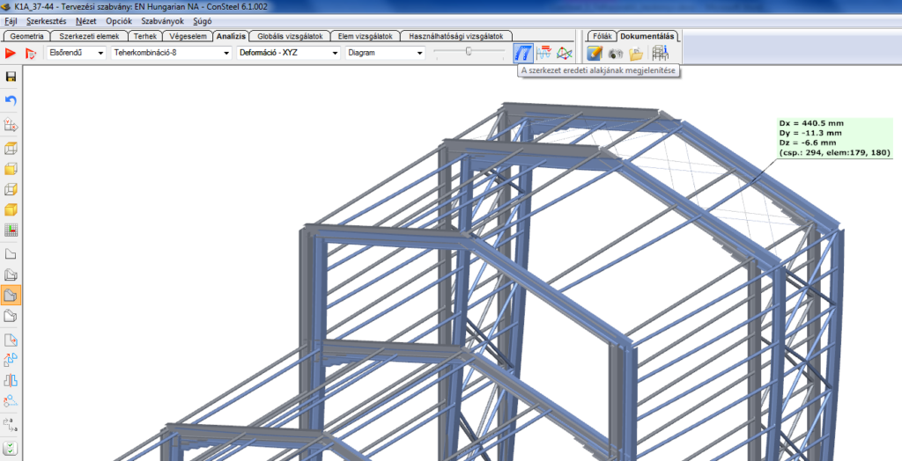
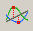

# Analízis eredmények
<!-- wp:heading {"level":3} -->

### Eredmény típusok

<!-- /wp:heading -->

<!-- wp:paragraph -->

A két különböző típusú (rúd és héj) végeselemhez az alábbi analízis eredmények állnak rendelkezésre:

<!-- /wp:paragraph -->

<!-- wp:list {"ordered":true,"type":"1"} -->

1. **Rúd elemek**

**Rugalmas és képlékeny analízis**

<!-- /wp:paragraph -->

<!-- wp:list {"editorskit":{"indent":60,"devices":false,"desktop":true,"tablet":true,"mobile":true,"loggedin":true,"loggedout":true,"acf_visibility":"","acf_field":"","acf_condition":"","acf_value":"","migrated":false,"unit_test":false}} -->

- Első és másodrendű számítás:

  - Deformációk – a végeselem pontokban, globális koordinátarendszerben

    - XYZ – összes elmozdulás komponens
    - X – "X” irányú elmozdulás
    - Y – "Y” irányú elmozdulás
    - Z –"Z” irányú elmozdulás
    - Rx –"X” tengely körüli elfordulás
    - Ry –"Y” tengely körüli elfordulás
    - Rz – „Z” tengely körüli elfordulás
    - W– öblösödés \[1/rad]
    - Rxx – LOKÁLIS “x” tengely körüli elfordulás

  - Igénybevételek – lokális koordinátarendszerben, a végeselemek végpontjaiban

    - N – normálerő
    - Vy – lokális koordinátarendszer “y” irányú nyíróerő
    - Vz – lokális koordinátarendszer “z” irányú nyíróerő
    - T – csavaró nyomaték
    - My – lokális koordinátarendszer „y” körüli hajlító nyomaték
    - Mz – lokális koordinátarendszer „z” körüli hajlító nyomaték
    - B – bimoment

  - Reakcióerők – a támaszok lokális koordinátarendszerében, a támaszokon

    - R – összes reakcióerő és reakciónyomaték komponens
    - RR – összes reakcióerő komponens
    - RRR – összes reakciónyomatékok komponens
    - Rx – globális “X” irányú reakcióerő
    - Ry – globális “Y” irányú reakcióerő
    - Rz – globális “Z” irányú reakcióerő
    - Rxx – globális “X” irányú reakciónyomaték
    - Ryy – globális “Y” irányú reakciónyomaték
    - Rzz – globális “Z” irányú reakciónyomaték

- Statikai sajátértékek és megfelelő sajátalakok – a végeselemek csomópontjaiban, globális koordinátarendszerben, **csak rugalmas analízis esetén**

- Dinamikus sajátértékek és megfelelő saját rezgésalakok – a végeselemek csomópontjaiban, globális koordinátarendszerben, **csak rugalmas analízis esetén**

- Képlékeny csukló – képlékeny csuklók kialakulásának állapotai. Állapotonként a képlékeny csuklók megjelennek a megfelelő végeselem végeken és megjelenítésre kerülnek a teherfaktorok is

<!-- /wp:list -->

<!-- wp:list {"ordered":true,"start":2,"editorskit":{"devices":false,"desktop":true,"tablet":true,"mobile":true,"loggedin":true,"loggedout":true,"acf_visibility":"","acf_field":"","acf_condition":"","acf_value":"","migrated":false,"unit_test":false}} -->

2. **Héj elemek**

<!-- /wp:list -->

<!-- wp:list {"editorskit":{"indent":60,"devices":false,"desktop":true,"tablet":true,"mobile":true,"loggedin":true,"loggedout":true,"acf_visibility":"","acf_field":"","acf_condition":"","acf_value":"","migrated":false,"unit_test":false}} -->

- Első és másodrendű számítás:

  - Deformációk – a végeselem pontokban, globális koordinátarendszerben

    - XYZ – összes elmozdulás komponens
    - X – "X” irányú elmozdulás
    - Y – "Y” irányú elmozdulás
    - Z – "Z” irányú elmozdulás
    - Rx – végeselempont lokális “x” tengelye körüli elfordulása
    - Ry – végeselempont lokális “y” tengelye körüli elfordulása
    - Rz – végeselempont lokális “z” tengelye körüli elfordulása
    - W– öblösödés \[1/rad]
    - Rxx –elfordulása lokális “x” tengely körül

  - Egyensúly – a csomóponti belső erők, és a megfelelő külső erő és reakció komponensek előjeles összegzése, amelynek minden pontban nullával kell egyenlőnek lennie. Ez a feltétele annak, hogy a modell a számított deformált helyzetben egyensúlyban van.

  - Felületi igénybevételek – erők és nyomatékok hosszegységre vetítve végeselem pontokban, lokális koordinátarendszerben

    - mx – szelvényen ható helyi „x” tengelyre merőleges hajlító nyomaték
    - my – szelvényen ható helyi „y” tengelyre merőleges hajlító nyomaték
    - mxy – csavaró nyomaték
    - nx – helyi “x” irányú normálerő
    - ny – helyi “y” irányú normálerő
    - nxy – tárcsa nyíróerő
    - vxz – a szelvényen ható helyi „x” tengelyre merőleges lemez nyíróerő
    - vyz – a szelvényen ható helyi „y” tengelyre merőleges lemez nyíróerő
    - vRz – eredő lemez nyíróerő
    - Ɑn – tárcsa erők fő irányai  
     $\alpha_n=\frac{1}{2}arctan\left [ \frac{2n_{xy}}{n_x-n_y} \right ]\; \; -90^{\circ}< \alpha_n\leq +90^{\circ}$
    - Ɑm – tárcsa erők fő irányai  
     $\alpha_m=\frac{1}{2}arctan\left [ \frac{2m_{xy}}{m_x-m_y} \right ]\; \; -90^{\circ}< \alpha_m\leq +90^{\circ}$

  - Felületi feszültségek – a héj végeselemek felső, középső, és alsó síkjaiban, végeselem pontokban, lokális koordinátarendszerben

    - $\sigma_x$ – “x” irányú normálfeszültség
    - $\sigma_y$ – “y” irányú normálfeszültség
    - $\sigma\_{xy}$ – nyírófeszültség
    - $\sigma_1$ – főfeszültségek maximuma  
     $\sigma_1= \frac{\sigma_x+\sigma_y}{2}+\sqrt{{\left [ \frac{\sigma_x-\sigma_y}{2} \right ]}^2+\sigma_{xy}^2}$
    - $\sigma_2$ – főfeszültségek minimuma  
     $\sigma_1= \frac{\sigma_x+\sigma_y}{2}-\sqrt{{\left [ \frac{\sigma_x-\sigma_y}{2} \right ]}^2+\sigma_{xy}^2}$
    - $\sigma_{HMH}$ – Huber-Mises-Hencky feszültség  
     $\sigma_{HMH}=\sqrt{\sigma_x^2+\sigma_y^2-\sigma_x\sigma_y+3\sigma_{xy}^2}$
    - $\alpha\_{\sigma}$ – feszültségek főirányai  
     $\alpha_{\sigma}=\frac{1}{2}arctan\left [ \frac{2\sigma_{xy}}{\sigma_x-\sigma_y} \right ]\; \; -90^{\circ}< \alpha_{\sigma}\leq +90^{\circ}$

  - Reakciók – megtámasztott csomópontokban, globális koordinátarendszerben

    - R – összes reakcióerő és reakciónyomaték komponens
    - RR – összes reakcióerő komponens
    - RRR – összes reakciónyomaték komponens
    - Rx – globális “X” irányú reakcióerő
    - Ry – globális “Y” irányú reakcióerő
    - Rz – globális “Z” irányú reakcióerő
    - Rxx – globális “X” irányú reakciónyomaték
    - Ryy – globális “Y” irányú reakciónyomaték
    - Rzz – globális “Z” irányú reakciónyomaték

- Statikai sajátértékek és megfelelő sajátalakok – a végeselemek csomópontjaiban, globális koordinátarendszerben

- Dinamikus sajátértékek és megfelelő saját rezgésalakok – a végeselemek csomópontjaiban, globális koordinátarendszerben

<!-- /wp:list -->

<!-- wp:heading {"level":3} -->

### Eredmények megjelenítése

<!-- /wp:heading -->

<!-- wp:paragraph -->

Az analízis során keletkező óriási adatmennyiség hatékony kezelése kiemelt fontosságú. Lehetőséget kell biztosítani az eredmények adott típusának általános, és a pontos, részletes adatok áttekintésére. Az analízis eredmények áttekintésére két fő lehetőség van: a _grafikus nézet_, és az _eredmény táblázatok_ (A _Consteel_-ben alkalmazott táblázatok kezelési funkcióit lásd a **_[Táblázatok általános funkciói](../1_0_general-description/1_4_general-functions-for-tables.md)_** c. fejezetben). A kétféle megjelenítés természetesen szorosan összefüggésben állnak egymással, és az Analízis fül felső részén található funkciókkal módosíthatók. A négy legördülő menü (balról jobbra) a következő beállítási lehetőségeket nyújtja.

<!-- /wp:paragraph -->

<!-- wp:image {"align":"center","id":36833,"sizeSlug":"full","linkDestination":"media","className":"is-style-editorskit-rounded"} -->

<!-- /wp:image -->

<!-- wp:list {"type":"a"} -->

- analízis típusa (lásd. az **_[Analízis típusok](./8_4_analysis-types.md)_** fejezet)
- teherkombináció és teheresetek kiválasztása
- eredmény típus kiválasztása (lásd. az **_[Eredmény típusok](#eredmény-típusok)_** alfejezetet)
- megjelenítési mód kiválasztása (végeselem/diagram/szintvonal/diszkrét színek/szintfelület)

<!-- /wp:list -->

<!-- wp:paragraph -->

A megjelenítési módok rendelkezésre álló lehetőségei az eredménytípustól függenek. A következő opciók állnak rendelkezésre:

<!-- /wp:paragraph -->

<!-- wp:columns -->

<!-- wp:column {"width":"25%","editorskit":{"devices":false,"desktop":true,"tablet":true,"mobile":true,"loggedin":true,"loggedout":true,"acf_visibility":"","acf_field":"","acf_condition":"","acf_value":"","migrated":false,"unit_test":false}} -->

<!-- wp:image {"id":22624,"width":198,"height":246,"sizeSlug":"large","linkDestination":"none"} -->

Végeselem

<!-- /wp:image -->

<!-- /wp:column -->

<!-- wp:column {"width":"25%","editorskit":{"devices":false,"desktop":true,"tablet":true,"mobile":true,"loggedin":true,"loggedout":true,"acf_visibility":"","acf_field":"","acf_condition":"","acf_value":"","migrated":false,"unit_test":false}} -->

<!-- wp:image {"id":22618,"width":220,"height":248,"sizeSlug":"large","linkDestination":"none"} -->

Diagram

<!-- /wp:image -->

<!-- /wp:column -->

<!-- wp:column {"width":"25%","editorskit":{"devices":false,"desktop":true,"tablet":true,"mobile":true,"loggedin":true,"loggedout":true,"acf_visibility":"","acf_field":"","acf_condition":"","acf_value":"","migrated":false,"unit_test":false}} -->

<!-- wp:image {"id":22606,"sizeSlug":"large","linkDestination":"none"} -->

Színezett diagram

<!-- /wp:image -->

<!-- /wp:column -->

<!-- wp:column {"width":"25%","editorskit":{"devices":false,"desktop":true,"tablet":true,"mobile":true,"loggedin":true,"loggedout":true,"acf_visibility":"","acf_field":"","acf_condition":"","acf_value":"","migrated":false,"unit_test":false}} -->

<!-- wp:image {"id":22642,"width":200,"height":248,"sizeSlug":"large","linkDestination":"none"} -->

Deformáció

<!-- /wp:image -->

<!-- /wp:column -->

<!-- /wp:columns -->

<!-- wp:list -->

- Végeselem: csak a végeselemes modell látható, eredmények nélkül.
- Diagram: az eredmények egyvonalas diagrammal jelennek meg.
- Színezett diagram: a diagram vonalak színe az érték előjelétől függ. A negatív értékek kékkel, a pozitív értékek pedig pirossal jelennek meg.
- Deformáció: (csak a deformációs eredmények esetében) a deformált szerkezet jelenik meg.
- Szintfelület: az eredmények a szerkezeti elemek színezésével jelennek meg az ablak jobb felső sarkában látható színpaletta szerint. A paletta testre szabható a palettán jobb egérgombbal történő kattintásra megnyíló **Színátmenetes skála beállításai** párbeszédpanelen.

<!-- /wp:list -->

<!-- wp:columns -->

<!-- wp:column {"width":"50%"} -->

<!-- wp:image {"align":"center","id":22612,"width":310,"height":348,"sizeSlug":"large","linkDestination":"none"} -->

Szintfelület

<!-- /wp:image -->

<!-- /wp:column -->

<!-- wp:column {"width":"50%"} -->

<!-- wp:image {"align":"center","id":36872,"width":300,"height":341,"sizeSlug":"full","linkDestination":"none","className":"is-style-editorskit-rounded"} -->

Paletta testreszabása

<!-- /wp:image -->

<!-- /wp:column -->

<!-- /wp:columns -->

<!-- wp:paragraph -->

A **_[Modell nézetek](../3_0_model-view/3_1_model-views.md)_** fejezetben bemutatott modell nézeti lehetőségek az eredmények grafikai megjelenítésénél is használhatók. A legördülő menük után található csúszka  segítségével az eredmények grafikai megjelenítésének mértéke módosítható.

<!-- /wp:paragraph -->

<!-- wp:paragraph -->

Részletmodell vagy részmodell esetén a grafikai megjelenítés és az eredmény táblázat csak a kiválasztott modell rész eredményeit mutatja. Az eredmény táblázatnak három féle megjelenítése nézete van:

<!-- /wp:paragraph -->

<!-- wp:paragraph -->

 Szélső értékek elemenként: kiválasztja rudanként a szélsőértékeket.

<!-- /wp:paragraph -->

<!-- wp:paragraph -->

 Felhasználói értékek: a felhasználó által elhelyezett jelölők helyein mutatja az értékeket (megjelölést lásd lentebb, a **_[Jelölt eredmények](#jelölt-eredmények)_** fejezetben)

<!-- /wp:paragraph -->

<!-- wp:paragraph -->

 Minden érték: az összes érték megjelenítése végeselem pontonként.

<!-- /wp:paragraph -->

<!-- wp:paragraph -->

Az eredménytáblázatok az értékeket a megjelenített eredménytípusoknak megfelelően rendezik:

<!-- /wp:paragraph -->

<!-- wp:list -->

- elmozdulás típusú eredmények (első- másodrendű deformációk, statikus és dinamikus sajátalakok): végeselem pontok száma, elmozdulás komponensek
- erő típusú eredmények (igénybevételek, felületi erők és feszültségek): végeselem pontok száma, végeselemek száma, erőkomponensek
- reakció típusú eredmények (reakciók, egyensúly): végeselem pontok száma, reakció komponensek

<!-- /wp:list -->

<!-- wp:heading {"level":3} -->

### Jelölt eredmények

<!-- /wp:heading -->

<!-- wp:paragraph -->

Az eredmények grafikus megjelenítésén jelölők helyezhetők el, amelyekkel megmutathatók az értékek. Szerkezeti elemeken történő egér mozgatás esetén, az eredmény jelölő folyamatosan megjelenik, mutatva az aktuális értékeket. Ezek a jelölők rögzíthetők a jobb egér gombbal történő kattintással és a „Megjelölés” opció választásával.

<!-- /wp:paragraph -->

<!-- wp:paragraph -->

Az elhelyezett jelölők minden eredménynézetben láthatók, ahol van értelmezhető eredmény:

<!-- /wp:paragraph -->

<!-- wp:list -->

- Alakváltozás

<!-- /wp:list -->

<!-- wp:image {"align":"center","id":10782,"sizeSlug":"large","linkDestination":"media"} -->

<!-- /wp:image -->

<!-- wp:paragraph -->

Normál erők

<!-- /wp:paragraph -->

<!-- wp:image {"align":"center","id":10788,"sizeSlug":"large","linkDestination":"media"} -->

<!-- /wp:image -->

<!-- wp:paragraph -->

Hajlító nyomaték

<!-- /wp:paragraph -->

<!-- wp:image {"align":"center","id":10794,"sizeSlug":"large","linkDestination":"media"} -->

<!-- /wp:image -->

<!-- wp:image {"align":"center","id":10800,"sizeSlug":"large","linkDestination":"media"} -->

<!-- /wp:image -->

<!-- wp:paragraph -->

Elhelyezett jelölők esetén a „Felhasználói értékek” táblázat tartalmazza a megfelelő értékeket a jelölt pontokban. A táblázatban a jelölök ki/bekapcsolhatók a sorok előtti jelölőnégyzetekkel.

<!-- /wp:paragraph -->

<!-- wp:image {"align":"center","id":36882,"width":768,"height":74,"sizeSlug":"large","linkDestination":"media","className":"is-style-editorskit-rounded"} -->

<!-- /wp:image -->

<!-- wp:paragraph -->

A jelölők az alábbi módokon törölhetők:

<!-- /wp:paragraph -->

<!-- wp:list {"type":"a"} -->

- a táblázat megfelelő sorainak kijelölését követően jobb egérgombbal kattintva és a „Kijelölt sorok törlése” opció választásával
- a grafikus megjelenítésen a jelölt pontra jobb egérgombbal kattintva a „Megjelölés törlése” opció választásával

<!-- /wp:list -->

<!-- wp:paragraph -->

A szélső értékek automatikusan megjelölhetők a „Szélső értékek elemenként” táblázat sorai előtt található jelölőnégyzet segítségével.

<!-- /wp:paragraph -->

<!-- wp:heading {"level":3} -->

### Burkoló ábrák

<!-- /wp:heading -->

<!-- wp:paragraph -->

Consteelben mind rúdelemekre, mind pedig héjfelületekre elérhető az eredmények burkolóábrán való megjelenítési módja. A burkolóábrák az **Analízis** fülön a **teherkombinációk és teheresetek** legördülő menüjéből érhetők el, ha rendelkezésre állnak első és/vagy másodrendű analízis eredmények. Alapértelmezésként két féle burkoló ábra érhető el, egy az összes teherbírási (ULS) egy pedig az összes használhatósági (SLS) kombinációkból származó eredményekhez. Ezek mellett lehetőség van létrehozni saját, egyedi adatok alapján összeállított burkoló ábrákat, erről részletes leírás az **_[Egyénileg összeállított burkoló ábrák](#egyénileg-összeállított-burkoló-ábrák)_** c. fejezetben érhető el!

<!-- /wp:paragraph -->

<!-- wp:image {"align":"center","id":36890,"width":369,"height":238,"sizeSlug":"full","linkDestination":"media","className":"is-style-editorskit-rounded"} -->

<!-- /wp:image -->

<!-- wp:paragraph -->

A következő eredmény típusok ábrázolhatók burkoló ábrás megjelenítési módban (ld. még az **_[Eredmény típusok](#eredmény-típusok)_** alfejezetben található részletes leírást):

<!-- /wp:paragraph -->

<!-- wp:list {"ordered":true,"type":"I"} -->

1. Igénybevételek rudakra
2. Felületi igénybevételek héj elemeken
3. Felületi feszültségek héj elemeken

<!-- /wp:list -->

<!-- wp:paragraph -->

A burkolóábrás megjelenítési mód a következő színsémával kerül megjelenítésre. A minimum értékekhez tartozó ábra pontjai kék színnel, míg a maximum értékekhez tartozó pontok piros színnel kerülnek megjelenítésre. A burkolóábra pontjai fölé mozgatva a kurzort, a megjelenő zászlón a burkoló érték mellett a teherkombináció is megjelenítésre kerül.

<!-- /wp:paragraph -->

<!-- wp:image {"align":"center","id":36898,"width":768,"height":426,"sizeSlug":"large","linkDestination":"media","className":"is-style-editorskit-rounded"} -->

<!-- /wp:image -->

<!-- wp:paragraph -->

A burkolóábrákon jobb egérgombbal a zászlók pozíciója a rögzíthető, ilyenkor az analízis eredmény megjelenítő táblázatban felhasználói értékek részénél kerülnek megjelenítésre a burkoló értékek.

<!-- /wp:paragraph -->

<!-- wp:image {"align":"center","id":36906,"width":768,"height":73,"sizeSlug":"large","linkDestination":"media","className":"is-style-editorskit-rounded"} -->

<!-- /wp:image -->

<!-- wp:heading {"level":4} -->

#### Egyénileg összeállított burkoló ábrák

<!-- /wp:heading -->

<!-- wp:paragraph -->

Az alapértelmezésként elérhető beépített burkolóábrákon (összes ULS és SLS kombináció alapján létrehozott ábrák) túl, lehetőség van egyénileg meghatározott adatok alapján létrehozott burkolóábrák használatára. Egyéni burkolóábrák létrehozására az **Analízis** fül teheresetek és teherkombinációk legördülő menüjének **Egyénileg összeállított burkolóábrák** alatti **Összeállítások definiálása…** funkcióra kattintva van lehetőség.

<!-- /wp:paragraph -->

<!-- wp:image {"align":"center","id":36914,"sizeSlug":"full","linkDestination":"media","className":"is-style-editorskit-rounded"} -->

<!-- /wp:image -->

<!-- wp:paragraph -->

A megjelenő **egyénileg összeállított burkoló ábrák** dialógon az **Új** gomb megnyomásával hozhatók létre új burkolóábrák. Annak függvényében, hogy a Paraméterek panelon a teher kombinációk vagy a teher esetek van kijelölve, a **teherkombinációk és teheresetek** legördülő menü tartalma változik.

<!-- /wp:paragraph -->

<!-- wp:image {"align":"center","id":36922,"width":478,"height":364,"sizeSlug":"full","linkDestination":"media","className":"is-style-editorskit-rounded"} -->

<!-- /wp:image -->

<!-- wp:paragraph -->

Ha a paraméterek panelon a teherkombinációk opció van kijelölve, a legördülő menüből a következő lehetőségek érhetők el:

<!-- /wp:paragraph -->

<!-- wp:list -->

- Összes teherkombináció: Minden leszámolt teherkombináció figyelembevétele a burkolóábra létrehozásához
- Kiválasztott teherkombinációk: A jelölőnégyzetekkel kiválasztott teherkombinációk figyelembevétele a burkolóábra létrehozásához
- Kiválasztott tehereseteket tartalmazó teherkombinációk: Azon teherkombinációk figyelembevétele a burkolóábra létrehozásához, melyek tartalmazzák a jelölőnégyzetekkel kiválasztott tehereseteket

<!-- /wp:list -->

<!-- wp:image {"align":"center","id":36930,"width":457,"height":207,"sizeSlug":"full","linkDestination":"media","className":"is-style-editorskit-rounded"} -->

<!-- /wp:image -->

<!-- wp:paragraph -->

Ha a paraméterek panelon a teheresetek opció van kijelölve, a legördülő menüből a következő lehetőségek érhetők el:

<!-- /wp:paragraph -->

<!-- wp:list -->

- Összes tehereset: Minden leszámolt tehereset figyelembevétele a burkoló ábra előállításához
- Kiválasztott teheresetek: Csak a jelölőnégyzetek segítségével kiválasztott teheresetek figyelembevétele a burkoló ábra előállításához

<!-- /wp:list -->

<!-- wp:paragraph -->

Az egyéni burkolóábrák összeállítása után és a dialóg bezárása után azok a teheresetek és teherkombinációk legördülő menüben kerülnek listázásra, az **egyénileg összeállított burkolóábrák** rész alatt:

<!-- /wp:paragraph -->

<!-- wp:image {"align":"center","id":36940,"sizeSlug":"full","linkDestination":"media","className":"is-style-editorskit-rounded"} -->

<!-- /wp:image -->

<!-- wp:heading {"level":3} -->

### A szerkezet eredeti alakjának megtekintése

<!-- /wp:heading -->

<!-- wp:paragraph -->

A szerkezet eredeti alakjának megtekintés funkció  megjeleníti a szerkezet eredeti és deformált alakját egy időben:

<!-- /wp:paragraph -->

<!-- wp:image {"align":"center","id":36948,"width":512,"height":262,"sizeSlug":"large","linkDestination":"media","className":"is-style-editorskit-rounded"} -->

<!-- /wp:image -->

<!-- wp:heading {"level":3} -->

### Mértékadó értékek táblázata

<!-- /wp:heading -->

<!-- wp:paragraph -->

Az Analízis fül utolsó ikonja  segítségével előállítható mértékadó értékek táblázata. A táblázat nézet érzékeny, ami azt jelenti, hogy mindig az aktuálisan nézett eredmény típus kerül dominánsként megjelölésre a táblázatban. A táblázatban csak a szerkezeti elemek végein lévő értékek kerülnek megjelenítésre. A táblázaton az alábbi lehetőségek találhatók:

<!-- /wp:paragraph -->

<!-- wp:image {"align":"center","id":36960,"width":715,"height":507,"sizeSlug":"full","linkDestination":"media","className":"is-style-editorskit-rounded"} -->

<!-- /wp:image -->

<!-- wp:paragraph -->
**Határállapot**: kiválasztható a vizsgált határállapot (a teherbírási határállapothoz a belső erők és a reakciók, míg a használhatósági határállapothoz a deformációk automatikusan megjelennek)

<!-- /wp:paragraph -->

<!-- wp:paragraph -->

**Szélső értékek**: szélsőérték típusának kiválasztása

<!-- /wp:paragraph -->

<!-- wp:paragraph -->

**Leválogatás**: az értékek megjelenítése rudanként, rúdcsoportonként vagy szelvényenként

<!-- /wp:paragraph -->

<!-- wp:paragraph -->

**Rúdvég**: a rúdvégi eredmények megjeleníthetők külön-külön (A,B külön), vagy együtt is (Mindkét vég)

<!-- /wp:paragraph -->

<!-- wp:paragraph -->

Az önálló és a többszörös komponens kiválasztás is lehetséges. A kiválasztott mértékadó értékek cellái színezéssel kiemelésre kerülnek. A mértékadónak jelölt oszlop tartalmazza a mértékadó komponenseket.

<!-- /wp:paragraph -->

<!-- wp:image {"align":"center","id":36968,"width":713,"height":505,"sizeSlug":"full","linkDestination":"media","className":"is-style-editorskit-rounded"} -->

<!-- /wp:image -->

<!-- wp:heading {"level":3} -->

### Rezgésalakok animációja

<!-- /wp:heading -->

<!-- wp:columns -->

<!-- wp:column -->

<!-- wp:paragraph -->

Dinamikai vizsgálat esetén elérhető a rezgés alakok animációja az  ikonra kattintva. Az animáció sebessége a csúszka mozgatásával növelhető és csökkenthető.

<!-- /wp:paragraph -->

<!-- /wp:column -->

<!-- wp:column -->

<!-- wp:image {"align":"center","id":10872,"sizeSlug":"large","linkDestination":"media"} -->

<!-- /wp:image -->

<!-- /wp:column -->

<!-- /wp:columns -->

<!-- wp:paragraph -->

<!-- /wp:paragraph -->
