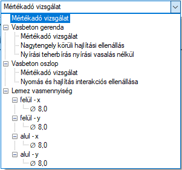

# Vasbeton szerkezetek tervezése
<!-- wp:paragraph -->

**Consteel 16**

<!-- /wp:paragraph -->

<!-- wp:paragraph {"align":"justify"} -->

A vasbeton szerkezetek tervezése a globális vizsgálatok fülről érhető el. A globális tervezés ikonra kattintva  , a megjelenő **Tervezés…** dialógon az acél, illetve öszvér tervezési lehetőségek alatt, a **Vasbeton tervezés** EN1992-1-1 csoportban található meg a **Gerenda tervezés**, **Oszlop tervezés**, illetve **Lemezek minimális vashányad számítása** opció. Amennyiben rendelkezésre állnak a tervezéshez szükséges bemeneti adatok _(keresztmetszetek, vasalási paraméterek, tervezési paraméterek és analízis eredmények)_, úgy a jelölőnégyzetek aktívak, és bejelölhetők. Ezután a **Számítás** gombra kattintva a kiválasztott teherkombinációkra a szabványos vizsgálatok végrehajtásra kerülnek.

<!-- /wp:paragraph -->

<!-- wp:image {"id":51850,"width":430,"height":411,"sizeSlug":"full","linkDestination":"media","className":"is-style-editorskit-rounded"} -->

Tervezési beállítások - vasbeton szerkezetek

<!-- /wp:image -->

<!-- wp:paragraph -->

A vasbeton tervezéshez a szükséges bemenő paraméterek a következők (részletesen lásd a **_[Vasbeton keresztmetszetek](../5_0_structural-modeling/5_2_line-members.md#vasbeton-keresztmetszetek)_** fejezetben):

- Vasbeton gerendák esetében:

  - _[Méretezési opcióval rendelkező vasbeton keresztmetszet](../5_0_structural-modeling/5_2_line-members.md#méretezési-opcióval-nem-rendelkező-vasbeton-keresztmetszetek-2)_
  
  - _[Vasbeton gerendához rendelt gerendavasalási objektum](../5_0_structural-modeling/5_2_line-members.md#gerenda-vasalás-definiálása)_

  - _[Első vagy másodrendű analízis eredmények](../8_0_structural-analysis/8_5_analysis-results.md#eredmény-típusok)_

* Vasbeton oszlopok esetében:

  - _[Méretezési opcióval rendelkező vasbeton keresztmetszet](../5_0_structural-modeling/5_2_line-members.md#méretezési-opcióval-rendelkező-vasbeton-keresztmetszetek-1)_
 
  - _[Vasbeton oszlophoz rendelt oszlopvasalási objektum](../5_0_structural-modeling/5_2_line-members.md#oszlop-vasalás-definiálása)_
  
  - A vasbeton oszlophoz rendelt tervezési paraméter (lásd _[lejjebb](#vasbeton-oszlopok-tervezési-paraméterei)_)
 
  - _[Globális imperfekciók](../6_0_structural-loads/6_4_global-imperfections.md)_ (szükség esetén)
  
  - _[Első vagy másodrendű analízis eredmények](../8_0_structural-analysis/8_5_analysis-results.md#eredmény-típusok)_
  

- Vasbeton lemezek esetében:

  - _[Egyes főirányokhoz tartozó vasalási paraméterek](../5_0_structural-modeling/5_3_surface-members.md#felületi-elemek)_

  - _[Első vagy másodrendű héj elem analízis eredmények](../8_0_structural-analysis/8_5_analysis-results.md)_

Amennyiben a vasbeton tervezéshez szükséges bemenő adatok rendelkezésre állnak, a számítás gombra kattintva a szabványos ellenőrzéseket a Consteel minden keresztmetszetre automatikusan elvégzi. A keresztmetszetekhez tartozó mértékadó kihasználtságokat eredményező vizsgálatokat a Consteel, a **Mértékadó kihasználtságok** táblázatban automatikusan kigyűjti, a modell grafikán pedig színkódos ábrázolással megjeleníti.

<!-- /wp:paragraph -->

<!-- wp:image {"align":"center","id":37213,"width":768,"height":497,"sizeSlug":"large","linkDestination":"media","className":"is-style-editorskit-rounded","editorskit":{"devices":false,"desktop":true,"tablet":true,"mobile":true,"loggedin":true,"loggedout":true,"acf_visibility":"","acf_field":"","acf_condition":"","acf_value":"","migrated":false,"unit_test":false}} -->

<!-- /wp:image -->

<!-- wp:paragraph -->

A képernyő bal felső sarkában található legördülő menüben az egyes vizsgálatok eredményei külön-külön is lekérhetők:

<!-- /wp:paragraph -->

<!-- wp:image {"id":37205,"sizeSlug":"full","linkDestination":"none"} -->

<!-- /wp:image -->

<!-- wp:paragraph -->

**Consteel 15**

<!-- /wp:paragraph -->

<!-- wp:paragraph {"align":"justify"} -->

A vasbeton szerkezetek tervezése a globális vizsgálatok fülről érhető el. A globális tervezés ikonra kattintva  , a megjelenő **Tervezés…** dialógon az acél, illetve öszvér tervezési lehetőségek alatti **Vasbeton tervezés EN1992-1-1** csoportban található meg a **vasbeton gerenda**, **vasbeton oszlop**, illetve **vasbeton lemez minimális vashányad számítása** opció. Amennyiben rendelkezésre állnak a tervezéshez szükséges bemeneti adatok _(keresztmetszetek, vasalási paraméterek, tervezési paraméterek és analízis eredmények)_, úgy a jelölőnégyzetek segítségével kiválasztható, hogy a **Számítás** gombra kattintva a kiválasztott teherkombinációkra a szabványos vizsgálatok végrehajtásra kerüljenek.

<!-- /wp:paragraph -->

<!-- wp:image {"align":"center","id":37221,"width":442,"height":458,"sizeSlug":"full","linkDestination":"media","className":"is-style-editorskit-rounded","editorskit":{"devices":false,"desktop":true,"tablet":true,"mobile":true,"loggedin":true,"loggedout":true,"acf_visibility":"","acf_field":"","acf_condition":"","acf_value":"","migrated":false,"unit_test":false}} -->

A vasbeton tervezéshez a szükséges bemenő paraméterek a következők (részletesen lásd a **_[Vasbeton keresztmetszetek](../5_0_structural-modeling/5_2_line-members.md#vasbeton-keresztmetszetek)_** fejezetben):

- Vasbeton gerendák és oszlopok esetében:

  - [Méretezési opcióval rendelkező vasbeton keresztmetszet](../5_0_structural-modeling/5_2_line-members.md#méretezési-opcióval-rendelkező-vasbeton-keresztmetszetek-1)

  - [Vasbeton rúdelemhez rendelt vasalási objektum](../5_0_structural-modeling/5_2_line-members.md#gerenda-vasalás-definiálása)
  
  - [Első vagy másodrendű analízis eredmények](../8_0_structural-analysis/8_5_analysis-results.md#eredmény-típusok)

* Vasbeton lemezek esetében:

  - [Egyes főirányokhoz tartozó vasalási paraméterek](../5_0_structural-modeling/5_3_surface-members.md#felületi-elemek)

  - [Első vagy másodrendű héj elem analízis eredmények](../8_0_structural-analysis/8_5_analysis-results.md)
 

Amennyiben a vasbeton tervezéshez szükséges bemenő adatok rendelkezésre állnak, a számítás gombra kattintva a szabványos ellenőrzéseket a Consteel minden keresztmetszetre automatikusan elvégzi. A keresztmetszetekhez tartozó mértékadó kihasználtságokat eredményező vizsgálatokat a Consteel, a **Mértékadó kihasználtságok** táblázatban automatikusan kigyűjti, a modell grafikán pedig színkódos ábrázolással megjeleníti.

<!-- /wp:paragraph -->

<!-- wp:image {"align":"center","id":37213,"width":768,"height":497,"sizeSlug":"large","linkDestination":"media","className":"is-style-editorskit-rounded","editorskit":{"devices":false,"desktop":true,"tablet":true,"mobile":true,"loggedin":true,"loggedout":true,"acf_visibility":"","acf_field":"","acf_condition":"","acf_value":"","migrated":false,"unit_test":false}} -->

<!-- /wp:image -->

<!-- wp:paragraph -->

A képernyő bal felső sarkában található legördülő menüben az egyes vizsgálatok eredményei külön-külön is lekérhetők:

<!-- /wp:paragraph -->

<!-- wp:image {"id":37205,"sizeSlug":"full","linkDestination":"none"} -->

<!-- /wp:image -->

<!-- wp:heading {"level":3,"editorskit":{"devices":false,"desktop":true,"tablet":true,"mobile":true,"loggedin":true,"loggedout":true,"acf_visibility":"","acf_field":"","acf_condition":"","acf_value":"","migrated":false,"unit_test":false}} -->

### Vasbeton gerendák tervezése

<!-- /wp:heading -->

<!-- wp:spacer {"height":"1px"} -->

<!-- /wp:spacer -->

<!-- wp:paragraph -->

A vasbeton gerenda tervezés az **Eurocode 1992-1-1** következő vizsgálatait hajtja végre:

- Szerkesztési szabályok

  - EN 1992-1-1 9.2.1.1. (1) (9.1.n) formula, Minimális hosszirányú vasmennyiség ellenőrzés
  
  - EN 1992-1-1 9.2.1.1. (3) formula, Maximális hosszirányú vasmennyiség ellenőrzés
 
* Hajlítás

  - EN 1992-1-1 6.1, Nagytengely körüli hajlítás ellenőrzés

- Nyírás

  - EN 1992-1-1 9.2.2. (6) (9.6.N) formula, Maximális kengyeltávolság ellenőrzés

  - EN 1992-1-1 9.2.2. (5) (9.5.n) formula, Minimális fajlagos kengyel mennyiség ellenőrzés

  - EN 1992-1-1 6.2.2. (1) (6.2.a) és (6.2.b) formula, Nyírási teherbírás tervezési értéke nyírási vasalás nélkül
 
  - EN 1992-1-1 6.2.3. (3) (6.8) és (6.9) formula, Nyírási teherbírás tervezési értéke nyírási vasalással

* Nyírás és csavarás interakciója

  - EN 1992-1-1 6.3.2. (4) (6.29) formula, Ferde nyomott betonzónák teherbírása

  - EN 1992-1-1 6.3.2 (5) (6.31) formula, Szükséges csavarási hosszvasalás

  - EN 1992-1-1 6.3.2. (3) (6.28) formula, Alkalmazott csavarási hosszvasalás ellenőrzés

### Vasbeton oszlopok tervezése

**Consteel 16**

Vasbeton oszlop objektum tulajdonságai

A Consteel támogatja az EN 1992-1-1 által meghatározott különböző tervezési módszereket, köztük a következőket

- Névleges merevségen alapuló módszer (EN 1992-1-1 5.8.7)

* Névleges görbületen alapuló módszer (EN 1992-1-1 5.8.8)

  - tervezés manuálisan megadott paraméterekkel

  - tervezés a globális modell alapján kapott automata értékekkel

A választott módszer, valamint a szükséges vagy választható paraméterek a vasbeton oszlop típusú keresztmetszettel rendelkező rúdelem tulajdonságaként adhatók meg az Objektum tulajdonságok panel segítségével.

A névleges merevségen alapuló módszer alkalmazásához és a névleges görbületen alapuló módszer automatikus opciójához a megfelelő globális imperfekciók definiálására lehet szükség, lásd [**6.4. Globális imperfekciók**](../6_0_structural-loads/6_4_global-imperfections.md**).

A vasbeton oszlop tervezés az **Eurocode 1992-1-1** következő vizsgálatait hajtja végre:

- Szerkesztési szabályok

  - EN 1992-1-1 9.5.2 (1), Hosszirányú acélbetétek minimális átmérője

  - EN 1992-1-1 9.5.2 (2), (9.12.N) formula, Minimális hosszirányú vasmennyiség
 
  - EN 1992-1-1 9.5.2 (3), Maximális hosszirányú vasmennyiség

  - EN 1992-1-1 9.5.3. (1), Kengyel minimális átmérője

  - EN 1992-1-1 9.5.3 (2), Maximális kengyeltávolság

* Hajlítás

  - EN 1992-1-1 5.8.3, 5.8.8, Ferde hajlítás

- Nyírás

  - EN 1992-1-1 6.2.2 (1) (6.2.a) és (6.2.b) formula, Nyírási teherbírás tervezési értéke nyírási vasalás nélkül

  - EN 1992-1-1 6.2.3. (3) (6.8) és (6.9) formula, Nyírási teherbírás tervezési értéke nyírási vasalással

#### **_Vasbeton oszlopok tervezési paraméterei_**

Egy Consteel modell több vasbeton oszlop tervezési paraméterkészletet is tartalmazhat, amelyek hozzárendelhetők a vasbeton oszlopokhoz. A **Paraméter csomagok vasbeton oszlop tervezéshez** párbeszédpanel a vasbeton oszlop keresztmetszetű rúdelem tulajdonságfájában, a Tervezési paraméterek sorban, a  gombra kattintva nyitható meg. A már létrehozott csomagokat a párbeszédpanel összefoglaló képernyője jeleníti meg.

Paraméter csomagok vasbeton oszlop tervezéshez

Egy új tervezési paraméter csomag definiálása az **+ Új létrehozása** gombbal indítható el. Új paraméter csomagot egy már meglévő alapján is lehet definiálni a **+ Új létrehozása meglévőből** gomb segítségével.

Egy csomagot a soron való dupla kattintással vagy a ikonnal lehet módosítani, és a  ikonnal lehet törölni.

Először az alkalmazott tervezési módszert határozzuk meg:

Tervezési módszer kiválasztása vasbeton oszlop tervezéshez

A választástól függően a párbeszédpanel további bevitelt fog kérni.

**A névleges görbületen alapuló módszer**

Névleges másodrendű hatások meghatározása vasbeton oszlop tervezéshez

Az automatikus opció további analízis eredményeken alapul, mint például a stabilitási és a stabilitás érzékenységi analízis.

Az egyedi érték kiválasztása akkor ajánlott, ha a tervező manuálisan kívánja szabályozni a fontos tervezési bemeneti paramétereket, mint például a kihajlási hosszakat,

Kihajlási paraméterek megadása vasbeton oszlop tervezéshez

vagy közvetlenül szeretné meghatározni a figyelembe vett maximális görbületi érték kiszámításához szükséges paramétereket:

Görbületi paraméterek vasbeton oszlop tervezéshez

Az automatikus opció nem igényel ilyen meghatározásokat. Ezenkívül opcionálisan merevségcsökkentő értékek is megadhatók.

Merevségcsökkentés megadása analízishez

<!-- /wp:image -->

<!-- wp:paragraph -->

**Névleges merevségen alapuló módszer**

<!-- /wp:paragraph -->

<!-- wp:paragraph -->

Ennek a módszernek a használatához feltétlenül meg kell határozni az alkalmazandó merevségi értékeket, nemcsak az oszlopokra, hanem a kapcsolódó gerendaelemekre is. Két lehetőség áll rendelkezésre.

<!-- /wp:paragraph -->

<!-- wp:paragraph -->

Az egyik a Ks és Kc tényezők meghatározása (lásd az EN 1992-1-1 5.8.7.2. pontját).

<!-- /wp:paragraph -->

<!-- wp:image {"align":"center","id":51895,"width":329,"height":215,"sizeSlug":"full","linkDestination":"media","className":"is-style-editorskit-rounded"} -->

Analízishez alkalmazott merevségcsökkentés megadása

<!-- /wp:image -->

<!-- wp:paragraph -->

A másik a rúdelem Ely és Elz hajlító merevségeire alkalmazott közvetlen merevségcsökkentő tényezők meghatározásával.

<!-- /wp:paragraph -->

<!-- wp:image {"align":"center","id":51868,"width":324,"height":221,"sizeSlug":"full","linkDestination":"media","className":"is-style-editorskit-rounded"} -->

Analízishez alkalmazott merevségcsökkentés megadása

<!-- /wp:image -->

<!-- wp:paragraph -->

A bevitt értékeket a felhasználónak kell meghatároznia. Közvetlen merevség-módosító tényezők használata esetén a megadott értékek automatikusan csökkentésre kerülnek a kúszás hatásának figyelembevétele érdekében.

<!-- /wp:paragraph -->

<!-- wp:heading {"level":4} -->

#### **_Vasbeton gerendák tervezési paraméterei_**

<!-- /wp:heading -->

<!-- wp:paragraph -->

Az _[oszloptervezési paraméterekhez](../9_0_standard-design/9_2_reinforced-concrete-design.md#vasbeton-oszlopok-tervezési-paraméterei)_ hasonlóan egy Consteel modell több vasbeton gerenda tervezési paramétert tartalmazhat, melyek a tulajdonságfán a vasbeton gerenda elemekhez rendelhetők. A **Paraméter csomagok vasbeton gerenda tervezéshez** párbeszédpanel a vasbeton gerenda keresztmetszetű rúdelem tulajdonságfájában, a Tervezési paraméterek sorban, a  gombra kattintva nyitható meg. A létrehozott paramétereket az összefoglaló képernyő mutatja be:

<!-- /wp:paragraph -->

<!-- wp:image {"align":"center","id":51886,"width":768,"height":282,"sizeSlug":"large","linkDestination":"media","className":"is-style-editorskit-rounded"} -->

Tervezési paraméter csomagok vasbeton gerendákhoz

<!-- /wp:image -->

<!-- wp:paragraph -->

Egy új tervezési paraméter csomag definiálása az **+ Új létrehozása** gombbal indítható el. Új paraméter csomagot egy már meglévő alapján is lehet definiálni a **+ Új létrehozása meglévőből** gomb segítségével.

<!-- /wp:paragraph -->

<!-- wp:paragraph -->

Egy csomagot a soron való dupla kattintással vagy a ikonnal lehet módosítani, és a  ikonnal lehet törölni.

<!-- /wp:paragraph -->

<!-- wp:paragraph -->

**Ha a vasbeton oszlopok tervezéséhez a névleges merevségen alapuló módszert alkalmazzuk, akkor a szerkezet merevségéhez hozzájáruló vasbeton gerendákhoz is hozzá kell rendelni egy megfelelő merevségcsökkentő értéket.**

<!-- /wp:paragraph -->

<!-- wp:paragraph -->

A párbeszédpanel hasonló az _[oszlopokéhoz](../9_0_standard-design/9_2_reinforced-concrete-design.md#vasbeton-oszlopok-tervezési-paraméterei)_, de csak a merevségcsökkentő paraméterek meghatározásával kapcsolatos részt tartalmazza.

<!-- /wp:paragraph -->

<!-- wp:image {"id":51931,"width":336,"height":370,"sizeSlug":"full","linkDestination":"media","className":"is-style-editorskit-rounded"} -->

Tervezési paraméterek megadása vasbeton gerenda tervezéshez

<!-- /wp:image -->

<!-- wp:paragraph -->

Nem kell tervezési paramétert rendelni a gerendákhoz, ha az oszlopokat a névleges görbület alapján tervezzük.

<!-- /wp:paragraph -->

<!-- wp:image {"align":"left","id":21420,"sizeSlug":"full","linkDestination":"none"} -->

<!-- /wp:image -->

<!-- wp:paragraph -->

Bár az elemekhez különböző tervezési módszereket meghatározó tervezési paraméterek rendelhetők, a tervezési módszerek keverésével óvatosan kell bánni. A névleges merevségen alapuló módszer feltételezi, hogy a szerkezet merevségéhez hozzájáruló minden egyes elemhez egy megfelelő merevségcsökkentő érték van rendelve.

A vasbeton oszlop tervezés az **Eurocode 1992-1-1** következő vizsgálatait hajtja végre:

- Szerkesztési szabályok

  - EN 1992-1-1 9.5.2 (1), Hosszirányú acélbetétek minimális átmérője

  - EN 1992-1-1 9.5.2 (2), (9.12.N) formula, Minimális hosszirányú vasmennyiség

  - EN 1992-1-1 9.5.2 (3), Maximális hosszirányú vasmennyiség

  - EN 1992-1-1 9.5.3. (1), Kengyel minimális átmérője

  - EN 1992-1-1 9.5.3 (2), Maximális kengyeltávolság

* Hajlítás

  - EN 1992-1-1 5.8.3, 5.8.8, Ferde hajlítás

- Nyírás

  - EN 1992-1-1 6.2.2 (1) (6.2.a) és (6.2.b) formula, Nyírási teherbírás tervezési értéke nyírási vasalás nélkül

  - EN 1992-1-1 6.2.3. (3) (6.8) és (6.9) formula, Nyírási teherbírás tervezési értéke nyírási vasalással

**Consteel 15**

A vasbeton oszlop tervezés az **Eurocode 1992-1-1** következő vizsgálatait hajtja végre:

- Szerkesztési szabályok

  - EN 1992-1-1 9.5.2 (1), Hosszirányú acélbetétek minimális átmérője
 
  - EN 1992-1-1 9.5.2 (2), (9.12.N) formula, Minimális hosszirányú vasmennyiség
 
  - EN 1992-1-1 9.5.2 (3), Maximális hosszirányú vasmennyiség

  - EN 1992-1-1 9.5.3. (1), Kengyel minimális átmérője

  - EN 1992-1-1 9.5.3 (2), Maximális kengyeltávolság

* Hajlítás

  - EN 1992-1-1 5.8.3, 5.8.8, Ferde hajlítás

- Nyírás

  - EN 1992-1-1 6.2.2 (1) (6.2.a) és (6.2.b) formula, Nyírási teherbírás tervezési értéke nyírási vasalás nélkül

  - EN 1992-1-1 6.2.3. (3) (6.8) és (6.9) formula, Nyírási teherbírás tervezési értéke nyírási vasalással

Vasbeton oszlopoknál megjeleníthető a **[teherbírási felület](../10_0_section-module/10_2_section-module.md)** is.

### Vasbeton lemezek tervezése

Amennyiben a modellben létrehozott vasbeton lemezhez az **_[5.3.1 fejezetben](../5_0_structural-modeling/5_3_surface-members.md#felületi-elemek)_** részletesen bemutatott módon megadásra kerültek x és y irányban az alsó és felső vasalási paraméterek, úgy a **Globális vizsgálatok** fül **Tervezés…** dialógján a vasbeton lemezek minimális vashányad számítása opció aktív, és a jelölőnégyzet bekapcsolásával a számítás elvégezhető.

A számítás eredménye a lemez igénybevételei alapján számolt szükséges vasmennyiségek \[mm2/m] a főirányokban, alsó és felső pozícióra külön-külön meghatározva. A főirányok között a legördülő menü segítségével van lehetőség váltani, az eredmények kijelzése pedig szintfelületes ábrázolással történik:

<!-- /wp:image -->

<!-- wp:paragraph -->

A jobb oldalon található színpalettán jobb egérgombot kattintva annak tulajdonságai (osztások száma, osztások értékei, vasmennyiség vagy vas távolság kijelzése) módosíthatók:

<!-- /wp:paragraph -->

<!-- wp:image {"align":"center","id":37197,"width":354,"height":400,"sizeSlug":"full","linkDestination":"media","className":"is-style-editorskit-rounded","editorskit":{"devices":false,"desktop":true,"tablet":true,"mobile":true,"loggedin":true,"loggedout":true,"acf_visibility":"","acf_field":"","acf_condition":"","acf_value":"","migrated":false,"unit_test":false}} -->

<!-- /wp:image -->

<!-- wp:paragraph -->

A főirányokhoz tartozó szükséges vasmennyiség ábrák dxf formátumba exportálhatók, a **_[2.6 fejezetben](../2_0_file-handling/2_6_dxf-import.md)_** bemutatott módon.

<!-- /wp:paragraph -->
