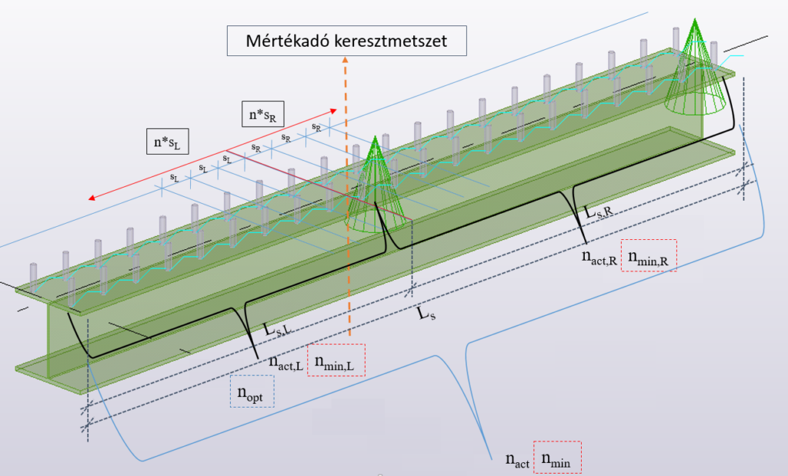
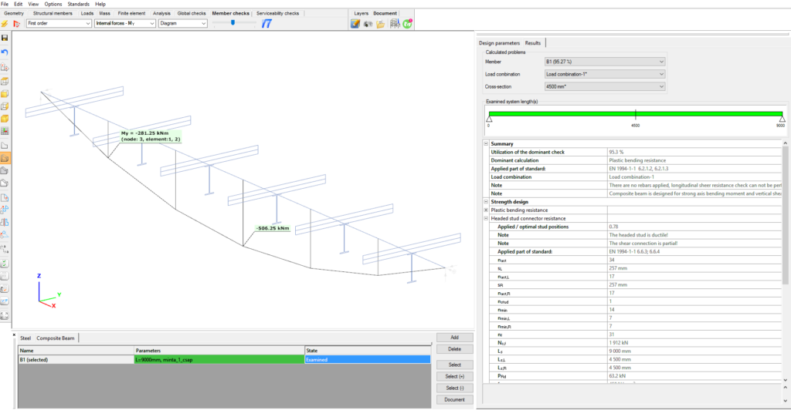

# Öszvérszerkezet tervezés

<!-- wp:paragraph -->

Az öszvér oszlopok tervezéséhez tartozó funkciók a Globális vizsgálatok fülön, míg az öszvér gerendákhoz tartozók az Elem vizsgálatok fülön találhatóak.

<!-- /wp:paragraph -->

<!-- wp:heading {"level":3} -->

### Öszvér oszlop tervezése

<!-- /wp:heading -->

<!-- wp:paragraph -->

Öszvér oszlop keresztmetszeti vizsgálata a **Globális vizsgálatok** fülön található kék nyíl segítségével végezhető el. A **Tervezés…** dialógon az _Öszvér oszlop tervezése_ jelölő négyzetet kell kiválasztani. A vizsgálat elvégezhető teljes vagy részletmodellre is. A **Tervezés…** dialóg felső részén kiválasztható, hogy mely eredmény típus (első vagy másodrendű analízis) alapján történjen a vizsgálatok elvégzése, illetve a táblázatban kiválasztható, hogy mely teherkombinációk esetében.

<!-- /wp:paragraph -->

<!-- wp:image {"align":"center","id":37184,"width":466,"height":410,"sizeSlug":"full","linkDestination":"media","className":"is-style-editorskit-rounded"} -->

<!-- /wp:image -->

<!-- wp:paragraph -->

Ha a vizsgált keresztmetszet létrehozásakor ki lett választva a _Kezdeti görbeség hozzárendelése_ opció az y és z irányokban is, akkor az oszlop stabilitásvizsgálata elhanyagolható. Elegendő csak a keresztmetszeti vizsgálatok elvégzése.

<!-- /wp:paragraph -->

<!-- wp:heading {"level":4} -->

#### Eredmények

<!-- /wp:heading -->

<!-- wp:paragraph -->

Az elvégzett ellenőrzések eredményei megtekinthetők grafikus formában, vagy táblázatosan (a táblázatok általános kezelési funkcióit lásd a _[Táblázatok általános funkciói ](/manual/altalanos-ismertetes/tablazatok-altalanos-funkcioi/)_c. fejezetben).

<!-- /wp:paragraph -->

<!-- wp:paragraph -->

Az aktuálisan megjelenített eredménytípus a legördülő menüből választható.

<!-- /wp:paragraph -->

<!-- wp:image {"align":"center","id":37176,"width":573,"height":355,"sizeSlug":"full","linkDestination":"media"} -->

<!-- /wp:image -->

<!-- wp:paragraph -->

Szerkezeti elemeken történő egér mozgatás esetén, az eredmény jelölő folyamatosan megjelenik, mutatva az aktuális kihasználtságot.

<!-- /wp:paragraph -->

<!-- wp:paragraph -->

A számítás részletei megtekinthetők a keresztmetszeti modulban (lásd a[ Keresztmetszeti modul ](/manual/keresztmetszet-modul/)fejezetben). A keresztmetszeti modul megnyitható közvetlenül a **Globális vizsgálatok** fülről is, a megfelelő keresztmetszet grafikus felületen vagy táblázatban történő jobb egérgombos kiválasztásával.

<!-- /wp:paragraph -->

<!-- wp:image {"align":"left","id":37051,"width":302,"height":213,"sizeSlug":"full","linkDestination":"media","className":"is-style-editorskit-rounded"} -->

<!-- /wp:image -->

<!-- wp:image {"align":"right","id":37043,"width":427,"height":207,"sizeSlug":"full","linkDestination":"media","className":"is-style-editorskit-rounded"} -->

<!-- /wp:image -->

<!-- wp:spacer {"height":"10px"} -->

<!-- /wp:spacer -->

<!-- wp:heading {"level":3} -->

### Öszvér gerenda tervezése

<!-- /wp:heading -->

<!-- wp:paragraph -->

Öszvér gerendák tervezése az **Elem vizsgálat** fülön található funkciók segítségével végezhetők el. Az oldal alján található táblázatban az **Öszvér gerenda** fület kell megnyitni, majd ki kell választani a vizsgálandó öszvér gerendá(ka)t és a **Hozzáad** gombra kattintva hozzá kell adni a vizsgálandó gerendák táblázatához. A vizsgálandó gerendák táblázatából a **Kiválaszt (Kiválaszt +)** gomb segítségével lehet egy elemet tervezésre kiválasztani. Megadható, hogy első- vagy másodrendű analízis eredmények alapján történjen a tervezés, és ehhez kiválasztható a megfelelő teherkombináció is. Az **Ellenőrzés** gombra kattintva indítható a vizsgálat.

<!-- /wp:paragraph -->

<!-- wp:paragraph -->

Öszvér keresztmetszetű gerendák ellenőrzése az EN 1994-1-1:2010 szabvány alapján történik.

<!-- /wp:paragraph -->

<!-- wp:paragraph -->

A tervezési hajlítási ellenállás meghatározását képlékeny elmélet alapján végzi el a program, a 6.2.1.2 vagy a 6.2.1.3 EuroCode fejezeteknek megfelelően, 1. és 2. keresztmetszeti osztályok esetén. A keresztmetszeti osztályok meghatározása az 5.5.2 fejezet alapján történik. 3. és 4. keresztmetszeti osztályú kompozit gerendák tervezése jelenleg még nem végezhető el a _Consteel_ segítségével. Öszvér gerendák ellenőrzése a következő vizsgálatokra történik az összes kritikus keresztmetszetben:

<!-- /wp:paragraph -->

<!-- wp:list -->

- képlékeny hajlítás,
- függőleges nyírás,
- nyírási horpadás,
- betonöv morzsolódása,
- hosszirányú nyírás.

<!-- /wp:list -->

<!-- wp:paragraph -->

A kritikus keresztmetszeti helyek meghatározása a 6.1.1. (4) bekezdés alapján történik. A következő vizsgálatok nem kerülnek elvégzésre: nemlineáris hajlítási ellenállás (6.2.1.4) és rugalmas hajlítási ellenállás (6.2.1.5). Az esetleges trapézlemez ellenállása elhanyagolásra kerül.

<!-- /wp:paragraph -->

<!-- wp:heading {"level":4} -->

#### Analízis modell

<!-- /wp:heading -->

<!-- wp:paragraph -->

Az **analízis modellben** a betonöv effektív szélességét (beff) a _Consteel_ a korábbi fejezetben található eljárás alapján határozza meg (a támaszköz és az egy keresztmetszetben lévő nyírási csapok egymástól való távolságának a függvényében). A gyakorlati tapasztalatok alapján az öszvér gerendák legtöbbször kéttámaszú „csuklós-csuklós” tartóként kerülnek kialakításra, emiatt a Consteel csak ebben az esetben végzi el az öszvérgerenda ellenőrzését. Többtámaszú kialakítás, illetve húzott betonzóna esetén a felhasználó hibaüzenet kap, és nem tudja elvégezni az ellenőrzést.

<!-- /wp:paragraph -->

<!-- wp:paragraph -->

Az analízis modell megtekinthető az **Analízis** fülön.

<!-- /wp:paragraph -->

<!-- wp:heading {"level":4} -->

#### Nyírócsapok tervezése

<!-- /wp:heading -->

<!-- wp:paragraph -->

A nyírócsapok kiosztását képlékeny alapon végezzük el, mely alapján a csapokat egyenletesen kell kiosztani a mértékadó keresztmetszettől balra és jobbra eső szakaszon. A mértékadó keresztmetszet meghatározását a program automatikusan elvégzi. (Mértékadó keresztmetszet: az öszvér gerendában keletkező maximális hajlítónyomaték helye.) Ennek a keresztmetszetnek az ismeretében már lehet tőle balra, illetve jobbra eső szakaszról beszélni.

<!-- /wp:paragraph -->

<!-- wp:paragraph -->

Nyírócsapok automatikus számítása opció választása esetén a program a minimális nyírócsap pozícióból számolt nyírócsap darabszámmal elvégzi a nyomatéki ellenállás számítását. A keletkező igénybevétel függvényében addig növeli a nyírócsapok számát, amíg a hajlítási ellenállás meghaladja a hajlítási igénybevételt.

<!-- /wp:paragraph -->

<!-- wp:paragraph -->

A gerenda alábbi sematikus ábráján a zöld szakasz mutatja azt a szakaszt, amely mentén meghatározásra került az optimális nyírócsap pozíció és a kiosztás. Az alábbi paraméterek kerülnek meghatározásra az öszvér gerendák vizsgált szakaszaira:

<!-- /wp:paragraph -->

<!-- wp:paragraph -->

nopt: a nyírócsapok pozíciójának optimális száma a rúd mértékadó szakaszán

<!-- /wp:paragraph -->

<!-- wp:paragraph -->

nact: a nyírócsapok pozíciójának száma a vizsgált rúdon

<!-- /wp:paragraph -->

<!-- wp:paragraph -->

sL: a nyírócsapok kiosztása a keresztmetszettől balra eső szakaszon \[mm]

<!-- /wp:paragraph -->

<!-- wp:paragraph -->

nact,L: a nyírócsapok pozíciójának száma a keresztmetszettől balra eső szakaszon

<!-- /wp:paragraph -->

<!-- wp:paragraph -->

sR: a nyírócsapok kiosztása a keresztmetszettől jobbra eső szakaszon \[mm]

<!-- /wp:paragraph -->

<!-- wp:paragraph -->

nact,R: a nyírócsapok pozíciójának száma a keresztmetszettől jobbra eső szakaszon

<!-- /wp:paragraph -->

<!-- wp:paragraph -->

nstud: az egy keresztmetszetben lévő nyírócsapok száma

<!-- /wp:paragraph -->

<!-- wp:paragraph -->

nmin: a minimális nyírócsap pozíciók száma a vizsgált rúdon

<!-- /wp:paragraph -->

<!-- wp:paragraph -->

nmin,L: a minimális nyírócsap pozíciók száma a keresztmetszettől balra eső szakaszon

<!-- /wp:paragraph -->

<!-- wp:paragraph -->

nmin,R: a minimális nyírócsap pozíciók száma a keresztmetszettől jobbra eső szakaszon

<!-- /wp:paragraph -->

<!-- wp:image {"align":"center","id":37168,"width":768,"height":464,"sizeSlug":"large","linkDestination":"media","className":"is-style-editorskit-rounded"} -->

<!-- /wp:image -->

<!-- wp:paragraph -->

Az automata kiosztás helyett megadható a nyírócsap pozíciók pontos száma is. Ebben az esetben a program ellenőrzi, hogy megfelel-e a kiosztás a szabványos előírásoknak, illetve minimális és maximális távolsági követelményeknek. A nyírócsap pozíciók számát a teljes gerendára kell megadni. Az ellenőrzés során a _Consteel_ a megadott nyírócsap pozíciót egyenletesen szétosztja a gerenda hossza mentén (az automata kiosztás esetén a keletkező igénybevétel függvényében előfordulhat nem egyenletes csapkiosztás is a mértékadó keresztmetszettől balra és jobbra eső szakaszon).

<!-- /wp:paragraph -->

<!-- wp:paragraph -->

A nyírócsapok kihasználtságának a számítása a következőek szerint történik: alkalmazott nyírócsap szám osztva az optimális nyírócsap számmal (nact / nopt).

<!-- /wp:paragraph -->

<!-- wp:image {"align":"center","id":37160,"width":768,"height":399,"sizeSlug":"large","linkDestination":"media","className":"is-style-editorskit-rounded"} -->

<!-- /wp:image -->

<!-- wp:heading {"level":4} -->

#### Öszvérszerkezetek nyírási horpadási ellenállás

<!-- /wp:heading -->

<!-- wp:paragraph -->

A nyírási horpadási ellenállás meghatározása az EN 1993-1-5:2006 szabvány 5 szakasza, illetve az '_A_' melléklete alapján történik. Az övek nyírási ellenállása elhanyagolásra került.

<!-- /wp:paragraph -->

<!-- wp:heading {"level":4} -->

#### Öszvérszerkezetek hajlítási és függőleges nyírási ellenállása

<!-- /wp:heading -->

<!-- wp:paragraph -->

A függőleges nyírás hajlítási ellenállásra gyakorolt hatása elhanyagolásra kerül, ha a függőleges nyíróerő kevesebb, mint a keresztmetszet nyírási ellenállásának a fele.

<!-- /wp:paragraph -->

<!-- wp:paragraph -->

Első és második keresztmetszeti osztály esetén, ha a függőleges nyíróerő nagyobb, mint a keresztmetszet nyírási ellenállásának fele, akkor a hajlítás ellenállás meghatározásához csökkentett tervezési acél határfeszültség kerül használatra, a 6.2.2.4 (2) fejezet szerint.

<!-- /wp:paragraph -->

<!-- wp:heading {"level":4} -->

#### Öszvér gerenda kifordulása

<!-- /wp:heading -->

<!-- wp:paragraph -->

Öszvér gerenda kifordulása nincs vizsgálva.

<!-- /wp:paragraph -->

<!-- wp:heading {"level":4} -->

#### Öszvér tartó alátámasztó gerendájával párhuzamos trapézlemez bordázás

<!-- /wp:heading -->

<!-- wp:paragraph -->

A nyírócsapok tervezési ellenállása az állandó vastagságú betonlemezes öszvérgerenda esetén meghatározott nyírócsap ellenállás és a 6.6.4.1 (2) fejezetben megadott csökkentő tényező szorzataként kerül meghatározásra.

<!-- /wp:paragraph -->

<!-- wp:list -->

- \-kl egy gerendával párhuzamos acél profillemez fejes csapja ellenállásának csökkentő tényezője

<!-- /wp:list -->

<!-- wp:paragraph -->

Nem folytonos trapézlemez esetén, a Consteel azt feltételezi, hogy a trapézlemez a gerenda övére van hegesztve, de a távolság a két trapézlemez között nem adható meg (’a’ paraméter).

<!-- /wp:paragraph -->

<!-- wp:heading {"level":4} -->

#### Öszvér tartó alátámasztó gerendájára merőleges trapézlemez bordázás

<!-- /wp:heading -->

<!-- wp:paragraph -->

A nyírócsapok tervezési ellenállása az állandó vastagságú betonlemezes öszvérgerenda esetén meghatározott nyírócsap ellenállás, és a 6.23 képlet szerinti csökkentő tényező (maximum érték a 6.2 táblázat szerint) szorzataként kerül meghatározásra.

<!-- /wp:paragraph -->

<!-- wp:list -->

-  kt egy gerendára merőlegesen elhelyezett acél profillemez fejes csapja ellenállásának csökkentő tényezője

<!-- /wp:list -->

<!-- wp:paragraph -->

Állandó vastagságú betonlemezes öszvérgerenda esetén számított nyírócsap ellenállás során a szakadási feszültség maximalizálva van (450 N/mm2).

<!-- /wp:paragraph -->
