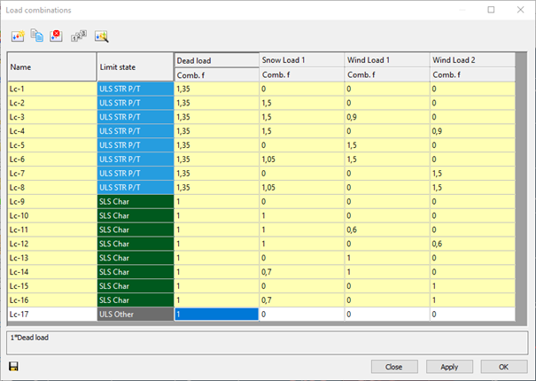

# Load combinations
## Limit states
According to EN 1990, structural verifications should be executed in either ultimate (ULS) or serviceability limit states (SLS). Limit states shall be related to design situations.  

**Ultimate limit states**: EQU (for loss of equilibrium of the foundation), STR (for structural design), GEO (for geotechnical design), etc.

**Serviceability limit states**: characteristic, frequent, quasi-permanent

**Design situations**: persistent and transient (P/T), accidental (Acc), seismic

Limit states introduced in Consteel are combination of limit states and design situations defined in the Eurocode.

*Concept of limit states in EN 1990*

- ULS STR P/T
- ULS GEO P/T
- ULS STR/GEO P/T (this is a combined limit state for cases when STR and GEO combinations would be the same)
- ULS EQU P/T
- ULS Acc
- ULS Seismic
- ULS Other
- SLS Char
- SLS Freq
- SLS Q-p
- SLS Seismic
- SLS Other

In order to cover cases not strictly under EC scope, and make sure of smooth transition of old files, there is an ‘Other’ limit state for ULS and SLS too.

When opening models saved in previous Consteel versions, the limit states will be converted as follows:

- ULS -> ULS Other
- SLS -> SLS Other
- ULS EQ (Seismic generated) -> ULS Seismic
- SLS EQ (Seismic generated) -> SLS Seismic

For manually defined load combinations, the limit states can be selected. Seismic combinations can not be defined manually, they can be created only by automatic generation. <mark>Load combinations in ULS GEO P/T and ULS EQU P/T limit states are used only for foundation design.</mark> Consequently, global design checks will not be performed in these limit states and analysis results are not transferred for connection design (except for spread footing).
## Load combinations
According to the actual structural [design code](../general-description/the-main-window), load case combinations must be created from the load cases. Load combinations can be created manually by defining the combination factors manually for each load case or can be created automatically by using the Automatic load combination generation function of ConSteel.

The load combinations can be managed in the table of load combinations which can be opened by clicking on the Load combination () command on the Loads tab.

*Table of load combinations*

At the top of the window there are commands for creating and modifying combinations. Below the commands, the table itself can be found. The first column is the name of the load combination. The name is built up from a default name and an ascending sequence number. This can be changed only one-by-one.

The second column defines in which limit state the load combination is working. Design checks are performed only on ultimate limit state (*ULS*) load combinations, while serviceability checks are only performed on serviceability (*SLS*) combinations.

In the further columns, there are the combination factors for each load case. It is possible to edit multiple safety factors at the same time: select safety factors and right-click over them, then enter the desired value in the pop-up window. Multiple cells can be selected using Ctrl or Shift buttons or holding down the left mouse button and moving the cursor over the cells. Cell contents can also be copied and pasted. On the table, select the cells that you want to copy and press **Ctrl+C**. Select the upper-left cell of the paste area and press **Ctrl+V**. Cell contents can be copied from MS Excel and other spreadsheet applications also.

The yellow rows in the load combination table are the automatically generated combinations. The white ones are the ones created or edited manually.
