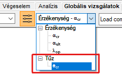
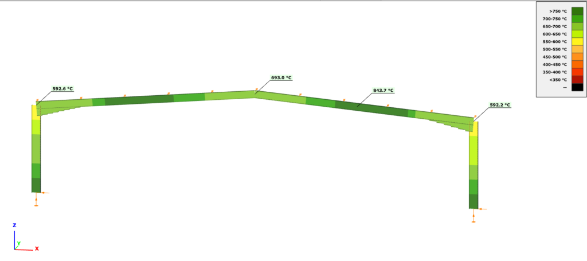

# Tervezés

<!-- wp:heading {"level":3} -->

### Tervezés emelt hőmérsékleti anyagjellemzők mellett

<!-- /wp:heading -->

<!-- wp:paragraph {"align":"justify"} -->

Emelt hőmérsékleti analízis esetén a Consteel az EuroCode 3 szabvány vonatkozó formulái szerint ellenőrzi a tűzzel terhelt szerkezeti elemek keresztmetszeteit.

<!-- /wp:paragraph -->

<!-- wp:paragraph -->

**Keresztmetszet osztályozása (EN 1993-1-2 4.2.2)**

<!-- /wp:paragraph -->

<!-- wp:paragraph {"align":"justify"} -->

A keresztmetszetek osztályba sorolása a normál tervezési eljárásoknál alkalmazott szabványrész (EN 1993-1-1) szerint történik, azzal a különbséggel csökkentett ε kerül figyelembevételre.

<!-- /wp:paragraph -->

<!-- wp:paragraph {"editorskit":{"indent":40,"devices":false,"desktop":true,"tablet":true,"mobile":true,"loggedin":true,"loggedout":true,"acf_visibility":"","acf_field":"","acf_condition":"","acf_value":"","migrated":false,"unit_test":false}} -->

$\varepsilon = 0,85 \left [\dfrac {235} {f_y} \right ] ^{0,5}$

<!-- /wp:paragraph -->

<!-- wp:paragraph -->

**Húzás (EN 1993-1-2 4.2.3.1)**

<!-- /wp:paragraph -->

<!-- wp:paragraph {"editorskit":{"indent":20,"devices":false,"desktop":true,"tablet":true,"mobile":true,"loggedin":true,"loggedout":true,"acf_visibility":"","acf_field":"","acf_condition":"","acf_value":"","migrated":false,"unit_test":false}} -->

Állandó hőmérséklet ((1))

<!-- /wp:paragraph -->

<!-- wp:paragraph {"editorskit":{"indent":40,"devices":false,"desktop":true,"tablet":true,"mobile":true,"loggedin":true,"loggedout":true,"acf_visibility":"","acf_field":"","acf_condition":"","acf_value":"","migrated":false,"unit_test":false}} -->

$N_{t,fi,\Theta,Rd} = k_{y,\Theta} \cdot \left[\dfrac{\gamma_{M,0}}{\gamma_{M,fi}}\right] \cdot N_{pl,Rd}$

(1-4. osztály)

Ahol

<!-- /wp:paragraph -->

<!-- wp:paragraph {"editorskit":{"indent":40,"devices":false,"desktop":true,"tablet":true,"mobile":true,"loggedin":true,"loggedout":true,"acf_visibility":"","acf_field":"","acf_condition":"","acf_value":"","migrated":false,"unit_test":false}} -->

$k_{y,\Theta}$  értékeit a 3.1 táblázat tartalmazza 

$N_{pl,Rd}$  tűzhatás nélküli esetben

<!-- /wp:paragraph -->

<!-- wp:paragraph {"editorskit":{"indent":20,"devices":false,"desktop":true,"tablet":true,"mobile":true,"loggedin":true,"loggedout":true,"acf_visibility":"","acf_field":"","acf_condition":"","acf_value":"","migrated":false,"unit_test":false}} -->

Változó hőmérséklet ((2))

<!-- /wp:paragraph -->

<!-- wp:paragraph {"editorskit":{"indent":40,"devices":false,"desktop":true,"tablet":true,"mobile":true,"loggedin":true,"loggedout":true,"acf_visibility":"","acf_field":"","acf_condition":"","acf_value":"","migrated":false,"unit_test":false}} -->

$N_{t,fi,t,Rd} = A_{non,t} \cdot \dfrac {f_y} {\gamma_{M,fi}}$
   (1-4. osztály)

<!-- /wp:paragraph -->

<!-- wp:paragraph -->

**Nyomás (1-3. osztály: EN 1993-1-2 4.2.3.2, 4. osztály: + E.2 melléklet)**

<!-- /wp:paragraph -->

<!-- wp:paragraph {"editorskit":{"indent":20,"devices":false,"desktop":true,"tablet":true,"mobile":true,"loggedin":true,"loggedout":true,"acf_visibility":"","acf_field":"","acf_condition":"","acf_value":"","migrated":false,"unit_test":false}} -->

Állandó hőmérséklet ((1))

<!-- /wp:paragraph -->

<!-- wp:paragraph {"editorskit":{"indent":40,"devices":false,"desktop":true,"tablet":true,"mobile":true,"loggedin":true,"loggedout":true,"acf_visibility":"","acf_field":"","acf_condition":"","acf_value":"","migrated":false,"unit_test":false}} -->

$N_{c,fi,t,Rd} = A \cdot \dfrac {k_{y,\Theta} \cdot f_y} {\gamma_{M,fi}}$ (1-3. osztály)

$N_{c,fi,t,Rd} = A_{eff} \cdot \dfrac {k_{p0,2,\Theta} \cdot f_y} {\gamma_{M,fi}}$ (4. osztály)

Ahol  
 
$k_{p0,2,\Theta}$ értékeit a 3.1 táblázat tartalmazza

<!-- /wp:paragraph -->

<!-- wp:paragraph {"editorskit":{"indent":20,"devices":false,"desktop":true,"tablet":true,"mobile":true,"loggedin":true,"loggedout":true,"acf_visibility":"","acf_field":"","acf_condition":"","acf_value":"","migrated":false,"unit_test":false}} -->

Változó hőmérséklet ((6))

<!-- /wp:paragraph -->

<!-- wp:paragraph {"editorskit":{"indent":40,"devices":false,"desktop":true,"tablet":true,"mobile":true,"loggedin":true,"loggedout":true,"acf_visibility":"","acf_field":"","acf_condition":"","acf_value":"","migrated":false,"unit_test":false}} -->

Konzervatív módszer, (1) eset, ahol $\Theta_a = \Theta_{a,max}$

<!-- /wp:paragraph -->

<!-- wp:paragraph -->

**Hajlítás (EN 1993-1-2 1-2. osztály: 4.2.3.3; 3. osztály: 4.2.3.4; 4. osztály: + E.2 melléklet)**

<!-- /wp:paragraph -->

<!-- wp:paragraph {"editorskit":{"indent":20,"devices":false,"desktop":true,"tablet":true,"mobile":true,"loggedin":true,"loggedout":true,"acf_visibility":"","acf_field":"","acf_condition":"","acf_value":"","migrated":false,"unit_test":false}} -->

Állandó hőmérséklet ((1))

<!-- /wp:paragraph -->

<!-- wp:paragraph {"editorskit":{"indent":40,"devices":false,"desktop":true,"tablet":true,"mobile":true,"loggedin":true,"loggedout":true,"acf_visibility":"","acf_field":"","acf_condition":"","acf_value":"","migrated":false,"unit_test":false}} -->

$M_{fi,\Theta ,Rd} = k_{y,\Theta} \cdot \dfrac {\gamma_{M,0}} {\gamma_{M,fi}} \cdot M_{Rd}$

Ahol  
$M_{Rd}=M_{pl.Rd}$ , nyírás esetén: $M_{Rd}=M_{V.Rd}$  (1-2. osztály)  
$M_{Rd}=M_{el.Rd}$ , nyírás esetén: $M_{Rd}=M_{V.Rd}$  (3. osztály)  
$M_{Rd}=M_{eff.Rd}$  (4. osztály)  
$k_{y,\Theta}$  értékeit a 3.1 táblázat tartalmazza

<!-- /wp:paragraph -->

<!-- wp:paragraph {"editorskit":{"indent":20,"devices":false,"desktop":true,"tablet":true,"mobile":true,"loggedin":true,"loggedout":true,"acf_visibility":"","acf_field":"","acf_condition":"","acf_value":"","migrated":false,"unit_test":false}} -->

Változó hőmérséklet ((2))

<!-- /wp:paragraph -->

<!-- wp:paragraph {"editorskit":{"indent":40,"devices":false,"desktop":true,"tablet":true,"mobile":true,"loggedin":true,"loggedout":true,"acf_visibility":"","acf_field":"","acf_condition":"","acf_value":"","migrated":false,"unit_test":false}} -->

$M_{fi,t,Rd} = W_{pl,non,t} \cdot \dfrac {f_y} {\gamma_{M,fi}}$  (1-2. osztály)  
$M_{fi,t,Rd} = k_{y,\Theta,max} \cdot \dfrac {\gamma_{M,0}} {\gamma_{M,fi}} \cdot \dfrac {1} {\kappa_1 \cdot \kappa_2}$  (3. osztály)  
$M_{fi,t,Rd} = k_{p0,2,\Theta,max} \cdot \dfrac {\gamma_{M,0}} {\gamma_{M,fi}} \cdot \dfrac {1} {\kappa_1 \cdot \kappa_2} \cdot M_{eff,Rd}$  (4. osztály)

<!-- /wp:paragraph -->

<!-- wp:paragraph -->

**Nyírás (EN 1993-1-2 1-2. osztály: 4.2.3.3(6); 3. osztály: 4.2.3.4(4); 4. osztály: + E.2 melléklet)**

<!-- /wp:paragraph -->

<!-- wp:paragraph {"editorskit":{"indent":20,"devices":false,"desktop":true,"tablet":true,"mobile":true,"loggedin":true,"loggedout":true,"acf_visibility":"","acf_field":"","acf_condition":"","acf_value":"","migrated":false,"unit_test":false}} -->

Állandó hőmérséklet

<!-- /wp:paragraph -->

<!-- wp:paragraph {"editorskit":{"indent":40,"devices":false,"desktop":true,"tablet":true,"mobile":true,"loggedin":true,"loggedout":true,"acf_visibility":"","acf_field":"","acf_condition":"","acf_value":"","migrated":false,"unit_test":false}} -->

$V_{fi,t,Rd} = k_{y,\Theta ,web} \cdot \dfrac {\gamma_{M,0}} {\gamma_{M,fi}} \cdot V_{Rd}$  (1-4. osztályokra)

<!-- /wp:paragraph -->

<!-- wp:paragraph {"editorskit":{"indent":20,"devices":false,"desktop":true,"tablet":true,"mobile":true,"loggedin":true,"loggedout":true,"acf_visibility":"","acf_field":"","acf_condition":"","acf_value":"","migrated":false,"unit_test":false}} -->

Változó hőmérséklet

<!-- /wp:paragraph -->

<!-- wp:paragraph {"editorskit":{"indent":40,"devices":false,"desktop":true,"tablet":true,"mobile":true,"loggedin":true,"loggedout":true,"acf_visibility":"","acf_field":"","acf_condition":"","acf_value":"","migrated":false,"unit_test":false}} -->

$k_{y,\Theta ,web}$  az öv legmelegebb pontja

<!-- /wp:paragraph -->

<!-- wp:paragraph -->

**Összetett belső erők esetén a _Consteel_ a konzervatív interakciós képletet használja, és a nyírást figyelmen kívül hagyja:**

<!-- /wp:paragraph -->

<!-- wp:paragraph {"editorskit":{"indent":40,"devices":false,"desktop":true,"tablet":true,"mobile":true,"loggedin":true,"loggedout":true,"acf_visibility":"","acf_field":"","acf_condition":"","acf_value":"","migrated":false,"unit_test":false}} -->

$\dfrac {N_{fi,Ed}} {N_{fi,\Theta ,Ed}}+\dfrac {M_{y,fi,Ed}} {M_{y,fi,\Theta ,Ed}}+\dfrac {M_{z,fi,Ed}} {M_{z,fi,\Theta ,Ed}}\leq 1\qquad \qquad $ 

<!-- /wp:paragraph -->

<!-- wp:paragraph -->

**Globális stabilitási ellenállás:**

<!-- /wp:paragraph -->

<!-- wp:paragraph {"align":"justify"} -->

A stabilitási ellenállás számításra a Consteel az EuroCode általános módszerét (EN 1993-1-1 6.3.4) használja, megfelelően az általános tervezési szituációhoz, de természetesen a megfelelő, tűz tervezési szituációban használandó kihajlási görbék felhasználásával.

<!-- /wp:paragraph -->

<!-- wp:paragraph {"editorskit":{"indent":40,"devices":false,"desktop":true,"tablet":true,"mobile":true,"loggedin":true,"loggedout":true,"acf_visibility":"","acf_field":"","acf_condition":"","acf_value":"","migrated":false,"unit_test":false}} -->

Nyomás

<!-- /wp:paragraph -->

<!-- wp:paragraph {"editorskit":{"indent":40,"devices":false,"desktop":true,"tablet":true,"mobile":true,"loggedin":true,"loggedout":true,"acf_visibility":"","acf_field":"","acf_condition":"","acf_value":"","migrated":false,"unit_test":false}} -->

$\chi _{fi}=\dfrac {1}{\varphi_{\Theta}+\sqrt{\varphi_{\Theta}^2-\bar{\lambda}_{\Theta}^2}}$ 
<!-- /wp:paragraph -->

<!-- wp:paragraph {"editorskit":{"indent":40,"devices":false,"desktop":true,"tablet":true,"mobile":true,"loggedin":true,"loggedout":true,"acf_visibility":"","acf_field":"","acf_condition":"","acf_value":"","migrated":false,"unit_test":false}} -->

Hajlítás

<!-- /wp:paragraph -->

<!-- wp:paragraph {"editorskit":{"indent":40,"devices":false,"desktop":true,"tablet":true,"mobile":true,"loggedin":true,"loggedout":true,"acf_visibility":"","acf_field":"","acf_condition":"","acf_value":"","migrated":false,"unit_test":false}} -->

$\chi _{LT,fi}=\dfrac {1}{\phi_{LT,\Theta ,com}+\sqrt{\phi_{LT,\Theta ,com}^2-\bar{\lambda}_{LT,\Theta ,com}^2}}$

<!-- /wp:paragraph -->

<!-- wp:heading {"level":3} -->

### Kritikus hőmérséklet

<!-- /wp:heading -->

<!-- wp:paragraph {"align":"justify"} -->

A kritikus hőmérséklet számítását a tervezés beállításai ablakban lehet aktiválni, amennyiben teljesülnek az alábbi feltételek:

<!-- /wp:paragraph -->

<!-- wp:list {"type":"a"} -->

- van legalább egy, reaktív tűzvédelemmel ellátott elem a modellben
- van legalább egy, szobahőmérsékleti anyagjellemzőkre beállított tűzterhelési eset
- van legalább egy, tűzterhelési esetet tartalmazó teherkombináció kiválasztva a globális vizsgálathoz

<!-- /wp:list -->

<!-- wp:image {"align":"center","id":37690,"sizeSlug":"full","linkDestination":"media","className":"is-style-editorskit-rounded"} -->

<!-- /wp:image -->

<!-- wp:image {"align":"right","id":37706,"width":181,"height":111,"sizeSlug":"full","linkDestination":"none","className":"is-style-editorskit-rounded"} -->

<!-- /wp:image -->

<!-- wp:paragraph {"align":"justify"} -->

A számítás eredményeit a tervezési paraméterek legördülő menüben lehet lekérdezni. Az eredmények színezett grafikus ábrán jelennek meg. Egy adott szelvényen jobb egérkattintásra innen is megnyitható a szelvény modul, ahol a kritikus hőmérséklet számításának részletei megtalálhatók. Az összegzés első sorában szerepel, hogy a szelvényt kell-e tűzvédő festéssel védeni vagy sem, a kritikus hőmérséklet mezőben pedig megtalálható a vonatkozó szabványrészlet, az alkalmazott tűzgörbe, a szelvény védelem nélküli tűzállósági ideje és tűzhatásra elért hőmérséklete, valamint a megkívánt tűzállósági idő

<!-- /wp:paragraph -->

<!-- wp:image {"align":"center","id":9408,"width":822,"height":365,"sizeSlug":"large","linkDestination":"media"} -->

<!-- /wp:image -->

<!-- wp:image {"align":"center","id":37698,"width":613,"height":504,"sizeSlug":"full","linkDestination":"media","className":"is-style-editorskit-rounded"} -->

<!-- /wp:image -->

<!-- wp:paragraph -->

<!-- /wp:paragraph -->
