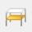
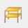
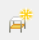
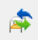
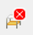
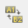
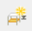

# Részlet kezelő

<!-- wp:paragraph -->

A _**Részlet kezelő**_ egy igen hasznos eszköz, a modell különböző részleteinek (mint például szintek, oszlopok, merevítés, gerendák stb.) csoportosítására és kezelésére. A funkció a _**Részlet kezelő**_ fülön található, ami alapértelmezésben a képernyő jobb oldalán jelenik meg.

<!-- /wp:paragraph -->

<!-- /wp:paragraph -->

<!-- wp:columns -->

<!-- wp:column {"width":"50%"} -->

<!-- wp:image {"align":"center","id":32609,"width":336,"height":341,"sizeSlug":"full","linkDestination":"media"} -->

<!-- /wp:image -->

<!-- /wp:column -->

<!-- wp:column {"width":"50%"} -->

<!-- wp:image {"align":"center","id":7811,"width":436,"height":341,"sizeSlug":"full","linkDestination":"media"} -->

<!-- /wp:image -->

<!-- /wp:column -->

<!-- /wp:columns -->

<!-- wp:image {"align":"right","id":18012,"width":298,"height":239,"sizeSlug":"full","linkDestination":"media"} -->

<!-- /wp:image -->

<!-- wp:image {"align":"right","id":18024,"width":398,"height":280,"sizeSlug":"full","linkDestination":"media"} -->

<!-- /wp:image -->

<!-- wp:paragraph -->

\#1  Nagy modelleknél gyakran van szükség arra, hogy a modellnek csak egy része kerüljön megjelenítésre. Ilyenkor használható a _**Részlet modell nézet**_ funkció. A funkció hatására az összes fülön csak a kiválasztott elemek maradnak láthatók.

<!-- /wp:paragraph -->

<!-- wp:spacer {"height":"1px"} -->

<!-- /wp:spacer -->

<!-- wp:paragraph -->

\#2  A _**Teljes modell nézet**_ ikonra kattintva a teljes modell újra láthatóvá válik.

<!-- /wp:paragraph -->

<!-- wp:paragraph -->

\#3  A létrehozott részletek (ld. később) mappákba is rendezhetők. Az _**Új mappa**_ gombra kattintással a Részleteken belül többszintű struktúrába rendezve hozhatóak létre a mappák.

<!-- /wp:paragraph -->

<!-- wp:image {"align":"right","id":32694,"width":443,"height":346,"sizeSlug":"full","linkDestination":"media"} -->

<!-- /wp:image -->

<!-- wp:image {"align":"right","id":32680,"width":263,"height":110,"sizeSlug":"full","linkDestination":"media"} -->

<!-- /wp:image -->

<!-- wp:paragraph -->

\#4  Az _**Új részlet**_ gombra kattintással új részlet hozható létre abban a mappában, amelyik épp ki van jelölve. Ha előzőleg megtörtént az elemek kiválasztása is, úgy azok egyből hozzá is rendelődnek az új részletmodellhez. A felugró ablakban meg kell adni az új részlet nevét, majd a **Rendben** gombra kattintva a részlet létrejön.

<!-- /wp:paragraph -->

<!-- wp:paragraph -->

Egy részlet modell bekapcsolásához be kell jelölni a részlet neve előtt található jelölő négyzetet. Egyszerre több részletmodell is bekapcsolható, és egy objektum egyszerre több részletmodellnek is része lehet.

<!-- /wp:paragraph -->

<!-- wp:paragraph -->

\#5 Ha a _**Részlet kezelő**_ fül alján található _„Az elrejtett részek megjelenítése áttetszően”_ jelölő négyzet be van kapcsolva, akkor a modell elrejtett része is megjelenik áttetsző halvány szürke színnel.

<!-- /wp:paragraph -->

<!-- wp:spacer {"height":"1px"} -->

<!-- /wp:spacer -->

<!-- wp:image {"align":"right","id":32602,"width":256,"height":190,"sizeSlug":"full","linkDestination":"media"} -->

<!-- /wp:image -->

<!-- wp:paragraph -->

\#6  Lehetőség van létrehozott részletmodellek módosítására is. A meglévő részlethez hozzáadhatunk vagy elvehetünk elemeket. Ehhez először ki kell választani a modell megfelelő részét, majd a módosítani kívánt részletmodell nevét is. Végül a _**Módosítás**_ gombra kattintva megjelenik a _**Részlet módosítása**_ ablak a következő opciókkal:

- **Kijelölt elemek hozzáadása a részlethez:** a _**Rendben**_ gombra kattintva a kijelölt elemek az aktív részmodellhez hozzáadódnak. Ha a kijelölt elemek közül néhány eleve ehhez a részmodellhez tartozott, akkor ezek státusza nem változik.

- **Kijelölt elemek kivonása a részletből:** a kijelölt elemek nem lesznek részei az aktuális részletmodellnek.

- **Részlet módosítása csak kijelölt elemekre:** az aktuális részmodell csak a kijelölt elemeket fogja tartalmazni.

7#  A törlés gombbal a kijelölt részlet törölhető.

<!-- /wp:paragraph -->

<!-- wp:paragraph -->

8#  A részletmodell átnevezése az átnevezendő részlet kiválasztása után az _**Átnevezés**_ gombra kattintással történik.

<!-- /wp:paragraph -->

<!-- wp:image {"align":"right","id":32687,"width":229,"height":152,"sizeSlug":"full","linkDestination":"media"} -->

<!-- /wp:image -->

<!-- wp:paragraph -->

9# Részlet modellek szintek alapján is létrehozhatók. Szint részleteket az _**Új szint**_ gombra kattintva  lehet létrehozni. A felugró „Szint felvétele” ablakban megadható a szint neve és a magassága. A magasság felvehető a fekete nyílra kattintás után a modell egy pontjának a kijelölésével is. A szint magassága megjelenik a szint neve után. Minden olyan szerkezeti elem része lesz a szint részletnek, ami az adott szinten helyezkedik el. Amennyiben vannak a modellben az adott szintnél magasabban elhelyezkedő elemek is, melyek nem tartoznak más szintbe, azok automatikusan az adott szinthez fognak tartozni.