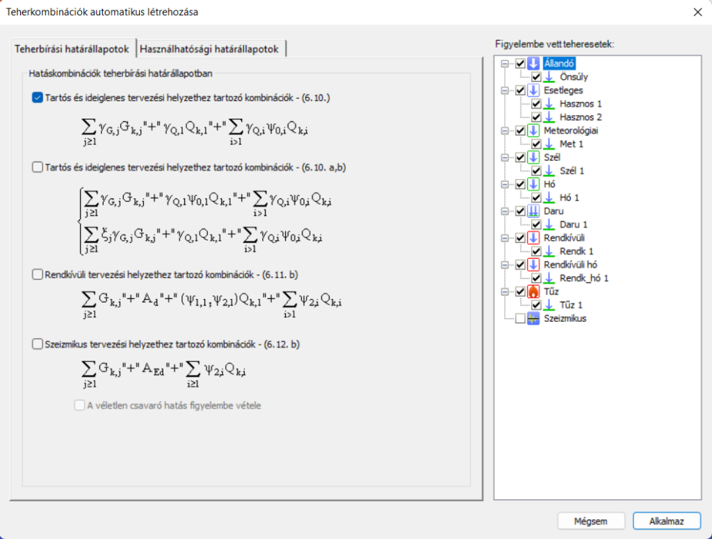

# Teherkombinációk

### Határállapotok

Az EN 1990 szabvány alapján a szerkezeteket teherbírási (ULS), vagy használhatósági határállapotban (SLS) kell ellenőrizni. Ezek a határállapotok különböző tervezési állapotokhoz kapcsolódnak.

Teherbírási határállapotok:
- EQU (alapozás helyzeti állékonyságának elvesztése)

- STR (tartószerkezetek ellenőrzése)

- GEO (geotechnikai tervezéshez), stb.

Használhatósági határállapotok:

- karakterisztikus

- gyakori

- kvázi állandó

Tervezési állapotok:

- tartós és ideiglenes (P/T)

- rendkívüli (Acc)

- szeizmikus

A Consteelben bevezetett határállapotok az Eurocode-ban meghatározott határállapotok és tervezési állapotok kombinációi.

<!-- /wp:paragraph -->

<!-- wp:image {"align":"center","id":50981,"width":512,"height":262,"sizeSlug":"large","linkDestination":"media","className":"is-style-editorskit-rounded"} -->

Határállapot koncepció

- ULS STR P/T

- ULS GEO P/T

- ULS STR/GEO P/T (ez egy kombinált határállapot olyan esetekre, amikor az STR és GEO kombinációk azonosak lennének.)

- ULS EQU P/T

- ULS Acc

- ULS Seismic

- ULS Other

- SLS Char

- SLS Freq

- SLS Q-p

- SLS Seismic

- SLS Other

A nem szigorúan az Eurocode hatálya alá tartozó esetek számára, és a korábbi verziók fájljainak problémamentes átvétele érdekében az ULS és SLS határállapotok esetében is rendelkezésre áll egy "Egyéb" elnevezésű határállapot is.

A korábbi Consteel verziókban mentett modellek megnyitásakor a határállapotok az alábbiak szerint módosulnak:
- ULS -> ULS Other

- SLS -> SLS Other

- ULS EQ (generált szeizmikus) -> ULS Seismic

- SLS EQ (generált szeizmikus) -> SLS Seismic

A manuálisan létrehozott teherkombinációkhoz kézzel kell valamely határállapotot hozzárendelni. Szeizmikus kombinációkat nem lehet manuálisan létrehozni, azok csak automatikus generálás útján jöhetnek létre. Az ULS GEO P/T és ULS EQU P/T határállapotokban szereplő teherkombinációk csak alapozás tervezéshez használhatók. Következésképpen ezekben a határállapotokban a globális méretezési vizsgálatok nem kerülnek elvégzésre, és az analízis eredményei nem adódnak át a csomóponttervezéshez (kivéve a pontalap csomópontot).

## Teherkombinációk

<!-- /wp:paragraph -->

<!-- wp:paragraph -->

A kiválasztott _[tervezési szabványnak](../1_0_general-description/1_2_the-main-window.md)_ megfelelően a teherkombinációk (TK) a [teheresetekből ](./6_1_load-cases-and-load-groups.md#teheresetek-és-tehercsoportok)állíthatók elő. A teherkombinációk () létrehozhatók manuálisan, a biztonsági és kombinációs tényezők teheresetenkénti megadásával, vagy a _Consteel_ **Teherkombinációk automatikus létrehozása** () funkciójának segítségével.

<!-- /wp:paragraph -->

<!-- wp:paragraph -->

A teherkombinációkat a teherkombinációk táblázatában lehet kezelni, amelyet a Terhek fülön a Teherkombináció () parancsra kattintva lehet megnyitni.

<!-- /wp:paragraph -->

<!-- wp:image {"align":"right","id":35820,"width":512,"height":295,"sizeSlug":"large","linkDestination":"media","className":"is-style-editorskit-rounded","editorskit":{"devices":false,"desktop":true,"tablet":true,"mobile":true,"loggedin":true,"loggedout":true,"acf_visibility":"","acf_field":"","acf_condition":"","acf_value":"","migrated":false,"unit_test":false}} -->

<!-- /wp:image -->

<!-- wp:paragraph -->

Az ablak tetején a kombinációk létrehozására és módosítására szolgáló parancsikonok találhatók. A parancsok alatt található maga a táblázat. Az első oszlop a teherkombináció neve. A név egy alapértelmezett névből és egy növekvő sorszámból épül fel. A név csak egyesével módosítható.

<!-- /wp:paragraph -->

<!-- wp:paragraph -->

A második oszlop határozza meg, hogy a teherkombináció melyik határállapothoz tartozik. Fontos a határállapot helyes beállítása, mivel a tervezési ellenőrzések csak a teherbírási (ULS) kombinációkra, míg a használhatósági vizsgálatok csak a használhatósági (SLS) kombinációkra kerülnek végrehajtásra.

<!-- /wp:paragraph -->

<!-- wp:paragraph -->

A további oszlopokban az egyes teheresetekre vonatkozó kombinációs tényezők szerepelnek. Egyszerre több tényező szerkesztése is lehetséges: ehhez válaszd ki a kívánt tényezőket, kattints rájuk a jobb egérgombbal, majd add meg a kívánt értéket a felugró ablakban. Több cella kijelölése történhet a **CTRL** vagy **SHIFT** gombok használatával, vagy az egér bal gombjának lenyomva tartásával és a kurzornak a cellák fölött történő mozgatásával. A cellák tartalma másolható és beilleszthető is a **CTRL+C** / **CTRL+V** billentyűkombinációkkal. A cellák tartalma az MS Excel vagy más táblázatkezelő alkalmazásokba/-ból is másolható.

<!-- /wp:paragraph -->

<!-- wp:paragraph -->

A teherkombináció táblázat sárga sorai az automatikusan generált kombinációk. A fehér sorok a kézzel létrehozott vagy kézzel szerkesztett kombinációk.

<!-- /wp:paragraph -->

<!-- wp:paragraph -->

 **Új teherkombináció létrehozása** - új sort hoz létre a teherkombinációk táblázatában. A kombinációs tényezőket kézzel kell kitölteni.

<!-- /wp:paragraph -->

<!-- wp:paragraph -->

 **Teherkombináció másolása** - Másolatot készít a korábban kijelölt sorokról. Az új teherkombinációk sorszámokat és fehér hátteret kapnak.

<!-- /wp:paragraph -->

<!-- wp:paragraph -->

 **Teherkombináció törlése** - Törli a korábban kijelölt sorokat.

<!-- /wp:paragraph -->

<!-- wp:paragraph -->

 **Teherkombinációk újraszámozása** - A táblázat összes teherkombinációjának nevét az eredetire változtatja.

<!-- /wp:paragraph -->

<!-- wp:image {"align":"right","id":35828,"width":512,"height":389,"sizeSlug":"large","linkDestination":"media","className":"is-style-editorskit-rounded","editorskit":{"devices":false,"desktop":true,"tablet":true,"mobile":true,"loggedin":true,"loggedout":true,"acf_visibility":"","acf_field":"","acf_condition":"","acf_value":"","migrated":false,"unit_test":false}} -->

<!-- /wp:image -->

<!-- wp:paragraph -->

 **Teherkombinációk automatikus létrehozása** - a tervezési szabványnak és a _[tehercsoportok és teheresetek beállításainak](./6_1_load-cases-and-load-groups.md#teheresetek-és-tehercsoportok)_ megfelelően. Megjelenik egy új ablak, ahol a kívánt kombinációs képletet ki lehet választani. Az ULS és SLS kombinációk két külön fülön helyezkednek el. A kívánt képlet szerinti kombinációk létrehozásához jelölje be az előtte lévő jelölőnégyzetet. A kombinálandó teheresetek a jobb oldali fa struktúrából választhatók ki. Végül, a kombinációk létrehozásához nyomja meg az **Alkalmaz** gombot.

<!-- /wp:paragraph -->

<!-- wp:paragraph -->

Nagyszámú teherkombináció kiszámítása hosszú időt vesz igénybe az analízis során, ezért célszerű a teherkombinációk számát a lehető legkisebbre csökkenteni. Az automatikus teherkombináció létrehozása funkció használata esetén célszerű a generálás előtt kiszűrni a felesleges tehereseteket. A bejelölt jelölőnégyzet azt jelenti, hogy az adott tehereset(-csoport) felhasználásra kerül a teherkombinációk generálásához. A nem kívánt teheresetek kihagyásával jelentősen csökkenthető a generált kombinációk száma.

<!-- /wp:paragraph -->

<!-- wp:paragraph {"align":"justify"} -->

A teherkombinációk generálása után a számítási idő minimalizálása érdekében lehetőség van a nem releváns sorok törlésére is.

<!-- /wp:paragraph -->

<!-- wp:heading -->
