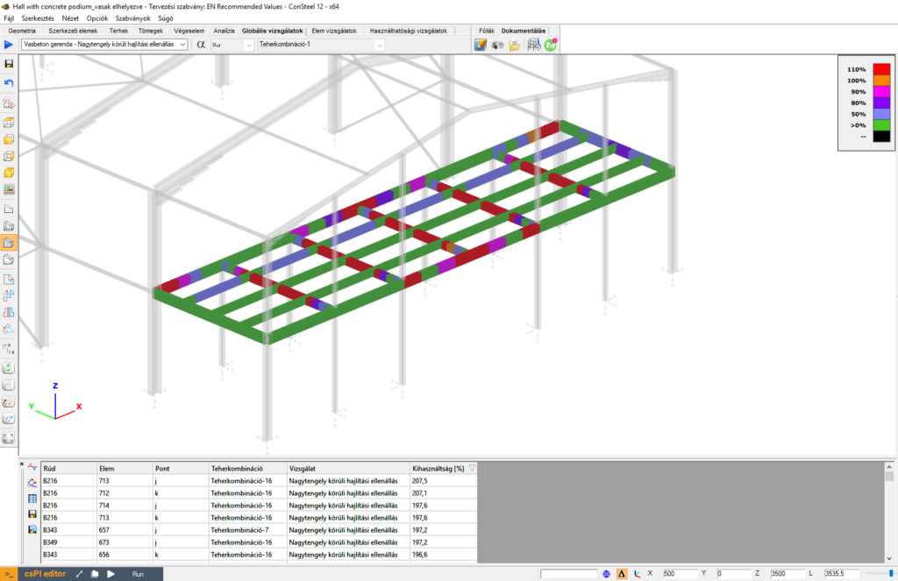
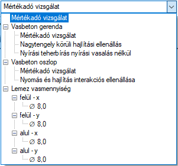

# Vasbeton szerkezetek tervezése

<!-- /wp:paragraph -->

<!-- wp:paragraph {"align":"justify"} -->

A vasbeton szerkezetek tervezése a globális vizsgálatok fülről érhető el. A globális tervezés ikonra kattintva  , a megjelenő **Tervezés…** dialógon az acél, illetve öszvér tervezési lehetőségek alatti **Vasbeton tervezés EN1992-1-1** csoportban található meg a **vasbeton gerenda**, **vasbeton oszlop**, illetve **vasbeton lemez minimális vashányad számítása** opció. Amennyiben rendelkezésre állnak a tervezéshez szükséges bemeneti adatok _(keresztmetszetek, vasalási paraméterek, tervezési paraméterek és analízis eredmények)_, úgy a jelölőnégyzetek segítségével kiválasztható, hogy a **Számítás** gombra kattintva a kiválasztott teherkombinációkra a szabványos vizsgálatok végrehajtásra kerüljenek.

<!-- /wp:paragraph -->

<!-- wp:image {"align":"center","id":37221,"width":442,"height":458,"sizeSlug":"full","linkDestination":"media","className":"is-style-editorskit-rounded","editorskit":{"devices":false,"desktop":true,"tablet":true,"mobile":true,"loggedin":true,"loggedout":true,"acf_visibility":"","acf_field":"","acf_condition":"","acf_value":"","migrated":false,"unit_test":false}} -->

A vasbeton tervezéshez a szükséges bemenő paraméterek a következők (részletesen lásd a **_[Vasbeton keresztmetszetek](../5_0_structural-modeling/5_2_line-members.md#vasbeton-keresztmetszetek)_** fejezetben):

- Vasbeton gerendák és oszlopok esetében:

  - [Méretezési opcióval rendelkező vasbeton keresztmetszet](../5_0_structural-modeling/5_2_line-members.md#méretezési-opcióval-rendelkező-vasbeton-keresztmetszetek-1)

  - [Vasbeton rúdelemhez rendelt vasalási objektum](../5_0_structural-modeling/5_2_line-members.md#gerenda-vasalás-definiálása)
  
  - [Első vagy másodrendű analízis eredmények](../8_0_structural-analysis/8_5_analysis-results.md#eredmény-típusok)

* Vasbeton lemezek esetében:

  - [Egyes főirányokhoz tartozó vasalási paraméterek](../5_0_structural-modeling/5_3_surface-members.md#felületi-elemek)

  - [Első vagy másodrendű héj elem analízis eredmények](../8_0_structural-analysis/8_5_analysis-results.md)
 

Amennyiben a vasbeton tervezéshez szükséges bemenő adatok rendelkezésre állnak, a számítás gombra kattintva a szabványos ellenőrzéseket a Consteel minden keresztmetszetre automatikusan elvégzi. A keresztmetszetekhez tartozó mértékadó kihasználtságokat eredményező vizsgálatokat a Consteel, a **Mértékadó kihasználtságok** táblázatban automatikusan kigyűjti, a modell grafikán pedig színkódos ábrázolással megjeleníti.

<!-- /wp:paragraph -->

<!-- wp:image {"align":"center","id":37213,"width":768,"height":497,"sizeSlug":"large","linkDestination":"media","className":"is-style-editorskit-rounded","editorskit":{"devices":false,"desktop":true,"tablet":true,"mobile":true,"loggedin":true,"loggedout":true,"acf_visibility":"","acf_field":"","acf_condition":"","acf_value":"","migrated":false,"unit_test":false}} -->

<!-- /wp:image -->

<!-- wp:paragraph -->

A képernyő bal felső sarkában található legördülő menüben az egyes vizsgálatok eredményei külön-külön is lekérhetők:

<!-- /wp:paragraph -->

<!-- wp:image {"id":37205,"sizeSlug":"full","linkDestination":"none"} -->

<!-- /wp:image -->

<!-- wp:heading {"level":3,"editorskit":{"devices":false,"desktop":true,"tablet":true,"mobile":true,"loggedin":true,"loggedout":true,"acf_visibility":"","acf_field":"","acf_condition":"","acf_value":"","migrated":false,"unit_test":false}} -->

### Vasbeton gerendák tervezése

<!-- /wp:heading -->

<!-- wp:spacer {"height":"1px"} -->

<!-- /wp:spacer -->

<!-- wp:paragraph -->

A vasbeton gerenda tervezés az **Eurocode 1992-1-1** következő vizsgálatait hajtja végre:

- Szerkesztési szabályok

  - EN 1992-1-1 9.2.1.1. (1) (9.1.n) formula, Minimális hosszirányú vasmennyiség ellenőrzés
  
  - EN 1992-1-1 9.2.1.1. (3) formula, Maximális hosszirányú vasmennyiség ellenőrzés
 
* Hajlítás

  - EN 1992-1-1 6.1, Nagytengely körüli hajlítás ellenőrzés

- Nyírás

  - EN 1992-1-1 9.2.2. (6) (9.6.N) formula, Maximális kengyeltávolság ellenőrzés

  - EN 1992-1-1 9.2.2. (5) (9.5.n) formula, Minimális fajlagos kengyel mennyiség ellenőrzés

  - EN 1992-1-1 6.2.2. (1) (6.2.a) és (6.2.b) formula, Nyírási teherbírás tervezési értéke nyírási vasalás nélkül
 
  - EN 1992-1-1 6.2.3. (3) (6.8) és (6.9) formula, Nyírási teherbírás tervezési értéke nyírási vasalással

* Nyírás és csavarás interakciója

  - EN 1992-1-1 6.3.2. (4) (6.29) formula, Ferde nyomott betonzónák teherbírása

  - EN 1992-1-1 6.3.2 (5) (6.31) formula, Szükséges csavarási hosszvasalás

  - EN 1992-1-1 6.3.2. (3) (6.28) formula, Alkalmazott csavarási hosszvasalás ellenőrzés

### Vasbeton oszlopok tervezése

:::warning

A névleges merevségen alapuló módszer alkalmazásához és a névleges görbületen alapuló módszer automatikus opciójához a megfelelő globális imperfekciók definiálására lehet szükség, lásd [**Globális imperfekciók**](../6_0_structural-loads/6_4_global-imperfections.md**).
:::

A vasbeton oszlop tervezés az **Eurocode 1992-1-1** következő vizsgálatait hajtja végre:

- Szerkesztési szabályok

  - EN 1992-1-1 9.5.2 (1), Hosszirányú acélbetétek minimális átmérője
 
  - EN 1992-1-1 9.5.2 (2), (9.12.N) formula, Minimális hosszirányú vasmennyiség
 
  - EN 1992-1-1 9.5.2 (3), Maximális hosszirányú vasmennyiség

  - EN 1992-1-1 9.5.3. (1), Kengyel minimális átmérője

  - EN 1992-1-1 9.5.3 (2), Maximális kengyeltávolság

* Hajlítás

  - EN 1992-1-1 5.8.3, 5.8.8, Ferde hajlítás

- Nyírás

  - EN 1992-1-1 6.2.2 (1) (6.2.a) és (6.2.b) formula, Nyírási teherbírás tervezési értéke nyírási vasalás nélkül

  - EN 1992-1-1 6.2.3. (3) (6.8) és (6.9) formula, Nyírási teherbírás tervezési értéke nyírási vasalással

Vasbeton oszlopoknál megjeleníthető a **[teherbírási felület](../10_0_section-module/10_2_section-module.md)** is.

### Vasbeton lemezek tervezése

Amennyiben a modellben létrehozott vasbeton lemezhez az **_[Felületi elemek fejezetben](../5_0_structural-modeling/5_3_surface-members.md#felületi-elemek)_** részletesen bemutatott módon megadásra kerültek x és y irányban az alsó és felső vasalási paraméterek, úgy a **Globális vizsgálatok** fül **Tervezés…** dialógján a vasbeton lemezek minimális vashányad számítása opció aktív, és a jelölőnégyzet bekapcsolásával a számítás elvégezhető.

A számítás eredménye a lemez igénybevételei alapján számolt szükséges vasmennyiségek \[mm2/m] a főirányokban, alsó és felső pozícióra külön-külön meghatározva. A főirányok között a legördülő menü segítségével van lehetőség váltani, az eredmények kijelzése pedig szintfelületes ábrázolással történik:

<!-- /wp:image -->

<!-- wp:paragraph -->

A jobb oldalon található színpalettán jobb egérgombot kattintva annak tulajdonságai (osztások száma, osztások értékei, vasmennyiség vagy vas távolság kijelzése) módosíthatók:

<!-- /wp:paragraph -->

<!-- wp:image {"align":"center","id":37197,"width":354,"height":400,"sizeSlug":"full","linkDestination":"media","className":"is-style-editorskit-rounded","editorskit":{"devices":false,"desktop":true,"tablet":true,"mobile":true,"loggedin":true,"loggedout":true,"acf_visibility":"","acf_field":"","acf_condition":"","acf_value":"","migrated":false,"unit_test":false}} -->

<!-- /wp:image -->

<!-- wp:paragraph -->

A főirányokhoz tartozó szükséges vasmennyiség ábrák dxf formátumba exportálhatók, a **_[DXF import fejezetben](../2_0_file-handling/2_6_dxf-import.md)_** bemutatott módon.

<!-- /wp:paragraph -->
