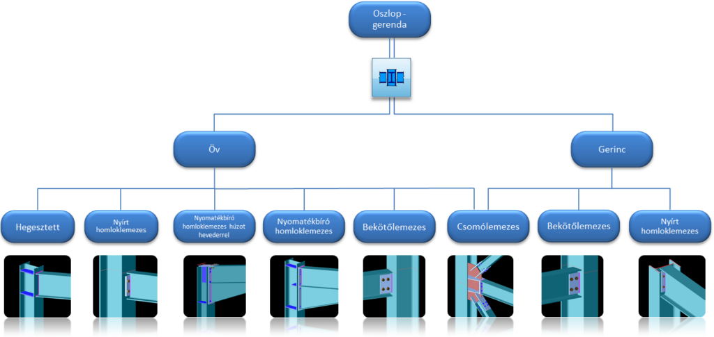

# Csomópont típusok
<!-- wp:paragraph -->

A csomópont típusok különböző logikai csoportokba vannak gyűjtve a modulon belül. A modul, a legtöbb csomóponthoz sok megerősítési lehetőséget is kínál, mint például alsó vagy felső kiékelés, gerinc, vagy övmerevítők, nyírási bordák (gerinchizlaló, Morrison merevítő, egyszerű vagy dupla ferde merevítő). Jelenleg az alábbi kapcsolatok érhetők el a csJoint modulban:

<!-- /wp:paragraph -->

<!-- wp:image {"align":"center","id":38192,"width":768,"height":364,"sizeSlug":"large","linkDestination":"media"} -->

<!-- /wp:image -->

<!-- wp:image {"align":"center","id":38200,"width":313,"height":391,"sizeSlug":"full","linkDestination":"media"} -->

<!-- /wp:image -->

<!-- wp:image {"align":"center","id":38208,"width":325,"height":356,"sizeSlug":"full","linkDestination":"media"} -->

<!-- /wp:image -->

<!-- wp:image {"align":"center","id":38216,"width":803,"height":623,"sizeSlug":"full","linkDestination":"media"} -->

<!-- /wp:image -->

<!-- wp:image {"align":"center","id":38232,"width":272,"height":401,"sizeSlug":"full","linkDestination":"media"} -->

<!-- /wp:image -->

<!-- wp:image {"align":"center","id":38224,"width":357,"height":407,"sizeSlug":"full","linkDestination":"media"} -->

<!-- /wp:image -->

<!-- wp:image {"align":"center","id":38240,"width":960,"height":464,"sizeSlug":"full","linkDestination":"media"} -->

<!-- /wp:image -->

<!-- wp:image {"align":"center","id":38248,"width":655,"height":483,"sizeSlug":"full","linkDestination":"media"} -->

<!-- /wp:image -->
