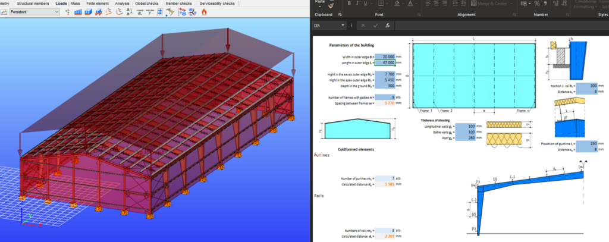
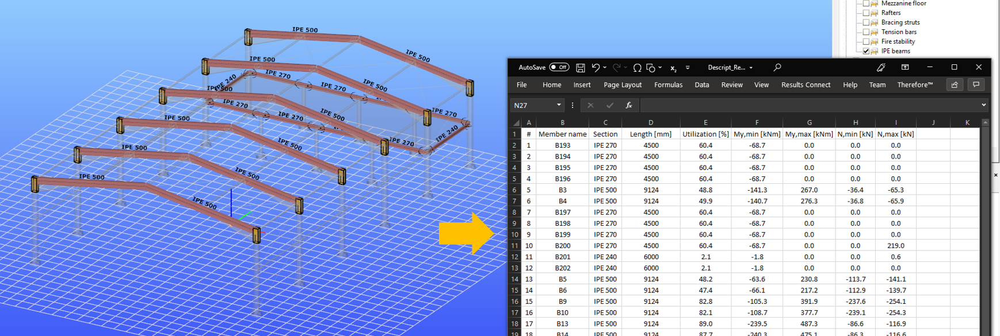

# Introduction

## What is Descript?

Descript is a scripting language for Consteel. It makes it possible to use Consteel functions through code. This way any sequence of actions in Consteel can be written as a script, and saved for later use.

## What can Descript be used for?

Descript can be used to perform a sequence of actions unattended within Consteel, which can be defined beforehand.  
Descript can be useful for parametric work, where certain parameters govern the creation or analysis of a model. Parameters in the script can be changed for different script runs in order to explore the range of possibilities, find an optimal solution, or be customized for different models.

Here are a few typical examples for the usage of Descript:

### Structural parts

While a particular structure might be unique, parts of it are frequently similar across different structures. This means that a certain structural part can be scripted and added to other models in one go.  
In this [example](https://consteelsoftware.com/script/purlin-generator/), purlins and their connection elements are added to the whole roof after setting a few initial input parameters.

### Entire structures

In case of not too complex, regular structures, it might be useful to create a script that builds it all in one go.  
In this [example ](https://consteelsoftware.com/script/warehouse-creation-with-excel-control-type-1-tapered/)an entire warehouse building is created with a bracing system, purlins, supports and loads.

### Automated calculations, iteration

Not only model building, but calculations and model modification can also be scripted. This way, iterative model modification based on results is also possible.  
In this [example](https://consteelsoftware.com/script/section-optimization-shs/), section sizes are modified based on utilization results until all utilizations are below 100%.

### Input / output

In some cases getting data in or out of Consteel might be tedious and time consuming, if done manually. Like if we have a long list of load values in another software to put on a large number of structural elements in a Consteel model, or we need to document a large amount of result values from a model. Descript can help us automate this process.  
In this [example](https://consteelsoftware.com/script/output-results-to-excel-ipe-members/), design utilizations and internal force results are collected from all structural members with an IPE section, and written in an Excel spreadsheet.

## [Script library](https://consteelsoftware.com/script/)

For even more examples and scripts visit our [Script library](https://consteelsoftware.com/script/), or browse scripts from within Consteel's MyDescript interface, where you can try scripts right away:

