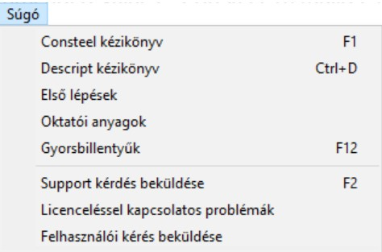
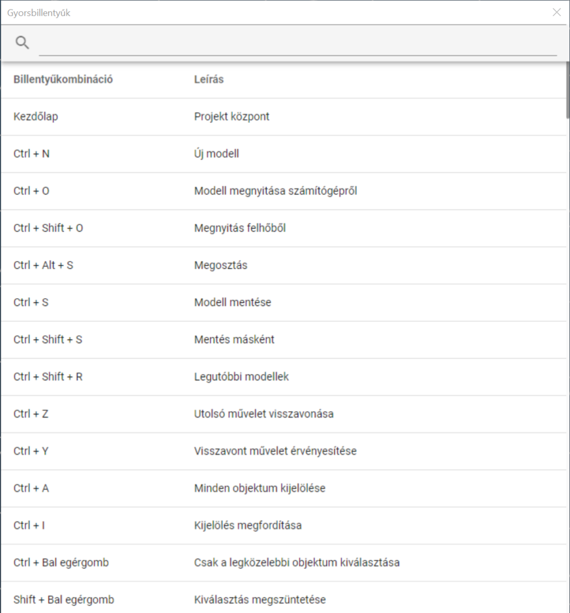

# Gyorsbillentyűk

Használatuk jelentősen gyorsítják a modellezést. A _Consteel_-ben az alábbi gyorsbillentyűk használhatók:

**Consteel 16**

- **Home: Projekt központ**

- **CTRL+N: új modell**

- **CTRL+O : modell megnyitása számítógépről**

- **Ctrl + Shift + O: Megnyitás felhőből**

- **Ctrl + Alt + S: Megosztás**

- **CTRL+S: modell mentése**

- **Ctrl+Shift+S: Mentés másként**

- **Ctrl + Shift + R: Legutóbbi modellek**

- **CTRL+Z: utolsó művelet visszavonása**

- **CTRL+Y: visszavont művelet érvényesítése**

- **CTRL+A: minden objektum kijelölése**

- **CTRL+I: kijelölés megfordítása**

- **CRTL + bal egérgomb: csak a legközelebbi objektum kiválasztása**

- **SHIFT+ jobb egérgomb: kiválasztás megszüntetése**

- **ESC: kijelölés megszüntetése, vagy kilépés egy műveletből**

- **Delete: kiválasztott objektumok törlése**

- **Ctrl + 0: befoglaló nézet**

- **CTRL+1: XY nézet (felülnézet)**

- **CTRL+2: XZ nézet (elölnézet)**

- **CTRL+3: YZ nézet (oldalnézet)**

- **CTRL+4: XYZ nézet (axonometria)**

- **CTRL+5: aktuális raszter síkra merőleges nézet**

- **CTRL+C: kiválasztott cellatartalmak másolása módosítható táblázatokból**

- **CTRL+V: másolt cellatartalmak beszúrása**

- **Egér középsőgomb: modell mozgatása**

- **ALT+bal egérgomb: modell forgatása**

- **ALT+jobb egérgomb: modell nagyítása/kicsinyítése**

- **↑: képernyő mozgatása fel**

- **↓: képernyő mozgatása le**

- **→: képernyő mozgatása jobbra**

- **←: képernyő mozgatása balra**

- **egér görgő: modell nagyítása/kicsinyítése**

- **+: modell közelítése**

- **-: modell távolítása**

- **SHIFT+ALT+bal egérgomb: ablakos nagyítás**

- **Insert: relatív origo elhelyezése**

- **X: Globális X koordináta értékének manuális megadása**

- **Y: Globális Y koordináta értékének manuális megadása**

- **Z: Globális Z koordináta értékének manuális megadása**

- **A: alfa szög megadása polár koordináta rendszerben**

- **B: béta szög megadása polár koordináta rendszerben**

- **L: hosszérték manuális megadása egy adott irányba, egy előzőleg kiválasztott ponttól**

- **Q: váltás a globális és a legutóbb definiált felhasználói koordináta rendszer között**

- **Ctrl + L: Licence**

- **Ctrl + H: Verzióelőzmények**

- **Ctrl + D: Descript Kézikönyv**

- **Ctrl + E: Pont és él mozgazása funkció megnyitása**

- **Ctrl + T: Eltolás funkció megnyitása**

- **Ctrl + R: Forgatás funkció megnyitása**

- **Ctrl + J: Consteel Joint megnyitása**

- **Ctrl + P: Kiválasztás tulajdonság alapján**

- **Shift + A: Szelvénykezelő**

- **Shift + S: Keresztmetszet modul**

- **K: Teherkombináció csomagok**

- **Alt + C: szelvény szerinti színezés ki+be kapcsolása**

- **Alt + P: Pillanatkép készítése**

- **F1: Consteel Kézikönyv**

- **F2: Support kérdés beküldése**

- **F3: Diagnosztika**

- **F4: Beállítások**

- **F5: Analízis paraméterek**

- **F6: Analízis futtatása**

- **F7: Globális vizsgálatok beállításai**

- **F8: Globális vizsgálatok futtatása**

- **F9: Használhatósági határállapot vizsgálat beállítások**

- **F10: Dokumentum kezelő megnyitása**

- **F11: Fóliák**

- **F12: Gyorsbillentyűk**

- **Shift+1: Szerkesztő nézet**
- **Shift+2: Drótvázas nézet**

- **Shift+3: Takartvonalas nézet**

- **Shift+4: Test nézet**

- **Shift + F1: Geometria fül**

- **Shift + F2: Szerkezeti elemek fül**

- **Shift + F3: Terhek fül**

- **Shift + F4: Tömegek fül**

- **Shift + F5: Végeselem fül**

- **Shift + F6: Analízis fül**

- **Shift + F7: Globális vizsgálatok fül**

- **Shift + F8: Elem vizsgálatok fül**

- **Shift + F9: Használhatósági vizsgálatok fül**

- **Shift + F10: Súgó fül**

- **Shift + F11: Fóliák fül**

- **Shift + F12: Dokumentálás fül**

- **Tab: Tabváltás előre**

- **Ctrl+Tab: Tabváltás hátra**

- **Alt + D: Descript megnyitása**

**Dokumentáció** **modul**

- **Ctrl + O: Megnyitás**

- **Ctrl +N: Új dokumentum**

- **Ctrl + P: Nyomtatás**

- **Ctrl + E: Export**

- **Ctrl + H: Panel elrejtése/megjelenítése**

- **Ctrl + S: Beállítások**

- **Home: Első oldal**

- **End: Utolsó oldal**

- **Page up: Egy oldalt fel**

- **Page down: Egy oldalt le**

A gyorsbillentyűk megjelennek a funkciók neve mellett a menüben és az ikonoknál az egeret az ikon fölé húzva lebegő üzenetben. Továbbá lehetőség van a kívánt kombináció megkeresésére a **_Gyorsbillentyűk_** ablakban, ami a **_Súgó_** menüből érhető el.

**Consteel 15**

- **CTRL+N:új modell**

- **CTRL+O: modell megnyitása**

- **CTRL+S: modell mentése**

- **CTRL+Z: utolsó művelet visszavonása**

- **CTRL+Y: visszavont művelet érvényesítése**

- **CTRL+A: minden objektum kijelölése**

- **CTRL+I: kijelölés megfordítása**

- **CTRL+1: XY nézet (felülnézet)**

- **CTRL+2: XZ nézet (elölnézet)**

- **CTRL+3: YZ nézet (oldalnézet)**

- **CTRL+4: XYZ nézet (axonometria)**

- **CTRL+5: aktuális raszter síkra merőleges nézet**

- **CTRL+C: kiválasztott cellatartalmak másolása módosítható táblázatokból**

- **CTRL+V: másolt cellatartalmak beszúrása**

- **ESC: kijelölés megszüntetése, vagy kilépés egy műveletből**

- **DELETE: kiválasztott objektumok törlése**

- **F1: súgó**

- **F3: analízis futtatása az aktuális beállításokkal**

- **X: Globális X koordináta értékének manuális megadása**

- **Y: Globális Y koordináta értékének manuális megadása**

- **Z: Globális Z koordináta értékének manuális megadása**

- **a: alfa szög megadása polár koordináta rendszerben**

- **b: béta szög megadása polár koordináta rendszerben**

- **L: hosszérték manuális megadása egy adott irányba, egy előzőleg kiválasztott ponttól**

- **R: váltás a globális és a legutóbb definiált felhasználói koordináta rendszer között**

- **Középső egérgomb: modell mozgatása**

- **ALT+bal egérgomb: modell forgatása**

- **ALT+jobb egérgomb: modell nagyítása/kicsinyítése**

- ↑ **: képernyő mozgatása fel**

- ↓ **: le**

- → **: jobbra**

- ← **: balra**

- **középső egérgomb tekerése: modell nagyítása/kicsinyítése**

- **+: modell közelítése**

- **-: modell távolítása**

- **SHIFT + bal egérgombbal kattintás elemre: kiválasztás megszüntetése**

- **SHIFT+ALT+ bal egérgombbal ablakrajzolás: ablakos nagyítás**