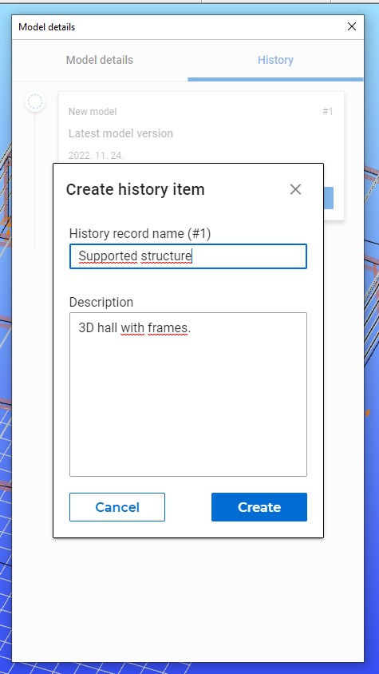
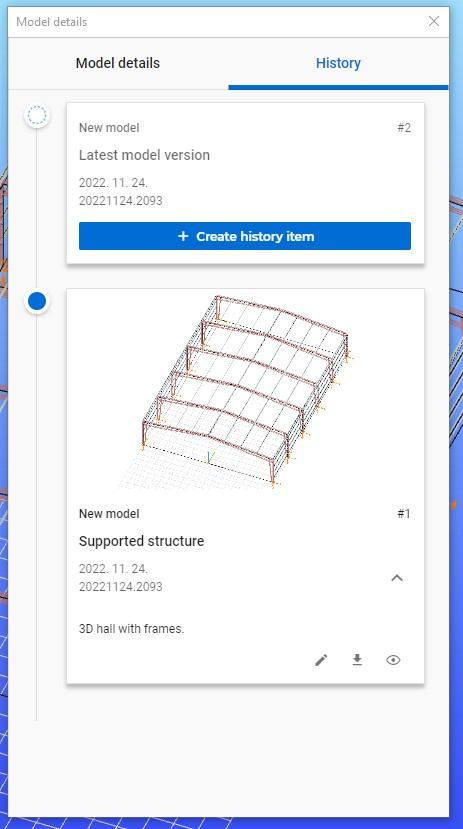
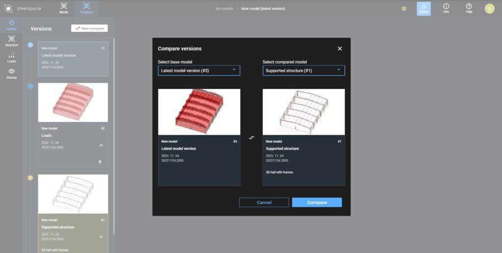
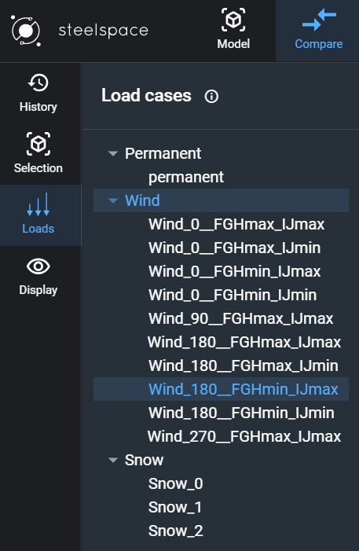
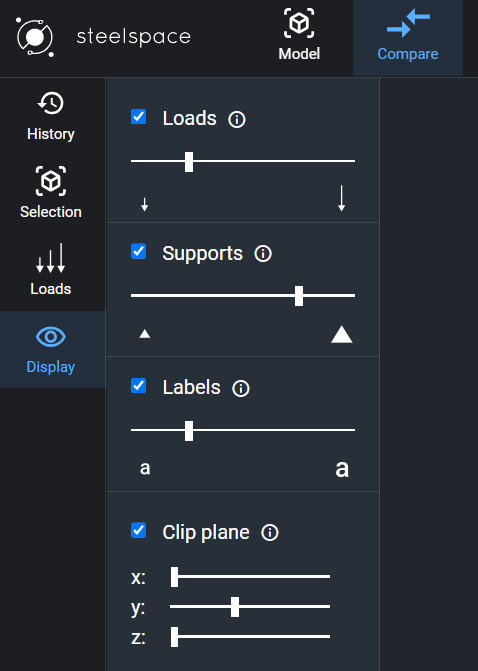

# Modell verzióelőzmények és verziók összehasonlítása

<!-- wp:paragraph -->

A Steelspace által támogatott új felhőalapú szolgáltatásként lehetőség van létrehozni, megtekinteni, letölteni, szerkeszteni modellekhez verziókat vagy akár visszaállítani a korábbi verziókat. Az Verzióelőzmények funkció csak a felhőbe mentett modellekkel működik így használatához online kapcsolat szükséges. Ennek a szolgáltatásnak a használatát csak a Consteel közösségi tagsághoz tartozó havi tárhelyméret korlátozza, mivel minden verziózással kapcsolatos művelet sávszélességbe kerül.

<!-- /wp:paragraph -->

<!-- wp:paragraph -->
:::warning Figyelem
Az előzményelemek létrehozása és a felhőbe mentése nem ugyanaz, ezért ne felejtsd el rendszeresen menteni a modelljeidet!
:::
A Verzióelőzmények funkció célja, hogy megőrizze a modell különböző állapotait, amelyek fontosak lehetnek a jövőbeni módosításokhoz vagy a modell felülvizsgálatához.

<!-- /wp:paragraph -->

<!-- wp:heading {"level":3} -->

### **Verzióelőzmények Consteel**ben

<!-- /wp:heading -->

<!-- wp:heading {"level":4} -->

#### **Előzményelem létrehozása**

<!-- /wp:heading -->

<!-- wp:paragraph -->

A funkció megtalálható ikonként, ha a Mentés ikonra felett tartod az egér kurzorát, vagy a Fájl menüben a Megosztás parancs alatt, vagy a Ctrl + H billentyűkombinációval előhívva.

<!-- /wp:paragraph -->

<!-- wp:columns -->

<!-- wp:column -->

<!-- wp:image {"align":"center","id":76046,"width":"296px","height":"auto","sizeSlug":"full","linkDestination":"none"} -->

Verzióelőzmények parancs a Fájl menüben

<!-- /wp:image -->

<!-- /wp:column -->

<!-- wp:column -->

<!-- wp:image {"align":"center","id":76056,"width":"262px","height":"auto","aspectRatio":"0.9659090909090909","sizeSlug":"full","linkDestination":"none"} -->

Az Verzióelőzmények ikon megjelenítéséhez vidd az egérmutatót a Mentés ikon fölé.

<!-- /wp:image -->

<!-- /wp:column -->

<!-- /wp:columns -->

<!-- wp:paragraph -->

A funkció első indításakor a szoftver megkérdezi, hogy szeretnéd-e bekapcsolni a modellverziózást, amihez először a felhőbe kell menteni a modellt, ezután már létrehozható a modell első előzményeleme.

<!-- /wp:paragraph -->

<!-- wp:image {"align":"center","id":76067,"width":"455px","height":"auto","sizeSlug":"full","linkDestination":"none"} -->

_Felugró ablak megjelenése, amikor először használják a Verzióelőzményeket_

<!-- /wp:image -->

<!-- wp:paragraph -->

Az előzményelemnek nevet és leírást is lehet adni, ha szükséges. Az előzményelem neve nem fogja befolyásolni a modell nevét.

<!-- /wp:paragraph -->

<!-- wp:image {"align":"center","id":44057,"width":313,"height":557,"sizeSlug":"full","linkDestination":"none"} -->

_Új verzióelőzmény létrehozása névvel és leírással_

<!-- /wp:image -->

<!-- wp:paragraph -->

A verzióelőzmény elem tartalmazza a modell nevét, a verzió számát, a létrehozás dátumát, a szoftverbuild számát amiben készült, és egy pillanatképet is a modellképernyőről.

<!-- /wp:paragraph -->

<!-- wp:paragraph -->

Új verzió létrehozásához csak kattints a Verzió létrehozása gombra. Az aktuális verzió mindig az idővonal tetején lesz megtalálható.

<!-- /wp:paragraph -->

<!-- wp:paragraph -->

Consteel 17-től kezdve, a Modell Verzióelőzmény frissítésre került. Az összes csapattag menthet új verziót a modell előzményébe a jogosultsági szintjeiknek megfelelően. Az információk a modellverziót létrehozó személyről, valamint a mentés pontos dátumáról és időpontjáról megjelennek a verzió neve alatt.

<!-- /wp:paragraph -->

<!-- wp:image {"align":"center","id":44064,"width":385,"height":690,"sizeSlug":"full","linkDestination":"none"} -->

_Új verzióelőzmény elem létrehozásához kattints a Verzió létrehozása gombra_

<!-- /wp:image -->

<!-- wp:heading {"level":4} -->

#### **Modellverzió letöltése**

<!-- /wp:heading -->

<!-- wp:paragraph -->

A Verzióelőzmények funkció megnyitásakor kattints a Letöltés ikonra a kívánt modellverzió elemnél és a modellfájl le fog töltődni a számítógépre.

<!-- /wp:paragraph -->

<!-- wp:heading {"level":4} -->

#### **Verzióelőzmény elem módosítása**

<!-- /wp:heading -->

<!-- wp:paragraph -->

A Verzióelőzmények funkció megnyitásakor kattints a Szerkesztés ikonra a kívánt modellverzió elemnél és szerkesztheted a verzió nevét és leírását.

<!-- /wp:paragraph -->

<!-- wp:heading {"level":4} -->

#### **Modellverzió megtekintése**

<!-- /wp:heading -->

<!-- wp:paragraph -->

A Verzióelőzmények funkció megnyitásakor kattints a Megtekintés ikonra a kívánt modellverzió elemnél és megtekintheted a Steelspace-en az adott verziót.

<!-- /wp:paragraph -->

<!-- wp:heading {"level":4} -->

#### **Modell visszaállítása korábbi verzióra**

<!-- /wp:heading -->

<!-- wp:paragraph -->

A visszaállítás funkció csak a felhőszolgáltatásokban érhető el, hogy ne okozzon hibát egy már megnyitott modellben. Ehhez először újra meg kell nyitni a Consteelt és a Projekt Centerben a Megnyitás felhőből gombra vagy a Fájl/Megnyitás felhőből parancsra kell kattintani, hogy hozzáférj a felhőben tárolt modelljeidhez. A kívánt modellnél jobb felül kattints az "i" ikonra és a Verzióelőzmények fülre, hogy hozzáférj az adott modell verzióelőzményeihez. Válaszd ki a számodra szimpatikus verziót és kattints a Visszaállítás ikonra.

<!-- /wp:paragraph -->

<!-- wp:image {"align":"center","id":44068,"width":834,"height":513,"sizeSlug":"large","linkDestination":"none"} -->

_A Visszaállítás ikon csak akkor látható ha a felhőből nyitnál meg egy modellt._

<!-- /wp:image -->

<!-- wp:paragraph -->

Visszaállításkor egy figyelmeztető üzenet fog megjelenni, hogy nehogy véletlenül történjen a visszaállítás. A visszaállítás után a választott verzió lesz az aktuális verziója a modellnek.

<!-- /wp:paragraph -->

<!-- wp:image {"align":"center","id":44078,"sizeSlug":"full","linkDestination":"none"} -->

_Figyelmeztető üzenet visszaállítás esetén_

<!-- /wp:image -->

<!-- wp:spacer {"height":"36px"} -->

<!-- /wp:spacer -->

<!-- wp:heading {"level":3} -->

### **Verzióelőzmények a Steelspaceben**

<!-- /wp:heading -->

<!-- wp:paragraph -->

Mint láthatod, a Verzióelőzmények teljesen integrálódtak a Steelspace felületébe is. Csak jelenkezz be a Steelspacere a steelspace.io oldalon és hozzáférhetsz a modelljeid verzióelőzményéhez anélkül, hogy meg kellene nyitnod a Consteelt.

<!-- /wp:paragraph -->

<!-- wp:heading {"level":4} -->

#### **Előzményelem létrehozása**

<!-- /wp:heading -->

<!-- wp:paragraph -->

Csak akkor hozhatsz létre verzióelőzményt ha az utolsó felhőbe mentésed nem egyezik az utolsó verzióelőzmény elem állapotával.

<!-- /wp:paragraph -->

<!-- wp:paragraph -->

Ilyen esetben válaszd ki a kívánt modellt a Dokumentum választó felületen és jobb felül kattints az "i" ikonra, majd a History fülre hogy hozzáférj az adott modell verzióihoz.

<!-- /wp:paragraph -->

<!-- wp:image {"align":"center","id":44083,"width":829,"height":417,"sizeSlug":"large","linkDestination":"none"} -->

_Kattints az "i" ikonra jobb felül, hogy hozzáférj az adott modell verzióelőzményeihez_

<!-- /wp:image -->

<!-- wp:paragraph -->

Modell megnyitásakor kattints a History fülre bal oldalt a Model megtekintő képernyőn.

<!-- /wp:paragraph -->

<!-- wp:paragraph -->

Ilyenkor a legfrissebb verzióelem létrehozásához kattints az idővonal legfelső kártyáján a „+ Create history item” gombra.

<!-- /wp:paragraph -->

<!-- wp:image {"align":"center","id":44093,"width":800,"height":401,"sizeSlug":"large","linkDestination":"none"} -->

Kattints a **History** fülre a Modell megtekintő képernyő bal oldalán hogy hozzáférj az adott modell verzióelőzményeihez*

<!-- /wp:image -->

<!-- wp:heading {"level":4} -->

#### **Modellverzió letöltése**

<!-- /wp:heading -->

<!-- wp:paragraph -->

A Dokumentum választó felületen vagy a Modell megtekintőben kattints a kívánt modell verzióelpzménykártyáján a Download ikonra és a verzió letöltődik a számítógépedre.

<!-- /wp:paragraph -->

<!-- wp:heading {"level":4} -->

#### **Verzióelőzmény elem módosítása**

<!-- /wp:heading -->

<!-- wp:paragraph -->

A Dokumentum választó felületen vagy a Modell megtekintőben kattints a kívánt modell verzióelpzménykártyáján az Edit ikonra és módosíthatod az adott verzióelem nevét és leírását.

<!-- /wp:paragraph -->

<!-- wp:heading {"level":4} -->

#### **Modellverzió megtekintése**

<!-- /wp:heading -->

<!-- wp:paragraph -->

A Dokumentum választó felületen kattints kétszer a választott modell kártyájára vagy a kártyán lévő View ikonra hogy egy adott verziót nyiss meg a Modell megtekintőben.

<!-- /wp:paragraph -->

<!-- wp:heading {"level":4} -->

#### **Modell visszaállítása korábbi verzióra**

<!-- /wp:heading -->

<!-- wp:paragraph -->

A kívánt modellnél jobb felül kattints az "i" ikonra és a Verzióelőzmények fülre, hogy hozzáférj az adott modell verzióelőzményeihez. Válaszd ki a számodra szimpatikus verziót és kattints a Visszaállítás ikonra. Visszaállításkor egy figyelmeztető üzenet fog megjelenni, hogy nehogy véletlenül történjen a visszaállítás. A visszaállítás után a választott verzió lesz az aktuális verziója a modellnek.

<!-- /wp:paragraph -->

<!-- wp:heading {"level":4} -->

#### **Verzióelőzmény elem törlése**

<!-- /wp:heading -->

<!-- wp:paragraph -->

A Dokumentum választó felületen vagy a Modell megtekintőben kattints a választott modell verzióinak a kártyáján a Delete ikonra a törléshez. Törlés esetén egy figyelmeztető üzenet fog megjelenni, hogy nehogy véletlenül történjen az eltávolítás.

<!-- /wp:paragraph -->

<!-- wp:spacer {"height":"36px"} -->

<!-- /wp:spacer -->

<!-- wp:heading {"level":3} -->

### **Modellverziók összehasonlítása**

<!-- /wp:heading -->

<!-- wp:paragraph -->

A Verzióelőzmények kiegészítő funkciójaként bevezetjük a Modellverziók összehasonlításának lehetőségét, ami lehetővé teszi egy adott modell két különböző állapotú verziójának összehasonlítását egymással. Az összehasonlítás Steelspace felületén történik ahol könnyen kiválaszthatod, hogy melyik verziókat szeretnéd összehasonlítani.

<!-- /wp:paragraph -->

<!-- wp:paragraph -->

Egy modell megnyitásakor a History fül tetején találod a Compare version gombot. Kattintáskor bekapcsol a funkció és automatikusan az adott kiválasztott verzió lesz kiválasztva egyik modellverzióként az összehasonlításhoz. Emellett egy magyarázó szöveg is megjelenik a gomb alatt, hogy csak válassz ki egy másik verziót az összehasonlítás másik elemének.

<!-- /wp:paragraph -->

<!-- wp:image {"align":"center","id":44104,"width":402,"height":397,"sizeSlug":"full","linkDestination":"none"} -->

_Az összehasonlítás funkció bekapcsolásakor egy segítő szöveg jelenik meg a Compare version gomb alatt._

<!-- /wp:image -->

<!-- wp:paragraph -->

Kattintás után az összehasonlítás véglegesítéséhez szükséges dialóg jelenik meg, ahol még lehetőség van a verziók kiválasztásának a módosítására. Kattints a Compare gombra az összehasonlításhoz.

<!-- /wp:paragraph -->

<!-- wp:image {"align":"center","id":44108,"width":894,"height":452,"sizeSlug":"large","linkDestination":"none"} -->

_Verziók kiválasztását segítő dialóg_

<!-- /wp:image -->

<!-- wp:paragraph -->

A legújabb verziótól kezdve összehasonlítási szempontokat lehet beállítani. A felhasználók legördülő menük segítségével kiválaszthatják, mely objektumok állapotváltozásait szeretnék megjeleníteni. A kiválasztott objektumokat az alábbi módon színezi:

<!-- /wp:paragraph -->

<!-- wp:paragraph -->

\- Zöld szín jelöli azokat az objektumokat, amelyeket hozzáadtak a modellhez

<!-- /wp:paragraph -->

<!-- wp:paragraph -->

\- Piros szín jelöli azokat az objektumokat, amelyeket töröltek

<!-- /wp:paragraph -->

<!-- wp:paragraph -->

\- Sárga szín jelöli azokat az objektumokat, amelyeken változás történt.

<!-- /wp:paragraph -->

<!-- wp:paragraph -->

Továbbá, a kiválasztott összes objektumon részletesebb kiválasztás is elvégezhető az alábbi jelölőnégyzetek segítségével. Itt a felhasználók beállíthatják azokat a szempontokat, amelyek alapján az összehasonlítást kívánják végezni.

<!-- /wp:paragraph -->

<!-- wp:image {"align":"center","id":76077,"width":"577px","height":"auto","sizeSlug":"full","linkDestination":"none"} -->

<!-- /wp:image -->

<!-- wp:image {"align":"center","id":76087,"width":"573px","height":"auto","sizeSlug":"full","linkDestination":"none"} -->

<!-- /wp:image -->

<!-- wp:paragraph -->

A képernyő automatikusan Modell nézetről a Compare nézetre vált, ahol egy csúszka segítségével választhatod ki, hogy melyik verziót szeretnéd megtekinteni. A History fülön belül egy világoskék és egy sárga színezés jelzi az éppen összehasonlításra kiválasztott verziókat.

<!-- /wp:paragraph -->

<!-- wp:image {"align":"center","id":44116,"width":858,"height":430,"sizeSlug":"large","linkDestination":"none"} -->

_A csúszkát használva kiválaszthatod, hogy melyik modellverziót szeretnéd megtekinteni_

<!-- /wp:image -->

<!-- wp:paragraph -->

Új összehasonlítást a New compare gombra kattintva indíthatsz el.

<!-- /wp:paragraph -->

<!-- wp:paragraph -->

A Modell nézetre visszaváltás esetén elvész az előzőleg kiválasztott modellösszehasonlítás és új összehasonlítás indítására lesz szükséged.

<!-- /wp:paragraph -->

<!-- wp:heading {"level":3} -->

### **Kiválasztás (Selection)**

<!-- /wp:heading -->

<!-- wp:paragraph -->

A modell megértésének elősegítése érdekében a felhasználók kijelölhetik az objektumokat szelvények vagy anyagok alapján. A kijelölt objektumok magenta színnel villognak. A kijelölés a szelvény vagy anyag nevére kattintással történik. Lehetőség van a rúdnevek alapján egyéni rudak kiválasztására, vagy akár egyszerre több objektum kiválasztására is.

<!-- /wp:paragraph -->

<!-- wp:image {"align":"center","id":76097,"width":"749px","height":"auto","sizeSlug":"large","linkDestination":"none"} -->

<!-- /wp:image -->

<!-- wp:image {"align":"center","id":76117,"width":"264px","height":"auto","sizeSlug":"full","linkDestination":"none"} -->

<!-- /wp:image -->

<!-- wp:image {"align":"center","id":76107,"width":"264px","height":"auto","sizeSlug":"full","linkDestination":"none"} -->

<!-- /wp:image -->

<!-- wp:heading {"level":3} -->

### **Terhek (Loads)**

<!-- /wp:heading -->

<!-- wp:paragraph -->

Az oldalsávon a következő gomb a Terhek. Segít a felhasználóknak azonosítani a tehereseteket és tehercsoportokat. A teheresetek nevére kattintásakor vizuálisan is megjelenik az adott tehereset a modellen.

<!-- /wp:paragraph -->

<!-- wp:image {"align":"center","id":76127,"width":"273px","height":"auto","sizeSlug":"full","linkDestination":"none"} -->

<!-- /wp:image -->

<!-- wp:heading {"level":3} -->

### **Megjelenítés (Display)**

<!-- /wp:heading -->

<!-- wp:paragraph -->

A Megjelenítés ablakon a Steelspace különféle láthatósági lehetőségeket kínál a felhasználóknak. A felhasználók csúszkákkal állíthatják be a Terhelések, Támaszok és Feliratok méretét.

<!-- /wp:paragraph -->

<!-- wp:paragraph -->

Ezenkívül a ,,Clip plane” jelölőnégyzet egy metszősíkot hoz létre a modellben X, Y vagy Z irányból. A pozíció csúszkákkal állítható be. Továbbá, egyidejűleg több metszősík is alkalmazható.

<!-- /wp:paragraph -->

<!-- wp:image {"align":"center","id":76137,"width":"285px","height":"auto","sizeSlug":"full","linkDestination":"none"} -->

<!-- /wp:image -->
