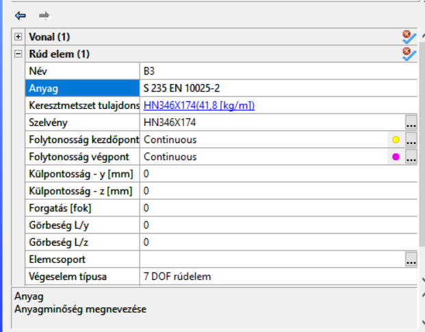
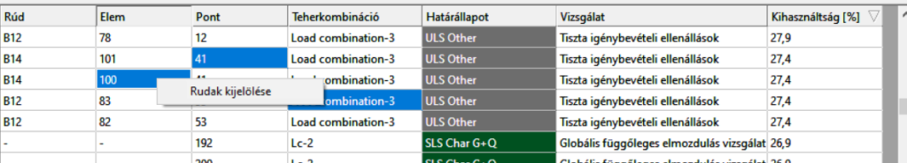

# Kijelölés

Az objektumok kijelölése történhet a grafikus képernyőn, az objektumfán, és a tulajdonságok szerinti kiválasztási módszerrel. Általános szabály, hogy csak a látható objektumok jelölhetők ki a grafikus képernyőről, ezért a különböző füleken egy azonos kijelölési művelet eredménye eltérő lehet. Egy kiválasztott elem kijelölése megszüntethető az elemre kattintással a _**SHIFT**_ billentyű lenyomása mellett. Az _**ESC**_ billentyű lenyomása az összes kijelölést megszünteti.

Az alapvető kijelölési módok és azok működése a következő:

- Az **egyszerű grafikus kijelölés** a kijelölendő elemre bal egérgombos kattintással történik. Minden olyan objektum kijelölésre kerül, melyet a kattintás pontjában a képernyő síkjára állított képzeletbeli merőleges egyenes átdöf. A kijelölés eredménye függ a grafikus szimbólum méretétől is. A takart, nem látszó objektumok is kijelölésre kerülnek!

* A **kijelölés ablakkal** a bal egérgombbal történő ablakrajzolással lehetséges. Az egérgomb fölengedésével a rajzolás befejeződik. Az ablak aktuális mérete rajzolás közben folyamatosan látható. Ha az ablakot balról jobbra rajzoljuk, akkor csak azok az objektumok kerülnek kijelölésre, amelyek teljes terjedelmükben az ablakon belül esnek. Ha az ablakot jobbról balra rajzoljuk, akkor az ablak belsejébe eső elemeken kívül, az ablak határvonalai által elmetszett elemek is kijelölésre kerülnek, akár milyen kis részt is érint az ablak.

- **CTRL + jobb klikk kijelölés**: a CTRL billentyű lenyomásával és jobb kattintással az egérmutatóhoz legközelebb eső objektum lesz kijelölve.

* **Kijelölés tulajdonságok szerint**: a funkció elérhető a bal oldali sávból, vagy a grafikus képernyőre való jobb egérgombos kattintással megjelenő helyi menüből is. A kívánt elemek kijelölése elvégezhető a megnyíló **_Kiválasztás tulajdonságok alapján_** című ablakban.

  - Elsőként az ablak legfelső sorában található legördülő menüből a kívánt objektum típust kell kiválasztani (Rúd elem, Pontbeli támasz, stb.), majd az adott típuson beül további tulajdonságokat megadva a kiválasztás tovább szűkíthető.

  - A bal alsó sarokban három opcióból kell választani, melyek a végső kiválasztást meghatározzák. Ezek:

    - _Pontos kiválasztás_: csak azon objektumok kiválasztása történik meg, melyek megfelelnek az épp aktuális paramétereknek.
  
    - _Kiválasztáshoz hozzáad_: az aktuális paramétereknek megfelelő elemek hozzáadódnak a már kiválasztott elemek halmazához.
    
    - _Kiválasztásból töröl_: az aktuális paramétereknek megfelelő elemek eltávolításra kerülnek a már kiválasztott elemek halmazából.

  * Az ablak alján látható parancsikonok működése:

    - **Bezár**: bezárja az ablakot, és az esetlegesen már korábban kiválasztott elemek halmaza nem változik
   
    - **Alkalmaz**: elvégzi az aktuális paraméterek és opciók alapján a kiválasztást, és az ablak nyitva marad. További kiválasztás lehetséges.
   
    - **Rendben**: elvégzi az aktuális paraméterek és opciók alapján a kiválasztást, és bezárja az ablakot.

 <!-- wp:list-item -->
- **Kijelölés az objektumfáról**: kijelölni kívánt elemek kijelölése az [_**Objektumfán**_](../1_0_general-description/1_2_the-main-window.md#objektumfa-objektum-tulajdonságok-és-diagnosztika-ablakok) látható elemek nevére való kattintással. A _**CTRL**_ vagy a _**SHIFT**_ billentyű lenyomása mellett a többszörös elemkijelölés is elvégezhető. A kiválasztás megszüntethető a modellfán kijelölt objektumnévre a _**CTRL**_ billentyű egyidejű lenyomásával történő újbóli kattintással.

- **Kijelölés az Objektum tulajdonságokból:** egy elemet kiválasztva, annak objektum tulajdonságait megtekinthetik a főablak jobb alsó részén. A modellben több elem is kijelölhető, melyek azonos tulajdonságokkal rendelkeznek. Ezeket az elemeket a tulajdonságukra (például anyag) való dupla kattintással választhatják ki.

- **Kijelölés a Tervezési eredményekből:** a felhasználók kiválaszthatják az elemeket a tervezési eredmény táblázatból azok kihasználtsága szerint.

- Tervezési eredmény táblázat:

- Bármely cellára jobb kattintással és a "Rudak kijelölése" opcióval a felhasználók kiválaszthatják a megfelelő elemet. Ha több cella van kijelölve, és a pontok különböző rudakhoz tartoznak, akkor több rúd lesz kiválasztva.

- Attól függetlenül, hogy melyik tulajdonságot választják ki (a felhasználók választhatnak cellákat bármely oszlopból), a "Rudak kijelölése” gomb megnyomásával az egész rúd ki lesz választva, ami magában foglalja a kiválasztott véges elemet vagy csomópontot, amelyet az egész sor jellemez.

- Figyelem, a Globális vizsgálatok fülön az elemek színei azok kihasználtságát jelzik. A kiválasztott elemek megtekintéséhez váltson a Globális vizsgálatok fülről valamelyikre az első négy közül: Geometria, Szerkezeti elemek, Terhek vagy Tömegek.

További általános kiválasztási funkció (mindet kijelöl, kijelölés törlése, kijelölés megfordítása) található az **_[Oldalsávon](../1_0_general-description/1_2_the-main-window.md#oldalsáv)_**, vagy elérhetőek a képernyőre történő jobb egérgombos kattintással, illetve _[**Gyorsbillentyűk**](../1_0_general-description/1_5_hot-keys.md)_ segítségével is.