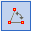

# Mérés
<!-- wp:paragraph -->

Modellezés közben szükséges lehet távolságok, szögek megmérése. A _**Mérés**_ funkció a _**Geometria**_ fülön található.

<!-- /wp:paragraph -->

<!-- wp:image {"align":"center","id":32937,"width":566,"height":73,"sizeSlug":"full","linkDestination":"media","className":"is-style-editorskit-rounded"} -->

<!-- /wp:image -->

<!-- wp:paragraph -->

A mérési funkciók a az alábbi, felugró ablakon érhetőek el:

<!-- /wp:paragraph -->

<!-- wp:image {"align":"center","id":32952,"width":359,"height":177,"sizeSlug":"full","linkDestination":"media"} -->

<!-- /wp:image -->

<!-- wp:list -->

- **Távolságmérés** - két kiválasztott pont közötti távolságot lehet megmérni milliméterben vagy méterben. A mértékegység a legördülő menüből választható.

<!-- /wp:list -->

<!-- wp:columns -->

<!-- wp:column -->

<!-- wp:image {"align":"center","id":32966,"width":359,"height":178,"sizeSlug":"full","linkDestination":"media"} -->

<!-- /wp:image -->

<!-- /wp:column -->

<!-- wp:column -->

<!-- wp:image {"align":"center","id":32982,"width":338,"height":171,"sizeSlug":"full","linkDestination":"media"} -->

<!-- /wp:image -->

<!-- /wp:column -->

<!-- /wp:columns -->

<!-- wp:list -->

- **Szögmérés** - három pont által meghatározott, két vonal által bezárt szöget lehet megmérni fokban vagy radiánban.

<!-- /wp:list -->

<!-- wp:columns -->

<!-- wp:column -->

<!-- wp:image {"align":"center","id":32990,"width":358,"height":177,"sizeSlug":"full","linkDestination":"media"} -->

<!-- /wp:image -->

<!-- /wp:column -->

<!-- wp:column -->

<!-- wp:image {"align":"center","id":32997,"width":311,"height":190,"sizeSlug":"full","linkDestination":"media"} -->

<!-- /wp:image -->

<!-- /wp:column -->

<!-- /wp:columns -->

<!-- wp:list -->

- **Szerkezeti elem adatainak lekérdezése** - kijelzi a képernyőn a kiválasztott szerkezeti elem hosszát, felületét és tömegét.

<!-- /wp:list -->

<!-- wp:columns -->

<!-- wp:column -->

<!-- wp:image {"align":"center","id":33014,"width":359,"height":176,"sizeSlug":"full","linkDestination":"media"} -->

<!-- /wp:image -->

<!-- /wp:column -->

<!-- wp:column -->

<!-- wp:image {"align":"center","id":33021,"width":348,"height":176,"sizeSlug":"full","linkDestination":"media"} -->

<!-- /wp:image -->

<!-- /wp:column -->

<!-- /wp:columns -->
