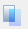

# Fóliák

Minden CAD alapú modellező rendszer rendelkezik valamilyen fóliakoncepcióval a modellen belüli objektumok kezelésének könnyebbé tétele érdekében. Ha az objektumokat különböző fóliákra helyezzük el, azok színek és vonaltípusok szerint jól elkülöníthetők, illetve egyes fóliák ki- vagy bekapcsolhatók, valamint lezárhatók a véletlen módosítások elkerülésére.

 A fólia kezelő dialógon az alábbi funkciók találhatóak:

- Új fólia létrehozása
- Meglévő fólia tulajdonságainak lemásolásával új fólia létrehozása
- Fóliák törlése
- Fóliák tulajdonságainak megváltoztatása (szín, vonaltípus, vonalvastagság és átlátszóság)
- Láthatóság ki-be kapcsolása
- Zárolás ki-be kapcsolása (látható, de nem módosíthatók a rajta lévő elemek, új elemeket sem lehet elhelyezni a fóliára)
- Saját stílus ki-be kapcsolása. Alapértelmezettként ez az opció be van kapcsolva. Ilyenkor az összes objektum a globálisan beállított stílust használja. Ha ezt kikapcsoljuk, akkor a fólián szereplő objektumok a fólia színét, vonaltípusát és -vastagságát veszik fel.
