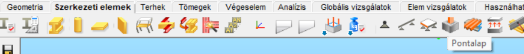
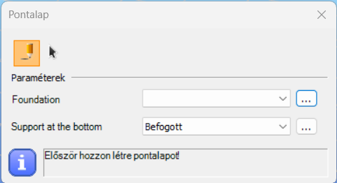
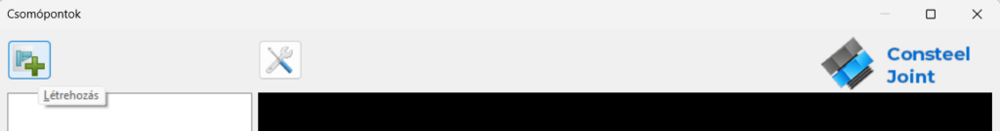
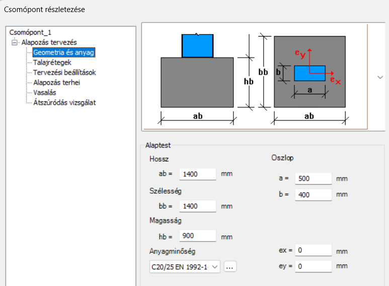
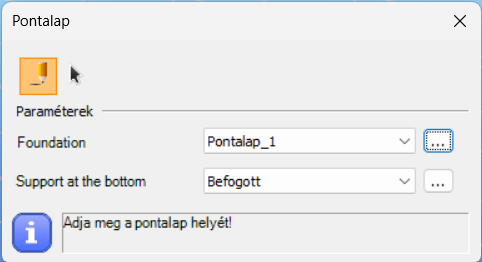
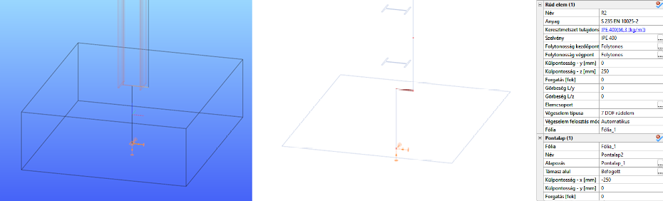
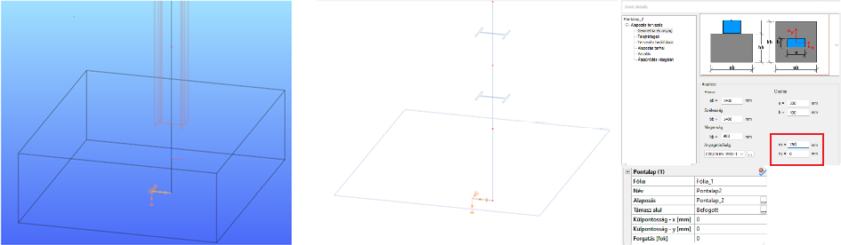
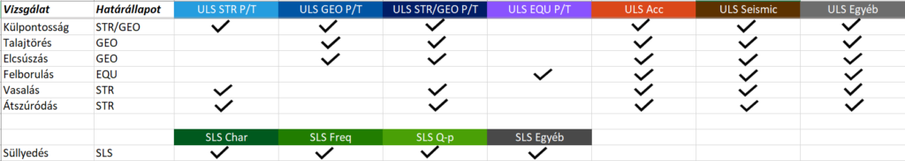

# Pontalap

<!-- wp:paragraph {"style":{"typography":{"fontSize":"24px"}}} -->

<!-- /wp:paragraph -->

<!-- wp:paragraph -->

A **Pontalapok** funkció a **Szerkezeti elemek** fülön található, és kifejezetten a különálló oszlopok kis mélységű pontalapozásának számítására szolgál.

<!-- /wp:paragraph -->

<!-- wp:image {"align":"center","id":51777,"sizeSlug":"full","linkDestination":"none","editorskit":{"devices":false,"desktop":true,"tablet":true,"mobile":true,"loggedin":true,"loggedout":true,"acf_visibility":"","acf_field":"","acf_condition":"","acf_value":"","migrated":false,"unit_test":false}} -->

<!-- /wp:image -->

<!-- wp:paragraph -->

A Pontalap egy összetett objektum, amely egy rúdelemből, egy támaszból és egy Joint-modellből áll. A támasz mindig az alapozás aljának geometriai középpontjában helyezkedik el, függetlenül az excentricitásoktól. A Pontalap referenciavonala mindig párhuzamos a globális Z tengellyel.

<!-- /wp:paragraph -->

<!-- wp:image {"align":"center","id":44444,"sizeSlug":"full","linkDestination":"none","editorskit":{"devices":false,"desktop":true,"tablet":true,"mobile":true,"loggedin":true,"loggedout":true,"acf_visibility":"","acf_field":"","acf_condition":"","acf_value":"","migrated":false,"unit_test":false}} -->

<!-- /wp:image -->

<!-- wp:heading {"level":3,"editorskit":{"devices":false,"desktop":true,"tablet":true,"mobile":true,"loggedin":true,"loggedout":true,"acf_visibility":"","acf_field":"","acf_condition":"","acf_value":"","migrated":false,"unit_test":false}} -->

### **Pontalap definiálása**

<!-- /wp:heading -->

<!-- wp:paragraph -->

A funkció ikonjára kattintva megjelenik a **Pontalap** párbeszédpanel. Ha még nincs létrehozott alapozás típusú Joint csomópont, a felső legördülő menü üres.

<!-- /wp:paragraph -->

<!-- wp:image {"align":"center","id":51768,"sizeSlug":"full","linkDestination":"none","editorskit":{"devices":false,"desktop":true,"tablet":true,"mobile":true,"loggedin":true,"loggedout":true,"acf_visibility":"","acf_field":"","acf_condition":"","acf_value":"","migrated":false,"unit_test":false}} -->

<!-- /wp:image -->

<!-- wp:paragraph -->

A  gombra, majd a megjelenő **Consteel Joint** párbeszédpanelen a  gombra kattintva lehet létrehozni egy új csomópontot. Itt csak pontalap típusú Joint csomópont hozható létre.

<!-- /wp:paragraph -->

<!-- wp:image {"align":"center","id":51786,"sizeSlug":"large","linkDestination":"none","editorskit":{"devices":false,"desktop":true,"tablet":true,"mobile":true,"loggedin":true,"loggedout":true,"acf_visibility":"","acf_field":"","acf_condition":"","acf_value":"","migrated":false,"unit_test":false}} -->

<!-- /wp:image -->

<!-- wp:paragraph -->

Elegendő megadni a méreteket, az anyagminőséget és az excentricitásokat a Consteel Joint **Geometria és anyag** párbeszédpanelén.

<!-- /wp:paragraph -->

<!-- wp:image {"align":"center","id":51723,"sizeSlug":"full","linkDestination":"none","editorskit":{"devices":false,"desktop":true,"tablet":true,"mobile":true,"loggedin":true,"loggedout":true,"acf_visibility":"","acf_field":"","acf_condition":"","acf_value":"","migrated":false,"unit_test":false}} -->

<!-- /wp:image -->

<!-- wp:paragraph -->

Az alapozási csomópont létrehozása és a támasz típusának kiválasztása után a pontalap egyenként  vagy többszörös elhelyezéssel  helyezhető el.

<!-- /wp:paragraph -->

<!-- wp:image {"align":"center","id":51732,"sizeSlug":"full","linkDestination":"none","editorskit":{"devices":false,"desktop":true,"tablet":true,"mobile":true,"loggedin":true,"loggedout":true,"acf_visibility":"","acf_field":"","acf_condition":"","acf_value":"","migrated":false,"unit_test":false}} -->

<!-- /wp:image -->

<!-- wp:paragraph -->

Pontalap a modell bármely pontján elhelyezhető. Az elhelyezés referenciapontja az objektum referenciavonalának felső vége.

<!-- /wp:paragraph -->

<!-- wp:paragraph -->

Amikor a pontalap egy rúdelem ( praktikusan egy oszlop ) végére kerül, akkor átveszi a rúdelem excentricitásait (y és z irányok és a forgatás). A lokális koordináta-rendszerek közötti transzformáció automatikusan történik. Ha az adott ponthoz egynél több rúd csatlakozik, ki kell jelölni, hogy melyiktől örökölje a tulajdonságokat. A pontalap elhelyezése után a rúdelemek excentricitásainak módosítása már nincs hatással a pontalapra.

<!-- /wp:paragraph -->

<!-- wp:heading {"level":3,"editorskit":{"devices":false,"desktop":true,"tablet":true,"mobile":true,"loggedin":true,"loggedout":true,"acf_visibility":"","acf_field":"","acf_condition":"","acf_value":"","migrated":false,"unit_test":false}} -->

### **Külpontosságok**

<!-- /wp:heading -->

<!-- wp:paragraph -->

A pontalap külpontosságát két helyen is be lehet állítani, de a kétféle meghatározás különböző végeselemes modellt eredményez. Ez a kétféle megadás az alábbi lehet:

<!-- /wp:paragraph -->

<!-- wp:paragraph -->

\#1 – Objektum tulajdonságok panelen: az oszlop alatt elhelyezett pontalap beállításához.

<!-- /wp:paragraph -->

<!-- wp:paragraph -->

Azon a feltételezésen alapul, hogy általános esetben a pontalapnak fizikailag az oszlop alatt kell lennie (nem az oszlop referenciavonala alatt). A Consteel más objektumaitól eltérően a pontalap referenciavonala elmozdul, ha excentricitást határozunk meg.

<!-- /wp:paragraph -->

<!-- wp:paragraph -->

Ha az objektum örökölte az excentricitást, az itt is látható lesz.

<!-- /wp:paragraph -->

<!-- wp:paragraph -->

Külpontos oszlop alá helyezett pontalap:

<!-- /wp:paragraph -->

<!-- wp:image {"align":"center","id":52101,"sizeSlug":"full","linkDestination":"none","className":"is-style-editorskit-rounded","editorskit":{"devices":false,"desktop":true,"tablet":true,"mobile":true,"loggedin":true,"loggedout":true,"acf_visibility":"","acf_field":"","acf_condition":"","acf_value":"","migrated":false,"unit_test":false}} -->

Pontalap külpontosságának beállítása az Objektum tulajdonságok panelen

<!-- /wp:image -->

<!-- wp:paragraph -->

\#2 – Consteel Joint segítségével: arra az esetre, ha az oszlop külpontosan helyezkedik el a pontalapon.

<!-- /wp:paragraph -->

<!-- wp:image {"align":"center","id":52110,"sizeSlug":"full","linkDestination":"none","className":"is-style-editorskit-rounded","editorskit":{"devices":false,"desktop":true,"tablet":true,"mobile":true,"loggedin":true,"loggedout":true,"acf_visibility":"","acf_field":"","acf_condition":"","acf_value":"","migrated":false,"unit_test":false}} -->

Pontalap külpontosságának beállítása a Consteel Joint modulban

<!-- /wp:image -->

<!-- wp:image {"align":"left","id":44536,"width":138,"height":147,"sizeSlug":"full","linkDestination":"none","editorskit":{"devices":false,"desktop":true,"tablet":true,"mobile":true,"loggedin":true,"loggedout":true,"acf_visibility":"","acf_field":"","acf_condition":"","acf_value":"","migrated":false,"unit_test":false}} -->

:::warning

A pontalap grafikus ábrázolása két különböző külpontosság-megadás esetén is lehet azonos vagy nagyon hasonló (az excentricitás-típusok kombinációja), ám a végeselem-modellek mégis különbözhetnek egymástól. Fontos meggyőződni a szerkezeti modell helyességéről.
:::
<!-- /wp:paragraph -->

<!-- wp:paragraph -->

Az átszúródás vizsgálatban a nyírási kerület kiszámításakor a Consteel Jointban megadott külpontosságok a mérvadók.

<!-- /wp:paragraph -->

<!-- wp:paragraph -->

<!-- /wp:paragraph -->

<!-- wp:heading {"level":3,"editorskit":{"devices":false,"desktop":true,"tablet":true,"mobile":true,"loggedin":true,"loggedout":true,"acf_visibility":"","acf_field":"","acf_condition":"","acf_value":"","migrated":false,"unit_test":false}} -->

### **Analízis**

<!-- /wp:heading -->

<!-- wp:paragraph -->

A pontalap egy fiktív vasbeton szelvénnyel rendelkező rúdelemként van modellezve, mely a háttérben automatikusan létrejön a Consteel Jointban meghatározott méretek szerint.

<!-- /wp:paragraph -->

<!-- wp:paragraph -->

A külpontosságok kezelésére szolgáló merev testek szintén automatikusan jönnek létre a végeselemes modell létrehozása során.

<!-- /wp:paragraph -->

<!-- wp:paragraph -->

A szerkezeti analízis nem veszi figyelembe a pontalap önsúlyát, de a Consteel Joint kiszámítja azt, és szükség esetén hozzáadja a tervezési terhekhez. Ha a modellben van pontalap objektum, akkor az SLS-kombinációkra a reakcióerők számítása is elvégzésre kerül a süllyedés ellenőrzéséhez.

<!-- /wp:paragraph -->

<!-- wp:paragraph -->

<!-- /wp:paragraph -->

<!-- wp:image {"align":"left","id":44544,"width":144,"height":153,"sizeSlug":"full","linkDestination":"none","editorskit":{"devices":false,"desktop":true,"tablet":true,"mobile":true,"loggedin":true,"loggedout":true,"acf_visibility":"","acf_field":"","acf_condition":"","acf_value":"","migrated":false,"unit_test":false}} -->
:::warning

Fontos ügyelni a pontalaphoz csatlakozó oszlop csatlakozó végének folytonosságára.
:::
<!-- /wp:paragraph -->

<!-- wp:paragraph -->

Ha az alaptesteket nem a Consteel programban tervezi, ajánlott az alapozás tervezéshez szükséges reakcióerőket egy pontalapok nélküli modellből generálni.

<!-- /wp:paragraph -->

<!-- wp:spacer -->

<!-- /wp:spacer -->

<!-- wp:heading {"level":3,"editorskit":{"devices":false,"desktop":true,"tablet":true,"mobile":true,"loggedin":true,"loggedout":true,"acf_visibility":"","acf_field":"","acf_condition":"","acf_value":"","migrated":false,"unit_test":false}} -->

### **Pontalapok tervezése**

A pontalapok tervezése a Consteel Joint programban történik.

A terhek megadhatók kézzel vagy betölthetők a Consteel modellből. A tervezési terheket általában az alapozás alján fellépő terhekből kell kiszámítani, kivéve az átszúródást, mely esetben az alapozás tetején fellépő terheket kell figyelembe venni.

Különböző ellenőrzések kerülnek elvégzésre a megfelelő határállapotokban.

1. Külpontosság ellenőrzése: EN 1997-1 6.5.4.

6. A talaj teherbírásának ellenőrzése: EN 1997-1 Annex D

10. Elcsúszás ellenőrzése: EN 1997-1 6.5.3.

14. A felborulás ellenőrzése: EN 1990 6.4.2. Eq. (6.7)

18. A vasalás ellenőrzése hajlításra: EN 1992-1-1 A vasalásra ható tervezési nyomaték kiszámításához lineáris feszültségeloszlást feltételezünk az alapozás alatt, ezért az eredő erőnek a "belső mag" területén belül kell lennie (az x és y irányú összegzett külpontosságnak kisebbnek kell lennie, mint ab/6, illetve bb/6). A vasalás ellenőrzése x és y irányban külön-külön történik.

22. Átszúródásvizsgálat nyírási vasalás figyelembevétele nélkül: EN 1992-1-1 6.4.4. (2)

26. Süllyedés ellenőrzése: EN 1997-1 6.6.2.

Ha a tervezési folyamat során módosítjuk a pontalap méreteit (magasság, ex, ey), a terhek elavulttá válnak. A megfelelő alapozási terhekhez új analízist kell futtatni a Consteelben.