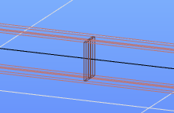
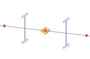

# Merevítők

<!-- wp:paragraph {"align":"justify"} -->

A gerinc merevítők modellezése jelenleg hegesztett I vagy H típusú keresztmetszetekhez áll rendelkezésre, de a későbbiekben elérhető lesz majd más típusú keresztmetszetekhez is. A merevítők hatása csak akkor lesz figyelembe véve az analízis és a méretezés során, ha a rúd végeseleme héj típusú. A normál 7SZF végeselemmel történő analízis ezeket az objektumokat nem veszi figyelembe. Egyetlen kivételként a merőleges merevítők öblösödési merevsége figyelembe vehető a rúd gerenda modelljében is, igény esetén.

<!-- /wp:paragraph -->

<!-- wp:columns -->

<!-- wp:column {"width":"50%","editorskit":{"devices":false,"desktop":true,"tablet":true,"mobile":true,"loggedin":true,"loggedout":true,"acf_visibility":"","acf_field":"","acf_condition":"","acf_value":"","migrated":false,"unit_test":false}} -->

<!-- wp:image {"align":"center","id":11456,"width":392,"height":224,"sizeSlug":"full","linkDestination":"media"} -->

<!-- /wp:image -->

<!-- /wp:column -->

<!-- wp:column {"width":"50%","editorskit":{"devices":false,"desktop":true,"tablet":true,"mobile":true,"loggedin":true,"loggedout":true,"acf_visibility":"","acf_field":"","acf_condition":"","acf_value":"","migrated":false,"unit_test":false}} -->

<!-- wp:image {"align":"center","id":11462,"width":389,"height":224,"sizeSlug":"full","linkDestination":"media","editorskit":{"devices":false,"desktop":true,"tablet":true,"mobile":true,"loggedin":true,"loggedout":true,"acf_visibility":"","acf_field":"","acf_condition":"","acf_value":"","migrated":false,"unit_test":false}} -->

<!-- /wp:image -->

<!-- /wp:column -->

<!-- /wp:columns -->

<!-- wp:heading {"level":3} -->

### Gerinc merevítők létrehozása 

<!-- /wp:heading -->

<!-- wp:paragraph -->

Gerinc merevítők hegesztett I vagy H keresztmetszetű rudakon definiálhatók, függetlenül attól, hogy a rúd végeselem típusa 7SZF rúd vagy héj. A parancs elindítása után megjelenő párbeszédablakban három típusú merevítőt lehet definiálni:

<!-- /wp:paragraph -->

<!-- wp:columns -->

<!-- wp:column -->

<!-- wp:image {"align":"right","id":39465,"width":294,"height":385,"sizeSlug":"full","linkDestination":"media","className":"is-style-editorskit-rounded"} -->

<!-- /wp:image -->

<!-- /wp:column -->

<!-- wp:column -->

<!-- wp:image {"align":"center","id":39457,"width":294,"height":385,"sizeSlug":"full","linkDestination":"media","className":"is-style-editorskit-rounded"} -->

<!-- /wp:image -->

<!-- /wp:column -->

<!-- wp:column -->

<!-- wp:image {"align":"left","id":39448,"width":294,"height":385,"sizeSlug":"full","linkDestination":"media","className":"is-style-editorskit-rounded"} -->

<!-- /wp:image -->

<!-- /wp:column -->

<!-- /wp:columns -->

<!-- wp:paragraph -->

A párbeszédablak legfelső részén a szokásos elhelyezési módok ikonjai találhatók:

<!-- /wp:paragraph -->

<!-- wp:list -->

-  a merevítők elhelyezhetők **egyenként** a rúd referencia vonalán történő kattintással,
-  vagy **többszörös** elhelyezéssel a rúd helyi koordinátarendszerében értelmezett relatív távolságokkal megadva.
-  Meglévő merevítők tulajdonságainak átvétele új definíciókhoz.

<!-- /wp:list -->

<!-- wp:paragraph -->

A párbeszédablak _Paraméterek_ szakaszában a merevítő pozícióját és méreteit kell megadni. Az elhelyezéshez választani kell egy referenciavonalat az ablak bal oldalán található legördülő mezőben (_Illesztés_). A kiválasztott referenciavonal a mező alatti ábrán látható. A referenciavonal lehet:

<!-- /wp:paragraph -->

<!-- wp:columns -->

<!-- wp:column {"width":"24%","editorskit":{"devices":false,"desktop":true,"tablet":true,"mobile":true,"loggedin":true,"loggedout":true,"acf_visibility":"","acf_field":"","acf_condition":"","acf_value":"","migrated":false,"unit_test":false}} -->

<!-- wp:list {"editorskit":{"devices":false,"desktop":true,"tablet":true,"mobile":true,"loggedin":true,"loggedout":true,"acf_visibility":"","acf_field":"","acf_condition":"","acf_value":"","migrated":false,"unit_test":false}} -->

- a rúd referencia vonala,
- a gerinc középvonala,
- a felső öv,
- az alsó öv.

<!-- /wp:list -->

<!-- /wp:column -->

<!-- wp:column {"width":"19%","editorskit":{"devices":false,"desktop":true,"tablet":true,"mobile":true,"loggedin":true,"loggedout":true,"acf_visibility":"","acf_field":"","acf_condition":"","acf_value":"","migrated":false,"unit_test":false}} -->

<!-- wp:image {"align":"center","id":39440,"width":159,"height":159,"sizeSlug":"full","linkDestination":"media","className":"is-style-editorskit-rounded","editorskit":{"devices":false,"desktop":true,"tablet":true,"mobile":true,"loggedin":true,"loggedout":true,"acf_visibility":"","acf_field":"","acf_condition":"","acf_value":"","migrated":false,"unit_test":false}} -->

<!-- /wp:image -->

<!-- /wp:column -->

<!-- wp:column {"width":"19%","editorskit":{"devices":false,"desktop":true,"tablet":true,"mobile":true,"loggedin":true,"loggedout":true,"acf_visibility":"","acf_field":"","acf_condition":"","acf_value":"","migrated":false,"unit_test":false}} -->

<!-- wp:image {"align":"center","id":39432,"width":159,"height":158,"sizeSlug":"full","linkDestination":"media","className":"is-style-editorskit-rounded"} -->

<!-- /wp:image -->

<!-- /wp:column -->

<!-- wp:column {"width":"19%","editorskit":{"devices":false,"desktop":true,"tablet":true,"mobile":true,"loggedin":true,"loggedout":true,"acf_visibility":"","acf_field":"","acf_condition":"","acf_value":"","migrated":false,"unit_test":false}} -->

<!-- wp:image {"align":"center","id":39424,"width":159,"height":159,"sizeSlug":"full","linkDestination":"media","className":"is-style-editorskit-rounded"} -->

<!-- /wp:image -->

<!-- /wp:column -->

<!-- wp:column {"width":"19%"} -->

<!-- wp:image {"align":"center","id":39416,"width":156,"height":158,"sizeSlug":"full","linkDestination":"media","className":"is-style-editorskit-rounded"} -->

<!-- /wp:image -->

<!-- /wp:column -->

<!-- /wp:columns -->

<!-- wp:paragraph -->

A választott referenciavonal nem csak a merevítő pozícionálását határozza meg, hanem annak tengelyét is, mivel az mindig merőleges lesz a választott referencia vonalra.

<!-- /wp:paragraph -->

<!-- wp:image {"align":"center","id":11557,"width":380,"height":288,"sizeSlug":"full","linkDestination":"media"} -->

<!-- /wp:image -->

<!-- wp:paragraph -->

A párbeszédablak jobb oldalán a kiválasztott geometriának megfelelő paraméterek adhatók meg. Az alábbi paraméterek minden típus esetén rendelkezésre állnak:

<!-- /wp:paragraph -->

<!-- wp:list -->

- referencia vonaltól mért **külpontosság**,
- merevítő elhelyezése a gerinc bal, jobb vagy mindkét **odalán**

<!-- /wp:list -->

<!-- wp:paragraph -->

A többi paraméter merevítő típustól függően változó:

<!-- /wp:paragraph -->

<!-- wp:list -->

- **Merőleges lemez**: az övekre merőlegesen elhelyezett lemez merevítő. A lemez vastagságát minden esetben meg kell adni. A többi méret megadása lehet kézi vagy automatikus. Automatikus választás esetén a lemez kitölti az övek közötti teret (szélességben és magasságban egyaránt), míg kézi esetben a lemez szélességét és hosszát is meg kell adni.
- **Párhuzamos lemez**: az övekkel párhuzamosan elhelyezett lemez merevítő. A lemez vastagságát és hosszát minden esetben meg kell adni. A lemez szélességének megadása lehet kézi vagy automatikus. Automatikus választás esetén a lemez szélessége megegyezik a szelvény szélességével. Meg kell adni továbbá a lemez beillesztési pontját is, mely lehet a lemez eleje, közepe vagy vége.
- **Merőleges szelvény**: az övekre merőlegesen elhelyezett szelvény, mely L, U vagy T típusú makró vagy könyvtári szelvény lehet. Rajzolt, összetett vagy hidegen alakított szelvények és acéltól eltérő anyagú szelvények nem használhatók ebben az esetben. A szelvény hosszának megadása lehet kézi vagy automatikus. Automatikus választás esetén a szelvény kitölti az övek közötti távolságot.

<!-- /wp:list -->

<!-- wp:paragraph -->

Az összes paraméter megadása után a merevítő elhelyezhető a rudakon:

<!-- /wp:paragraph -->

<!-- wp:list -->

- egyenként a rúd referenciavonalára kattintva, vagy
- a párbeszédablak alján egy sorozat elhelyezés megadásával az összes objektum egy egérkattintással elhelyezhető a rúd referenciavonalán.

<!-- /wp:list -->

<!-- wp:heading {"level":3} -->

### Analízis és méretezés

<!-- /wp:heading -->

<!-- wp:paragraph -->

**Analízis**

<!-- /wp:paragraph -->

<!-- wp:paragraph {"align":"justify"} -->

A program a merevítők hatását csak akkor veszi figyelembe az analízis során, ha a rúd végeselemtípusa héj. (A merevítők automatikusan bekerülnek a hálóba a végeselemes osztás során.) Normál 7SZF gerenda végeselemmel futtatva az analízist, ezek az objektumok nem lesznek figyelembe véve.

<!-- /wp:paragraph -->

<!-- wp:paragraph -->

Ha a "Öblösödési merevség figyelembevétele a rúdmodellen" opció be van jelölve, akkor a végeselemes osztás során egy automatikusan kiszámított merevségű öblösödési támasz kerül elhelyezésre a merevítő helyén, amelyet az analízis figyelembe vesz, és így a merevtő közvetett hatással lesz az kifordulási ellenállásra.

<!-- /wp:paragraph -->

<!-- wp:paragraph -->

Ez az opció csak az automatikus geometriájú (ld. fentebb), merőleges lemez- vagy szelvénymerevítő esetén elérhető.

<!-- /wp:paragraph -->

<!-- wp:columns -->

<!-- wp:column -->

<!-- wp:image {"align":"right","id":25497,"width":197,"height":130,"sizeSlug":"full","linkDestination":"none","className":"is-style-editorskit-shadow"} -->

merevítő a rúdon elhelyezve

<!-- /wp:image -->

<!-- /wp:column -->

<!-- wp:column -->

<!-- wp:image {"align":"left","id":25503,"height":130,"sizeSlug":"full","linkDestination":"none","className":"is-style-editorskit-shadow"} -->

helyettesítő öblösödési támasz a végeselemes modellen

<!-- /wp:image -->

<!-- /wp:column -->

<!-- /wp:columns -->

<!-- wp:paragraph -->

A Consteelben, az öblösödési merevség számításához használt módszerről bővebben a következő Tudásbázis cikkben olvashat (angolul): **_[Discrete warping restraint](https://www.Consteelsoftware.com/knowledgebase/discrete-warping-restraint/?search=discrete%20warping)_**.

<!-- /wp:paragraph -->

<!-- wp:paragraph -->

**Méretezés**

<!-- /wp:paragraph -->

<!-- wp:paragraph -->

A merevítők a méretezésben jelenleg nincsenek figyelembe véve.

<!-- /wp:paragraph -->

<!-- wp:spacer {"height":"11px","editorskit":{"devices":false,"desktop":true,"tablet":true,"mobile":true,"loggedin":true,"loggedout":true,"acf_visibility":"","acf_field":"","acf_condition":"","acf_value":"","migrated":false,"unit_test":false},"editorskit_typography":{"name":"","family":"","weight":""},"extUtilities":[]} -->

<!-- /wp:spacer -->

<!-- wp:heading {"level":3} -->

### Bemutató videó

<!-- /wp:heading -->

<!-- wp:html -->

<YouTubeEmbedded>ClcNpBDFazg</YouTubeEmbedded>

<!-- /wp:html -->
