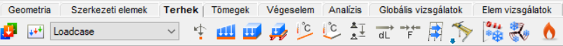

import DocCardList from '@theme/DocCardList';

{/* Ez a sor az adott főcímért mint eddig */}

# Terhek

A teherfelvétel az egyik legfontosabb fázisa a szerkezetek modellezésének. Ellentétben a szerkezet modellezésével, a terhek felvételét a szabványok részletesen meghatározzák, mivel a terhek helyes felvételének döntő szerepe van a szerkezet valósághű viselkedésének elemzését lehetővé tevő számítási modell előállításakor.

A Consteel-ban számos funkció segíti a mérnököt. A szerkezeti elemek kezeléséhez hasonlóan, a szabványok által kezelt és meghatározott teher típusok alkalmazhatók. Az alkalmazott terheket a program automatikusan átalakítja véges elemeken ható terhekre a számítási modell részére. A terhek modellezéséhez kapcsolódó funkciók a Terhek fülön találhatók.

<DocCardList />   {/* Ez a sor felel a kártyák megjelenítésért (ez és az első sor is) */}
