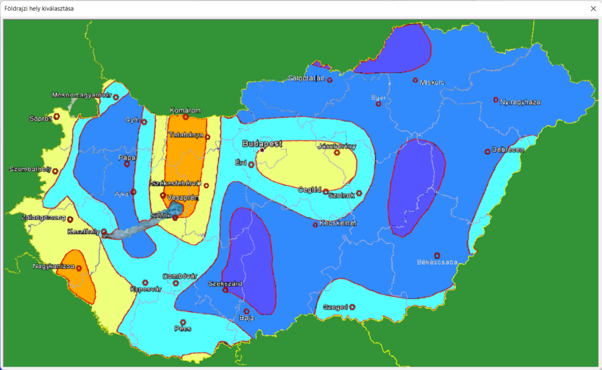

# Válaszspektrum felvétele

<!-- wp:paragraph -->

A Válaszspektrum felvétele () funkció segítségével az alábbi kétfajta spektrum felvételére van lehetőség:

<!-- /wp:paragraph -->

<!-- wp:list -->

- Szabványos rugalmas válaszspektrum: a kiválasztott szabvány, illetve nemzeti mellékletnek megfelelő szabványos rugalmas válaszspektrum felvétele. A megadáshoz szükséges paraméterek szabványonként, illetve nemzeti mellékletenként eltérőek lehetnek
- Egyedi válaszspektrum: egyedi válaszspektrum felvétele, a spektrum pontjainak táblázatos megadásával

<!-- /wp:list -->

<!-- wp:image {"align":"center","id":36433,"width":548,"height":186,"sizeSlug":"full","linkDestination":"media","className":"is-style-editorskit-rounded"} -->

<!-- /wp:image -->

<!-- wp:heading {"level":3} -->

### Új szabványos rugalmas válaszspektrum

<!-- /wp:heading -->

<!-- wp:paragraph -->

Az **Új Szabványos rugalmas válaszspektrum** létrehozása opció választása esetén, az előzetesen kiválasztott szabvány, illetve nemzeti mellékletnek megfelelő szabványos rugalmas válaszspektrum hozható létre válaszspektrum analízis, illetve földrengésszámítás számára.

<!-- /wp:paragraph -->

<!-- wp:image {"align":"right","id":36441,"width":245,"height":313,"sizeSlug":"full","linkDestination":"media","className":"is-style-editorskit-rounded"} -->

<!-- /wp:image -->

<!-- wp:paragraph -->

Az _EuroCode_ szerint, a szabványos rugalmas válaszspektrumhoz az alábbi paraméterek megadása szükséges:

<!-- /wp:paragraph -->

<!-- wp:list -->

- _T_

<!-- /wp:list -->

<!-- wp:list -->

- _Spektrum típusa:_ a legördítő menüből kiválasztható az aktuális szabvány szerint használható spektrum típus
- _Fontossági osztály:_ a legördítő menüből kiválasztható a létesítménynek megfelelő fontossági osztály. A fontossági osztály mellet megjelenik az aktuális szabvány szerinti tényező
- _Altalaj típusa_: a három pontos () gombra kattintva kiválasztható a létesítmény helyszínén lévő altalaj típus. A dialóg alján megjelennek a kiválasztott altalaj típushoz tartozó szabványos spektrum paraméterek.
- _Talajgyorsulás – agR \[m/s2]: a beviteli mezőben megadható a létesítmény helyszínén érvényes talajgyorsulás értéke m/s2 mértékegységben, vagy a három pontos_ () gombra kattintva, valamely beépített földrengés térképen a megfelelő helyszínre kattintva, a talajgyorsulás értéke betöltődik:

<!-- /wp:list -->

<!-- wp:image {"align":"right","id":36449,"width":154,"height":235,"sizeSlug":"full","linkDestination":"media","className":"is-style-editorskit-rounded"} -->

<!-- /wp:image -->

<!-- wp:image {"align":"center","id":36457,"width":512,"height":315,"sizeSlug":"large","linkDestination":"media","className":"is-style-editorskit-rounded"} -->

<!-- /wp:image -->

<!-- wp:list -->

- _Függőleges gyorsulás_ _avg/ag_: nem módosítható, csak tájékoztató információ. A mező megmutatja az aktuálisan kiválasztott szabvány által használt értéket. Felhasználó szabvány létrehozásával módosítható (lásd 1.2.3 fejezet)

<!-- /wp:list -->

<!-- wp:image {"align":"center","id":36466,"width":365,"height":403,"sizeSlug":"full","linkDestination":"media","className":"is-style-editorskit-rounded"} -->

<!-- /wp:image -->

<!-- wp:paragraph -->

A dialóg Válaszspektrum mezőjében grafikusan megjelenik a megadott paraméterek szerinti szabványos rugalmas válaszspektrum. Az egér mutatóval megtekinthető a spektrum minden egyes pontjában a függvény értéke. A függőleges és vízszintes spektrumok között a legördítő menüvel lehet váltani.

<!-- /wp:paragraph -->

<!-- wp:image {"align":"center","id":36474,"width":353,"height":177,"sizeSlug":"full","linkDestination":"media","className":"is-style-editorskit-rounded"} -->

<!-- /wp:image -->

<!-- wp:heading {"level":3} -->

### Új Egyedi válaszspektrum

<!-- /wp:heading -->

<!-- wp:paragraph -->

**Új Egyedi válaszspektrum** létrehozására két lehetőséget nyújt a _Consteel_.

<!-- /wp:paragraph -->

<!-- wp:image {"align":"center","id":36482,"width":548,"height":185,"sizeSlug":"full","linkDestination":"media","className":"is-style-editorskit-rounded"} -->

<!-- /wp:image -->

<!-- wp:list {"ordered":true,"type":"1"} -->

1. Válaszspektrum _létrehozható kézzel_ a függvény pontjainak megadásával, ebben az esetben az Új Egyedi válaszspektrum opció kiválasztása után a **Létrehozás** gombra kell kattintani. Ebben az esetben a létrehozó dialóg teljesen üresen jelenik meg
2. Válaszspektrum létrehozása, egy már *meglévő spektrum másolataként*. Az Új Egyedi válaszspektrum opció kiválasztása után be kell pipálni a _Létező válaszspektrum másolataként_ opció jelölőnégyzetét és a legördülő menüből ki kell választani valamelyik már előzőleg létrehozott spektrumot, majd a **Létrehozás** gombra kell kattintani. A létrehozó dialóg feltöltődik a másolatként használt spektrum értékeivel, amelyek ezután kézzel módosíthatók

<!-- /wp:list -->

<!-- wp:spacer -->

<!-- /wp:spacer -->

<!-- wp:heading {"level":4} -->

#### Egyedi válaszspektrum kézi felvétele

<!-- /wp:heading -->

<!-- wp:paragraph -->

Az **Új Egyedi válaszspektrum** opció kiválasztása után a **Létrehozás** gombra kattintva megjelenik a létrehozó dialóg.

<!-- /wp:paragraph -->

<!-- wp:image {"align":"right","id":36555,"width":389,"height":429,"sizeSlug":"full","linkDestination":"media","className":"is-style-editorskit-rounded"} -->

<!-- /wp:image -->

<!-- wp:paragraph -->

A _Válaszspektrum paraméterek_ (#1) mezőben az alábbi paramétereket kell megadni:

<!-- /wp:paragraph -->

<!-- wp:list -->

- _Talajgyorsulás_– a \[m/s2]: a beviteli mezőben megadható a létesítmény helyszínén érvényes talajgyorsulás értéke m/s2 mértékegységben, vagy a három pontos_ () gombra kattintva, valamely beépített földrengés térképeken a megfelelő helyszínre kattintva, a talajgyorsulás értéke betöltődik.
- _Függőleges gyorsulás av/a_: a beviteli mezőben megadható a függőleges és a vízszintes gyorsulás aránya
- *Válaszspektrum fajtája:* egyedi válaszspektrum lehet Tervezési vagy Rugalmas válaszspektrum. A megadott beállításnak megfelelően fogja a spektrumot a Consteel kezelni. Tervezési válaszspektrum tervezési szituációban, míg a rugalmas válaszspektrum használhatósági szituációban használható

<!-- /wp:list -->

<!-- wp:paragraph -->

A válaszspektrum függvény, a _Válaszspektrum pontjainak szerkesztése_ mezőben adható meg táblázatosan, megadva az időértéket másodperc mértékegységben, illetve a hozzá tartozó gyorsulással leosztott spektrum értéket (mértékegység nélküli szám).

<!-- /wp:paragraph -->

<!-- wp:paragraph -->

A spektrum megadó tábláz oszlopainak a száma tetszőlegesen változtatható. Új oszlop a , (#5) gombbal adható hozzá, míg oszlopot törölni a , (#4) gombbal lehet.

<!-- /wp:paragraph -->

<!-- wp:paragraph -->

Az egyedi válaszspektrum alap esetben mind a három (X, Y és Z) irányban megegyezik. Ha szükséges, a (#3) legördülő menü segítségével megadható eltérő spektrum a függőleges, illetve mind a három irányhoz. Viszont ezekben az esetekben a táblázatos spektrum megadást kétszer, illetve háromszor kell elvégezni a különböző irányokban. Az éppen szerkesztett irányhoz tartozó spektrum a (#2) legördülő menü segítségével választható ki.

<!-- /wp:paragraph -->

<!-- wp:paragraph -->

A megadott spektrum elmenthető *.csv* és *.txt* formátumokba, a  (#4) gomb segítségével, illetve egy már elmentett spektrum megnyitható a  (#4) gomb segítségével.

<!-- /wp:paragraph -->

<!-- wp:paragraph -->

A _Válaszspektrum_ mezőben, az aktuálisan szerkesztett válaszspektrum függvénye jelenik meg. Az egér mutatóval megtekinthető a spektrum minden egyes pontjában a függvény értéke.

<!-- /wp:paragraph -->

<!-- wp:heading {"level":4} -->

#### Egyedi válaszspektrum felvétele, egy meglévő spektrum másolataként

<!-- /wp:heading -->

<!-- wp:paragraph -->

Az **Új Egyedi válaszspektrum** opció kiválasztása és a _Létező válaszspektrum másolataként_ opció jelölőnégyzetét bepipálása és a legördülő menü segítségével, valamely már előzőleg létrehozott spektrum kiválasztása után, a **Létrehozás** gombra kattintva, megjelenik a létrehozó dialóg, feltöltve a másolatként használt spektrum paramétereivel.

<!-- /wp:paragraph -->

<!-- wp:paragraph -->

A spektrum betöltése után már a spektrum bármely paramétere módosítható és átírható.

<!-- /wp:paragraph -->

<!-- wp:paragraph -->

A funkciók használata megegyezik a fenti **_[Egyedi válaszspektrum kézi felvétele ](#egyedi-válaszspektrum-kézi-felvétele)_** alfejezetben leírtakkal.

<!-- /wp:paragraph -->
