# Acélszerkezet tervezés

<!-- wp:paragraph -->

Az acélszerkezet tervezéshez szükséges funkciók a **Globális vizsgálatok** és az **Elem vizsgálatok** fülön találhatók.

<!-- /wp:paragraph -->

<!-- wp:heading {"level":3} -->

### **Globális vizsgálatok**

<!-- /wp:heading -->

<!-- wp:heading {"level":4} -->

#### Alapok

<!-- /wp:paragraph -->

<!-- wp:image {"id":73060,"width":"1022px","height":"auto","sizeSlug":"full","linkDestination":"none"} -->

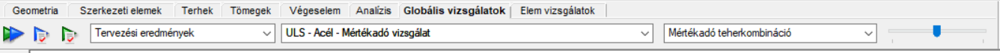

<!-- /wp:image -->

<!-- wp:paragraph -->

A Használhatósági határállapot vizsgálatok  és a Teherbírási határállapot vizsgálatok 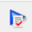 is  a Globális vizsgálatok fülön  szerepelnek.

<!-- /wp:paragraph -->

<!-- wp:paragraph -->

A már előzőleg kiválasztott beállításokkal a **Globális vizsgálatok** a  gombbal indítható el. Ezt a gombot csak abban az esteben ajánlott használni, amikor az Analízis, Terhek illetve a kombinációk nem változnak, csak a vizsgálatot ismételjük. Például, ha csak a rúd szelvényen esik módosítás.

<!-- wp:paragraph -->

 Ezek a vizsgálatok teljesen függetlenek mindenféle speciális szerkezeti elem paramétertől (pl.: kihajlási hossz stb.), ezért teljesen automatikusan elvégezhetők az egész szerkezetre.

<!-- /wp:paragraph -->

<!-- wp:paragraph -->

A dialóg felső részén kiválasztható, hogy mely eredmény típus (első vagy másodrendű analízis) alapján történjen a vizsgálatok elvégzése, illetve a táblázatban kiválasztható, hogy mely teherkombinációk esetén.

#### Keresztmetszet vizsgálat

<!-- /wp:heading -->

<!-- wp:image {"align":"center","id":37005,"width":509,"height":76,"sizeSlug":"full","linkDestination":"media","className":"is-style-editorskit-rounded"} -->

<!-- /wp:image -->

<!-- wp:paragraph -->

Keresztmetszet ellenőrzés elvégezhető az EN 1993-1-1 6.2 vagy EN 1993-1-2 4.2 (ha az adott teherkombináció tartalmaz tűzhatást) szabványok szerint.

<!-- /wp:paragraph -->

<!-- wp:paragraph -->

Az ellenőrzés elvégezhető teljes vagy részletmodellre is.

<!-- /wp:paragraph -->

<!-- wp:paragraph -->

Kiválasztható a méretezés során használandó biztonsági tényező is. Ha szükséges, a jelölő négyzet kiválasztásával a γM0 helyett, a γM1 is használható.

<!-- /wp:paragraph -->

<!-- wp:paragraph -->

Amennyiben a modell hidegen-alakított szelvényeket is tartalmaz, ezek keresztmetszeti méretezése az EN 1993-1-3 szerint akkor végezhető el, ha az ezek elvégzésére utasító kapcsoló bekapcsolt állapotban van.

<!-- /wp:paragraph -->

<!-- wp:image {"align":"center","id":36997,"sizeSlug":"full","linkDestination":"media","className":"is-style-editorskit-rounded"} -->

<!-- /wp:image -->

<!-- wp:heading {"level":4} -->

#### Stabil hossz ellenőrzés

<!-- /wp:heading -->

<!-- wp:paragraph -->

Képlékeny csuklókat tartalmazó szerkezet esetén az EuroCode (1993-1-1 BB3) szerinti stabil hossz számítása elvégezhető. A számítás során a képlékeny csukló és az oldalirányú(Lub) elmozdulás, illetve elcsavarodás elleni támaszok közötti képlékeny szakasz hosszak(Lt), valamint az ezekre a szakaszokra számolt stabil hosszak(Lm,Ls) kerülnek összehasonlításra. Ha az adott szakaszra meghatározott stabil hossz nagyobb, mint a rúdelemen kialakult képlékeny csukló és az oldalirányú/elcsavarodás elleni támasz közötti képlékeny szakasz hossza, a kifordulás ellenőrzésétől el lehet tekinteni.

<!-- /wp:paragraph -->

<!-- wp:paragraph -->

Stabil hossz ellenállás meghatározásánál a program a következő lépéseket hajtja végre:

1. Automatikusan felismeri a képlékeny csuklók helyeit a szerkezeten

6. Képlékeny csukló szomszédos támaszainak felkeresése

   - Oldalirányú eltolódás elleni támasz
  
   - Elcsavarodás elleni támasz

10. Képlékeny csukló és szomszédos támaszok közötti képlékeny szakaszok hosszának meghatározása

14. Képlékeny csukló és szomszédos támaszok közötti szakaszok stabil hosszának számítása a megfelelő módszerrel

A Rugalmas szakaszokon az Eurocode általános módszere szerint kerül meghatározásra a stabilitási ellenállás.

<!-- /wp:paragraph -->

<!-- wp:heading {"level":4} -->

#### Stabilitás vizsgálat síkra merőlegesen

<!-- /wp:heading -->

<!-- wp:paragraph -->

A síkra merőleges stabilitásvizsgálat elvégezhető az EuroCode általános módszere szerint (EN 1993-1-1 6.3.4).

<!-- /wp:paragraph -->

<!-- wp:image {"id":10541,"width":"109px","height":"50px","sizeSlug":"full","linkDestination":"media"} -->

$$
\frac{\chi_{op}*\alpha_{ult,k}}{\gamma_{M1}}\geq 1,0
$$

<!-- /wp:image -->

<!-- wp:paragraph -->

A stabilitás vizsgálat elvégzésének előfeltétele a stabilitás-analízis futtatása.

<!-- /wp:paragraph -->

<!-- wp:image {"align":"center","id":37013,"width":602,"height":245,"sizeSlug":"full","linkDestination":"media","className":"is-style-editorskit-rounded"} -->

<!-- /wp:image -->

<!-- wp:paragraph -->

Stabilitás vizsgálat esetén, az alábbi paraméterek állíthatók be:

- Rugalmas kritikus teherfaktor acr,op: a minimális teherszorzó, kihajlási analízis sajátértéke. Használható az első kihajlási sajátérték, a tervezési szituációnak megfelelően kézzel kiválasztott sajátérték, illetve érzékenység vizsgálat lefuttatása esetén automatikusan is kiválasztható a szerkezeti elemeknek legmegfelelőbb kritikus teherfaktor is. Kézi kiválasztás esetén, az **Analízis** fül **Kihajlás** eredményeinél minden kombinációhoz kiválasztható a megfelelő sajátérték a modell területre való jobb egérgombbal való kattintással, és a "Sajátérték kiválasztása a tervezéshez" menüpontot választva.  
  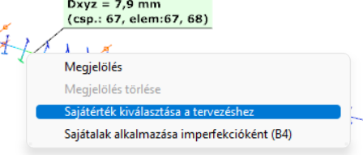

- Keresztmetszeti teherbírási szorzótényező ault,k: a stabilitásvesztés szempontjából domináns normálerőből és erős tengelyű hajlításból, karakterisztikus ellenállásokkal számolt kihasználtság reciproka. A kihasználtsági érték figyelembe vehető külön-külön rudanként, vagy részmodellenként a legkisebb érték.  

 $$
\overline{\lambda _{op}}=\sqrt{\frac{\alpha _{ult,k}}{\alpha _{cr,op}}}
$$
- Csökkentő tényező cop: a λop karcsúságból megállapított csökkentő tényező. Csökkentő tényező meghatározására két módszert ad az EuroCode. c,cLT értékek közül a kisebb, vagy e kettő érték interpoláltjaként.

Az ellenőrzés elvégezhető a teljes, vagy részlet modellre.

#### Eredmények

Az elvégzett ellenőrzések eredményei megtekinthetők grafikus formában, vagy táblázatosan (a táblázatok általános kezelési funkcióit lásd a **_[Táblázatok általános funkciói](../1_0_general-description/1_4_general-functions-for-tables.md)_** c. fejezetben).

<!-- /wp:paragraph -->

<!-- wp:paragraph -->

Az aktuálisan megjelenített eredménytípus a legördülő menüből választható ki.

<!-- wp:image {"id":73131,"width":"214px","height":"auto","sizeSlug":"full","linkDestination":"none"} -->

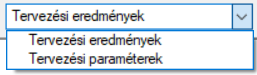

<!-- /wp:image -->

<!-- wp:paragraph -->

Az első legördülő menüben a felhasználók választhatnak a Tervezési eredmények és Tervezési paraméterek között.

<!-- /wp:paragraph -->

<!-- wp:paragraph -->

**Tervezési eredmények:**

<!-- /wp:paragraph -->

<!-- wp:paragraph -->

A **Mértékadó vizsgálat** alatt két alkategória található: Teherbírási Határállapot (ULS) és Használhatósági Határállapot (SLS) tervezés.

<!-- /wp:paragraph -->

<!-- wp:paragraph -->

Az ULS eredmények további alkategóriákra vannak bontva az alkalmazott anyagok és vizsgálatok alapján.

<!-- /wp:paragraph -->

<!-- wp:paragraph -->

Az acél anyagok esetében nem csak a mértékadó eredmények, hanem az összes terheléskombináció eredményei is el vannak mentve, és a legutolsó legördülő menü segítségével megjeleníthetők:

<!-- /wp:paragraph -->

<!-- wp:image {"id":73141,"width":"230px","height":"auto","sizeSlug":"full","linkDestination":"none"} -->

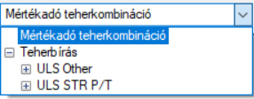

<!-- /wp:image -->

<!-- wp:paragraph -->

A Használhatósági Határállapot (SLS) vizsgálatok a kiválasztott vizsgálati szempontok szerint vannak felsorolva. Minden szempontnak vannak eredményei az összes kombinációra, valamint a mértékadó eredmények is megtekinthetőek.

<!-- /wp:paragraph -->

<!-- wp:image {"id":73151,"width":"595px","height":"auto","sizeSlug":"full","linkDestination":"none"} -->

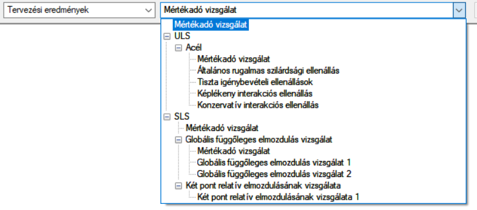

<!-- /wp:image -->

<!-- wp:paragraph -->

A **Tervezési paraméterek** megtekinthetők négy kategória szerint: Érzékenység, Tűz, Másodrendű igénybevételek vasbeton oszlop és Lemez vasmennyiség.

<!-- /wp:paragraph -->

<!-- wp:image {"id":73161,"width":"563px","height":"auto","sizeSlug":"full","linkDestination":"none"} -->

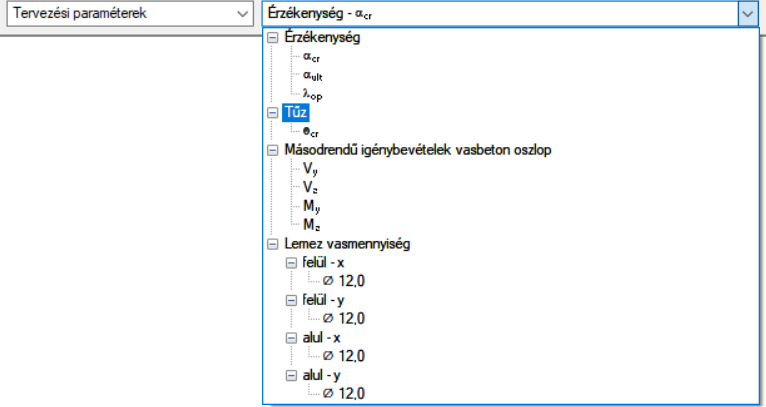

<!-- /wp:image -->

<!-- wp:paragraph -->

A kombinációkkal kapcsolatos paraméterek esetében, például az érzékenység és a másodrendű igénybevételek vasbeton oszlop esetében, elérhető a harmadik legördülő menü is, kiválasztható a vizsgálandó terheléskombináció.

<!-- /wp:paragraph -->

<!-- wp:image {"id":73171,"width":"207px","height":"auto","sizeSlug":"full","linkDestination":"none"} -->

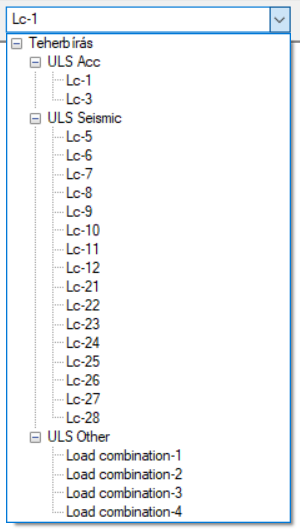

<!-- /wp:image -->

<!-- wp:paragraph -->

Az ablak alsó részén egy táblázat jelenik meg az eredményekkel. Az előzőleg kiválasztott számítási kritériumoknak megfelelő releváns információkat foglalja magába.

<!-- /wp:paragraph -->

<!-- wp:paragraph -->

A Teherbírási határállapot (ULS) vizsgálatoknál a következő információk jelennek meg: Rúd, Elem, Pont, Teherkombináció, Határállapot, Vizsgálat és Kihasználtság. Azonban a Használhatósági határállapot (SLS) vizsgálatoknál a Rúd és az Elem nem releváns.

<!-- /wp:paragraph -->

<!-- wp:paragraph -->

A táblázat bármely cellájára kattintva egy kék nyíl jelenik meg, amely a kiválasztott tulajdonsággal rendelkező pontra mutat.

<!-- /wp:paragraph -->

<!-- wp:image {"id":73840,"width":"750px","height":"auto","sizeSlug":"large","linkDestination":"none"} -->

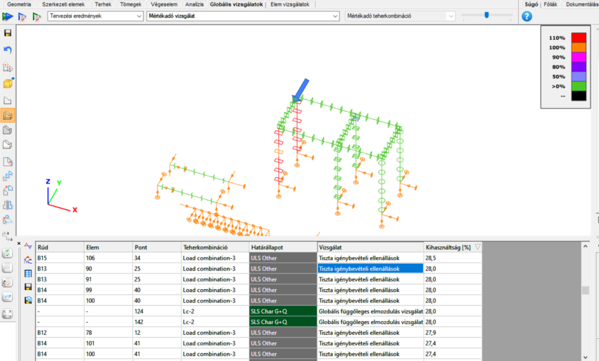

<!-- /wp:image -->

<!-- wp:paragraph -->

A felhasználók jobb kattintással elindíthatják a Szelvény vizsgálatot, illetve kijelölhetik a Rudat.

<!-- /wp:paragraph -->

<!-- wp:image {"id":73850,"width":"697px","height":"auto","sizeSlug":"large","linkDestination":"none"} -->

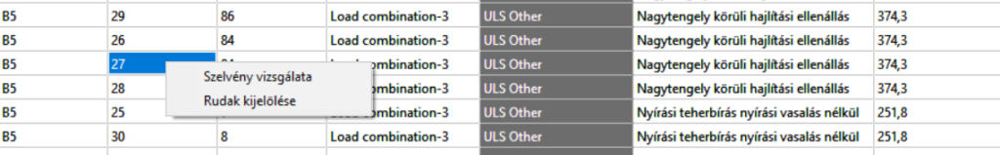

<!-- /wp:image -->

<!-- wp:paragraph -->

A "Szelvény vizsgálata" funkció automatikusan átvált a Keresztmetszet modulba, ahol részletesebb információkat találhatunk a kijelölt keresztmetszetről.

<!-- /wp:paragraph -->

<!-- wp:paragraph -->

Akár több rudat is ki tudunk jelölni egyszerre, több cellát választva, még akkor is, ha más tulajdonságok alapján választjuk ki őket (más-más oszlopokban vannak).

<!-- /wp:paragraph -->

<!-- wp:image {"id":73860,"width":"703px","height":"auto","sizeSlug":"large","linkDestination":"none"} -->

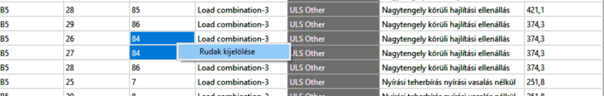

<!-- /wp:image -->

<!-- wp:paragraph -->

További információkért, kérem látogasson el a **Kijelölés** oldalunkra.

<!-- /wp:paragraph -->

<!-- wp:paragraph -->

A teherkombinációk oszlopában jobb kattintással egy újabb lehetőséggel találkozunk: "Csak ezekre a teherkombinációkra fusson az Analízis", olyan esetekre, amikor néhány kombináció további vizsgálatot igényel.

<!-- /wp:paragraph -->

<!-- wp:image {"id":73870,"width":"712px","height":"auto","sizeSlug":"large","linkDestination":"none"} -->

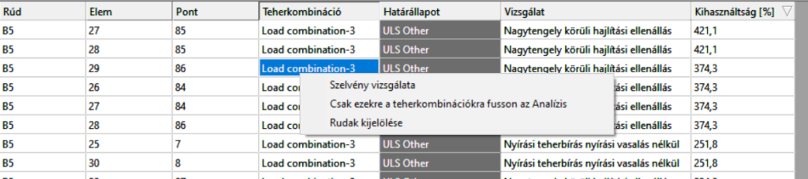

<!-- /wp:image -->

<!-- wp:paragraph -->

Az Eredmény táblázat néhány tervezési paramétert is megjelenít:

- Érzékenység

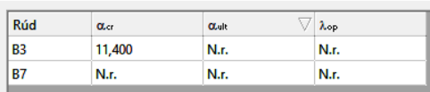

- Tűz

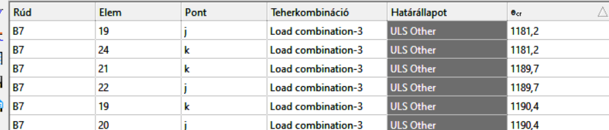

A cellákba való jobb kattintás hasonlóan működik, mint a fentebb leírt tervezési eredmények esetében.

Szerkezeti elemeken történő egér mozgatás esetén, az eredmény jelölő folyamatosan megjelenik, mutatva az aktuális kihasználtságot.

A számítás részletei megtekinthetők a keresztmetszeti modulban (lásd a **_[Keresztmetszeti modul](../../category/section-module)_** c. fejezetben). A keresztmetszeti modul megnyitható közvetlenül a **Globális vizsgálatok** fülről is, a megfelelő keresztmetszet grafikus felületen vagy táblázatban történő jobb egérgombos kiválasztásával.

<!-- /wp:paragraph -->

<!-- wp:image {"align":"left","id":37051,"width":227,"height":160,"sizeSlug":"full","linkDestination":"media","className":"is-style-editorskit-rounded"} -->

<!-- /wp:image -->

<!-- wp:image {"align":"right","id":37043,"width":320,"height":155,"sizeSlug":"full","linkDestination":"media","className":"is-style-editorskit-rounded"} -->

<!-- /wp:image -->

<!-- wp:spacer -->

<!-- /wp:spacer -->

<!-- wp:heading {"level":3} -->

### Elem vizsgálatok

<!-- /wp:heading -->

<!-- wp:heading {"level":4} -->

#### Alapok

<!-- /wp:heading -->

<!-- wp:image {"align":"center","id":37139,"width":695,"height":46,"sizeSlug":"full","linkDestination":"media","className":"is-style-editorskit-rounded"} -->

[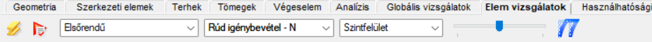](./img/wp-content-uploads-2022-06-tab_elemvizsgalat.png)

<!-- /wp:image -->

<!-- wp:paragraph -->

Acélszerkezetek elemszintű vizsgálataihoz tartozó funkciók találhatók az **Elem vizsgálatok** fülön.

<!-- /wp:paragraph -->

<!-- wp:paragraph -->

Az EuroCode 3 (EN 1993-1-1) következő fejezetei szerinti vizsgálatok végezhetők el:

<!-- /wp:paragraph -->

<!-- wp:paragraph -->

6.3.1 Állandó keresztmetszetű nyomott rúdelemek

<!-- /wp:paragraph -->

<!-- wp:paragraph -->

6.3.2 Állandó keresztmetszetű hajlított rúdelemek

<!-- /wp:paragraph -->

<!-- wp:paragraph -->

6.3.3 Állandó keresztmetszetű hajlított és nyomott rúdelemek

<!-- /wp:paragraph -->

<!-- wp:heading {"level":4} -->

#### Egyedi elemtervezés

<!-- /wp:heading -->

<!-- wp:paragraph -->

Elemtervezés elvégzéséhez először ki kell választani és hozzá kell adni a képernyő alján található listához a vizsgálandó elemeket. A hozzáadást a táblázat **Acél** fülét kiválasztva, a **Hozzáad** gomb segítségével lehet elvégezni. A hozzáadás után a listából egy elem a **Kiválaszt** gomb megnyomásával választható ki tervezésre.

<!-- /wp:paragraph -->

<!-- wp:image {"align":"center","id":37131,"width":768,"height":104,"sizeSlug":"large","linkDestination":"media"} -->

[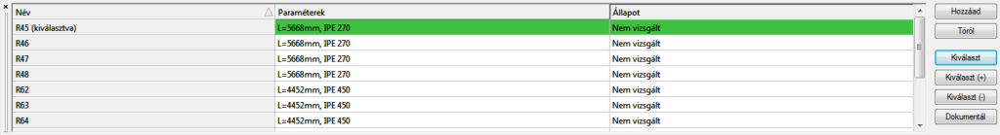](https://Consteelsoftware.com/wp-content/uploads/2022/06/tabl_elemvizsgalatok.png)

<!-- /wp:image -->

<!-- wp:paragraph -->

A kiválasztott elem sora a táblázatban zöld színűre változik és az analízis eredményei automatikusan betöltődnek. Az elemtervezés elvégezhető, ha a szükséges analízis (első és másodrendű számítás) és keresztmetszet vizsgálati eredmények rendelkezésre állnak. Az analízis eredmények megtekintése, az **Analízis** fülnek megfelelően, a három legördülő menü segítségével történik:

<!-- /wp:paragraph -->

<!-- wp:image {"align":"center","id":37139,"width":695,"height":46,"sizeSlug":"full","linkDestination":"media"} -->

<!-- /wp:image -->

<!-- wp:paragraph -->

A második gomb () megnyomásával egy speciális analízis indítható. Egyszerre csak egy teherkombinációra végezhető el a számítás. A kihajlási és kifordulási analízis csak a kiválasztott elemre kerül elvégzésre. Ha a normálerő elhanyagolható, akkor a kihajlás analízis nem futtatható le. A speciális kihajlási és kifordulási analízis elvégzése esetén, a _Consteel_ meg tudja határozni a kihajlási és kifordulási tényezőket.

<!-- /wp:paragraph -->

<!-- wp:image {"align":"center","id":37123,"width":479,"height":299,"sizeSlug":"full","linkDestination":"media"} -->

<!-- /wp:image -->

<!-- wp:paragraph -->

A következő lépés a teherkombináció és az ellenőrzés módjának kiválasztása a következő lehetőségek közül: tiszta esetek (kihajlás erős tengely körül, kihajlás gyenge tengely körül, kifordulás) és interaktív stabilitás (kihajlás és kifordulás interakciója, kihajlás és hajlítás interakciója, kifordulás és hajlítás interakciója). A mértékadó teherkombinációt a program automatikusan kiválassza és \*-al megjelöli.

<!-- /wp:paragraph -->

<!-- wp:image {"align":"center","id":37115,"width":346,"height":434,"sizeSlug":"full","linkDestination":"media","className":"is-style-editorskit-rounded"} -->

<!-- /wp:image -->

<!-- wp:paragraph -->

A végrehajtható ellenőrzések az egyes rudak terhelési állapotától függenek. Ha normálerő elhanyagolható, akkor az erős és gyenge tengely körüli kihajlás ellenőrzése nem hajtható végre.

<!-- /wp:paragraph -->

<!-- wp:paragraph -->

**Kihajlás (erős és gyenge tengely körül**) vizsgálat esetén meg kell adni a tervezési paramétereket. A program automatikusan érzékeli a kihajlást befolyásoló támaszokat.

<!-- /wp:paragraph -->

<!-- wp:image {"align":"center","id":37107,"width":673,"height":338,"sizeSlug":"full","linkDestination":"media","className":"is-style-editorskit-rounded"} -->

<!-- /wp:image -->

<!-- wp:paragraph -->

A rúd a támaszoknak megfelelően fölbontásra kerül. Az egyes szegmensek kikapcsolhatók, ha ellenőrzéskor figyelembevételük nem szükséges. A tervezési paraméterek szegmensenként adhatók meg a hárompontos ikonra kattintva.

<!-- /wp:paragraph -->

<!-- wp:image {"align":"center","id":37099,"width":695,"height":289,"sizeSlug":"full","linkDestination":"media","className":"is-style-editorskit-rounded"} -->

<!-- /wp:image -->

<!-- wp:paragraph -->

A számított szegmens zölddel jelölt. Két módon adhatók meg a tervezési paraméterek: a kihajlási hossz értékének manuális megadásával, vagy a megfelelő kritikus teherszorzó kiválasztásával. Erre csak akkor van lehetőség, ha a speciális analízist lefuttattuk. A rugalmas kritikus normálerőt a program mind a két esetben automatikusan számítja.

<!-- /wp:paragraph -->

<!-- wp:paragraph -->

Ha valamennyi tervezési paramétert beállításra került, akkor az ellenőrzés az **Ellenőrzés** gomb megnyomásával végrehajtható. Az ellenőrzés végrehajtása után a program megjeleníti a számítás részletes eredményeit.

<!-- /wp:paragraph -->

<!-- wp:image {"align":"center","id":37091,"width":426,"height":590,"sizeSlug":"full","linkDestination":"media","className":"is-style-editorskit-rounded"} -->

<!-- /wp:image -->

<!-- wp:paragraph -->

A különböző eredmények megtekintésére három legördülő menü áll rendelkezésre. Az elsővel a szerkezeti elemet lehet kiválasztani, a másodikkal a teherkombinációt, a harmadikkal pedig a kihajlási esetet. A beállításoknak megfelelő szegmenset az ábra zöld színnel jelzi. A kiválasztásnak megfelelő rövid összefoglalás található az eredménynézet felső részén.

<!-- /wp:paragraph -->

<!-- wp:paragraph -->

A **Kifordulás ellenőrzés** többé-kevésbé a kihajlás vizsgálathoz hasonló módon történik. Új szegmensek definiálhatók és nem szükséges szegmensek törölhetők. Minden szegmensre beállítható szakaszkezdet és szakaszvég.

<!-- /wp:paragraph -->

<!-- wp:image {"align":"center","id":37083,"width":440,"height":486,"sizeSlug":"full","linkDestination":"media","className":"is-style-editorskit-rounded"} -->

<!-- /wp:image -->

<!-- wp:paragraph -->

A tervezési paraméterek szegmensenként adhatók meg a hárompontos ikonra kattintva. A rugalmas kritikus nyomaték számítható analitikus képletből, vagy a kritikus teherfaktor segítségével. Az első esetben a szükséges tényezők manuálisan megadhatók, vagy az **AutoC** gomb segítségével a C tényezőket a program automatikusan meghatározza. A második esetben a megfelelő kritikus teherfaktor kiválasztásával kerül meghatározva a kritikus nyomaték.

<!-- /wp:paragraph -->

<!-- wp:image {"align":"center","id":37075,"width":440,"height":444,"sizeSlug":"full","linkDestination":"media","className":"is-style-editorskit-rounded"} -->

<!-- /wp:image -->

<!-- wp:paragraph -->

Az **interakciós stabilitástervezés** a tiszta eseteket veszi alapul.

<!-- /wp:paragraph -->

<!-- wp:paragraph -->

Miután egy elem ellenőrzésre került, a listában az elem állapota „Nem vizsgált”-ról „Vizsgált” –ra változik.

<!-- /wp:paragraph -->

<!-- wp:heading {"level":4} -->

#### Csoportos elemtervezés

<!-- /wp:heading -->

<!-- wp:paragraph -->

A **Kiválaszt (+)** gomb használatával lehetőség van több elem egyszerre történő kiválasztására elemtervezéshez. A **Kiválaszt (-)** gomb segítségével a kiválasztásból lehet eltávolítani a kijelölt elemeket. A csoportos elemtervezés hasonlóan működik, mint az egyedi elemtervezés. A különbség, hogy nem futtatható speciális analízis, ezért a kritikus teherszorzó alapján történő kritikus normálerő és nyomaték meghatározása nem elérhető.

<!-- /wp:paragraph -->

<!-- wp:paragraph -->

Az elemek kiválasztása után, a következő lépés, az egyedi elemtervezéshez hasonlóan az ellenőrzés módjának kiválasztása és a tervezési paraméterek megadása után, az **Ellenőrzés** gomb megnyomásával az ellenőrzés elvégzése.

<!-- /wp:paragraph -->

<!-- wp:image {"align":"center","id":37151,"width":346,"sizeSlug":"full","linkDestination":"media","className":"is-style-editorskit-rounded"} -->

[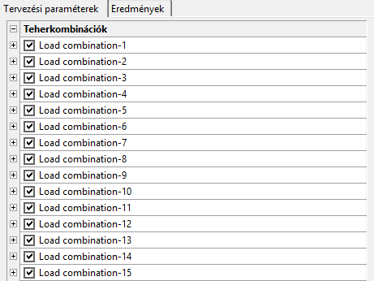](https://Consteelsoftware.com/wp-content/uploads/2022/06/tabl_elemvizsgalatok_csoportos.png)

<!-- /wp:image -->

<!-- wp:paragraph -->

Az elemtervezési teherkombinációnként kikapcsolható. Fontos tudni, hogy nem minden ellenőrzési mód futtatható az összes elemre az összes teherkombinációban. Az elvégezhető vizsgálatok az analízis eredményeitől függenek.

<!-- /wp:paragraph -->

<!-- wp:paragraph -->

Az eredmények fülön a mértékadó elem automatikusan kiválasztásra és megmutatásra kerül. Az elemszám mellett látható százalékos érték az elem kihasználtságát mutatja.

<!-- /wp:paragraph -->

<!-- wp:image {"align":"center","id":37059,"width":355,"height":443,"sizeSlug":"full","linkDestination":"media","className":"is-style-editorskit-rounded"} -->

<!-- /wp:image -->
