# Használhatósági vizsgálatok

Az összes szabványalapú ellenőrzés összegyűjtve a **Globális vizsgálatok** fülön található, ideértve a **Használhatósági határállapot vizsgálatokat** is.

<!-- /wp:paragraph -->

<!-- wp:image {"id":72232,"width":"503px","height":"auto","sizeSlug":"full","linkDestination":"none"} -->

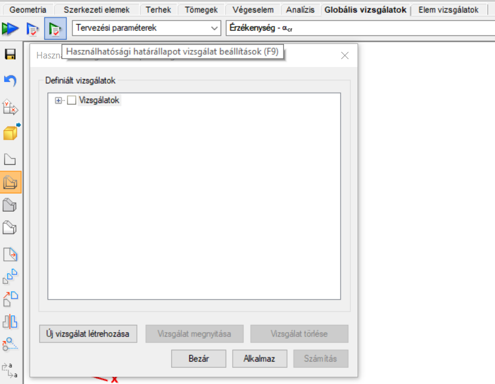

<!-- /wp:image -->

<!-- wp:paragraph -->

A zöld nyíl ikonra  kattintva megjelenik egy új párbeszédpanel. Itt a korábban meghatározott használhatósági határállapot vizsgálatok jelennek meg és lehetőség van a kiválasztott vizsgálatok **megnyitására** vagy **törlésére**.

Az **Új vizsgálat létrehozása** gombra kattintva a következő vizsgálatokból lehet választani:

- Vízszintes elmozdulás vizsgálata

- Globális függőleges elmozdulás vizsgálata

- Rúd végpontok közötti függőleges elmozdulás vizsgálata

- Két pont relatív elmozdulásának vizsgálata

- Földrengés- szintek közötti elmozdulás ellenőrzése

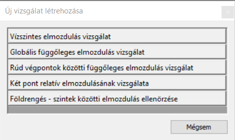

<!-- /wp:image -->

<!-- wp:paragraph -->

Minden használhatósági határállapot vizsgálat párbeszédpanel az **vizsgálandó teherkombinációk** kiválasztásával kezdődik. Az összes releváns teherkombináció automatikusan fel van sorolva. A felhasználónak lehetősége van választani az elsőrendű vagy a rendelkezésre álló legmagasabb rendű vizsgálati eredmények között.

<!-- /wp:paragraph -->

<!-- wp:image {"id":72587,"width":"658px","height":"auto","sizeSlug":"full","linkDestination":"none"} -->

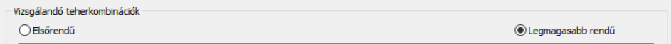

<!-- /wp:image -->

<!-- wp:paragraph -->

Az első három vizsgálat esetében a párbeszédpanel megegyező részeket is tartalmaz.

<!-- /wp:paragraph -->

<!-- wp:paragraph -->

A felhasználónak be kell állítania az elmozdulás **határértékeit** mind a teljes teherből, mind az esetleges terhekből. Ezeket a korlátokat a referencia hossz vagy magasság (Vízszintes elmozdulás vizsgálat esetén) hányadosaként adhatóak meg. A nevezőt a felhasználó szabványok alapján határozza meg, vagy használja a program által alapértelmezett értéket.

<!-- /wp:paragraph -->

<!-- wp:image {"id":72547,"width":"667px","height":"auto","sizeSlug":"full","linkDestination":"none"} -->

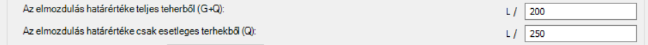

<!-- /wp:image -->

<!-- wp:paragraph -->

A **figyelembe vett részletmodell** gomb segítségével a felhasználó meghatározhatja, hogy a számításnak a teljes modellt, vagy csak egy, már korábban létrehozott, egyedi részletet kell lefednie. Javasolt egyedi részleten végrehajtani a számítást, mivel ez lerövidíti a számítási időt és lehetővé teszi a kívánt eredmények elérését az egyes elemtípusokra vonatkozóan.

<!-- /wp:paragraph -->

<!-- wp:paragraph -->

Az **ellenőrzés** gomb gyors számítást hajt végre. Ennek eredményeként, a felhasználó meg tudja tekinteni a mértékadó eredményeket a + ikonra kattintva. Láthatóvá válnak a mértékadó teherkombinációk, a szerkezeti elem jele, végeselem pont indexe, mértékadó elmozdulások és a kihasználtsági érték.

<!-- /wp:paragraph -->

<!-- wp:paragraph -->

Az ellenőrzés gomb opcionális, számítás nélküle is végezhető. Ez valóban csak egy gyors ellenőrzés. A kiválasztott vizsgálat elmentése érdekében a **Rendben** gombra kell kattintani. Így majd a számítás elvégzése után nem csak a mértékadó eredményhez lehet majd hozzáférni, hanem az összes többi pont eredményéhez is.

<!-- /wp:paragraph -->

<!-- wp:image {"id":72557,"width":"744px","height":"auto","sizeSlug":"full","linkDestination":"none"} -->

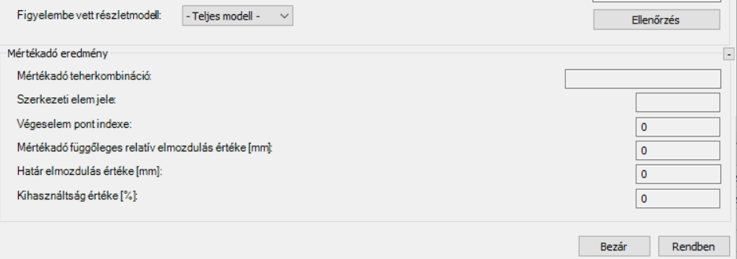

<!-- /wp:image -->

<!-- wp:paragraph -->

Miután minden elvégzendő vizsgálatot sikerült kiválasztani a **Számítás** gombra kattintva indítható el a vizsgálat.

<!-- /wp:paragraph -->

<!-- wp:image {"id":72577,"width":"320px","height":"auto","sizeSlug":"full","linkDestination":"none"} -->

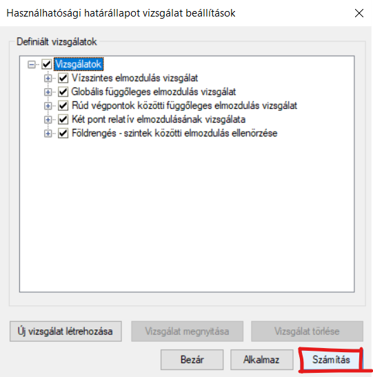

<!-- /wp:image -->

<!-- wp:paragraph -->

A használhatósági határállapot vizsgálat eredményei a kihasználtság, vizsgalat neve, határállapot es teherkombinációk alapján megtekinthetőek a **Globális vizsgálatok** ablak alsó táblázatában es a modellen színek formájában.

<!-- /wp:paragraph -->

<!-- wp:image {"id":72567,"width":"791px","height":"auto","sizeSlug":"large","linkDestination":"none"} -->

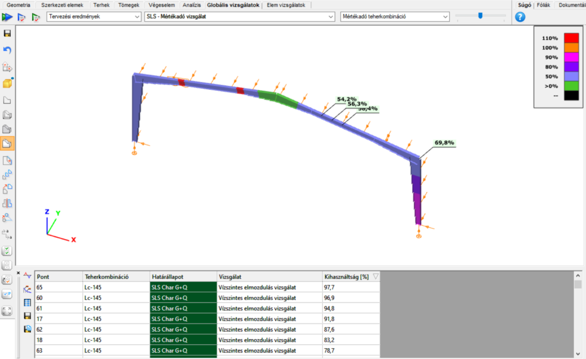

<!-- /wp:image -->

<!-- wp:paragraph -->

**Vízszintes elmozdulás vizsgálata**

<!-- /wp:paragraph -->

<!-- wp:paragraph -->

A **vízszintes elmozdulás vizsgálata** minden csomópont vízszintes elmozdulását értékeli, és összehasonlítja azt a csomópont tényleges magasságának megfelelően meghatározott határértékkel.

<!-- /wp:paragraph -->

<!-- wp:paragraph -->

Ahhoz, hogy a szoftver képes legyen minden csomópont magasságát (H) kiszámolni, szükséges a vízszintes referenciaszint globális Z koordinátájának meghatározása. Azokat a csomópontokat, amelyeknek a globális Z koordinátája a meghatározott referencia szint alatt van, kizárják a vizsgálatból.

<!-- /wp:paragraph -->

<!-- wp:image {"id":72598,"width":"635px","height":"auto","sizeSlug":"full","linkDestination":"none"} -->

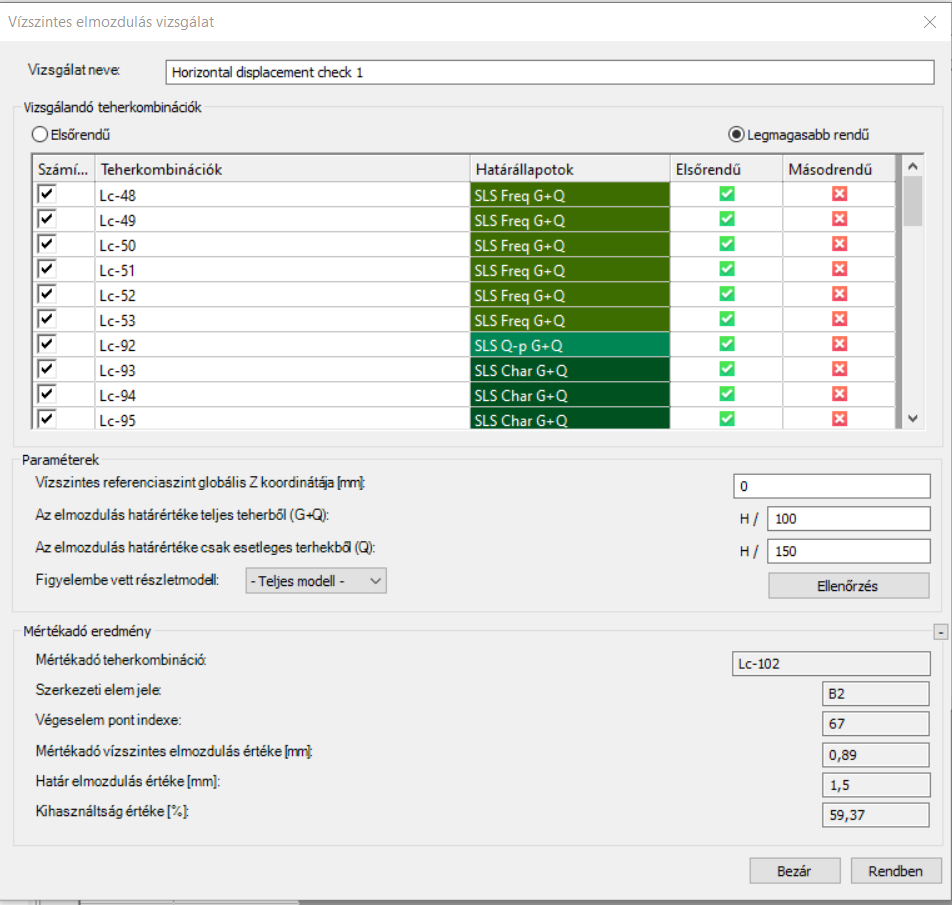

<!-- /wp:image -->

<!-- wp:paragraph -->

**Globális függőleges elmozdulás vizsgálata**

<!-- /wp:paragraph -->

<!-- wp:paragraph -->

A **globális függőleges elmozdulás** vizsgálata kiszámítja a domináns függőleges elmozdulást, majd összehasonlítja ezt az elmozdulás határértékével, amelyet a megadott viszonyítási hossz alapján határoz meg. A **viszonyítási hossz** meghatározását kézzel vagy a modellben két pont kiválasztásával lehet elvégezni.

<!-- /wp:paragraph -->

<!-- wp:image {"id":72679,"width":"617px","height":"auto","sizeSlug":"full","linkDestination":"none"} -->

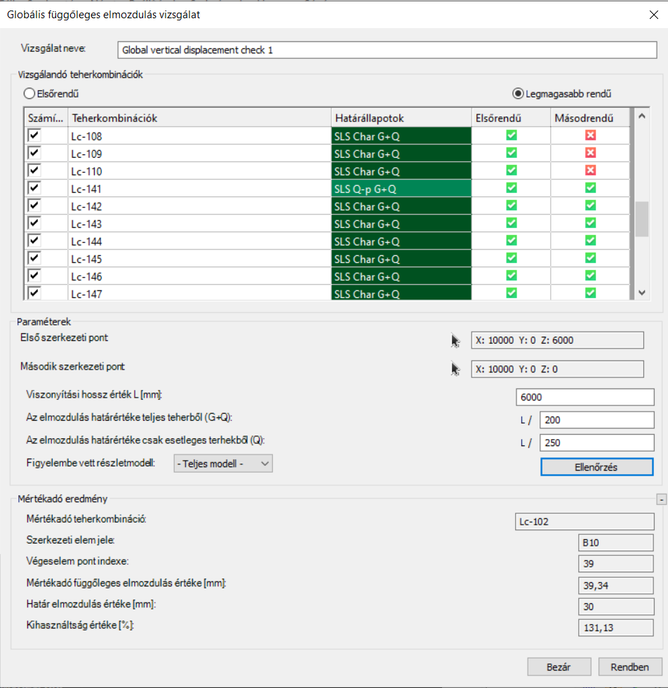

<!-- /wp:image -->

<!-- wp:paragraph -->

**Rúd végpontok közötti függőleges elmozdulás vizsgálata**

<!-- /wp:paragraph -->

<!-- wp:paragraph -->

A **rúd végpontok közötti függőleges elmozdulás** **vizsgálata** magában foglalja az összes gerenda helyi elmozdulásának értékelését a modellben. Ez az ellenőrzés minden pontot kiszámít a megadott részmodellen belül, de gyakorlati szempontból nagyobb jelentőséggel bír a vízszintes gerendák esetében, azaz az XY síkban elhelyezkedő elemek esetében.

<!-- /wp:paragraph -->

<!-- wp:paragraph -->

A **rúd végpontok közötti függőleges elmozdulás** **vizsgálata** nem feltétlenül megfelelő konzolok esetében.

<!-- /wp:paragraph -->

<!-- wp:image {"id":72628,"width":"658px","height":"auto","sizeSlug":"full","linkDestination":"none"} -->

<!-- /wp:image -->

<!-- wp:paragraph -->

**Két pont relatív elmozdulásának vizsgálata**

<!-- /wp:paragraph -->

<!-- wp:paragraph -->

A **két pont relatív elmozdulásának vizsgálata** elvégezhető a két pontra kattintva. A felhasználóknak lehetőségük van választani a relatív vízszintes vagy függőleges eltolódás vizsgálata között, és ezek az ellenőrzések végrehajthatók az eltolódás határértékeinek beállítása után mindkét irányban.

<!-- /wp:paragraph -->

<!-- wp:image {"id":72638,"width":"697px","height":"auto","sizeSlug":"full","linkDestination":"none"} -->

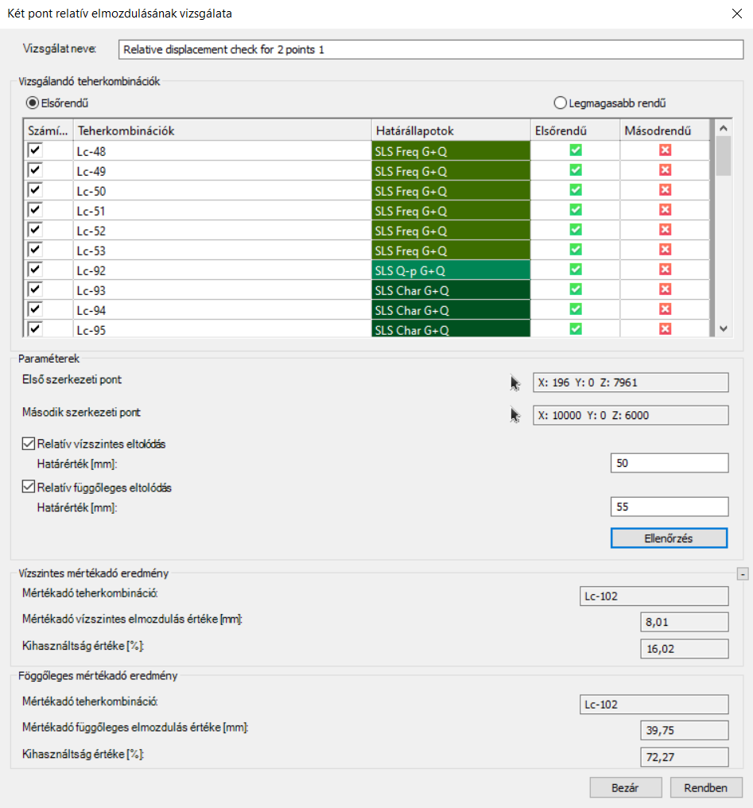

<!-- /wp:image -->

<!-- wp:paragraph -->

**Földrengés- Szintek közötti elmozdulás ellenőrzésé**

<!-- /wp:paragraph -->

<!-- wp:paragraph -->

Az ellenőrzés végrehajtásának előfeltétele a modellben meghatározott szintek létezése és a szeizmikus analízis elvégzése. A csökkentő tényezőt meg kell adni és elmozdulás határértéket kell választani.

<!-- /wp:paragraph -->

<!-- wp:image {"id":72658,"width":"412px","height":"auto","sizeSlug":"full","linkDestination":"none"} -->

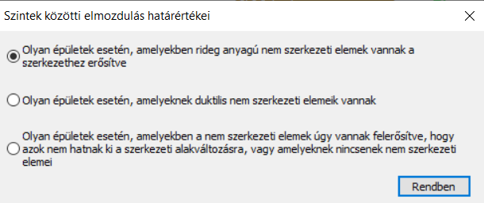

<!-- /wp:image -->

<!-- wp:paragraph -->

Miután az ellenőrzés megtörtént, kiszámolja a vízszintes elmozdulásokat mindkét irányban az összes szomszédos szint között, és megjeleníti a mértékadó elmozdulást. Továbbá, információt nyújt a mértékadó terheléskombinációról és a kihasználtságról.

<!-- /wp:paragraph -->

<!-- wp:paragraph -->

A párbeszéd ablak hasonlóan működik az előzőkhöz. A gyors **ellenőrzés** opcionális, annak érdekében, hogy rögzítsük és tároljuk az összes vizsgált pont eredményeit, el kell mentenünk a beállításokat az **OK** gomb használatával. Ezután az összes kiválasztott ellenőrzés mellett lévő számítás gomb segítségével tudunk pontos eredményekhez jutni.

<!-- /wp:paragraph -->

<!-- wp:image {"id":72668,"width":"501px","height":"auto","sizeSlug":"large","linkDestination":"none"} -->

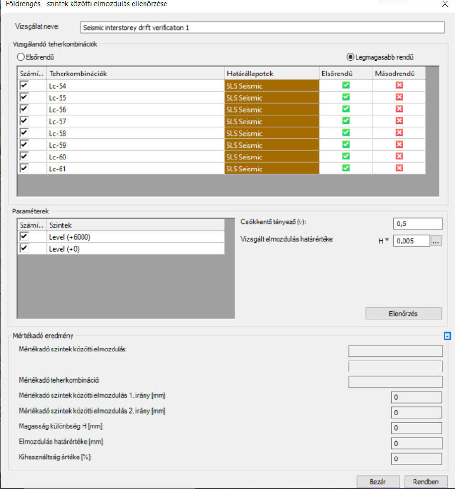

<!-- /wp:image -->

<!-- wp:paragraph -->

