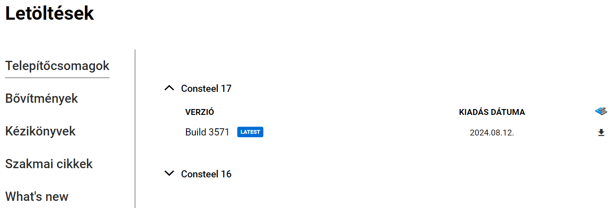
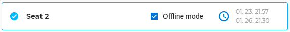
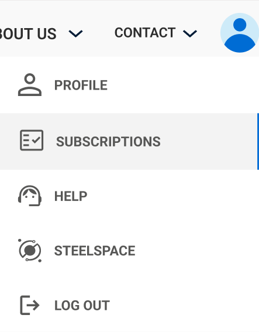
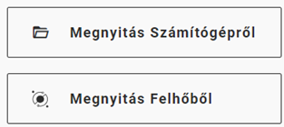
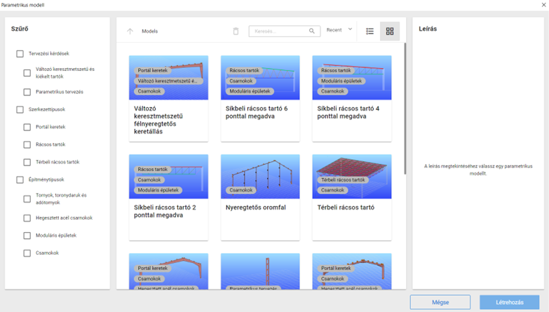
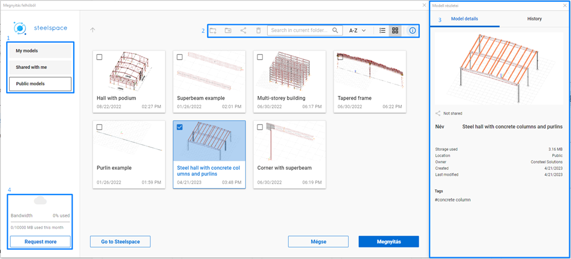
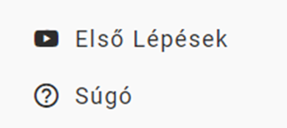
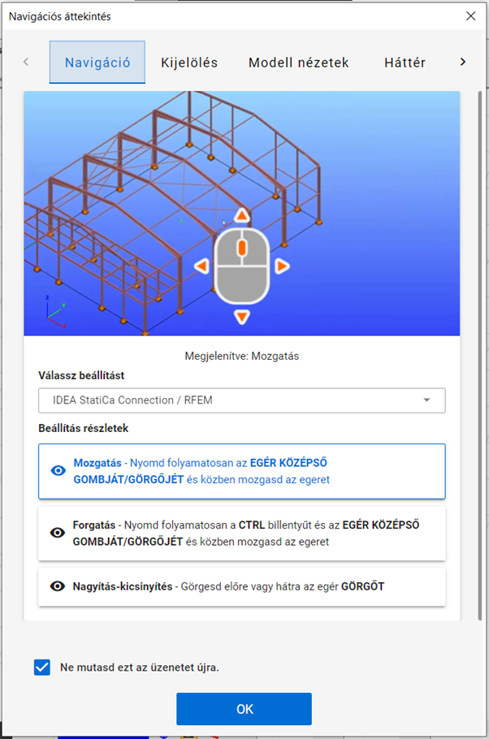

# A szoftver telepítése és futtatása

<!-- wp:Consteel/content-block -->

<!-- /wp:Consteel/content-block -->

<!-- wp:paragraph -->

Érvényes előfizetés szükséges a szoftver használatához – lehet próbaidős, oktatási célú vagy fizetős előfizetés része. A Consteel telepítéséhez, a telepítőfájlok eléréséhez, valamint az előfizetésedhez tartozó online szolgáltatások használatához Consteel-fiókra is szükség van. Consteel-fiókot a weboldalunkon tudsz regisztrálni.

[Diákoknak, oktatóknak](https://consteelsoftware.com/hu/diak-es-oktatas/) és próbaverziót igénylőknek a hozzáférést online kell kérvényezniük. Az igénylések lépéseit [itt](https://consteelsoftware.com/hu/ajanlatok-csomagok/licenceles-gyik/) olvashatod.

## **Követelmények**

**Hardver követelmények**

<!-- /wp:paragraph -->

<!-- wp:paragraph -->

A Consteel program futtatásához az alábbi szoftver és hardver követelmények teljesítése szükséges. Ezek hiányában a program nem, vagy nem az elvárt gyorsasággal futtatható.

<!-- /wp:paragraph -->

<!-- wp:paragraph -->

**Minimális konfiguráció:**

<!-- /wp:paragraph -->

<!-- wp:columns {"align":"wide"} -->

<!-- wp:column {"verticalAlignment":"top","width":"20%"} -->

<!-- wp:list -->

- Processzor
- Memória
- HDD
- Videó-kártya
- Operációs rendszer

<!-- /wp:list -->

<!-- /wp:column -->

<!-- wp:column {"width":"66.66%"} -->

<!-- wp:paragraph -->

Intel Core i5 vagy ennek megfelelő  
4 GB  
300 MB  
512 MB nem alaplapra integrált  
64-bit MS Windows 10

**Ajánlott konfiguráció:**

<!-- /wp:paragraph -->

<!-- wp:columns -->

<!-- wp:column {"width":"20%"} -->

<!-- wp:list -->

- Processzor
- Memória
- Videó-kártya
- Operációs rendszer

<!-- /wp:list -->

<!-- /wp:column -->

<!-- wp:column {"width":"66.66%"} -->

<!-- wp:paragraph -->

Intel Core i7 vagy ennek megfelelő  
32 GB  
2 GB nem alaplapra integrált  
64-bit Windows 10

<!-- /wp:paragraph -->

<!-- /wp:column -->

<!-- /wp:columns -->

<!-- wp:paragraph -->

## **A telepítő fájl letöltése**

<!-- /wp:paragraph -->

<!-- wp:paragraph -->

A telepítéshez rendszergazdai jogosultság szükséges. Rendszergazdai jogok nélkül a hardverkulcs és a program működéséhez elengedhetetlen .dll fájlok nem telepíthetőek.

<!-- /wp:paragraph -->

<!-- wp:paragraph -->

<!-- /wp:paragraph -->

<!-- wp:paragraph -->

A Consteel szoftver telepítő csomagja elérhető a Consteel honlap [_Letöltések_](https://Consteelsoftware.com/hu/letoltesek) (_Downloads_) menüpontjából   regisztrált felhasználók számára.

<!-- /wp:paragraph -->

<!-- wp:paragraph -->

## **Fiók létrehozása**

<!-- /wp:paragraph -->

<!-- wp:image {"align":"center","id":30803,"sizeSlug":"large","linkDestination":"none"} -->

<!-- /wp:image -->

<!-- wp:columns {"align":"wide"} -->

<!-- wp:column {"verticalAlignment":"top","width":"65%"} -->

<!-- wp:paragraph -->

Új felhasználói fiók létrehozásához a weboldal jobb felső sarkában található **Belépés** gombra, majd a megjelenő ablak alján a **Regisztrálj** feliratra kell kattintani.  
A **_Fiók létrehozása_** ablakban meg kell adni a felhasználó e-mail címét, nevét és egy választott jelszót. Fontos, hogy valós email címet adjunk meg, mert ezután egy automatikusan kiküldött email üzenetben meg kell erősíteni az e-mail címünket. Az ablak alján lehetőség van feliratkozni a Consteel szakmai hírlevelére, valamint el kell fogadni a felhasználási és adatvédelmi feltételeket, végül a **Regisztrálok** gombra kattintva lehet a regisztrációt befejezni. Ezután egy újabb ablak jelenik meg, mely arról tájékoztat, hogy a rendszer a regisztrációs visszaigazoló emailt elküldte a megadott email címre, és az abban található link segítségével kell a regisztrációt befejezni. Ha hosszabb idő eltelte után sem érkezik meg a visszaigazoló email, érdemes ellenőrizni a levélszemét és promóciós mappákat is levelező rendszerünkben. Ha ott sem található meg az email, akkor az előbbi tájékoztató ablakban kérhető a **megerősítő email újbóli kiküldése**. (Ha már bezártuk a regisztrációs ablakot, akkor újból a belépésre kattintva adjuk meg ismét az email címünket és választott jelszavunkat, hogy megjelenjen az üzenet újbóli kiküldése parancs.) A regisztráció megerősítése után már be lehet lépni a felhasználói fiókba.

<!-- /wp:paragraph -->

<!-- /wp:column -->

<!-- wp:column {"verticalAlignment":"bottom","width":"30%"} -->

<!-- wp:image {"align":"left","id":30830,"sizeSlug":"full","linkDestination":"media"} -->

<!-- /wp:image -->

<!-- wp:paragraph -->

<!-- /wp:paragraph -->

<!-- /wp:column -->

<!-- /wp:columns -->

<!-- wp:paragraph -->

## **A Consteel telepítése**

<!-- /wp:paragraph -->

<!-- wp:paragraph -->

A telepítéshez el kell indítani a letöltött Consteel telepítő fájlt, és követni kell a telepítő instrukcióit. Első lépésként ki kell választani a telepítő nyelvét. A kiválasztott nyelvet fogja használni a Consteel az első indítás során is, amely szükség esetén megváltoztatható. A telepítő a megadott mappába (alapesetben a C:\\Program Files\\Consteel xx mappába, ahol xx=verzió száma) másolja a szükséges fájlokat, a választott beállításoknak megfelelően elhelyezi a program ikonját az asztalra és a „START” menüben. A telepítés utolsó fázisa a hardverkulcs szoftverének installálása. Ez a folyamat nem kerül kijelzésre, és hosszabb ideig is eltarthat.

<!-- /wp:paragraph -->

<!-- wp:paragraph -->

**Hálózatos működés**

<!-- /wp:paragraph -->

<!-- wp:columns -->

<!-- wp:column {"width":"50%"} -->

<!-- wp:paragraph -->

Hálózatos licensz vásárlása esetén a program használatához szükséges hardverkulcsot a belső hálózat bármelyik, szabad USB csatlakozóval rendelkező számítógépéhez lehet csatlakoztatni, amelyen előzetesen telepítésre került a hardverkulcs kezelő szoftver (driver). Ez a driver is a Consteel telepítő csomag része, mely alapértelmezés szerint a programmal együtt települ a számítógépre (ld. előző pont), de lehetőség van annak önálló telepítésére is, ha a hardverkulcsot egy központi szervergépre szeretnénk csatlakoztatni. Ehhez el kell indítani a Consteel telepítőcsomagját a fentebb leírtak szerint, majd az **Összetevők kiválasztása** ablakban elegendő csak a _Hardverkulcs illesztőprogram_ pontot kiválasztani, a többit üresen hagyni, és a Tovább gombra kattintva befejezni a telepítést.

<!-- /wp:paragraph -->

<!-- /wp:column -->

<!-- wp:column {"width":"50%","editorskit":{"devices":false,"desktop":true,"tablet":true,"mobile":true,"loggedin":true,"loggedout":true,"acf_visibility":"","acf_field":"","acf_condition":"","acf_value":"","migrated":false,"unit_test":false}} -->

<!-- wp:image {"align":"left","id":30886,"sizeSlug":"full","linkDestination":"media"} -->

<!-- /wp:image -->

<!-- /wp:column -->

<!-- /wp:columns -->

<!-- wp:paragraph -->

A Consteel 15 Update 6 verzió kiadásával a hardverkulcs illesztőprogram a honlapunkról a Letöltések menüből érhető el. Letöltés után a szokásos módon kell telepíteni a drivert.

<!-- /wp:paragraph -->

<!-- wp:image {"align":"center","id":38178,"sizeSlug":"full","linkDestination":"none"} -->

<!-- /wp:image -->

<!-- wp:paragraph -->

## **A program indítása**

<!-- /wp:paragraph -->

<!-- wp:paragraph -->

A program első indításakor ki kell választani a szoftvervédelem típusát a felhasználói szerződésnek megfelelően. **Amennyiben rendelkezel hardverkulccsal, akkor válaszd az USB dongle opciót**! Csak akkor válaszd az Online licenszt, ha már átváltottál az új online védelemre, valamint a hardverkulcsot is visszaküldted a forgalmazónak.

<!-- /wp:paragraph -->

<!-- wp:paragraph -->

Ezt a beállítást el lehet menteni alapértelmezett beállításként. **Ezt csak akkor tedd meg, ha biztos vagy a választásban!** (Ha véletlenül elmentetted az online licenszt alapértelmezettként, de nem rendelkezel vele, akkor jelenleg csak a Consteel újratelepítésével tudsz visszatérni a hardverkulcs használatára.)

<!-- /wp:paragraph -->

<!-- wp:columns -->

<!-- wp:column -->

<!-- wp:image {"align":"right","id":30914,"sizeSlug":"medium","linkDestination":"media"} -->

USB dongle

<!-- /wp:image -->

<!-- /wp:column -->

<!-- wp:column -->

<!-- wp:image {"align":"left","id":30921,"sizeSlug":"medium","linkDestination":"media"} -->

Online védelem

<!-- /wp:image -->

<!-- wp:paragraph -->

<!-- /wp:paragraph -->

<!-- /wp:column -->

<!-- /wp:columns -->

<!-- wp:paragraph -->

**Indítás hardverkulcsos védelemmel**

<!-- /wp:paragraph -->

<!-- wp:paragraph -->

A program indítása előtt a hardverkulcsot (USB dongle) be kell dugni a számítógép egy üres USB portjába, vagy hálózati kulcs esetén a kulcsnak elérhetőnek kell lennie a helyi hálózaton lévő valamelyik számítógépen. A megfelelő hardverkulcs felismerés után a Consteel elindul. A továbbiakat ld. a _Projekt Központ fejezetben_!

<!-- /wp:paragraph -->

<!-- wp:paragraph -->

Ha az indítás után a Consteel nem találja a számítógéphez (vagy a hálózaton keresztül) csatlakoztatott megfelelő hardverkulcsot, megjelenik az online licensz bejelentkezési ablaka, amely lehetővé teszi a program indítását a Consteel felhasználói fiókhoz rendelt online licenc használatával (amennyiben elérhető).

<!-- /wp:paragraph -->

<!-- wp:paragraph -->

## **Consteel offline módban**

<!-- /wp:paragraph -->

<!-- wp:paragraph -->

A Consteel online védelemmel való használatához be kell jelentkezned online fiókoddal. Ha személyes előfizetéssel (**Personal plan**) rendelkezel, a szabad hely kiválasztása után azonnal indítható a Consteelt. Csapat előfizetésben (**Team plan**) minden _**szoftver helyhez**_ (_**seat**_) alapértelmezés szerint két szoftver **_hozzáférés_** (_**access**_) tartozik, de igény esetén további hozzáférés is kérhető felár ellenében. Csapat előfizetés használatakor ezért különböző szoftver helyek közül választhatsz, attól függően, hogy a licensz tulajdonosa hány helyhez adott hozzáférést. Előfizetési csomagokkal és tagsági szintekkel kapcsolatos fogalmak magyarázata az **_[Ajánlatok és csomagok](https://Consteelsoftware.com/hu/termekek/ajanlatok-csomagok/#ccm)_** oldalon olvashatók. Hozzáférések adminisztrációjával kapcsolatos további információkért [kattints ide](#csomag-és-felhasználó-menedzsment).

<!-- /wp:paragraph -->

<!-- wp:paragraph -->

Pro vagy Premium tagság esetén a választott szoftver helyet offline használatra is ki lehet venni. Ehhez a kiválasztás sorában el kell helyezni a pipát a jelölőnégyzetben, majd a megjelenő óra ikonra kattintva az offline használat hosszát kell megadni. (Ezt később, a program futása során is meg lehet tenni a _főmenü Licence menüpontja segítségével_.)

<!-- /wp:paragraph -->

<!-- wp:image {"align":"center","id":30938,"sizeSlug":"full","linkDestination":"none"} -->

<!-- /wp:image -->

<!-- wp:paragraph -->

A megfelelő szoftverhely kiválasztása után a _**[Projekt Központ](#home)**_ ablaka jelenik meg.

<!-- /wp:paragraph -->

<!-- wp:paragraph -->

Ha a Consteel nem talált elérhető szoftver helyet, a megjelenő link segítségével megnyithatjuk a weboldalon a felhasználói fiókunkat, ahol ellenőrizhető a licensz állapota. Megkérhetjük a licensz birtokosát, hogy adjon hozzáférést a licenszhez, vagy saját hozzáférést kell rendelnünk.

<!-- /wp:paragraph -->

<!-- wp:paragraph -->

[Fordulj hozzánk](https://Consteelsoftware.com/hu/kapcsolat/), ha további segítségre van szükséged!

<!-- /wp:paragraph -->

<!-- wp:image {"align":"center","id":28185,"width":464,"height":381,"sizeSlug":"full","linkDestination":"media"} -->

Seat selection

<!-- /wp:image -->

<!-- wp:paragraph -->

## **Előfizetési információk**

Az Általános Előfizetési oldalon megtalálhatók a szoftverhasználatra vonatkozó információk és a Végfelhasználói licencszerződés is. Emellett néhány legfrissebb cikkünket is elérheted ezen a kezdőlapon.

## **Előfizetési részletek**

Az előfizetési csomag adminisztrátorai a Részletek oldalon ellenőrizhetik a megvásárolt csomagok adatait, az elérhető tagságokat, valamint a számlázási információkat.

## **Felhasználó menedzsment**

<!-- /wp:paragraph -->

<!-- wp:paragraph -->

A felhasználói fiók _Előfizetés_ menüpontjából elérhető _Csomag és felhasználó menedzsment_ eszköz segítségével a licensz tulajdonosa bármely szoftver hozzáférést (access) hozzárendelhet bármely, a licenszen belül elérhető szoftver helyhez (seat).

<!-- /wp:paragraph -->

<!-- wp:paragraph -->

A _Csomag és felhasználó menedzsment_ eszköz képernyője az alábbi három nagy részből tevődik össze:

<!-- /wp:paragraph -->

<!-- wp:paragraph -->

- A **Szoftver hozzáférés** tartalmaz licensszel kapcsolatos információtkat: licensz típusa, szoftver-hozzáférések (access) és szoftver-helyek (seat) száma, megtekinthető a Felhasználói szoftver hozzáférési szerződés.A szoftver licensz a szoftver-hozzáférések és szoftver-helyek segítségével biztosítja a program használatát. Csapat előfizetés esetén a következő két szakaszban lehet a hozzáféréseket kiosztani a felhasználók között. 

<!-- /wp:paragraph -->

<!-- wp:paragraph -->

- Az **Előfizetés és csomag** szakaszban lehet megtekinteni a Szoftverlicenc csomaggal kapcsolatos információkat, Elérhető tagsági szinteket, Számlázást és Díjszabás részleteket. Amennyiben Team csomaggal rendelkeznek, az ezzel kapcsolatos információk is itt jelennek meg. 

- A **Felhasználó menedzsment**-ben lehet a felhasználókat rendelni az egyes szoftver-hozzáférésekhez. Minden szoftver-hozzáférés egy adott [Consteel Felhasználó Közösségi](https://Consteelsoftware.com/hu/termekek/ajanlatok-csomagok/#ccm) tagsági szinthez kötődik. Az elérhető online szolgáltatások körét a tagsági szint határozza meg. 

Szabad szoftver-hozzáférés felhasználóhoz rendeléséhez a "Felhasználó hozzáadása" kártyát kell választani. A megjelenő mezőben meg kell adni a felhasználó Consteel honlapon már előzetesen regisztrált e-mail címét, majd a Hozzáadás gomb megnyomásával véglegesíteni azt. 

 

Már hozzárendelt felhasználó kártyáján a 3 pont ikonra kattintva át lehet helyezni a felhasználót egy másik szoftver-hozzáférésbe vagy el is lehet őt távolítani az adott hozzáférésből. 
Egy felhasználót egyidőben csak egy hozzáféréshez lehet hozzárendelni. Ahhoz, hogy a felhasználó használni tudja a szoftvert, a  szoftver-hozzáférést kapott felhasználókat még hozzá kell rendelni egy vagy több szoftver-helyhez (Seat) is. Az elérhető szoftver-helyek (seat) listáján valamely hely kártyájára kattintva megjelennek az adott helyhez rendelt szoftver-hozzáférések. Új felhasználót a legördülő menüből lehet kiválasztani, majd a "Hozzáférés adása" gombra kattintva rendelhető hozzá az adott szoftver-helyhez. 

Felhasználókat eltávolítani a sor végén található "x" gombbal lehet. Egy felhasználót egyszerre több szoftver-helyhez is hozzá lehet rendelni.

<!-- /wp:paragraph -->

<!-- wp:image {"align":"center","id":30966,"sizeSlug":"large","linkDestination":"media"} -->

Előfizetés és felhasználó menedzsment

<!-- /wp:image -->

<!-- wp:paragraph -->

## **Projekt Központ**

<!-- /wp:paragraph -->

<!-- wp:paragraph -->

A Projekt Központ egyesíti magában a modell- és a felhasználói fiókkezelés összes funkcióját.

<!-- wp:paragraph {"fontSize":"medium"} -->

A jobb felső sarokban az alábbiakhoz férhetsz hozzá:
- **Hírek**: Itt jelennek meg a felhasználók számára releváns és érdekes hírek.
- **Értesítések**: Itt jelennek meg az általános közérdekű közlemények, például emlékeztetők vagy értesítések ideiglenes frissítésekről, esetleg egy linkkel együtt.
- **Védelem típusa**: Jelzi, hogy a védelem online vagy USB dongle védelem.
- **Általános információk ablak**: Lehetővé teszi a licencinformációk elérését és az online védelem offline módra történő váltását.

A bal felső sarokban választhatsz a számítógépről vagy a felhőből történő megnyitás között. 

A bal oldalon, a középső részen navigálhatsz a Kezdőlap, + Új létrehozása, Megnyitás és Tanulás fülek között.

### **Kezdőlap fül** 
Ez a képernyő jelenik meg a Consteel megnyitásakor. Különbség van a kereskedelmi és a trial verzió felhasználói között. A **trial** verzióban, mivel még nem tartalmaz korábban elmentett modelleket, **példamodellek** jelennek meg a felső részen, hogy segítsenek megismerkedni a szoftverrel.

A **kereskedelmi** felhasználók esetén az ő **legutóbbi modelljeik** jelennek meg ugyanitt. Az alsó rész minden felhasználó számára ugyanaz, ahol az összes lehetőség elérhető **új modellek létrehozásához**.

### **Új Létrehozása fül** 

Új modelleket hozhatsz létre a név megadásával, a tervezési szabvány kiválasztásával és a modell nyelvének megadásával. Az alábbi lehetőségek közül választhatsz:

- **Új üres modell indítása**: Olyan új modellt hozhatsz létre, amely nem tartalmaz előre definiált szerkezeti elemeket.
-** Import**: Az új modell megnyitásával automatikusan megnyílik az Import Center, amely lehetővé teszi a modellek importálását különböző fájlformátumokból.
- **Parametrikus modell indítása**: A projekt megnyitásával a parametrikus modell könyvtárból kiválaszthatsz egy modellt, a modellek szűrhetőek.

### **Megnyitás fül**

Választhatsz a Számítógépről való megnyitás, Felhőből való megnyitás és Legutóbbi fájlok lehetőségek közül.

**Felhőtárhely**

A főmenü harmadik pontjával (_"Open from Cloud"_) megnyíló nézetben a felhőtárhelyen tárolt modelljeinket, valamint a más által velünk megosztott modelleket érhetjük el.

Az ablak bal felső sarkában választhatsz a következő mappák közül: *Saját modellek, Megosztva velem* és *Nyilvános modellek*. Bármelyikre kattintva megnyílik a megfelelő mappa. **(1)** .

A jobb felső menüben **(2)** található parancsokkal balról jobbra haladva *új mappát hozhatunk létre, áthelyezhetjük, megoszthatjuk* vagy *törölhetjük a modellt*. Kereshetünk a tárhelyen, rendezhetjük a listát különböző tulajdonságok szerint, válthatunk a lista vagy a kártya nézet között, végül be-, vagy kikapcsolhatjuk a modell és mappa információs panelt.

A kiválasztott modell vagy mappa részletes tulajdonságai ablak a modell vagy mappa kiválasztása után és a *Modell információ* gombra kattintva jelenik meg. Ebben az ablakban megtekinthetők a mappa létrehozásának dátuma, a felette lévő mappa és a méret. **(3)** 

Ha egy modellt választasz, a következő információk jelennek meg: a modell neve, a használt tároló, a hely, a tulajdonos, a létrehozás dátuma, az utolsó módosítás dátuma és a modell leírása. A Történet fülön a jelenlegi modell összes korábbi verziója között navigálhatsz. Mappák esetén a Történet fül nem aktív.

A modellek megnyitása és megosztása a havi adatforgalmi korlát elérésig lehetséges, ennek alakulását a bal alsó sarokban **(4)** követhetjük nyomon. A felhasználható havi adatmennyiséget a tagsági szint határozza meg, mely minden hónap elején megújul.

A felhőtárhelyet a Steelspace platform biztosítja
A felhőtárhelyről megnyitott modellek minden esetben letöltésre kerülnek az alábbi mappába: C:\Users\{username}\AppData\Local\Consteel\CloudModels, és a munka során folyamatosan szinkronizált kapcsolatban maradnak a felhőben tárolt változattal.

### **Tanulás fül**

Ebben az ablakban szűrhetsz a **Példamodellek** és **Oktató Anyagok** között a szükségeidnek megfelelően. Több tutorial már elérhető, amelyek lépésről lépésre bemutatják a specifikus modellezési vagy tervezési fázisokat, kiemelve a fontosabb funkciókat. A tutorial könyvtárunk hamarosan bővülni fog.

A bal oldalon a következő szűrőket alkalmazhatod: _Tervezési kérdések, Szerkezettípusok_ és _Építménytípusok_.

Több kategóriát egyszerre is választhatsz. Ha egy példamodellt kiválasztasz, a jobb oldalon megjelenik a modell leírása, amely minden releváns információt tartalmaz róla. A leírás alatt található a **Megnyitás gomb**; ha rákattintasz, megnyílik egy Consteel projekt, amely tartalmazza a választott modellt.

Ha Oktató Anyagot választasz, a cikk leírása jelenik meg a jobb oldalon. A leírás alatt található a **Tudj meg többet** gomb, amely a tudásbázis platformunkra irányít, ahol a teljes cikket elolvashatod a tagságod típusának megfelelően.

### **Első Lépések és Súgó**
A **Projektközpont** bal alsó sarkában megtalálhatod az **Első lépések** és a **Súgó** gombokat.

Ha az **Első lépések** gombra kattintasz, a YouTube csatornánkhoz irányítunk, ahol új funkciókról és a szoftver használatáról szóló videókat találsz.

A **Súgó** gomb megnyomásával elérheted a [Consteel Súgóközpontot](https://consteel.atlassian.net/servicedesk/customer/user/login?destination=portals), ahol a Consteel és Steelspace támogatása érhető el. A [Consteel Support Center vagy a Steelspace támogatás](https://consteelsoftware.com/hu/servicecenter/consteel-support-services-and-help-center/) használatához külön regisztráció szükséges.

## **Navigációs áttekintés**

A modell megnyitása után az első felugró ablak a Navigációs áttekintés. Ez az ablak segít az új felhasználóknak abban, hogy megismerkedjenek a Consteel által biztosított funkciókkal:
- 	**Navigáció**: navigációs preferenciáidat testre is szabhatod – például a mozgatást, forgatást és nagyítást – több népszerű szoftverplatform beállításai közül választva
- 	**Kijelölés**: a leggyakrabban használt kijelölési típusok bemutatása
- 	**Modell nézetek**: Elrejtés, Részlet modell nézet és Teljes modell nézet
- 	**Háttér**: Alapértelmezett, Világos, Sötét
- 	**Segítség**: Támogatás, gyorsbillentyűk és oktató anyagok

 

Tapasztaltabb felhasználók számára ez az ablak véglegesen bezárható a „Ne mutassa ezt az üzenetet többször” jelölőnégyzet megnyomásával. Az ablak bármikor megnyitható a Súgó menüből. `Shift + N`

