# Steelspace 

### Verzióelőzmények a Steelspaceben

<!-- /wp:heading -->

<!-- wp:paragraph -->

Mint láthatod, a Verzióelőzmények teljesen integrálódtak a Steelspace felületébe is. Csak jelenkezz be a Steelspacere a steelspace.io oldalon és hozzáférhetsz a modelljeid verzióelőzményéhez anélkül, hogy meg kellene nyitnod a Consteelt.

<!-- /wp:paragraph -->

<!-- wp:heading {"level":4} -->

#### Előzményelem létrehozása

<!-- /wp:heading -->

<!-- wp:paragraph -->

Csak akkor hozhatsz létre verzióelőzményt ha az utolsó felhőbe mentésed nem egyezik az utolsó verzióelőzmény elem állapotával.

<!-- /wp:paragraph -->

<!-- wp:paragraph -->

Ilyen esetben válaszd ki a kívánt modellt a Dokumentum választó felületen és jobb felül kattints az "i" ikonra, majd a History fülre hogy hozzáférj az adott modell verzióihoz.

<!-- /wp:paragraph -->

<!-- wp:image {"align":"center","id":44083,"width":829,"height":417,"sizeSlug":"large","linkDestination":"none"} -->

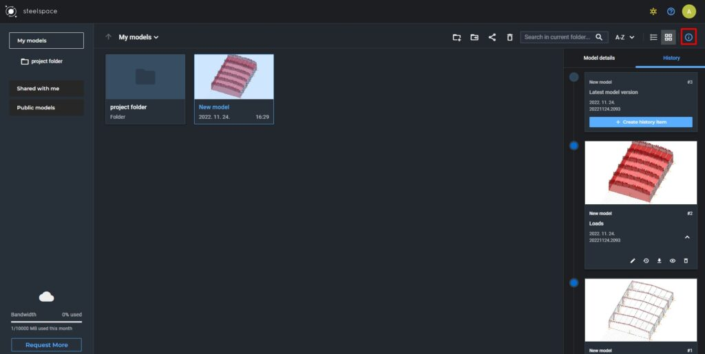

_Kattints az "i" ikonra jobb felül, hogy hozzáférj az adott modell verzióelőzményeihez_

<!-- /wp:image -->

<!-- wp:paragraph -->

Modell megnyitásakor kattints a History fülre bal oldalt a Model megtekintő képernyőn.

<!-- /wp:paragraph -->

<!-- wp:paragraph -->

Ilyenkor a legfrissebb verzióelem létrehozásához kattints az idővonal legfelső kártyáján a „+ Create history item” gombra.

<!-- /wp:paragraph -->

<!-- wp:image {"align":"center","id":44093,"width":800,"height":401,"sizeSlug":"large","linkDestination":"none"} -->

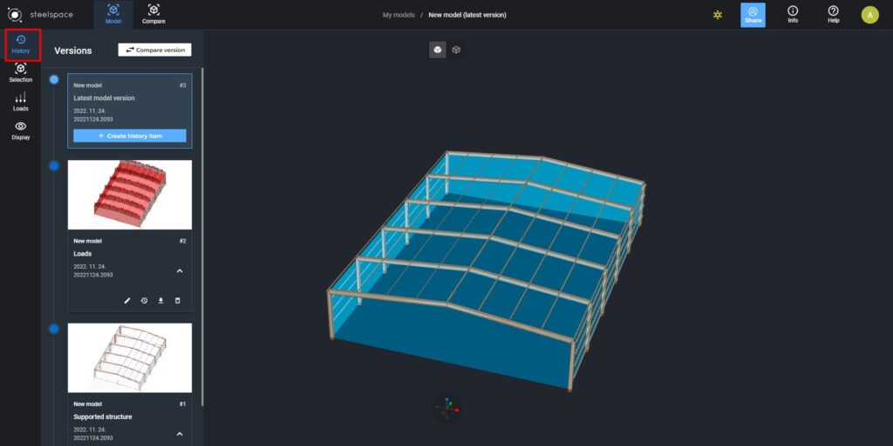

Kattints a **History** fülre a Modell megtekintő képernyő bal oldalán hogy hozzáférj az adott modell verzióelőzményeihez*

<!-- /wp:image -->

<!-- wp:heading {"level":4} -->

#### Modellverzió letöltése

<!-- /wp:heading -->

<!-- wp:paragraph -->

A Dokumentum választó felületen vagy a Modell megtekintőben kattints a kívánt modell verzióelpzménykártyáján a Download ikonra és a verzió letöltődik a számítógépedre.

<!-- /wp:paragraph -->

<!-- wp:heading {"level":4} -->

#### Verzióelőzmény elem módosítása

<!-- /wp:heading -->

<!-- wp:paragraph -->

A Dokumentum választó felületen vagy a Modell megtekintőben kattints a kívánt modell verzióelpzménykártyáján az Edit ikonra és módosíthatod az adott verzióelem nevét és leírását.

<!-- /wp:paragraph -->

<!-- wp:heading {"level":4} -->

#### Modellverzió megtekintése

<!-- /wp:heading -->

<!-- wp:paragraph -->

A Dokumentum választó felületen kattints kétszer a választott modell kártyájára vagy a kártyán lévő View ikonra hogy egy adott verziót nyiss meg a Modell megtekintőben.

<!-- /wp:paragraph -->

<!-- wp:heading {"level":4} -->

#### Modell visszaállítása korábbi verzióra

<!-- /wp:heading -->

<!-- wp:paragraph -->

A kívánt modellnél jobb felül kattints az "i" ikonra és a Verzióelőzmények fülre, hogy hozzáférj az adott modell verzióelőzményeihez. Válaszd ki a számodra szimpatikus verziót és kattints a Visszaállítás ikonra. Visszaállításkor egy figyelmeztető üzenet fog megjelenni, hogy nehogy véletlenül történjen a visszaállítás. A visszaállítás után a választott verzió lesz az aktuális verziója a modellnek.

<!-- /wp:paragraph -->

<!-- wp:heading {"level":4} -->

#### Verzióelőzmény elem törlése

<!-- /wp:heading -->

<!-- wp:paragraph -->

A Dokumentum választó felületen vagy a Modell megtekintőben kattints a választott modell verzióinak a kártyáján a Delete ikonra a törléshez. Törlés esetén egy figyelmeztető üzenet fog megjelenni, hogy nehogy véletlenül történjen az eltávolítás.

<!-- /wp:paragraph -->

<!-- wp:spacer {"height":"36px"} -->

<!-- /wp:spacer -->

<!-- wp:heading {"level":3} -->

### Modellverziók összehasonlítása

<!-- /wp:heading -->

<!-- wp:paragraph -->

A Verzióelőzmények kiegészítő funkciójaként bevezetjük a Modellverziók összehasonlításának lehetőségét, ami lehetővé teszi egy adott modell két különböző állapotú verziójának összehasonlítását egymással. Az összehasonlítás Steelspace felületén történik ahol könnyen kiválaszthatod, hogy melyik verziókat szeretnéd összehasonlítani.

<!-- /wp:paragraph -->

<!-- wp:paragraph -->

Egy modell megnyitásakor a History fül tetején találod a Compare version gombot. Kattintáskor bekapcsol a funkció és automatikusan az adott kiválasztott verzió lesz kiválasztva egyik modellverzióként az összehasonlításhoz. Emellett egy magyarázó szöveg is megjelenik a gomb alatt, hogy csak válassz ki egy másik verziót az összehasonlítás másik elemének.

<!-- /wp:paragraph -->

<!-- wp:image {"align":"center","id":44104,"width":402,"height":397,"sizeSlug":"full","linkDestination":"none"} -->

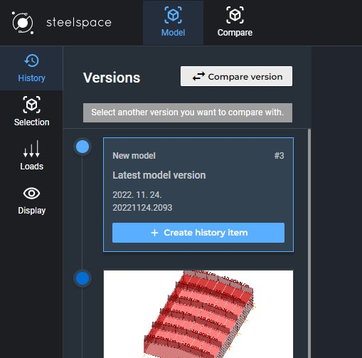

_Az összehasonlítás funkció bekapcsolásakor egy segítő szöveg jelenik meg a Compare version gomb alatt._

<!-- /wp:image -->

<!-- wp:paragraph -->

Kattintás után az összehasonlítás véglegesítéséhez szükséges dialóg jelenik meg, ahol még lehetőség van a verziók kiválasztásának a módosítására. Kattints a Compare gombra az összehasonlításhoz.

<!-- /wp:paragraph -->

<!-- wp:image {"align":"center","id":44108,"width":894,"height":452,"sizeSlug":"large","linkDestination":"none"} -->

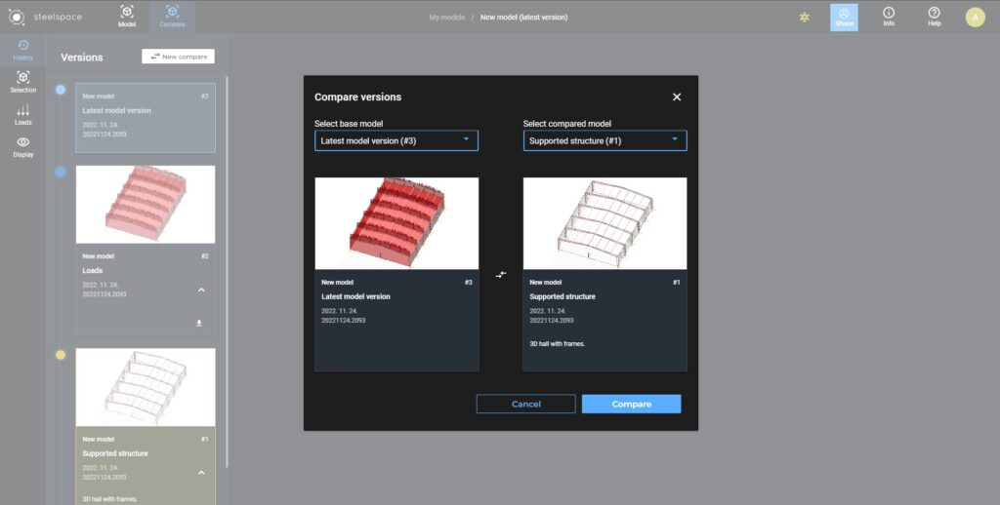

_Verziók kiválasztását segítő dialóg_

<!-- /wp:image -->

<!-- wp:paragraph -->

A legújabb verziótól kezdve összehasonlítási szempontokat lehet beállítani. A felhasználók legördülő menük segítségével kiválaszthatják, mely objektumok állapotváltozásait szeretnék megjeleníteni. A kiválasztott objektumokat az alábbi módon színezi:

<!-- /wp:paragraph -->

<!-- wp:paragraph -->

\- Zöld szín jelöli azokat az objektumokat, amelyeket hozzáadtak a modellhez

<!-- /wp:paragraph -->

<!-- wp:paragraph -->

\- Piros szín jelöli azokat az objektumokat, amelyeket töröltek

<!-- /wp:paragraph -->

<!-- wp:paragraph -->

\- Sárga szín jelöli azokat az objektumokat, amelyeken változás történt.

<!-- /wp:paragraph -->

<!-- wp:paragraph -->

Továbbá, a kiválasztott összes objektumon részletesebb kiválasztás is elvégezhető az alábbi jelölőnégyzetek segítségével. Itt a felhasználók beállíthatják azokat a szempontokat, amelyek alapján az összehasonlítást kívánják végezni.

<!-- /wp:paragraph -->

<!-- wp:image {"align":"center","id":76077,"width":"577px","height":"auto","sizeSlug":"full","linkDestination":"none"} -->

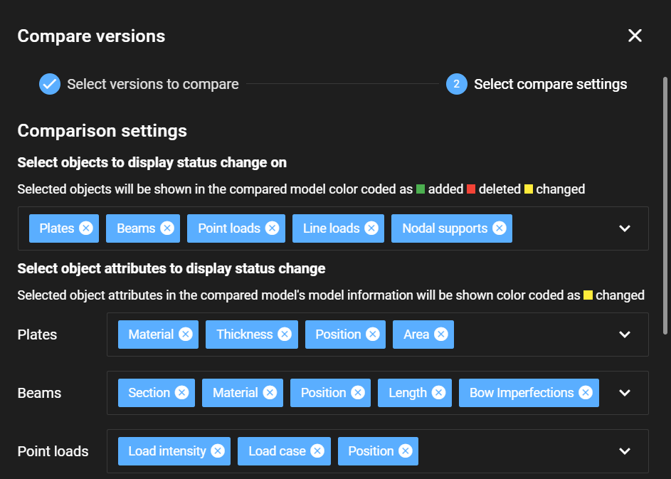

<!-- /wp:image -->

<!-- wp:image {"align":"center","id":76087,"width":"573px","height":"auto","sizeSlug":"full","linkDestination":"none"} -->

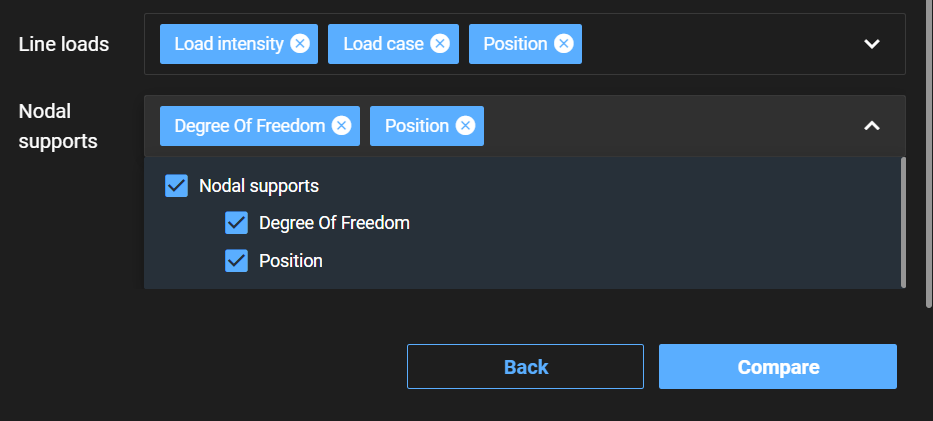

<!-- /wp:image -->

<!-- wp:paragraph -->

A képernyő automatikusan Modell nézetről a Compare nézetre vált, ahol egy csúszka segítségével választhatod ki, hogy melyik verziót szeretnéd megtekinteni. A History fülön belül egy világoskék és egy sárga színezés jelzi az éppen összehasonlításra kiválasztott verziókat.

<!-- /wp:paragraph -->

<!-- wp:image {"align":"center","id":44116,"width":858,"height":430,"sizeSlug":"large","linkDestination":"none"} -->

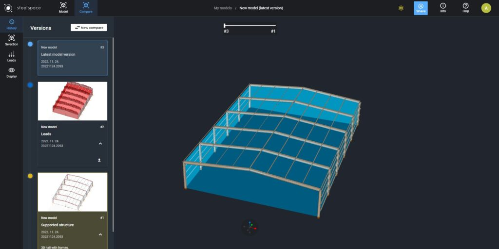

_A csúszkát használva kiválaszthatod, hogy melyik modellverziót szeretnéd megtekinteni_

<!-- /wp:image -->

<!-- wp:paragraph -->

Új összehasonlítást a New compare gombra kattintva indíthatsz el.

<!-- /wp:paragraph -->

<!-- wp:paragraph -->

A Modell nézetre visszaváltás esetén elvész az előzőleg kiválasztott modellösszehasonlítás és új összehasonlítás indítására lesz szükséged.

<!-- /wp:paragraph -->

<!-- wp:heading {"level":3} -->

### Kiválasztás (Selection)

<!-- /wp:heading -->

<!-- wp:paragraph -->

A modell megértésének elősegítése érdekében a felhasználók kijelölhetik az objektumokat szelvények vagy anyagok alapján. A kijelölt objektumok magenta színnel villognak. A kijelölés a szelvény vagy anyag nevére kattintással történik. Lehetőség van a rúdnevek alapján egyéni rudak kiválasztására, vagy akár egyszerre több objektum kiválasztására is.

<!-- /wp:paragraph -->

<!-- wp:image {"align":"center","id":76097,"width":"749px","height":"auto","sizeSlug":"large","linkDestination":"none"} -->

<!-- /wp:image -->

<!-- wp:image {"align":"center","id":76117,"width":"264px","height":"auto","sizeSlug":"full","linkDestination":"none"} -->

<!-- /wp:image -->

<!-- wp:image {"align":"center","id":76107,"width":"264px","height":"auto","sizeSlug":"full","linkDestination":"none"} -->

<!-- /wp:image -->

<!-- wp:heading {"level":3} -->

### Terhek (Loads)

<!-- /wp:heading -->

<!-- wp:paragraph -->

Az oldalsávon a következő gomb a Terhek. Segít a felhasználóknak azonosítani a tehereseteket és tehercsoportokat. A teheresetek nevére kattintásakor vizuálisan is megjelenik az adott tehereset a modellen.

<!-- /wp:paragraph -->

<!-- wp:image {"align":"center","id":76127,"width":"273px","height":"auto","sizeSlug":"full","linkDestination":"none"} -->

<!-- /wp:image -->

<!-- wp:heading {"level":3} -->

### Megjelenítés (Display)

<!-- /wp:heading -->

<!-- wp:paragraph -->

A Megjelenítés ablakon a Steelspace különféle láthatósági lehetőségeket kínál a felhasználóknak. A felhasználók csúszkákkal állíthatják be a Terhelések, Támaszok és Feliratok méretét.

<!-- /wp:paragraph -->

<!-- wp:paragraph -->

Ezenkívül a ,,Clip plane” jelölőnégyzet egy metszősíkot hoz létre a modellben X, Y vagy Z irányból. A pozíció csúszkákkal állítható be. Továbbá, egyidejűleg több metszősík is alkalmazható.

<!-- /wp:paragraph -->

<!-- wp:image {"align":"center","id":76137,"width":"285px","height":"auto","sizeSlug":"full","linkDestination":"none"} -->

<!-- /wp:image -->

### Kommentek

A kommentek funkció a globális struktúrára, specifikus objektumokra vagy specifikus objektumcsoportokra használható.

A komment **létrehozásához** először válaszd ki az objektumot, objektumcsoportot, vagy ha nincs kijelölve semmi, akkor globális kommentet hozhatsz létre, amely az egész modellre vonatkozik.

Ezután az ablak jobb alsó sarkában megtalálod a "Komment létrehozása" gombot. Kattints rá, és a kijelölt elemek függvényében lehetőséged lesz a komment írására.

A hozzárendelt kommentek megtekintéséhez menj a **Láthatósági beállításokhoz**, és az ablak jobb oldalán engedélyezd a kommentek láthatóságát.

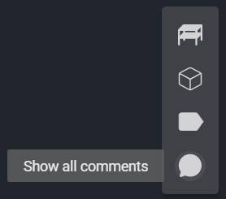

Válaszd ki a Komment Típusát:
A Kommentek panelen válaszd ki azt a komment típust, amelyet meg szeretnél tekinteni.

- **Globális** kommentek a panelen lesznek felsorolva.

- Az **objektum-specifikus** kommentek a modell felületén jelennek meg, az adott objektumokhoz rendelve.

 - Ha egy specifikus objektum kommentjeit szeretnéd megnézni, kattints a modellben az objektumhoz rendelt ikonra.
 - A Modell információ ablak automatikusan megnyílik, és megjeleníti az adott szakasz részleteit és a kapcsolódó kommenteket.

 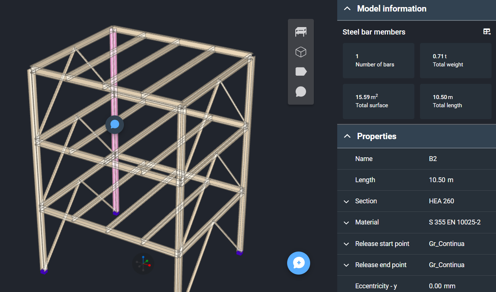

- **Objektumcsoport-specifikus** kommentek:
 - A kommentek csak akkor jelennek meg, ha kiválasztod a komment ikont a modell felületén.

A kommenteket **törölheted**, **módosíthatod** vagy **válaszolhatsz** rájuk.

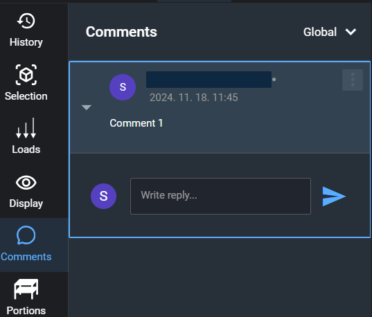

### Részletek

A **Részletek fülön** megtalálhatók az összes létrehozott részlet és emelet, amelyeket más szerkezeti tervező és részletező szoftverekből importáltak.

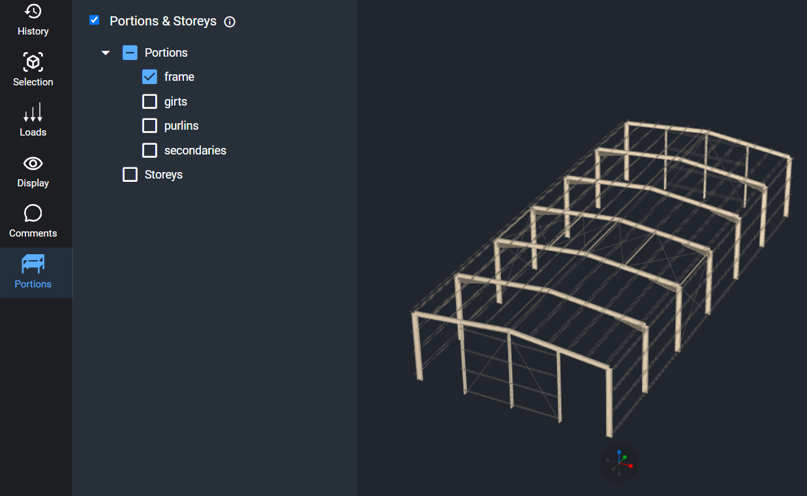

A részletek **megtekintéséhez** jelöld be a panelen megjelenő jelölőnégyzetet, és válaszd ki a megfelelő részletet vagy emeleteket.

A **láthatósági beállításokat** a képernyő jobb oldalán érheted el, ahol három lehetőség közül választhatsz:

- **Modell nézet** – a portiók nem különböztethetők meg
- **Csak részlet nézet**
- **Részletek átlátszó nézetben**

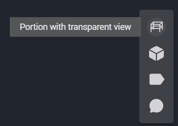
