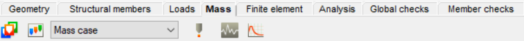

import DocCardList from '@theme/DocCardList';

{/* ide jön az oldal címe szokásosan */}
# Masses

The **Mass** tab contains functions, that are necessary for dynamic calculations. Mass cases and mass combinations can be created for masses that were placed on the model manually or converted automatically from loads into masses.

{/* ide írhatsz bármit ha a kártyák felé akarsz bármit beszúrni
 
 ez a kártya megjelenítő komponens hogy ugyanúgy nézzen ki mintha generálta volna automatikusn */}
<DocCardList />