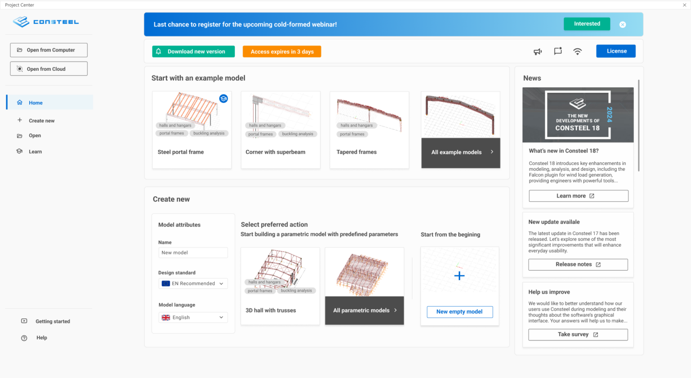
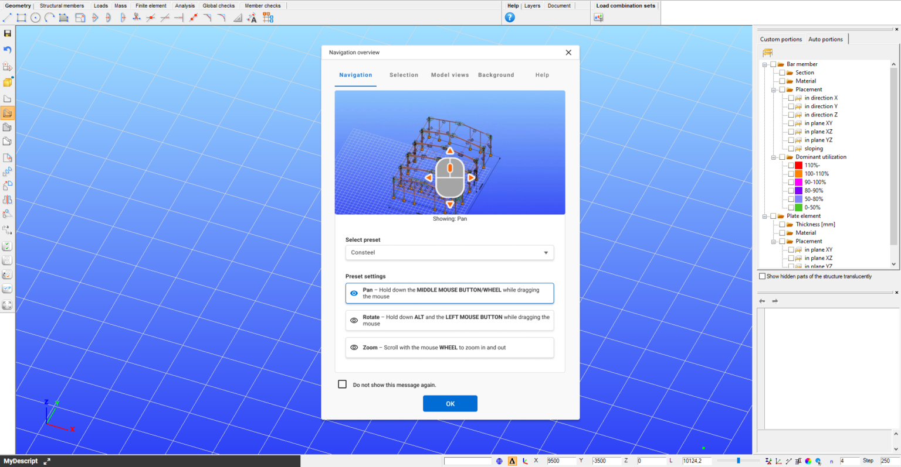
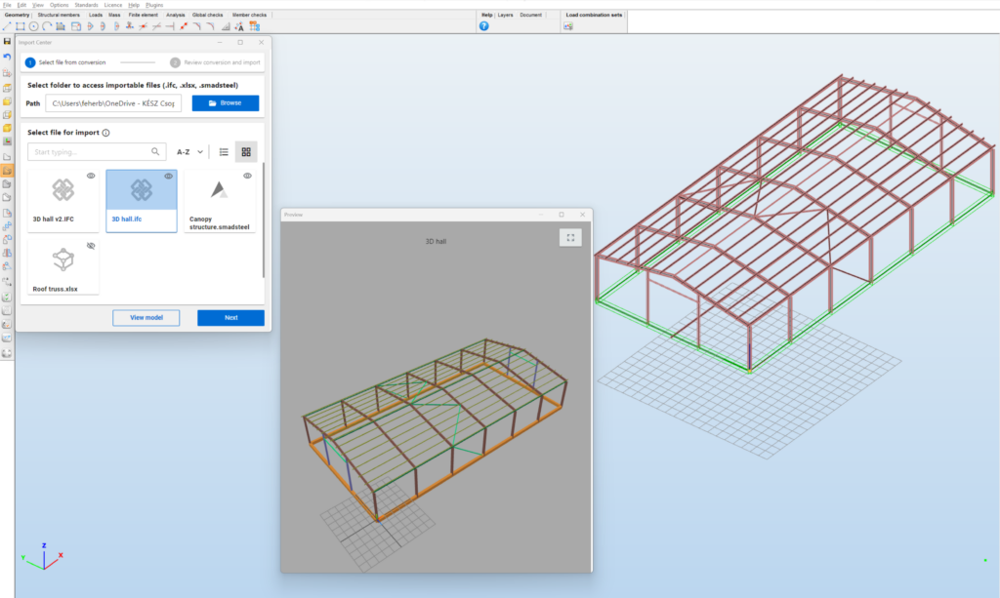
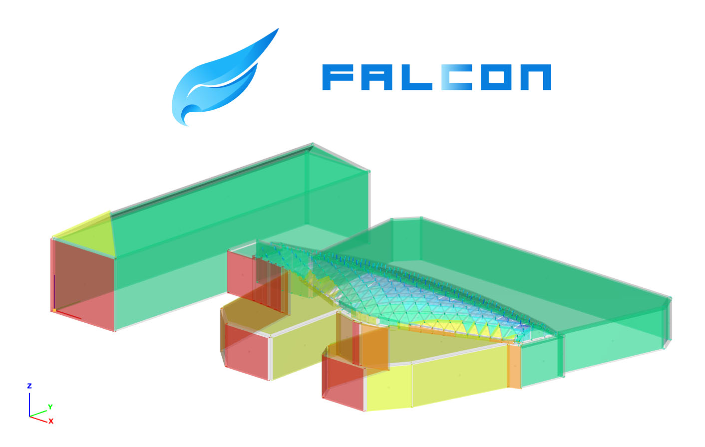

# A Consteel 18 újdonságai
<!-- wp:paragraph -->

Ebben az évben megkönnyítettük a **Consteel-lel való ismerkedést** a kollégáktól egészen **más szoftverekkel való zökkenőmentes együttműködésig**, valamint jelentős előrelépéseket tettünk a **használhatóság**, a **szkriptek** és a **mérnöki funkciók** terén is. Ezenkívül hosszú távú fejlesztési projektünk első verzióját: a **FALCON bővítményt** mutatjuk be, amely egy átfogó, áramlástani szimuláción alapuló szélteher-generáló eszköz. 

## Ismerkedés a Consteel-lel

### Az új Project center

A **modellkezelési lehetőségeket** kibővítettük, a fejlesztés célja egy zökkenőmentes és testre szabott **navigációs folyamat** létrehozása volt. A két alapvető lehetőség elkülönül, kibővített alternatívákkal:

**Új modell létrehozása:**

- Üres modellel kezdés a nulláról
- Gyors paraméteres modell építése az új Paraméteres modellek könyvtárából
- Modell importálása más formátumból (IFC, smadsteel, SAF)

**Meglévő modell megnyitása:**

- Fájlok böngészése a helyi számítógépen
- Modellek elérése a felhőalapú tárhelyről
- A legutóbb mentett modellek közül választás
- Az új Példamodellek könyvtárából való választás
- Az új Oktatómodellek könyvtárának felfedezése

Továbbá az új *Kezdőlap* nézetben a felkínált modellkezelési lehetőségek a bejelentkezett felhasználó profilja és munkafolyamata alapján testre szabhatók. 

Ezenkívül egy **személyre szabott hírcsatorna** is megjelenik, ahol értesülhetsz hírekről, újdonságokról, hibajavításokról és egyéb tartalmakról, de tájékozódhatsz az aktuális szoftverlicencről is.

 
### Navigációs áttekintés
 
A modell létrehozásakor vagy megnyitásakor  megjelenik a *Navigációs áttekintés* ablak, amely részletes információkat nyújt a modellben való navigációról, a kijelölésről, a modellnézetekről, a háttérbeállításokról és a Súgó funkciókról. 

Emellett navigációs preferenciáidat testre is szabhatod – például a mozgatást, forgatást és nagyítást – több népszerű szoftverplatform beállításai közül választva. Az ablak bármikor megnyitható a Súgó menüből.

 
## Együttműködést segítő újdonságok

### Import Center

A Consteel 18-ban az **import és export** funkciók egy új *Import Center* területen találhatók, hogy megkönnyítsék a különböző forrásokból származó modellek koordinációját és egységesítsék az importálási folyamatot.

A kiválasztott mappában megjelennek a kompatibilis fájlok (.IFC, .smadsteel, .xlsx). A modell kiválasztása után elindul a konverzió, amely Consteel-kompatibilis modellt hoz létre a munkaterületen.

A konverziós folyamatról átfogó dokumentáció biztosítja a jobb átláthatóságot.
  

### Általánosított modellkonverzió

A **smadsteel** mind a Consteel-lel, mind pedig a Steelspace-szel kompatibilis. 

Korábban ez a technológia kizárólag AxisVM modellek átalakítására volt használható, de továbbfejlesztésének köszönhetően már IFC és SAF modellek konvertálására is alkalmas.

Az általánosított modellkonverzió többlépcsős módszerrel alakítja át a szelvényeket, naplózva a forrás- és célattribútumokat, valamint az esetleges hibákat.

### Felhőalapú együttműködéshez kapcsolódó fejlesztések

Ebben a verzióban bevezettük a többszintű **kommentelési** lehetőséget a felhőben tárolt és megosztott modellekheza **Steelspace** platformunkon. A megjegyzések egyes modellelemekhez, specifikus modellrészekhez vagy az egész modellhez kapcsolhatók. Minden résztvevőt (legyen az tulajdonos vagy közreműködő) értesítünk a megjegyzésekről.
 

## Szoftver használat

### Új dokumentációs központ

A **Dokumentációs Center** egyesíti a **Consteel kézikönyvet**, a **Descript kézikönyvet**, a **bővítmények dokumentációit** és a **kiadási jegyzeteket** egy központi helyen.

Az új platform számos fejlett funkciót vezet be, beleértve a sötét és világos módot a testre szabható megjelenítési élmény érdekében, a fejlett keresési lehetőségeket, amelyekkel gyorsan megtalálhatók a releváns információk, valamint a több szoftververzió támogatását. 
 

### Keresztmetszetek kezelése

Az acél keresztmetszetek kezelésére egy új, rugalmas megoldást fejlesztettünk a hatékonyság növelésére. Létrehozható **Saját szelvénykönyvtár**, amelyben a gyakran használt szelvények – legyenek ezek könyvtári, makró- vagy rajzolt szelvények – menthetők és egy szabadon megadható mappastruktúrába rendezhetők.

Ez a könyvtár a lokális számítógépre mentődik, tehát különböző munkák során is gyorsan elérhetők általa a gyakran használt szelvények.
 

### Descript fejlesztések

A Constel 18-ban az új Descript funkciók mellett teljesen új felhasználói felület komponenseket is találhatsz a szkriptek által létrehozott dialógokon. Ezeket a frissítéseket úgy terveztük, hogy a szkriptelést intuitívabbá és hatékonyabbá tegyük.

### Felhőalapú modellkezelés

A [Steelspace](https://steelspace.io/explorer) platformunk számos frissítést kapott a felhőalapú modellnézegető és kezelési funkciók terén. A nézegető mostantól támogatja a Consteel modellek változó keresztmetszetű és kiékelt elemeinek megjelenítését. Emellett az **egyedi részletmodellek** is hozzáférhetők a Steelspace-en belül, így lehetőség van ezek megtekintésére. 
 

## Mérnöki fejlesztések

### Új szerkezeti elem objektum: dupla C-profilú rúdelem

A hidegen alakított acélszerkezetekben gyakori **dupla C (vagy szigma)** szelvények tervezése és elemzése összetett feladat. Új szerkezeti elemünk pontosan számítja ezek tulajdonságait, beleértve az öblösödés, csavarás és kihajlás hatásait, és a két szelvényt egyetlen rúdelemként kezeli a könnyebb modellezés érdekében.
 

## Új támasz típus: csak nyomást felvevő támasz

Bevezetésre került egy új támasztípus: a **csak nyomást felvevő támasz**. Ez az iteratív eljárással működik, hasonlóan a húzott rúd számításához, hogy az első- és másodrendű analízis során meghatározza a valós állapotot. Segítségével olyan helyzetek modellezhetők, amikor az objektumok nem kapcsolódnak valódi módon, csupán egymáson nyugszanak.

## A FALCON plugin

Az elmúlt években a CFD szimulációk fejlesztésére összpontosítottunk, hogy **nem szabványos épületek szélterhelését generáljuk**. Célunk egy egyszerűen használható eszköz biztosítása, amely automatikusan létrehozza a szabványos szélzónákat és terheket.

A **FALCON bővítmény** ingyenes béta verziója a Consteel 18-ban elérhető, lehetőséget adva tesztelésre és visszajelzésre. A végleges verzió jövőre kerül kiadásra.

