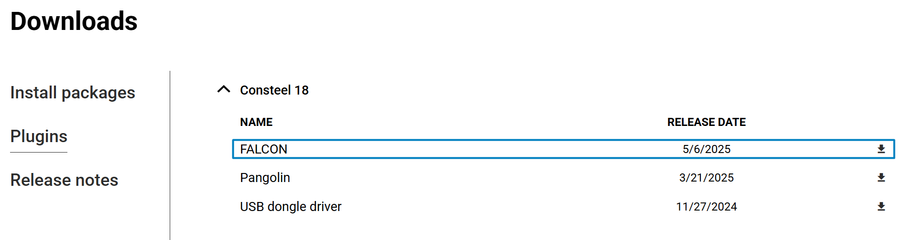
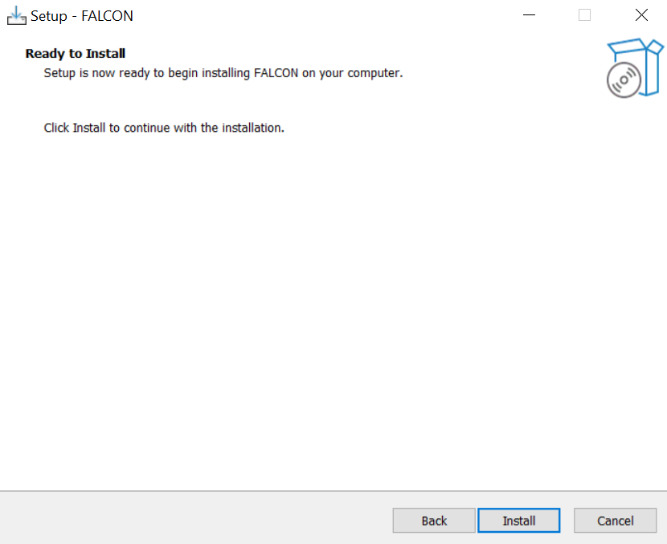
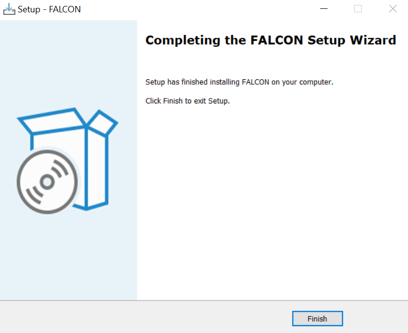

# FALCON telepítése és futtatása

A szél-szimulációs funkció használatához a felhasználóknak először telepíteniük kell a **FALCON plugint**. Ez a bővítmény a Consteel weboldalán, a „Letöltések” menüpont alatt érhető el. A bővítmények kategóriájában válaszd ki a „Consteel 18” opciót, majd töltsd le a „FALCON” plugint.

A plugin a Consteel 18-tól kezdve kompatibilis.

## Licencszerződés

A telepítési folyamat megkezdéséhez el kell fogadni a licencszerződést.

## Telepítő

 

A FALCON telepítési helye: C:\Users\[felhasználónév]\AppData\Local\ConSteel\Plugins\FALCON\1\...
   

 

Ha a telepítés sikeres, két új FALCON ikon lesz elérhető a Teher fülön:

- FALCON – Szél szimuláció
- FALCON – Szélteher generálás szimulációs eredményekből 

