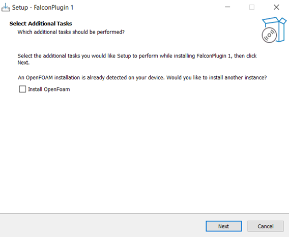

# FALCON telepítése és futtatása

A szél-szimulációs funkció használatához a felhasználóknak először telepíteniük kell a **FALCON plugint**. Ez a plugin a Consteel weboldalán, a „Letöltések” menüpont alatt érhető el. A bővítmények kategóriájában válaszd ki a „Consteel 18” opciót, majd töltsd le a „FALCON” plugint.

A plugin a Consteel 18-tól kezdve kompatibilis.

 
A plugin .exe fájl letöltése után győződj meg róla, hogy bepipáltad az „OpenFOAM telepítése” jelölőnégyzetet, ha az előzőleg **nem** lett telepítve. Ezután kattints a „Tovább” gombra.

## Van OpenFOAM telepítve a számítógépére?
### IGEN
*** 

Ha az OpenFOAM már telepítve van, de mégis bepipálod a jelölőnégyzetet, az alábbi üzenet jelenik meg:

"OpenFOAM telepítése már megtörtént az eszközén. Szeretné egy másik példányt telepíteni? Telepítse az OpenFOAM-ot."

Ha a Telepítés gombra kattintasz, egy új OpenFOAM példány lesz telepítve, ami **lassítani** fogja a telepítési folyamatot. Ajánlott a **Vissza** gombra kattintani, és eltávolítani a jelölést a telepítéshez.

- Kattints a **Tovább** gombra a Kiegészítő Feladatok kiválasztása ablakban.

- A Készen áll a telepítésre oldalon kattints a **Telepítés** gombra.

- Az utolsó ablakban, a FALCON Plugin 1 Telepítő varázsló befejezése oldalnál kattints a **Befejezés** gombra.

 

### NEM

*** 

Ha az OpenFOAM **nincs** telepítve, az alábbi üzenet jelenik meg:

"Nem található OpenFOAM az eszközén. A folytatáshoz először telepítenie kell. Telepítse az OpenFOAM-ot."

- **Ne használj a Consteel**-t a plugin telepítése közben. Ha a szoftver nyitva van, az alábbi üzenet jelenik meg:

"Az alábbi alkalmazások olyan fájlokat használnak, amelyeket a telepítő frissíteni szeretne. Ajánlott engedélyezni, hogy a telepítő automatikusan bezárja ezeket az alkalmazásokat. A telepítés befejezése után a telepítő megpróbálja újraindítani az alkalmazásokat."

- Kattints a **Telepítés** gombra a telepítés folytatásához.

- A Üdvözöljük az OpenFOAM Windows telepítőjében ablakban kattints a **Tovább** gombra.

- A Kezdő lépések ablakban pipáld be az ,,Ez a funkció **kihagyása**" jelölőnégyzetet, majd kattints a **Tovább** gombra.

:::note
Az OpenFOAM Linuxon fejlesztett rendszer, amely érzékeny a kis- és nagybetűkre, míg a Windows alapértelmezetten nem érzékeny rá. Azok számára, akik az OpenFOAM további fejlesztését tervezik, szükséges a Windows beállításainak módosítása. Azonban a legtöbb felhasználó számára biztonságos ezt a lépést kihagyni.
:::

 
- A következő hét ablakban kattints a **Tovább** és **Telepítés** gombra anélkül, hogy módosítanád az alapértelmezett beállításokat.

- Amikor a Microsoft MPI telepítő varázsló befejezése ablakhoz érsz, kattints a **Befejezés** gombra.

 

- A Microsoft MPI telepítése után, a **OK** gombra kattintva, a Cygwin és az OpenFOAM telepítésére van szükség, öt lépésben:

Lépés 1: OpenFOAM telepítése

:::info
Az alábbi 4 lépést csak kutatási célokra ajánljuk; a szokásos mérnöki projektekhez a felhasználók kihagyhatják a ParaView, swak4Foam, PyFoam és Gnuplot telepítését.
:::

- Lépés 2: ParaView telepítése

   
- Lépés 3: swak4Foam telepítése
- Lépés 4: PyFoam telepítése
- Lépés 5: Gnuplot telepítése
- Ezután ki kell választani a telepítés nyelvét. Kattintson a **OK** gombra.

- A következő ablakban el kell fogadni az Licencszerződést. Kattints a **Tovább** gombra.

- Kattints a **Tovább** gombra az Információ ablakban.

- Válaszd ki a célmappát és a komponenseket, majd kattints a **Tovább** gombra.

- Válaszd ki a Start menü mappát, majd kattints a **Tovább** gombra.

- További feladatok választhatók, majd kattints a **Telepítés** gombra a Kész a telepítéshez ablakban.

- Kattints a **Tovább** gombra az Információ ablakban, majd kattintson a Befejezés gombra.
   
   
 

Ha a telepítés sikeres, két új FALCON ikon lesz elérhető a Teher fülön:

- FALCON – Szél szimuláció
- FALCON – Szélteher generálás szimulációs eredményekből 

:::info
Mivel a FALCON bővítmény kezdeti verziója egy ingyenes bétaverzió, amely előzetes tesztelésre és használatra áll rendelkezésre, kérjük, hogy kezdés előtt [regisztrálj](https://share.hsforms.com/1Csz6iiSBRE2N3K6Y8fiGYA2irg2).

A finomhangolási fázist követően, együttműködve elkötelezett felhasználóinkkal, a végleges verzió kiadása jövőre várható.
:::