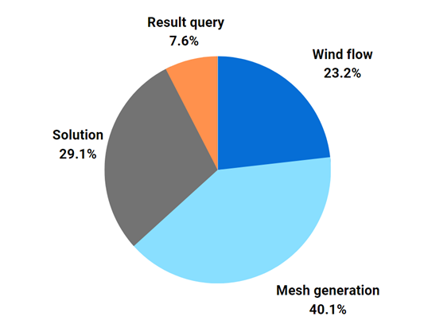

# Kliensek és paraméterek

A hordozhatóság elvének támogatása érdekében bármely olyan platform, amely képes biztosítani a bemeneti paramétereket SAF vagy SMADSTEEL formátumban, lehet a szolgáltatás kliensje. A geometria egy teherátadó felületek gyűjteményeként kell definiálni. Ahhoz, hogy több nyomásértéket rendelhessünk egy teherátadó felülethez, előzetes hálózásra van szükség, amely gyakorlatilag egy hagyományos véges elemes háló a felületen, amely mindig sík felületekből áll. Többféle választási lehetőség van a háló véges felületeinek típusával kapcsolatban. A háromszögletű hálók rugalmasak a geometria szempontjából (például lekerekített, befelé hajló sarkok), és mindig szabályos hálót eredményeznek. A négyszögletes hálók kevésbé rugalmasak, de hajlamosak jobb eredményeket adni a terhelés generálásában. A kombinált hálók megpróbálják ötvözni a háromszögletű és négyszögletes hálók előnyeit, de sok esetben szabálytalan hálót eredményeznek.

A szimulációs eset egy paraméterkészletből indul. A paraméterek száma a geometria és a számítási összetettség függvényében változhat, de még a legegyszerűbb szimuláció is minimum körülbelül 250 paramétert igényel, amelyek négy kategóriába sorolhatók. Természetesen a paraméterek jelentős része redundáns, így van hely az automatizálásra, amely megköveteli a tudatos szerializálási folyamatot.

**A paraméterek eloszlásának százaléka**

A tapasztalatok szerint a paraméterek közel 80%-a rögzíthető szerkezeti mérnöki célokra. Ez azt jelenti, hogy alapértelmezett értéket rendelnek hozzájuk. A szükséges paraméterek a következők:

- **Széláramlás**

  - Alap szélsebesség az EC szerint
  - Területi kategória az EC szerint
  - Szélirány vektor
  - Referencia magasság – ha nincs megadva, automatikusan kiszámításra kerül az épület körvonalának legmagasabb pontja alapján.

- **Háló generálás**

  - Teherátadó felületek
  - Előzetes hálózás flag – annak meghatározása, hogy a szerkezet előzetes hálózással rendelkezik-e vagy sem.
  - Háló típusa – a háló felületének típusa, ha előzetes hálózás kérhető.

    - Háromszögű
    - Négyszögletes
    - Kombinált

  - Terhelési cella mérete – a kívánt felület/cella mérete a terhelés generálásához, ha előzetes hálózás kérhető.

  - Finomítás – A finomítási érték a terhelési cella méretéhez képest.

  - Cellák száma a finomítási szintek között

- **Megoldás**

  - Turbulencia modell

  - Processzorok száma párhuzamos számításhoz

  - Iteráció vége

  - Konvergenciakritériumok

- **Eredmény lekérdezés**

  - Terhelés értékelés típusa

    - Átlagos

    - Maximum

    - Minimum

  - Terhelés generálás típusa

    - Csúcs terhelés csomópontoknál

    - Lineáris terhelés gerendákon

    - Egységes felületi terhelés síkokon

    - Lineáris felületi terhelés síkokon

    - Egységes felületi terhelés zónákban

    - Lineáris felületi terhelés zónákban

    - Egységes felületi terhelés specifikus zónákban

  - Zóna intervallum a zónatípusú terhelés létrehozásához

  - Specifikus zónák
