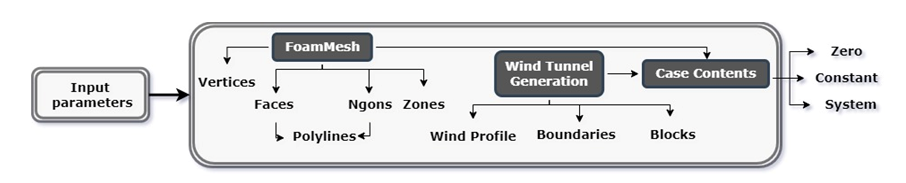
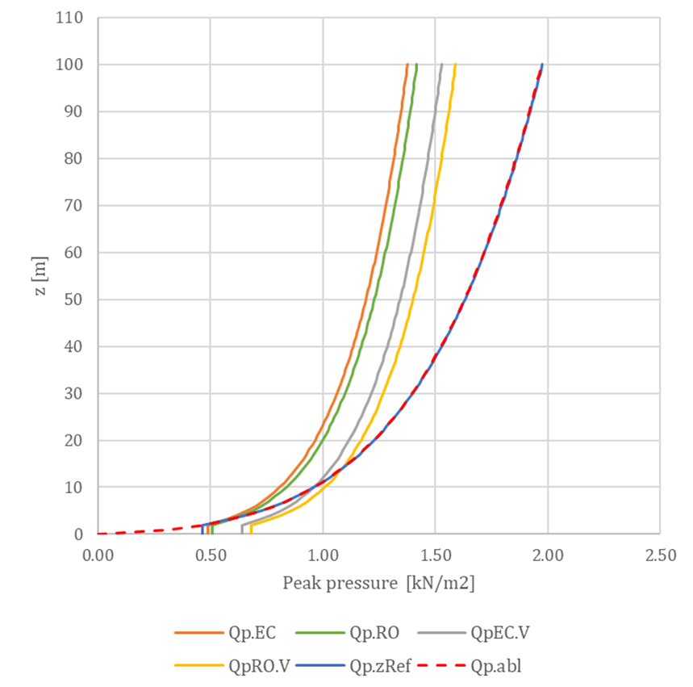
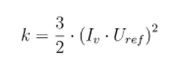
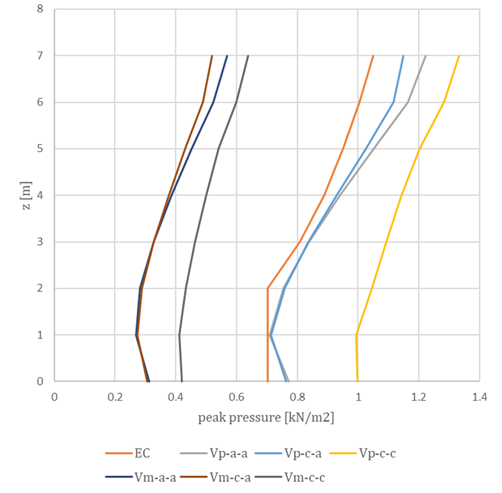

# Előfeldolgozás

Az előfeldolgozó egy működési fázisként is említhető, vagy egy olyan módszerek gyűjteményeként, amelyeknek két fő feladata van. Az egyik feladat az, hogy az input geometriát egy specifikus háló formátumba konvertálja, amelyet hagyományos hálóként lehet leírni, háromszög vagy négyszög alakú felületekkel és csomópontokkal, de lehetséges a polygonális (Ngon) felületekkel rendelkező háló értelmezése is.

Mindazonáltal reprezentációs célokra egy "Foam Mesh" is értelmezhető, mint polilíniák listája. A másik feladat a virtuális szélcsatorna létrehozása, amely a paraméterek szerinti szélprofilt tartalmazza, valamint geometriailag blokkokból (véges térfogatú elemek) és határokról. Ezen két információ birtokában lehetséges létrehozni a szimulációs eset tartalmát, hasonlóan az OpenFOAM hierarchiájához. A széláramlás paraméterei a "zero" mappában, a háló generálása pedig a "constant" és "system" mappákban található, míg a megoldás és az eredmény lekérdezési paraméterek a "system" mappában helyezkednek el.
  
_Előfeldolgozó áttekintése_  

Bár az előfeldolgozó kulcsfontosságú jellemzője a szélprofil meghatározása az Eurocode kontextusában, amely tartalmazza a 3.2.1 fejezetben bemutatott összes szempontot. A világos cél az, hogy olyan szélprofilt vezessünk be, amely a kód által meghatározott csúcsnyomás-profilt adja. Azonban ennek a profilnak a meghatározása nem egyszerű. Az alábbi 4-4 ábra különböző megközelítéseket mutat, ahol a Qp.EC függvény mutatja az Eurocode által használt általános „célt” profilját. Azonban fontos figyelembe venni a nemzeti mellékletek szempontjait is, például a román szabvány (Qp.Ro) egy speciális megközelítést tartalmaz, amely bevezeti a turbulenciaintenzitás arányossági tényezőjét, β. Egy másik szempont, hogy az Eurocode általában figyelmen kívül hagyja a turbulenciaintenzitás másodrendű tagját, amelyet a 3.2.1.2 fejezet tartalmaz, figyelembe véve, hogy az ebből az approximációból adódó hiba 3-4%-nál alacsonyabb. Azonban ha a csúcsnyomást közvetlenül a csúcssebesség alapján számítják ki (QpEC.V és QpRO.V), a különbség jelentősebbnek tűnik.

  

_Csúcsnyomás profilok_  

Ezenfelül fontos tisztában lenni azzal a ténnyel, hogy az OpenFOAM csak egy egyszerűsített logaritmikus megközelítést kínál, amely a referencia magasságban számított súrlódási sebességen, U*-n alapul, ami egy kissé eltérő sebességprofilt, U.abl-t eredményez, amely egy eltérő nyomásprofilt, Qp.abl-t ad, amely gyakorlatilag megegyezik egy nyomásprofilal, amelyet a referencia magasságban a tulajdonságok (turbulenciaintenzitás, ezáltal az expozíciós tényező) alapján számítanak ki, Qp.zRef.

  
_Csúcssebesség profilok II. kategóriájú terepen_  

Az OpenFOAM légköri határréteg megközelítése által kiértékelt logaritmikus profil a következő szerint van:

Ezért szükséges volt egy egyedi megoldás kidolgozása az OpenFOAM-on belül az U.in meghatározására, mint a beömlési csúcssebesség profilja, amely a kívánt Qp.EC-t eredményezi. Ehhez a következő képletet alkalmazzák:

A beömlő szélprofilhoz k-ε turbulenciamodellel a k és ε mezőértékek inicializálása is szükséges. Ehhez is különböző megközelítéseket kell figyelembe venni. Az OpenFOAM alapvető légköri határrétege automatikusan kiszámít egy állandó értéket a magasság mentén, az alábbiak szerint:

Azonban a beömlő turbulens kinetikus energia jellemzően a beömlési referencia sebesség és a turbulencia intenzitás alapján kerül kiszámításra, amelyet az Eurocode a terepparaméterek alapján határoz meg:

Hasonlóképpen, az ε beömlő értékéhez egy alapértelmezett automatikus módot használ az OpenFOAM, amely a súrlódási sebességen alapul:

:::info  
És van egy másik megközelítés is, amely figyelembe veszi a turbulens hosszúság intenzitását, amely az Eurocode eljárásai szerint értékelhető:  
:::

Ezeket a megközelítéseket összehasonlították, mind a középsebesség, mind a csúcssebesség profilok számára, amelyeket a 4-6. ábrán mutatunk be. A csúcsnyomások azoknak a nyomásértékeknek felelnek meg, amelyek egy egyszerű 8 m x 8 m x 8 m kocka szélvédett falán lettek mérve. A profilnevezési konvenció a következő: beömlő sebességprofil – beömlő turbulens kinetikus energia (automatikus vagy számított) – beömlő turbulens disszipációs ráta (automatikus vagy számított).

  
_Csúcsnyomások mérve a szélvédett falon_
