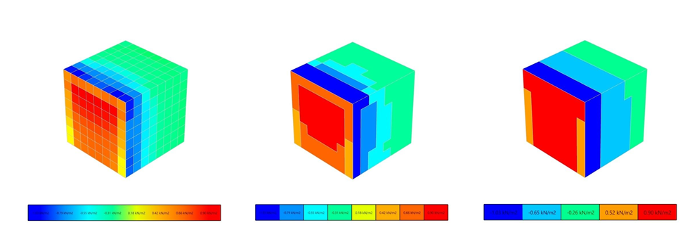

# Postprocesszor

A fejlesztés célja egy olyan fő funkció biztosítása volt, amely automatikusan átalakítja az eredményül kapott nyomásértékeket használható felületi terhelésekké a felhasználók preferenciái szerint. Lehetőség van közvetlenül hozzárendelni a szimulációs eredményeket az épülethez a premesh-en keresztül, vagy alkalmazni egy zónázási logikát, hasonlóan a szabványhoz, vagy akár terheléseket definiálni specifikus zónákra (pl. Eurocode zónák).

  
_Különböző posztprocesszor lépések a felületi terhelések megalkotásához ugyanazon szimulációs eredmény felhasználásával_

A postprocesszor terhelésgenerálási eljárásai a következőek:

- Egyenletes felületi terhelések a felületeken

- Lineáris felületi terhelések a felületeken

- Egyenletes felületi terhelések automatikus zónákban

- Lineáris felületi terhelések zónákban

- Egyenletes felületi terhelések specifikus zónákban

Ezen kívül lehetőség van eredménymezők lekérdezésére specifikus pontokban (pl. sebesség, turbulens kinetikus energia).
