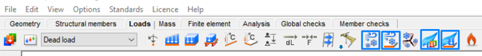
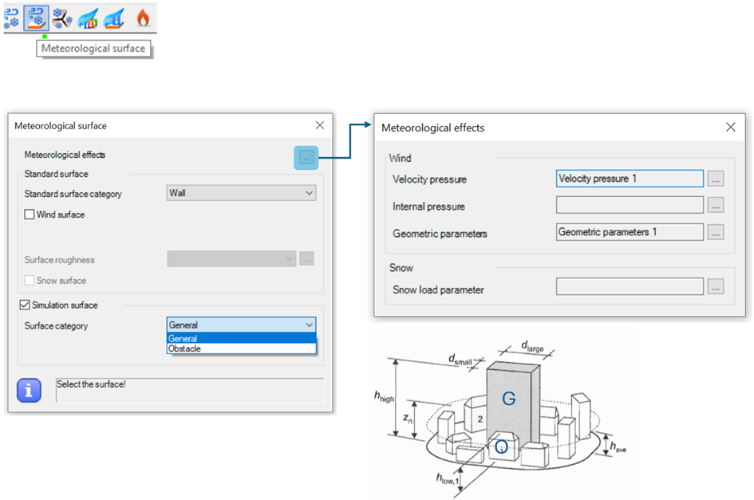
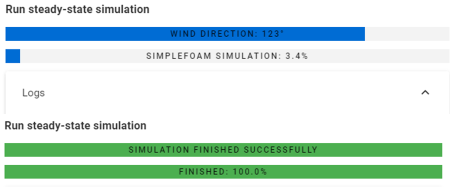
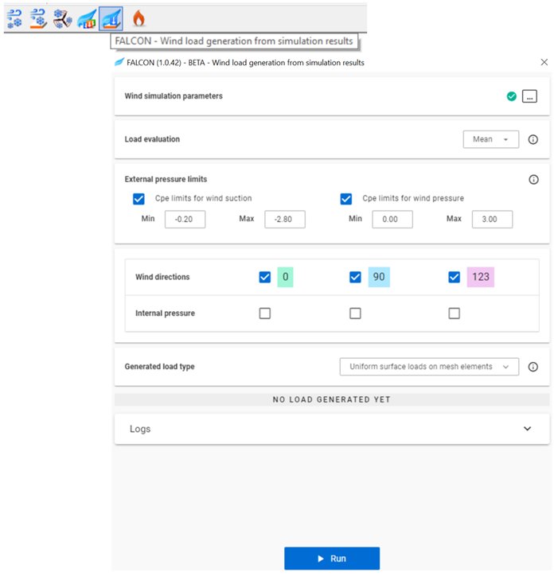

# **Felhasználói felület**

A szél szimulációs folyamat elkezdése előtt az első és legfontosabb lépés a **Terh átadó Felületek** létrehozása, amelyeken a szimuláció végrehajtásra kerül.

A teherátadó felületet többféleképpen is létrehozhatod:

- A **Teherátadó Felület** lehetőséggel a _Terhek fülön_
- **Diafragma** létrehozásával a _Szerkezeti elemek fülön_

A teherátadó felületek létrehozása után kezdődhet a szél szimulációs folyamat.

Minden **FALCON-szél szimuláció**-val kapcsolatos funkció a _Terhek fülön_ található.

### 1. Meteorológiai hatások

Az első lépés a **szél szimuláció** során a **meteorológiai hatások** meghatározása. Ehhez használd a speciálisan tervezett ikont a Terhek fülön.  
A szélterhelés szimulációhoz a **Torlónyomás** és a **Geometriai Paraméterek** meghatározása szükséges:

- **Torlónyomás**:
  - Beépítettségi osztály
  - Szélsebesség alapértéke
- **Szélteher generálás geometriai paraméterei**:
  - Az épület méretei a fő szél irányához képest
  - A terhelési terület pontos dimenziója nem releváns a szél szimulációban a béta verzióban.

A meteorológiai hatásokkal kapcsolatos további információkért tekintsd meg a [_Terhek fejezetet_](../../../manual/6_0_structural-loads/6_6_meteorological-loads.md) a Consteel kézikönyvben.

### 2. Meteorológiai felületek

A következő lépés a **Meteorológiai Felület** meghatározása.

Ebben az ablakban visszatérhetsz az első lépéshez, ha rákattintasz a három pont ikonra a **Meteorológiai Hatások** mellett.

:::info
A **Standard Felület** szekció nem befolyásolja a szél szimulációt; csupán a szabványos szélgenerálást szolgálja Eurocode szerint.
:::

A szél szimulációhoz használd az ablak végső szekcióját, amely a **Szimulációs Felület** néven, és válaszd ki a megfelelő felület kategóriát:

- **Általános** – a tervezett épület számára
- **Akadály** – bármely környező épület számára, amely modellezve van, és hatással lehet a szél szimulációra

A felület kategória kiválasztása után az összes releváns felületet ki kell választani. Ha a szimulációs felület helyesen van alkalmazva, az alábbi ikon jelenik meg a felületek közepén:

:::note
Az Általános felületek csak Terh átadó felületekre alkalmazhatók, beleértve a diafragmákat.
:::

### 3. FALCON-Wind szimuláció

:::info

Ha zöld pipa jelenik meg a három pont ikon mellett, az azt jelzi, hogy az előző lépések sikeresen befejeződtek, így folytathatod a szél szimulációs folyamatot.

Az Info gomb részletes információkat ad minden lépésről. A gomb megnyomásával megnyílik egy ablak, amely átfogó útmutatást tartalmaz.
:::

A harmadik lépés a szél szimuláció futtatása a FALCON-nal. Használd a **FALCON-Szél szimuláció** gombot a _Terhek fülön_, hogy megnyisd az ablakot.

Ez az ablak négy szekcióra van osztva, amelyek végigvezetik a beállításokon és a szimuláción:

#### A. Hatások és Felületek

- **Meteorológiai Hatás**: Ha előzőleg nem lett meghatározva, visszatérhetsz ehhez a beállításhoz a három pont gombra kattintva.

- **Szimulációs Felületek**: Az alatta lévő szám azt jelzi, hány szimulációs felület van jelenleg elhelyezve a modellben. Ha nincs felület meghatározva, használd a három pont gombot a visszalépéshez és azok meghatározásához.

#### B. Szimulációs Beállítások

- **Háló Mérete a Szimulációs Felületen**: A szimulációs felületen alkalmazott háló méretének beállítása.
- **Háló Mérete a Szerkezeten**: Az automatikus hálógenerálás két hálót hoz létre:

    - **A Végeselem Háló (FEM)**, amelyet kifejezetten a poszt-feldolgozáshoz hoznak létre, és csak az épülethez alkalmazzák, amely sík felületekkel rendelkezik, amelyek alkalmasak a terhelés létrehozására.
    - **A Végeselem Volumen Háló (FVM)**, amelyet a szimulációs megoldó generál, és amely a teljes szimulációs tartományban poligonális felületeket tartalmaz, alkalmazkodva a szél irányához. Az FVM eredmények a FEM hálóra vetítődnek a szimulációs célból.

- **Háló Finomítási Tényező**: A finomítási tényező (r) növeli a cella éleinek méretét (c) a szimulációs tartomány határain, hogy gyorsítsa a számításokat azzal, hogy csökkenti a távolabbi részletezést az épülettől. A cellaméret a határokon kiszámítható a következőképpen:

  c = s × 2^r

  Itt (s) a szerkezeten alkalmazott háló mérete, és minden finomítás a cellákat minden irányban felére csökkenti, létrehozva egy finomított hálót az épület közelében.

- **Fejlett Beállítások**: Az alapértelmezett beállítások általában megfelelőek, de szükség esetén módosíthatók. A három pont gombra kattintva módosíthatók:

  - **Hőmérséklet**: A szimulációhoz beállított környezeti hőmérséklet.
  - **Turbulenciás Modell**: A turbulencia hatásainak előrejelzése.
  - **Processzorok Száma**: A párhuzamos szimulációkhoz használt processzorok száma.
  - **Iterációk Száma**: Az iterációk számának meghatározása.
  - **Konvergencia Kritériumok**: A kiszámított mezők konvergenciájának szabványai.
  - **Tartomány Dimenzió Paraméterei**: A szimulációs tartomány dimenzióinak beállítása a magasság szorzóival minden irányban:
    - **Széloldal** (w)
    - **Leeward** (l)
    - **Oldal** (s)
    - **Felső** (t)

#### C. Szélirányok Θ₀-hoz képest (Max 12)
Ebben a szekcióban add meg az összes szélirányt az XY síkban Θ₀-hoz képest, legfeljebb 12 irány egyidejű megadásával. Minden új irányt az input mezőbe való beírás után nyomd meg az **Enter** billentyűt.

A Θ₀ irány a szimulált szerkezet tetejének nézetében, a szél szimulációs irányaival együtt látható. A színes nyilak jelzik a szimulált szél irányát a szerkezethez képest.

#### D. Folyamatos állapotú szimuláció futtatása
Az utolsó szekciókban a szimuláció állapota és az irány figyelemmel kísérhető:

A "Run" gombra kattintás után két betöltési sáv jelenik meg, amelyek a szimulált szélirányokat és azok előrehaladási százalékát mutatják.

:::info
Amíg a szél szimulációk futnak, a Consteel teljes mértékben működőképes marad, így továbbra is dolgozhatsz.
:::

A szimuláció előrehaladásának nyomon követéséhez nyisd meg a **Naplók** legördülő ablakot. A szimuláció bármikor leállítható a **Mégse** gombra kattintva.

### 4. FALCON-Wind terhelés generálása a szimulációs eredményekből

Az utolsó lépésben a FALCON generálja a szimulációs eredményekből származó terheléseket, amelyek a modellben rendes terhelésként használhatók. Az ablak végigvezet a szélterhelések generálásának lépésein:

- **Szél szimuláció végrehajtása**: Ha a szél szimuláció nem lett végrehajtva, használd a három pont ikont, hogy visszatérj az előző lépéshez és futtasd azt.

- **Terhelés Értékelés**: A háló generálása során a véges térfogatú háló további finomításon megy keresztül, biztosítva, hogy minden véges elem háló felületén legalább négy tárolt eredmény legyen. Ez különböző eredményértékelési módszereket tesz lehetővé a terhelés konvergenciájának ellenőrzésére, és szükség esetén konzervativizmus hozzáadására.

- **Külső Nyomáskorlátok beállítása**: Állítsd be a nyomás és szívóerő együtthatóinak felső határértékeit.

- **Szél és Belső Nyomás Irányok beállítása**: Állítsd be a szél- és belső nyomás irányokat a terhelés generálásához, a szimulációs eredmények alapján.

- **Generált terhelési típus kiválasztása - Egyenletes Felületi Terhelések**:

  - **Háló Elemein**: Terhelések generálása közvetlenül a véges elem háló elemein.
  
  - **Zónákban**: Terhelések generálása a meghatározott szélzóna kategóriák számának alapján, ami zónás terheléseket eredményez.

  - **Specifikus Zónákban**: Zónás terhelések alkalmazása a modell meghatározott részein.

- **Terhelés Generálás Futtatása**: Nyomd meg az ablak alján található "Futtatás" gombot a terhelések generálásának elindításához.

Ha a szélterhelés generálása sikeresen befejeződik, új szélterhelési esetek jelennek meg a _Terhelési Esetek és Csoportok_ szekcióban.

Minden szélterhelési eset tartalmazza a szimulációból generált megfelelő szélterheléseket.
