# AXISVM Konverter

## 1. AxisVM plugin letöltése, lépésről lépésre

Az importálási funkció használatához először telepíteni kell az AXISVM bővítményt. Ez letölthető a Consteel weboldaláról a „Letöltések” menüpontra kattintva. A bővítmények között a „Consteel 17”-et kell választani, majd letölteni a „Consteel Converter for AXISVM” bővítményt.

A Consteel 17-től és az AXISVM X7-től kezdődően a bővítmény kompatibilis. Régebbi Consteel verziók esetén lehetséges az AXISVM-ből konvertált .smadsteel fájlok megnyitása, de az importálási napló nem fog megjelenni. Régebbi AXISVM verziók esetén nem garantálható a megfelelő működés. Az AXISVM API változása befolyásolhatja az import minőségét.

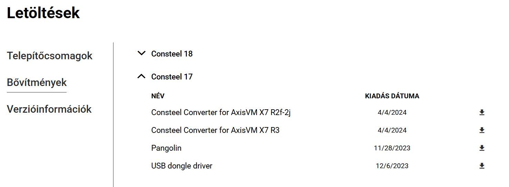

A bővítmény .exe fájl letöltése után győződj meg róla, hogy ugyanabba a mappába telepíted, ahol az AXISVM programfájl található. Kattints a „Tovább” gombra.

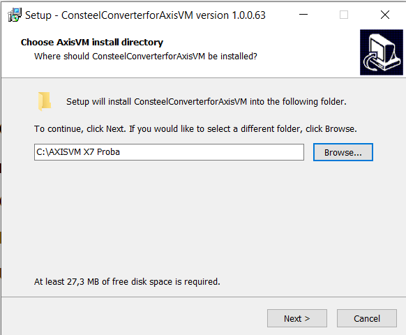

A következő ablakban ellenőrizheted, hogy az telepítési hely beállításai a megfelelő mappára mutatnak-e. Ha minden rendben van, folytathatod a telepítést a „Telepítés” gombra kattintva, majd az ezt következő ablakban kattints a „Befejezés” gombra.

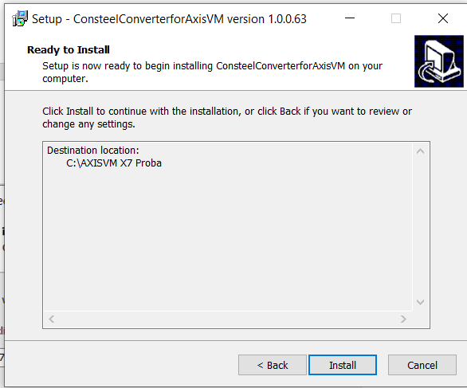

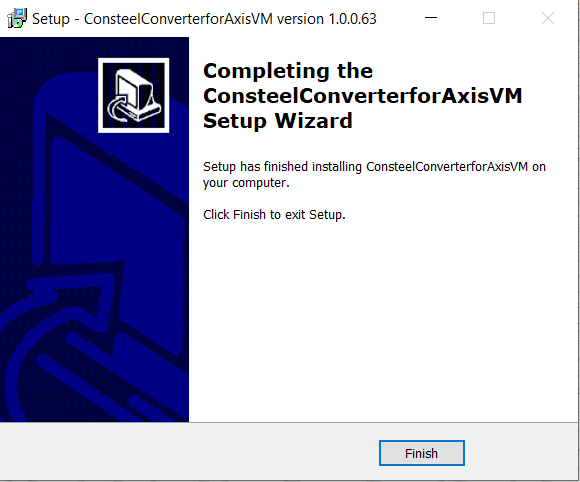

Amennyiben a telepítés sikeres volt, az AXISVM program megnyitása után a „Consteel Converter 1.0.0” opció a „Bővítmények” fül alatt található.

## 2. AXISVM modellek konvertálása Consteel-be:

A 'Consteel Converter 1.0.0' funkcióval exportálhatod az elkészített modellt .smadsteel fájlformátumba, amely kompatibilis a Consteel-lel. Lehetőség van az egész modell, vagy csak kiválasztott elemek konvertálására. Ha csak kiválasztott elemeket szeretnél konvertálni, azokat a Consteel konvertálási folyamat elindítása előtt kell kiválasztanod.

Ezután megadhatod a fájl nevét a mellette lévő mezőben, melyhez a '.smadsteel' fájlkiterjesztés tartozik. Ezen kívül beállíthatod a mentési helyet is, ha böngészel és kiválasztod a kívánt mappát.

A végső jelölőnégyzetben eldöntheted, hogy szeretnéd-e automatikusan megnyitni a mappát, amely a kiexportált fájlt tartalmazza. Végül az 'Export' gombra kattintva elindíthatod a folyamatot.

:::info
 Fontos megjegyezni, hogy egy modellt csak egyszer lehet exportálni, miután el lett mentve vagy meg lett nyitva. Ha újra szeretnéd exportálni, a modellt be kell zárni, majd újra meg kell nyitni.
:::

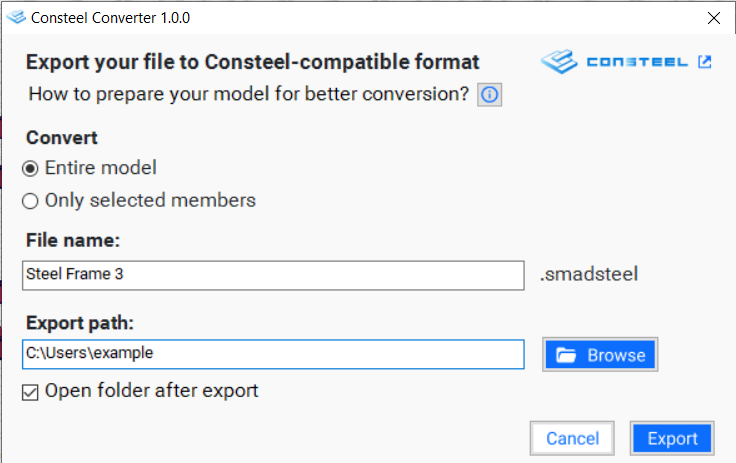

## 3.Új modell megnyitása és diagnosztika:

A konvertálási folyamat befejezése után a fájl megnyitható a Consteel-ben. A fájlt közvetlenül a Consteel indítása után is megnyithatod a „Modell Importálása”  opcióval. Ha a Consteel már nyitva van egy másik modellel, a fájlt a Fájl fülről is megnyithatod az „Import Center” opción keresztül, vagy használhatod a Ctrl+Shift+I gyorsbillentyűt a konvertált fájl megnyitásához.

További információkat az importálási folyamatról az [Import Center](../../manual/2_0_file-handling/2_8_import-center.md) fejezetben találhatsz.

## 4. Az import korlátozásai 

- **Anyagok**

- A program az **acél** és **beton anyagokat** a nevük alapján konvertálja, ha az algoritmus megtalálja a hozzájuk tartozó megfeleltetett elemet az adatbázisban.

  -  Ha az első megoldás nem lehetséges, a program megpróbál új anyagot létrehozni az összes új információval. Ebben az esetben az anyag neve tartalmazni fogja a '(AXISVM)' jelzést.

  -   Ha egyik fenti megoldás sem alkalmazható, a program az alapértelmezett helyettesítő anyagot, az S235 EN 100025-2-t helyettesíti. Ha a 'Placeholder (AXISVM)' szimbólum megjelenik, cseréld ki az anyagot a helyesre.

  -   Az importált anyagok ellenőrzéséhez lépj a **szelvénykezelőre** (Shift+A) vagy nyisd meg az Auto részletek Anyagok szekcióját. Itt megtalálod a modellhez tartozó összes anyag átfogó listáját.

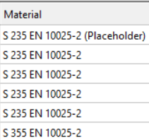

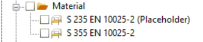

- **Szelvények**

  - A rúd szelvényeket elsősorban a nevük alapján konvertálja a program. Ha ez nem lehetséges, a konvertáló megpróbálja a szelvényt Consteel makróként létrehozni a rendelkezésre álló attribútumokkal. Ilyen esetekben a szelvény nevéhez hozzá lesz adva a '(AXISVM)' jelzés.

  - Ha egy szelvény nem található név alapján, vagy nem hozható létre makróként, a program helyettesíti egy helyettesítő szelvénnyel. Ezek a helyettesítő (dummy) szelvények könnyen felismerhetők a modellben, mivel irreálisan nagy kör alakú szelvények, és a nevükben ott szerepel a 'Placeholder (AXISVM)'. A felhasználóknak manuálisan kell kicserélniük ezeket a helyettesítő szelvényeket a helyesekre.

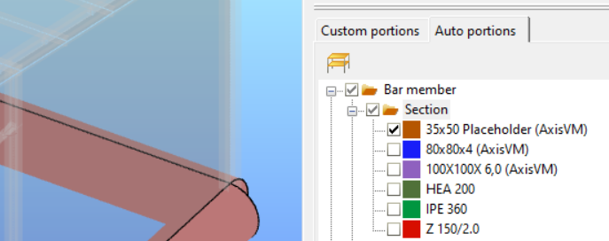

- **Rúd elemek**
  -  Az egyik legnagyobb különbség a Consteel és az AXISVM között, hogy a Consteel 7 szabadságfokkal dolgozik, míg az AXISVM főként csak 6-tal. Ezért, amikor Consteel-ba konvertálsz, a program kiválasztja a 7. szabadságfokot, amit mindenképp ellenőrizni kell.

  -  A rúdak esetében a legfontosabb tulajdonságok, amelyeket át lehet vinni a Consteel-ba, a folytonosság típusa, a végeselem típus, a forgatás, és a legtöbb szelvény esetében a külpontosság. Azonban érdemes a külpontosságot ellenőrizni aszimmetrikus vagy különleges formájú szelvények esetén.

* **Lemez elemek**
  - A lemez elemek a Consteel-ba az anyaguk, méretük és elhelyezkedésük alapján kerülnek átvitelre.
 

- **Támaszok**

  - Az AXISVM összes támasztípusa, beleértve a ponttámaszt, él menti támaszt és felületi támaszt, átválthatóak Consteel-ba.

  - Ne feledd, hogy a Consteel 7 szabadságfokkal (7DOF) működik, míg az AXISVM csak 6-ot használ. A program meghatározza a 7. értéket, így azt mindenképp ellenőrizni kell.

- **Teher átadó felület**

  - A teherátadó felületek problémamentesen átvihetőek az AXISVM-ből a Consteel-ba.

- **Terhek**

  - Különböző típusú pontterhek, vonalmenti terhek és felületi terhek átvitele lehetséges a tehereseteken belül, amennyiben azok tehercsoportokba vannak rendezve: Állandó, Esetleges és Rendkívüli.

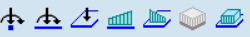

-  - Az önálló terhek nem kerülnek átvitelre.

 - - Az automatikusan generált terhelési esetek, mint például a Szél és a Hó, csak akkor exportálhatók, ha előzőleg szabályos terhelési esetekké lettek átalakítva.

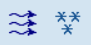

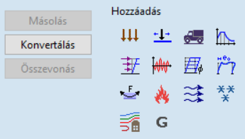

 - -  Néhány különleges teher jelenleg nem konvertálható, például: feszítőerő, hőterhelés, folyadékterhelés, földrengésből származó teher, támasz elmozdulás stb.

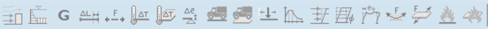

- **Teherkombinációk**

  - A manuálisan létrehozott teherkombinációk konvertálhatók.

