# AXISVM Konverter

## 1. AxisVM plugin letöltése, lépésről lépésre

Az importálási funkció használatához először telepíteni kell az AXISVM bővítményt. Ez letölthető a Consteel weboldaláról a „Letöltések” menüpontra kattintva. A bővítmények között a „Consteel 17”-et kell választani, majd letölteni a „Consteel Converter for AXISVM” bővítményt.

A Consteel 17-től és az AXISVM X7-től kezdődően a bővítmény kompatibilis. Régebbi Consteel verziók esetén lehetséges az AXISVM-ből konvertált .smadsteel fájlok megnyitása, de az importálási napló nem fog megjelenni. Régebbi AXISVM verziók esetén nem garantálható a megfelelő működés. Az AXISVM API változása befolyásolhatja az import minőségét.

A bővítmény .exe fájl letöltése után győződj meg róla, hogy ugyanabba a mappába telepíted, ahol az AXISVM programfájl található. Kattints a „Tovább” gombra.

A következő ablakban ellenőrizheted, hogy az telepítési hely beállításai a megfelelő mappára mutatnak-e. Ha minden rendben van, folytathatod a telepítést a „Telepítés” gombra kattintva, majd az ezt következő ablakban kattints a „Befejezés” gombra.

Amennyiben a telepítés sikeres volt, az AXISVM program megnyitása után a „Consteel Converter 1.0.0” opció a „Bővítmények” fül alatt található.

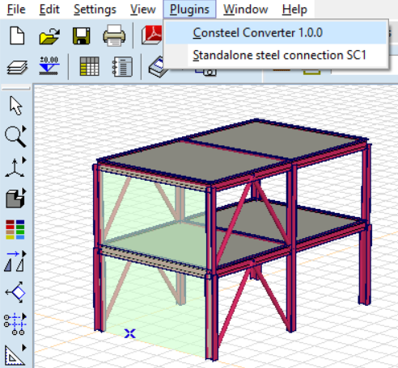

## 2. AXISVM modellek konvertálása Consteel-be:

A 'Consteel Converter 1.0.0' funkcióval exportálhatod az elkészített modellt .smadsteel fájlformátumba, amely kompatibilis a Consteel-lel. Lehetőség van az egész modell, vagy csak kiválasztott elemek konvertálására. Ha csak kiválasztott elemeket szeretnél konvertálni, azokat a Consteel konvertálási folyamat elindítása előtt kell kiválasztanod.

Ezután megadhatod a fájl nevét a mellette lévő mezőben, melyhez a '.smadsteel' fájlkiterjesztés tartozik. Ezen kívül beállíthatod a mentési helyet is, ha böngészel és kiválasztod a kívánt mappát.

A végső jelölőnégyzetben eldöntheted, hogy szeretnéd-e automatikusan megnyitni a mappát, amely a kiexportált fájlt tartalmazza. Végül az 'Export' gombra kattintva elindíthatod a folyamatot.

::: info
 Fontos megjegyezni, hogy egy modellt csak egyszer lehet exportálni, miután el lett mentve vagy meg lett nyitva. Ha újra szeretnéd exportálni, a modellt be kell zárni, majd újra meg kell nyitni.
:::

## 3.Új modell megnyitása és diagnosztizálása:

A konvertálási folyamat befejezése után a fájl megnyitható a Consteel-ben. A fájlt közvetlenül a Consteel indítása után is megnyithatod az „Megnyitás számítógépről”  opcióval. Ha a Consteel már nyitva van egy másik modellel, a fájlt a Fájl fülről is megnyithatod az „Megnyitás számítógépről” opción keresztül, vagy használhatod a Ctrl+O gyorsbillentyűt a konvertált fájl megnyitásához.

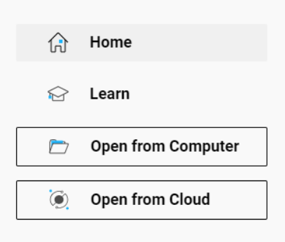

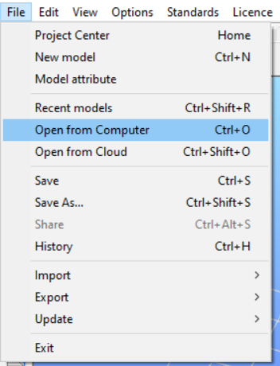

A Consteel fájlokat .csm kiterjesztéssel mentjük, ami a Consteel Model-t jelenti. Mivel AXISVM-ből konvertált fájlokkal dolgozunk, a .smadsteel formátumot kell választani. Keresd meg a konvertált fájlt, és válaszd ki.

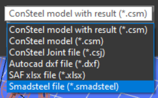

A .smadsteel fájl kiválasztása után megjelenik az „Új modell létrehozása” ablak. Bár már .smadsteel fájlként van elmentve, a Consteel az abban lévő információk felhasználásával egy új modellt generál .csm fájlformátumban. Az ablakon lehetőség van a modell nevének, leírásának módosítására, valamint a legfontosabb beállítások, mint a tervezési szabvány és a nevek nyelve megadására. Végül kattints az „OK” gombra.

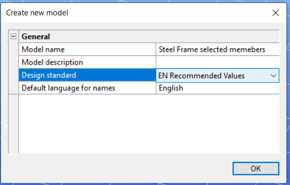

A Dokumentálás fülön az Importálási napló gomb csak akkor aktív, ha egy .smadsteel fájl importálva lett, de még nincs elmentve. Miután a fájl el lett mentve, a formátuma .csm-ra változik, és az Importálási napló gomb inaktívvá válik.

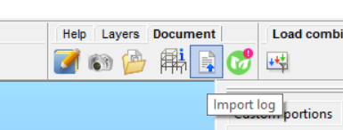

Az Importálás objektumai listában háromféle jelzés található, amelyek az importálás állapotát mutatják:

- **zöld**  sikeres importálást jelent, amelyben nem jelent meg probléma.
- **narancssárga** figyelmeztet a potenciálisan hiányzó attribútumokról.
- **piros**jelzi, hogy a program nem ismerte fel bizonyos elemeket, ezért azok kézi megadása szükséges.

Az importálási napló részletes információkat nyújt a szerkezeti, szelvényekkel, anyagokkal, terhekkel és geometriával kapcsolatos problémákról, amelyek az importálási folyamat során felmerültek. Segít a felhasználóknak az elemek azonosításában; az importálási naplóban való kiválasztásukkal azok a modellben is ki lesznek választva.

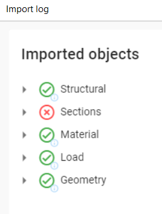

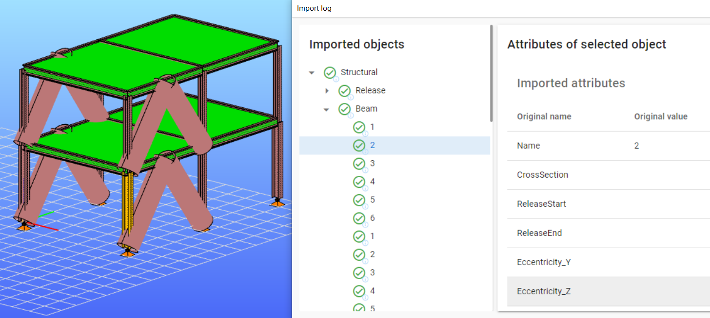

## 4. Limitations of the import

- **Materials**

- Steel and concrete materials are converted according to their name if the algorithm finds a matching one in the database.

  - If the first solution is not possible, the program attempts to create a material with all the new information. In this case, the material's name will include the '(AXISVM)' mark.

  - If none of the above solutions are applicable, it substitutes the default placeholder material S235 EN 100025-2. If the 'Placeholder (AXISVM)' symbol appears, users should replace the material with the correct one.

  - To verify imported materials, go to the section administration (Shift+A) or access the Auto Portions Material section. Here, you'll find a comprehensive list of all materials included in the model.

- **Sections**

  - Bar member sections are primarily converted based on their names. If this is not possible, the converter will attempt to create the section as a Consteel macro using the available attributes. In such cases, a '(AXISVM)’ marker will be added to the section name.

  - If a section cannot be found by name or created as a macro, the program will substitute it with a placeholder. These placeholder (dummy) sections are easily identifiable in the model as unrealistically large circular sections with 'Placeholder (AXISVM)' in their name. Users will need to manually replace these placeholder sections with the correct ones.

- **Bar members**

  - One of the most significant differences between Consteel and AXISVM is that in Consteel, is working with 7 degrees of freedom, whereas AXISVM, mostly works with only 6. Therefore, when converting to Consteel, the program selects the 7th degree of freedom, making it essential to verify before proceeding with further calculations.

  - For bar members, the most important properties that can be transferred to Consteel include the release type, the finite element type, rotation, and also the eccentricity for most sections. However, it is best to verify eccentricity in the case of nonsymmetrical or unusual shaped sections.

* **Plate element**

  - Plate elements are transferred to Consteel with respect to their materials, dimensions, and placements.

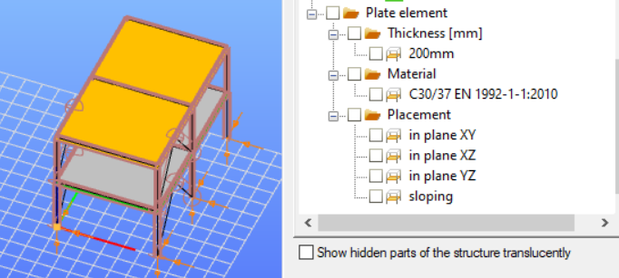

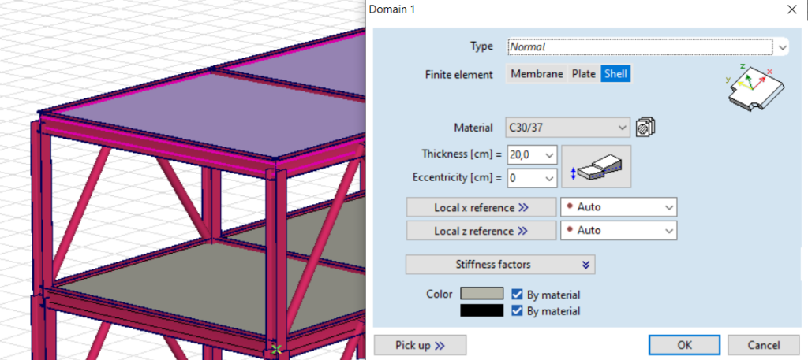

- **Supports**

  - All types of supports from AXISVM, including Point supports/Nodal support, Line supports, and Surface supports, can be converted to Consteel.
  - Do not forget that Consteel operates with 7 degrees of freedom (7DOF), whereas AXISVM only utilizes 6. The program will define the 7th value, so users need to verify it.

- **Loads transfer surface**

  - Load panels can be seamlessly transferred from AXISVM to Consteel.

- **Loads**

  - Conversion of various types of point loads, line loads, and surface loads is possible within load cases, provided they are organized into load groups: Permanent, Variable, and Accidental.

- Ungrouped loads will not be converted.

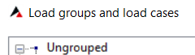

- Automatically generated load cases like Wind, and Snow can only be exported if they were previously converted into regular load cases:

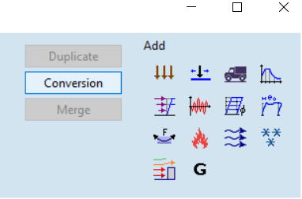

- Some specific loads currently cannot be converted, such as: tension/compression, thermal load, fluid loads, seismic loads, support displacement etc.

- **Load combinations**

  - manually created load combinations can be converted.