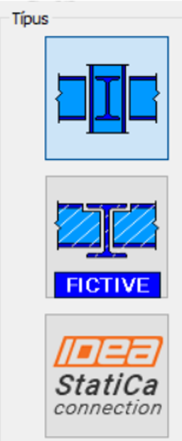
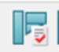
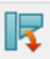
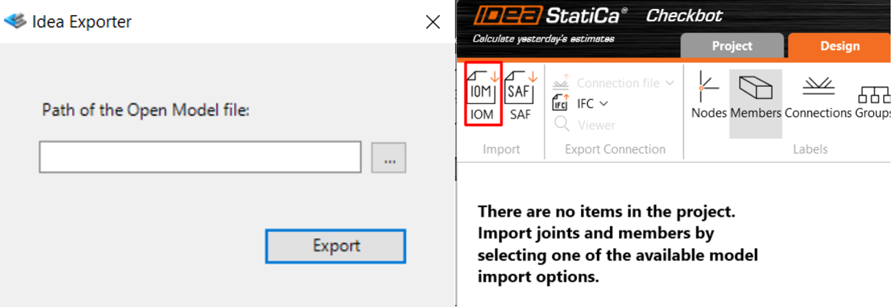
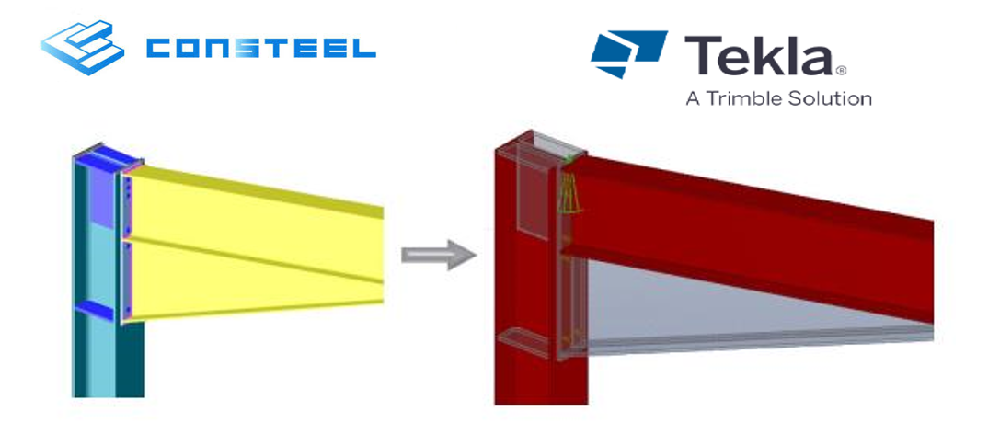

# Csomópontok exportálása

## Exportálható csomóponttípusok
A **Szerkezeti elemek** fülön csomópont létrehozásakor három különböző csomóponttípus közül lehet választani. Az első típus a [**Consteel Csomópont**](../14_0_joint-module/14_2_create-joint.md), amelyet a korábbi fejezetekben részletesen ismertettünk. A másik két típus lehetővé teszi a felhasználók számára, hogy vagy az összes csomópontra vonatkozó információt exportálják egy Excel-fájlba további feldolgozás céljából, vagy élő kapcsolatot hozzanak létre az **IDEA StatiCa Connection** szoftverrel.

 
### 1. Fiktív csomópont

Ez a funkció lehetővé teszi a csomópontokra ható belső erők exportálását .csv formátumba. Kihasználja az elhelyezett csomópontok előnyeit, vagyis egy **fiktív csomópont** több helyre is elhelyezhető a modellben, amennyiben azok geometriailag hasonlóak. Az összes elhelyezésből származó belső erők együttesen kerülnek összegyűjtésre és exportálásra, így biztosítva az átfogó adathalmazt.  

Az exportált .csv fájlok megnyithatók Excelben, így az adatok a felhasználó egyéni igényei szerint rendezhetők és felhasználhatók a csomópontok tervezéséhez. A .csv fájl mellett az exportálás során két kép is generálódik:
- Az egyik a csomópont geometriai kialakítását ábrázolja
- A másik a belső erők értelmezését és a lokális koordinátarendszert szemlélteti

 
### 2. IDEA StatiCa Connection
Az IDEA StatiCa Connection elérhető a Szerkezeti elemek fülön, a Csomópont felismerése menüpont alatt (a támogatott verziókról lásd alább).
 
 

Az **IDEA StatiCa Connection** típus kiválasztása és a Létrehozás gomb megnyomása után az **IDEA StatiCa Connection** automatikusan elindul, és két új mappa jön létre azon a helyen, ahol a Consteel modell található: **IDEA JOINT** és **IDEA IOM**.
Az új csomópont elérhető a saját mappájából (IDEA JOINT), vagy közvetlenül a Consteel modellből is, akárcsak bármely más csomópont, a **Szerkezeti elemek** fülön keresztül, a **Csomópont szerkesztő**  ablak megnyitásával, elhelyezhető a **Csomópont elhelyezése**  funkcióval, vagy közvetlenül a létrehozása után.

:::info Verziókompatibilitás

Az IDEA StatiCa-ban végrehajtott módosítások miatt a Consteel 19 verzióihoz az alábbi IDEA StatiCa verziók használata támogatott:
•	Consteel 19 Build 4446–4603 – IDEA StatiCa 22.1.6.0493–24.0.1.1233
•	Consteel 19 Build 4646-tól – IDEA StatiCa 25.1.3.1526 (a korábbi IDEA-verziók ezzel a builddel nem működnek)

A két verziótartomány egymással nem cserélhető fel. A 4603-as buildű Consteel nem használható az IDEA 25.1.3.1526 verziójával, és a 4646-os build sem működik a 22.1.6.0493–24.0.1.1233 közötti verziókkal.
Az aktuális Consteel-verzióhoz támogatott IDEA-verziók listája, valamint a tesztelt verziók és a kapcsolódó tudnivalók a Beállítások → Modell beállítások → IDEA StatiCa átmenet alatt tekinthetők meg. A Consteel–IDEA Connection átmenet kizárólag az IDEA StatiCa 25.1.3 vagy újabb verziójával használható. 

:::

## Teljes modell exportálása csomópontokkal
 
### 1. IDEA StatiCa Checkbot
Az egész modell, beleértve az analízis eredményeket, exportálható .xml formátumban, amelyet ezután az IDEA StatiCa Checkbot importálhat az IOM import funkció segítségével a csomópontok tervezéséhez.

A modell exportálása:

- A modellnek végső állapotában kell lennie.
- A fájl menüben található az Export lehetőség.
- Itt megtalálható az IDEA StatiCa Checkbot opció.
- Az IOM fájl mentéséhez ki kell jelölni a célmappát.

A modell importálása: 

- Az IDEA StatiCa elindítása után a Checkbot modult kell kiválasztani.
- Új projekt létrehozása.
- Az induló ablakban az IOM importálása lehetőség a bal oldalon jelenik meg.
- A korábban elmentett .iom fájl be lehet olvasni.
- Az importálást követően megkezdhető a csomópont tervezése.

A IDEA StatiCa Checkbot munkafolyamatának részletesebb információiért kérjük, látogasson el a [támogatási központjukba](https://www.ideastatica.com/support-center/checkbot-bulk-bim-workflows).

:::info
Ez egy egyirányú kapcsolat és csak az IDEA StatiCa 24.1 és 25.0 verziókkal kompatibilis. Továbbá, az exportálás csak akkor lehetséges, ha a modellben nincsenek SLS eredmények.
:::

Bizonyos korlátozások és esetleges problémák miatt ez a funkció béta verzióként került kiadásra.

### 2. Csomópont exportálása részlettervező szoftverbe
<!-- wp:paragraph -->

A modellben létrehozott csomópontok exportálhatók a _TEKLA Structures_ programba. Ennek módját részletesen lásd [_**Tekla Structures import és export**_](../2_0_file-handling/2_3_tekla-structures-model-import-export-and-update.md) fejezetben!

<!-- /wp:paragraph -->

<!-- wp:image {"align":"center","id":9836,"width":467,"height":212,"sizeSlug":"full","linkDestination":"media"} -->

<!-- /wp:image -->

<!-- wp:paragraph -->

<!-- /wp:paragraph -->
