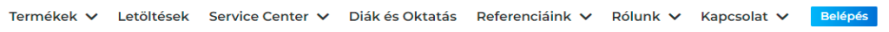
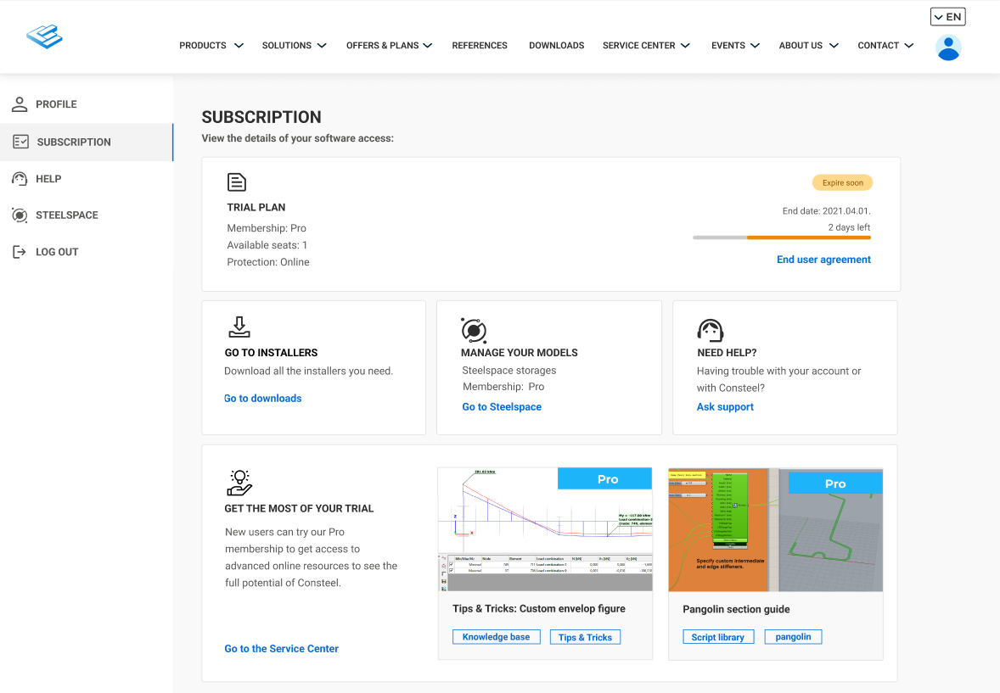
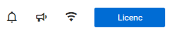
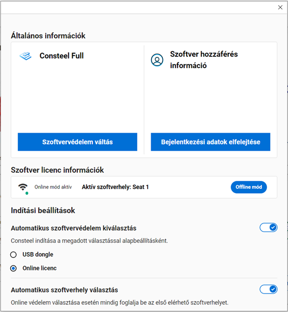
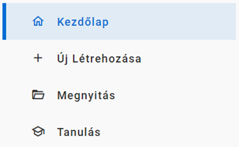
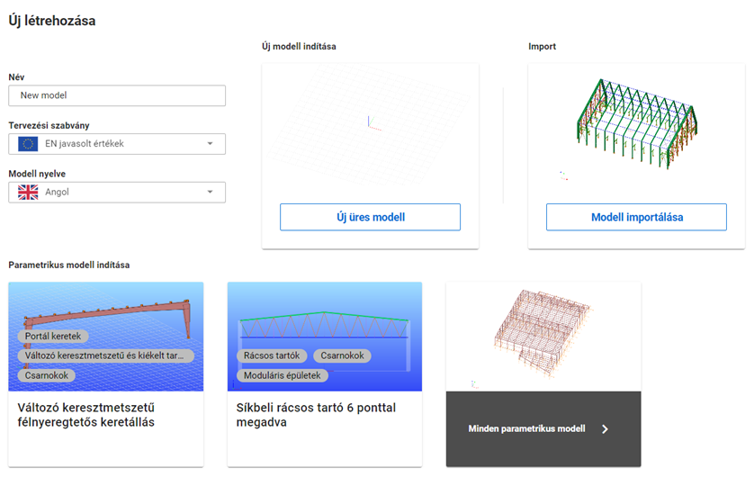
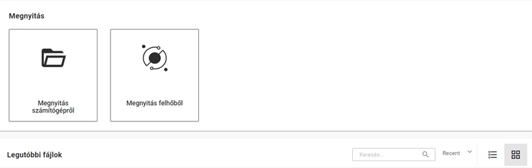
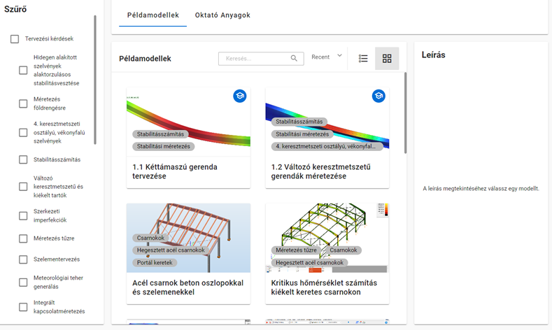
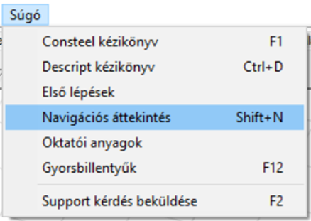

# A szoftver telepítése és futtatása

A szoftver használatához érvényes előfizetés szükséges – lehet próbaidős, oktatási célú vagy fizetős előfizetés része. A Consteel telepítéséhez, a telepítőfájlok eléréséhez, valamint az előfizetésedhez tartozó online szolgáltatások használatához Consteel-fiókra is szükség van. Consteel-fiókot a weboldalunkon tudsz regisztrálni. 

[Diákoknak, oktatóknak](https://consteelsoftware.com/hu/diak-es-oktatas/) és próbaverziót igénylőknek a hozzáférést online kell kérvényezniük. Az igénylések lépéseit [itt](https://consteelsoftware.com/hu/diak-es-oktatas/#how) olvashatod.

## **Fiók létrehozása**

Új felhasználói fiók létrehozásához a weboldal jobb felső sarkában található **Belépés** gombra, majd a megjelenő ablak alján a **Regisztrálj** feliratra kell kattintani.  
A **_Fiók létrehozása_** ablakban meg kell adni a felhasználó e-mail címét, nevét és egy választott jelszót. Fontos, hogy valós email címet adjunk meg, mert ezután egy automatikusan kiküldött email üzenetben meg kell erősíteni az e-mail címünket. Az ablak alján lehetőség van feliratkozni a Consteel szakmai hírlevelére, valamint el kell fogadni a felhasználási és adatvédelmi feltételeket, végül a **Regisztrálok** gombra kattintva lehet a regisztrációt folytatni. Ezután egy újabb ablak jelenik meg, mely arról tájékoztat, hogy a rendszer a regisztrációs visszaigazoló emailt elküldte a megadott email címre, és az abban található link segítségével kell a regisztrációt befejezni. Ha hosszabb idő eltelte után sem érkezik meg a visszaigazoló email, érdemes ellenőrizni a levélszemét és promóciós mappákat is levelező rendszerünkben. Ha ott sem található meg az email, akkor az előbbi tájékoztató ablakban kérhető a **megerősítő email újbóli kiküldése**. (Ha már bezártuk a regisztrációs ablakot, akkor újból a belépésre kattintva adjuk meg ismét az email címünket és választott jelszavunkat, hogy megjelenjen az üzenet újbóli kiküldése parancs.) A regisztráció megerősítése után már be lehet lépni a felhasználói fiókba.

## **A telepítő fájl letöltése**

A Consteel szoftver telepítő csomagja elérhető a Consteel honlap [_Letöltések_](https://Consteelsoftware.com/hu/letoltesek) (_Downloads_) menüpontjából   regisztrált felhasználók számára.

## **Követelmények**

**Hardver követelmények**

A Consteel program futtatásához az alábbi szoftver és hardver követelmények teljesítése szükséges. Ezek hiányában a program nem, vagy nem az elvárt gyorsasággal futtatható.

**Minimális konfiguráció:**

- **Processzor** Intel Core i5 (10-es generációs vagy újabb) vagy AMD Ryzen 5 (legalább 4 mag, 2.5–3.0 GHz)
- **Memória** 4 GB  
- **HDD** 300 MB  
- **Videó-kártya** 2 GB nem alaplapra integrált 
- **Operációs rendszer** 64-bit MS Windows 11

**Ajánlott konfiguráció:**

- **Processzor** Intel Core i7 / i9 (10-es generációs vagy újabb) vagy AMD Ryzen 7  
- **Memória** 32 GB  
- **Videó-kártya** 4 GB nem alaplapra integrált 
- **Operációs rendszer** 64-bit Windows 11

## **A Consteel telepítése**

A Consteel telepítéséhez indítsd el a letöltött telepítőfájlt, és kövesd a képernyőn megjelenő utasításokat. A program telepíthető kizárólag az akutális felhasználói fiókra (ajánlott), vagy minden felhasználó számára (ehhez rendszergazdai jogosultság szükséges). A következő lépésben el kell fogadni a licencszerződést. A telepítő ezután a program elemeit a megadott könyvtárba másolja (alapértelmezett könyvtár: C:\Users\<Felhasználónév>\AppData\Programs\Consteel xx, ahol az xx a verziószámot jelöli). Alapértelmezetten minden komponens ki van jelölve. 

A „Tovább” gombra kattintva kiválasztható, hogy a Start menüben hová kerüljön a program parancsikonja. Végül a telepítő létrehozza az asztali parancsikont, amennyiben ezt bejelölöd. Az utolsó lépés maga a telepítés. 

A telepítés befejezése után megjelenik a Consteel 18 Telepítő varázsló befejezése ablak, ahol lehetőség van azonnal elindítani a Consteel programot a Consteel indítása opció kiválasztásával. 

## **A program indítása**

A program első indításakor ki kell választani a szoftvervédelem típusát a felhasználói szerződésnek megfelelően. **Amennyiben rendelkezel hardverkulccsal, akkor válaszd az USB dongle opciót**! Csak akkor válaszd az Online licenszt, ha már átváltottál az új online védelemre, valamint a hardverkulcsot is visszaküldted a forgalmazónak.

Ezt a beállítást el lehet menteni alapértelmezett beállításként. **Ezt csak akkor tedd meg, ha biztos vagy a választásban!** (Ha véletlenül elmentetted az online licenszt alapértelmezettként, de nem rendelkezel vele, akkor jelenleg csak a Consteel újratelepítésével tudsz visszatérni a hardverkulcs használatára.)

USB dongle

Online védelem

**Indítás hardverkulcsos védelemmel**

A program indítása előtt a hardverkulcsot (USB dongle) be kell dugni a számítógép egy üres USB portjába, vagy hálózati kulcs esetén a kulcsnak elérhetőnek kell lennie a helyi hálózaton lévő valamelyik számítógépen. 

Ezen kívül fel kell telepíteni a hardverkulcs illesztő programot, melynek legfrissebb verziója szintén letölthető a honlapunk Letöltések menüjéből a Bővítmények/Consteel xx/USB dongle driver helyről (ahol xx a fő verziószámot jelöli) 

A megfelelő hardverkulcs felismerés után a Consteel elindul. A továbbiakat ld. a Projekt Központ fejezetben! 

Ha az indítás után a Consteel nem találja a számítógéphez (vagy a hálózaton keresztül) csatlakoztatott megfelelő hardverkulcsot, megjelenik az online licensz bejelentkezési ablaka, amely lehetővé teszi a program indítását a Consteel felhasználói fiókhoz rendelt online licenc használatával, amennyiben ez elérhető a felhasználó számára. 

**Hálózatos működés**

Hálózatos licensz vásárlása esetén a program használatához szükséges hardverkulcsot a belső hálózat bármelyik, szabad USB csatlakozóval rendelkező számítógépéhez lehet csatlakoztatni, amelyen előzetesen telepítésre került a hardverkulcs illesztő szoftver (driver). Ezután el kell végezni a megfelelő beállításokat, melyről kollégáin részletes felvilágosítást adnak hálózatos kulccsal rendelkező felhasználóink számára.  

**Indítás online védelemmel**

Online védelem választása esetén első alkalommal mindenképpen be kell jelentkezni a Consteel fiókba a honlapon regisztrált bejelentkezési adatokkal. A bejelentkezési adatokat el lehet menteni és bejelentkezve lehet maradni – az Emlékezz rám opció kiválasztásával, így a következő program indításkor már nem fogja kérni a bejelentkezést.  

Ezután megjelenik a Szoftverhely kiválasztása ablak, melyen a számodra elérhető hozzáférések (seat) kerülnek listázásra. Az egyik kiválasztása és a Kiválaszt gomb megnyomása után a szoftver elindul.  

Amennyiben csak egy szoftverhellyel vagy több ugyanolyan licenchez tartozóval rendelkezel, tehát nincs jelentősége, hogy melyik lehetőséget választod, érdemes használni az „Elsőként elérhető szoftverhely kiválasztása automatikusan” opciót.  

Ha a Consteel nem talált elérhető szoftver helyet, a megjelenő link segítségével megnyithatjuk a weboldalon a felhasználói fiókunkat, ahol ellenőrizhető a licensz állapota. Megkérhetjük a licensz birtokosát, hogy adjon hozzáférést a licenszhez, vagy saját hozzáférést kell rendelnünk. 

Arról, hogy hogyan tudod kezelni a hozzáféréseket/szoftverhelyeket itt olvashatsz: [A szoftver telepítése és futtatása | Consteel Documentation Center](https://docs.consteelsoftware.com/hu/docs/manual/1_0_general-description/1_1_installing-and-running-the-software/#felhaszn%C3%A1l%C3%B3-menedzsment) A licenceléssel kapcsolatban felmerülő kérdésekre pedig itt gyűjtöttük össze a válaszokat: [Licensing FAQ – Consteel](https://consteelsoftware.com/offers-licensing/licensing-faq/) 

[Fordulj hozzánk](https://consteelsoftware.com/hu/kapcsolat/), ha további segítségre van szükséged! 
 

**Consteel offline módban**

A választott szoftverhelyet offline használatra is ki lehet venni. Ehhez a kiválasztás sorában el kell helyezni a pipát a jelölőnégyzetben, majd a megjelenő óra ikonra kattintva az offline használat hosszát kell megadni. (Ezt később, a program futása során is meg lehet tenni a főmenü Licence menüpontja segítségével.) 

 ## **Előfizetési információk** 

A honlapon, az Előfizetés oldalon megtalálhatók a szoftverhasználatra vonatkozó információk és a Végfelhasználói licencszerződés is. Emellett néhány legfrissebb cikkünket is elérheted ezen a kezdőlapon.

<!--## **Előfizetési részletek**

Az előfizetési csomag adminisztrátorai a Részletek oldalon ellenőrizhetik a megvásárolt csomagok adatait, az elérhető tagságokat, valamint a számlázási információkat.

-->

## **Felhasználó menedzsment**

A felhasználói fiók Előfizetés menüpontjából elérhető Csomag és *felhasználó menedzsment* eszköz segítségével a licensz admin bármely szoftver hozzáférést (access) hozzárendelhet bármely, a licenszen belül elérhető szoftverhelyhez (seat). 

A **Felhasználó menedzsment**ben lehet a felhasználókat rendelni az egyes szoftverhozzáférésekhez. Minden szoftverhozzáférés egy adott [Consteel Felhasználó Közösségi](https://Consteelsoftware.com/hu/termekek/ajanlatok-csomagok/#ccm) tagsági szinthez kötődik. Az elérhető online szolgáltatások körét a tagsági szint határozza meg. 

A szabad szoftverhozzáférések felhasználóhoz való rendeléséhez a "Felhasználó hozzáadása" kártyát kell választani. A megjelenő mezőben meg kell adni a felhasználó Consteel honlapon már előzetesen regisztrált e-mail címét, majd a Hozzáadás gomb megnyomásával véglegesíteni azt.

 

Már hozzárendelt felhasználó kártyáján a 3 pont ikonra kattintva át lehet helyezni a felhasználót egy másik szoftver-hozzáférésbe vagy el is lehet őt távolítani az adott hozzáférésből. Egy felhasználót egyidőben csak egy hozzáféréshez lehet hozzárendelni. Ahhoz, hogy a felhasználó használni tudja a szoftvert, a szoftverhozzáférést kapott felhasználókat még hozzá kell rendelni egy vagy több szoftverhelyhez (Seat) is. A hozzárendelés új felhasználó hozzáféréshez rendelése esetén automatikusan megtörténik, azonban manuálisan is meg lehet tenni:  Az elérhető szoftverhelyek (seat) listáján valamely hely kártyájára kattintva megjelennek az adott helyhez rendelt szoftverhozzáférések. Új felhasználót a legördülő menüből lehet kiválasztani, majd a "Hozzáférés adása" gombra kattintva rendelhető hozzá az adott szoftverhelyhez.  

Felhasználókat eltávolítani a sor végén található "x" gombbal lehet. Egy felhasználót egyszerre több szoftver-helyhez is hozzá lehet rendelni.

                                              
 *Előfizetés és felhasználó menedzsment*                    

## **Projekt Center**

<!-- /wp:paragraph -->

<!-- wp:paragraph -->

A Projekt Center egyesíti magában a modell- és a felhasználói fiókkezelés összes funkcióját.

<!-- wp:paragraph {"fontSize":"medium"} -->

A jobb felső sarokban az alábbiakhoz férhetsz hozzá:
- **Hírek**: Itt jelennek meg a felhasználók számára releváns és érdekes hírek.
- **Értesítések**: Itt jelennek meg az általános közérdekű közlemények, például emlékeztetők vagy értesítések ideiglenes frissítésekről, esetleg egy linkkel együtt.
- **Védelem típusa**: Jelzi, hogy a védelem online vagy USB dongle védelem.
- **Általános információk ablak**: Lehetővé teszi a licencinformációk elérését és az online védelem offline módra történő váltását.

A bal felső sarokban választhatsz a számítógépről vagy a felhőből történő megnyitás között. 

A bal oldalon, a középső részen navigálhatsz a Kezdőlap, + Új létrehozása, Megnyitás és Tanulás fülek között.

#### **Kezdőlap fül** 
Ez a képernyő jelenik meg a Consteel megnyitásakor. Különbség van a kereskedelmi és a trial verzió felhasználói között. A **trial** verzióban, mivel még nem tartalmaz korábban elmentett modelleket, **példamodellek** jelennek meg a felső részen, hogy segítsenek megismerkedni a szoftverrel.

A **kereskedelmi** felhasználók esetén az ő **legutóbbi modelljeik** jelennek meg ugyanitt. Az alsó rész minden felhasználó számára ugyanaz, ahol az összes lehetőség elérhető **új modellek létrehozásához**.

#### **Új Létrehozása fül** 

Új modelleket hozhatsz létre a név megadásával, a tervezési szabvány kiválasztásával és a modell nyelvének megadásával. Az alábbi lehetőségek közül választhatsz:

- **Új üres modell indítása**: Olyan új modellt hozhatsz létre, amely nem tartalmaz előre definiált szerkezeti elemeket.
- **Import**: Az új modell megnyitásával automatikusan megnyílik az Import Center, amely lehetővé teszi a modellek importálását különböző fájlformátumokból.
- **Parametrikus modell indítása**: A projekt megnyitásával a parametrikus modell könyvtárból kiválaszthatsz egy modellt, a modellek szűrhetőek.

#### **Megnyitás fül**

Választhatsz a Számítógépről való megnyitás, Felhőből való megnyitás és Legutóbbi fájlok lehetőségek közül.

**Felhőtárhely**

A főmenü harmadik pontjával (_"Open from Cloud"_) megnyíló nézetben a felhőtárhelyen tárolt modelljeinket, valamint a más által velünk megosztott modelleket érhetjük el.

Az ablak bal felső sarkában választhatsz a következő mappák közül: *Saját modellek, Megosztva velem* és *Nyilvános modellek*. Bármelyikre kattintva megnyílik a megfelelő mappa. **(1)** .

A jobb felső menüben **(2)** található parancsokkal balról jobbra haladva *új mappát hozhatunk létre, áthelyezhetjük, megoszthatjuk* vagy *törölhetjük a modellt*. Kereshetünk a tárhelyen, rendezhetjük a listát különböző tulajdonságok szerint, válthatunk a lista vagy a kártya nézet között, végül be-, vagy kikapcsolhatjuk a modell és mappa információs panelt.

A kiválasztott modell vagy mappa részletes tulajdonságai ablak a modell vagy mappa kiválasztása után és a *Modell információ* gombra kattintva jelenik meg. Ebben az ablakban megtekinthetők a mappa létrehozásának dátuma, a felette lévő mappa és a méret. **(3)** 

Ha egy modellt választasz, a következő információk jelennek meg: a modell neve, a használt tároló, a hely, a tulajdonos, a létrehozás dátuma, az utolsó módosítás dátuma és a modell leírása. A Történet fülön a jelenlegi modell összes korábbi verziója között navigálhatsz. Mappák esetén a Történet fül nem aktív.

A modellek megnyitása és megosztása a havi adatforgalmi korlát elérésig lehetséges, ennek alakulását a bal alsó sarokban **(4)** követhetjük nyomon. A felhasználható havi adatmennyiséget a tagsági szint határozza meg, mely minden hónap elején megújul.

A felhőtárhelyet a Steelspace platform biztosítja
A felhőtárhelyről megnyitott modellek minden esetben letöltésre kerülnek az alábbi mappába: C:\Users\{username}\AppData\Local\Consteel\CloudModels, és a munka során folyamatosan szinkronizált kapcsolatban maradnak a felhőben tárolt változattal.

#### **Tanulás fül**

Ebben az ablakban szűrhetsz a **Példamodellek** és **Oktató Anyagok** között a szükségeidnek megfelelően. Több tutorial már elérhető, amelyek lépésről lépésre bemutatják a specifikus modellezési vagy tervezési fázisokat, kiemelve a fontosabb funkciókat. A tutorial könyvtárunk hamarosan bővülni fog.

A bal oldalon a következő szűrőket alkalmazhatod: _Tervezési kérdések, Szerkezettípusok_ és _Építménytípusok_.

Több kategóriát egyszerre is választhatsz. Ha egy példamodellt kiválasztasz, a jobb oldalon megjelenik a modell leírása, amely minden releváns információt tartalmaz róla. A leírás alatt található a **Megnyitás gomb**; ha rákattintasz, megnyílik egy Consteel projekt, amely tartalmazza a választott modellt.

Ha Oktató Anyagot választasz, a cikk leírása jelenik meg a jobb oldalon. A leírás alatt található a **Tudj meg többet** gomb, amely a tudásbázis platformunkra irányít, ahol a teljes cikket elolvashatod a tagságod típusának megfelelően.

#### **Első Lépések és Súgó**
A **Projektközpont** bal alsó sarkában megtalálhatod az **Első lépések** és a **Súgó** gombokat.

Ha az **Első lépések** gombra kattintasz, a YouTube csatornánkhoz irányítunk, ahol új funkciókról és a szoftver használatáról szóló videókat találsz.

A **Súgó** gomb megnyomásával elérheted a [Consteel Súgóközpontot](https://consteel.atlassian.net/servicedesk/customer/user/login?destination=portals), ahol a Consteel és Steelspace támogatása érhető el. A [Consteel Support Center vagy a Steelspace támogatás](https://consteelsoftware.com/hu/servicecenter/consteel-support-services-and-help-center/) használatához külön regisztráció szükséges.

#### **Navigációs áttekintés**

A modell megnyitása után az első felugró ablak a Navigációs áttekintés. Ez az ablak segít az új felhasználóknak abban, hogy megismerkedjenek a Consteel által biztosított funkciókkal:
- 	**Navigáció**: navigációs preferenciáidat testre is szabhatod – például a mozgatást, forgatást és nagyítást – több népszerű szoftverplatform beállításai közül választva
- 	**Kijelölés**: a leggyakrabban használt kijelölési típusok bemutatása
- 	**Modell nézetek**: Elrejtés, Részlet modell nézet és Teljes modell nézet
- 	**Háttér**: Alapértelmezett, Világos, Sötét
- 	**Segítség**: Támogatás, gyorsbillentyűk és oktató anyagok

 

Tapasztaltabb felhasználók számára ez az ablak véglegesen bezárható a „Ne mutassa ezt az üzenetet többször” jelölőnégyzet megnyomásával. Az ablak bármikor megnyitható a Súgó menüből. `Shift + N`

