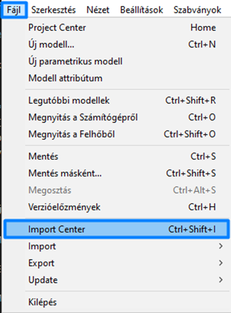

# Import Center 

A Consteel 18-tól kezdődően az importálási funkciók átkerültek az új **Import Center**-be, amely javítja a különböző forrásokból származó modellek közötti koordinációt, és egységesíti a modellimportálási munkafolyamatot.

## Az Import Center megnyitása

A folyamat elindításához nyisd meg a **Fájl** menüt, és válaszd az **Import Központ** opciót, vagy nyomd meg a `Ctrl+Shift+I` gyorsbillentyűt az ablak megnyitásához.

---

## Modell importálásának lépései

### 1. Fájl kiválasztása konvertáláshoz
- A **Mappa kiválasztása** mezőben kattints a **Keresés** gombra, és válaszd ki a mappát, amely importálható fájlokat tartalmaz (`.ifc`, `.xlsx`, `.smadsteel`).

:::note
A fájlok nem lesznek láthatóak a mappában, miközben keresel. A böngésző csak mappákat keres, és nem jeleníti meg a más fájlformátumokat.
:::

---

### 2. Fájlok megjelenítése
A mappa kiválasztása után az összes konvertálható fájl megjelenik a fő ablakban:

- A fájlokat ábécé sorrendbe (**A-Z**) vagy legutóbbi használat szerint rendezheted. A nézetet **rács** vagy **lista** formátumra is válthatod.
- A **szem ikon** jelzi, hogy a modell előnézete megtekinthető-e. A modellre kattintva az **Előnézet megjelenítése** gomb aktiválódik. Jelenleg csak `.ifc` és `.smadsteel` fájlok tekinthetők meg előnézetben.
- Az Import Center felismeri a fájlok forrását, amit ikonok jeleznek rács nézetben, illetve a táblázatban lista nézetben.
- Miután kiválasztottad a fájlt, amelyből a modellt importálni szeretnéd, nyomd meg a **Tovább** gombot.

---

### 3. Konverziós folyamat
A konverzió ezen a lépésen történik, ahogyan azt a felső sáv is mutatja. Kérlek, vedd figyelembe, hogy a folyamat néhány másodpercet is igénybe vehet, különösen bonyolultabb modellek esetén.

:::note
A konverziós módszer minden formátumot `.smadsteel` formátumra konvertál egy több lépésből álló megközelítéssel:
-  Egy felhasználó által módosítható táblázatos konverziós fájl segítségével a keresztmetszeteket név alapján egyezteti.
-  Ha nem talál egyezést, a keresztmetszet a Consteel profil adatbázisában kerül keresésre.
-  Ha így sem található egyezés, akkor a keresztmetszet a forrásmodell paraméteres szelvény makrója alapján jön létre.
:::

---

### 4. Konverzió és importálás ellenőrzése
- Az **Előnézet megjelenítése** opció aktiválásával a konvertált modell megtekinthető a Consteel munkaterületen.
- Az importált modell pozíciója a **Módosítás** gombra kattintva, az új origó definiálásával állítható be. Ez megtehető úgy, hogy a Consteel grafikus felületére kattintasz, vagy manuálisan beállítod a koordinátákat. A befejezéshez kattints a **Beállítás** gombra.

#### Modell importálása
- Az origó beállítása után a modell importálása az **Importálás** gombra kattintva történik.

---

### 5. Dokumentáció fül
A **Dokumentáció** fül alatt egy részletes napló ad összefoglalót a konverziós folyamatról.

:::note
Ez a funkció még nem érhető el, de hamarosan bevezetésre kerül.
:::
