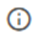

# Modelljavító eljárások

A geometriai javító eljárások geometriai jellegű modellhibák automatikus javítására szolgálnak. Több különböző eljárás áll rendelkezésre a különböző jellegű hiba típusokra.

A geometriai javító eljárások a Geometria fülön található gombon keresztül érhetőek el:

A gomb megnyomása után egy dialógon keresztül érhetjük el javító eljárásokat.

Az eljárások egyenként futtathatóak. Minden eljárás a teljes modellt vizsgálja, és a kritériumoknak megfelelő összes hibát javítja.

Minden javító eljárás modelltérbeli pontok szintjén keresi a hibákat, és pontok áthelyezésével – más szóval: a pont koordinátáinak felülírásával - javítja azokat. Az adott eljárás lefuttatása után a program egy külön ablakban visszajelzést ad arról, hogy hány pont geometriai helyzete módosult a javítás során. A pontok áthelyezésével minden egyes olyan modelltérbeli elem helyzete, amely az adott pontra referál, a pontot követve szintén megváltozik.

A javító eljárások által figyelembe vett pontok tehát: minden egyes modelltérben elhelyezett pont. Ez magába foglal minden geometriai, szerkezeti és teherrel kapcsolatos objektum pontjait. Ilyen objektumok a vonalak, poligonok, oszlopok, gerendák, lemezek, diafragmák, támaszok, linkek, teherátadó felületek, pont terhek, vonalmenti terhek, részleges felületen ható felületi terhek, pont tömegek stb.

### Dialóg elemek:

- **Tolerancia** - Minden eljáráshoz tartozik egy módosítható tolerancia érték. A tolerancia az a modelltérbeli pontok közötti távolság, amin belül a geometriai javító eljárások működésbe lépnek.
- **Súgó**  - Az egyes súgó ikonok az adott eljáráshoz vagy dialóg elemhez tartozó bővebb információval szolgálnak, ha az egér kurzorral fölé állunk; illetve az online kézikönyv releváns fejezetét nyitják meg egy böngészőben, ha rákattintunk.
- **Futtatás**  - Az adott eljárás az eljáráshoz tartozó sor jobboldalán található gombbal indítható el.

### Eljárások:

#### Tolerancián belül eső pontok egy helyre igazítása

Bemozgatja az egymáshoz képest tolerancia távolságon belüli pontokat egy közös helyre. Ez a közös hely a két pont közül valamelyiknek a koordinátái lesznek. Ha a két pont közül valamelyik közelében (0,01 mm távolságon belül) egyéb más pontok is találhatóak, akkor a közös hely annak a pontnak a koordinátái lesznek, amelynek a közelében a legtöbb egyéb más pont található. Egyedülálló pontok esetén a közös hely kiválasztása a két pont között véletlenszerű.

#### Oszlopok függőlegességének javítása

Közel függőleges szerkezeti elemeket tökéletesen függőlegessé teszi. Akkor tekintünk közel függőlegesnek egy szerkezeti elemet, ha az elem kezdő- és végpont x és y koordinátáinak az eltérése kisebb, mint a megadott tolerancia.

#### Közeli pontok rámozgatása oszlopok végpontjaira

Oszlop végpontok körül tolerancia sugarú gömb térfogaton belül lévő pontok rámozgatása az oszlop végpontjaira. Minden függőleges állású szerkezeti elemet oszlopnak tekintünk.

#### Közeli pontok rámozgatása oszlopok referencia vonalaira

Henger térfogaton belül eső pontok rámozgatása oszlopok referencia vonalaira. A henger térfogat az adott oszlop referencia vonala körüli tolerancia sugarú henger, két síkkal levágva a végpontoktól az oszlop középpontja irányában tolerancia távolságban. Azok a vonal elemek, amelyeknek egy végpontja ebbe a térfogatba esik, le lesznek vágva vagy meg lesznek hosszabbítva úgy, hogy elmetsszék az oszlop referencia vonalát. Kitérő egyenesek esetén a vonal elem meghosszabbított egyenesén lévő legközelebbi pontot merőlegesen rávetítjük az oszlop referencia vonalára. Minden függőleges állású szerkezeti elemet oszlopnak tekintünk.

#### Közeli pontok rámozgatása gerendák referencia vonalaira

Henger térfogaton belül eső pontok rámozgatása gerendák referencia vonalaira. A henger térfogat az adott gerenda referencia vonala körüli tolerancia sugarú henger, két síkkal levágva a végpontoktól a gerenda középpontja irányában tolerancia távolságban. Azok a vonal elemek, amelyeknek egy végpontja ebbe a térfogatba esik, le lesznek vágva vagy meg lesznek hosszabbítva úgy, hogy elmetsszék a gerenda referencia vonalát. Kitérő egyenesek esetén a vonal elem meghosszabbított egyenesén lévő legközelebbi pontot merőlegesen rávetítjük a gerenda referencia vonalára. Minden nem függőleges állású szerkezeti elemet gerendának tekintünk.

#### Pontok bemozgatása globális XY, XZ, és YZ síkokkal párhuzamos síkokba

Bemozgatja a majdnem egy síkban levő pontokat tökéletesen egy síkba.

Minden modelltérbeli pontot megvizsgál, hogy azonos síkban vannak-e vagy sem. Csak olyan síkokat vizsgálunk, amelyek párhuzamosak a globális XY, XZ és YZ síkok valamelyikével. Egy pontot akkor tekintünk azonos síkban levőnek, ha az adott síkra merőleges irányban tolerancia távolságon belül van az első pont által meghatározott síktól. Egy sík ebben az eljárásban a normál irányával és az ebben az irányban értelmezett maximális és minimális koordinátáival van definiálva, amiket a síkban lévő maximális és minimális koordinátájú pontok adnak meg. Egy újabb pont hozzáadása a síkhoz akkor történik meg, ha az új pont tolerancia távolságon belül van a sík maximális és minimális koordinátájától síkra merőleges értelemben. Ebből kifolyólag, a sík minden egyes hozzáadott ponttal „vastagodhat”, és így tetszőleges számú hozzáadott pont esetén tetszőlegesen „vastaggá” válhat.

:::warning

Ebből következik, hogy olyan modellek esetén érdemes használni ezt az eljárást, ahol ismerten a fősíkokkal párhuzamos síkban kell lennie a szerkezet pontjainak. Enyhén ferde síkokkal rendelkező modellek esetén az eljárás nem javasolt.

:::

A sík végső pozíciója a síkban benne lévőnek tekintett összes pont maximális és minimális koordináta értékeinek egész milliméterre kerekített átlaga. Minden pont, ami a síkba esik ebbe a végső koordinátába lesz bemozgatva síkra merőleges vetítés segítségével.

#### Közeli pontok rámozgatása teherbíró felületekre

Teherbíró felületektől tolerancia távolságon belüli pontok rámozgatása a felület síkjára. A felület lehet teherátadó felület vagy szerkezeti lemez. (A rámozgatott pont „z” koordinátája a sík lokális rendszerében 0 lesz.)
