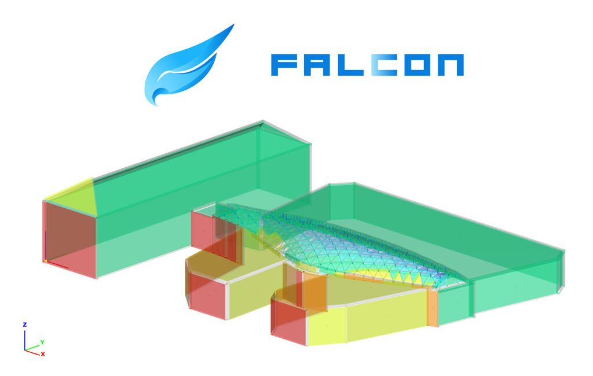

# A Consteel 19 újdonságai

Idei fejlesztéseinkkel ismét a tartószerkezet tervezési folyamat több kulcsfontosságú elemét érintettük — **a szélteher-generáláson** és **modelljavító folyamatokon** át egészen a **tűz-** és **kapcsolattervezésig**, valamint a **speciális, változó keresztmetszetű szerkezetek** modellezéséig. Ezen új funkciók egy része már a tavalyi évben bemutatkozott, míg mások most, a Consteel 19-ben jelennek meg először.

## [FALCON](../plugins/FALCON/1_introduction/index.md)

A **FALCON egy univerzális, CFD** (computational fluid dynamics) -alapú szélteher-generáló plugin, amely lehetővé teszi a tartószerkezeti mérnökök számára, hogy bármilyen épületkonfigurációra **realisztikus szélterheket** határozzanak meg, miközben megfelelnek a vonatkozó tervezési szabványoknak.

Kezdettől fogva az volt a fő célunk, hogy átlátható és intuitív eszközt biztosítsunk a mérnökök mindennapi gyakorlati munkájához.
Éppen ezért a hangsúly nem magán a szimulációs folyamaton van — amely egy belső motor a szélterhek előállításához —, hanem **a szimulációs eredmények utófeldolgozásán**.

Ez a megközelítés lehetővé teszi a mérnökök számára a megszokott **szélzónák és teherobjektumok automatikus létrehozását**, így a komplex CFD-adatok egyértelmű, azonnal felhasználható tervezési információkká alakulnak.

**Ami egyedivé teszi a FALCON-t:**

- Zökkenőmentes integráció a Consteellel a terhek közvetlen alkalmazásához
- Különböző nemzeti mellékletekkel és szélszabványokkal kompatibilis
- Realisztikus szélteher-generálás CFD segítségével
- Felületi nyomások automatikus leképezése és zónázása a szabványokkal összehasonlítható, pontos terhek meghatározásához

:::info
A FALCON egy Consteelbe implementált funkció, és plugin formájában vásárolható meg.
 :::

[Tudj meg többet](https://consteelsoftware.com/products/falcon/) és nézd meg a [bemutatkozó videót](https://www.youtube.com/watch?v=eh-Fu_XEEvs)!

## ÚJ LEHETŐSÉGEK KAPCSOLATTERVEZÉSHEZ

A Consteelben már meglévő kapcsolattervezési lehetőségek — **Consteel Joint** és a közvetlen **IDEA StatiCa Connection kapcsolat** — most két új funkcióval bővültek:

- **[IDEA StatiCa Checkbot export](../manual/14_0_joint-module/14_6_joint-export.md#1-idea-statica-checkbot)**, amely külpontos kapcsolatok tervezését is lehetővé teszi
- **[Fictive Joint](../manual/14_0_joint-module/14_6_joint-export.md#1-fiktív-csomópont)** – a csomóponti terhek táblázatos exportja bármely külső kapcsolattervezési folyamat számára

Ezek a fejlesztések együtt rugalmasabbá és átláthatóbbá teszik a teljes munkafolyamatot, csökkentik a manuális lépések számát, és biztosítják a kapcsolattervezés következetes és megbízható minőségét az egész projekt során.

Tudj meg többet arról, hogy mik a különbségek az [IDEA StatiCa Connection kapcsolat és a Checkbot export között a Consteelben](https://consteelsoftware.com/hu/knowledgebase/idea-statica-connection-vs-idea-statica-checkbot/), valamint a [Consteel Joint és a Fictive Joint között](https://consteelsoftware.com/hu/knowledgebase/consteel-joint-vs-fictive-joint/).

## ÚJ [DESCRIPT](../descript/15_1_introduction/index.md) PARANCSOK

Folyamatos fejlesztési törekvéseink eredményeként ismét több újdonságot vezettünk be a beépített szkript környezetünkben, a **Descript**ben, amely egyre fontosabb szerepet tölt be a mindennapi mérnöki munkafolyamatokban.

Az idei új funkciók között megtalálhatók:

- dupla hidegen alakított szelvények ([LOAD_SECTION_MACRO](https://docs.consteelsoftware.com/docs/descript/command-reference/load_section_macro/#double-mirrored-c))
- nyírási mező ([CREATE](../descript/command-reference/create/create.md#shear-field), [GET](../descript/command-reference/get/get.md#shear-field), [SET](../descript/command-reference/set/set.md#shear-field))
- keretsarok ([GET](../descript/command-reference/get/get.md#frame-corner-wizard), [SET](../descript/command-reference/set/set.md#frame-corner-wizard))
- kezdeti ferdeség ([CREATE](../descript/command-reference/create/create.md#sway-denominator-sway-denominator-is), [GET](../descript/command-reference/get/get.md#initial-sway), [SET](../descript/command-reference/set/set.md#initial-sway))
- vasbeton oszlop szelvények ([LOAD_SECTION_MACRO](../descript/command-reference/load_section_macro/load_section_macro.md))
- okos kapcsolati elem ([CREATE](../descript/command-reference/create/create.md#smart-link), [GET](../descript/command-reference/get/get.md#smart-link), [SET](../descript/command-reference/set/set.md#smart-link))

Mindegyik azzal a céllal készült, hogy **felgyorsítsa** a mindennapi munkát, és nagyobb hatékonysággal és rugalmassággal támogassa a szerkezettervezési feladataidat.

## FEJESZTÉSEK TŰZTERVEZÉSHEZ

A cinkbevonat javíthatja az acél elemek tűzállóságát azáltal, hogy lassítja a hőmérséklet emelkedését tűzterhelés esetén. Ilyen módon akár 30 perces tűzállóság is elérhető tűzgátló festék vagy egyéb tűzvédelem nélkül. A **tűzihorganyzás**nak ezt a **hatását** a Consteelben már figyelembe lehet venni a felületi emisszivitási tényező módosításával.

**Tűzgátló festékek** alkalmazása esetén mostantól **valós termékadatok** rendelhetők közvetlenül az elemekhez. A Consteel nemcsak a kritikus hőmérsékletet határozza meg, hanem a **szükséges festékréteg vastagság**ot is a kívánt tűzállóság eléréséhez — értékes eszköz, amely segít a tervezőknek előre ellenőrizni, hogy a választott tűzvédelmi stratégia hatékony és megfelelő lesz-e.

 *Fejlesztések tűztervezéshez*

## TEHERÁTADÓ FELÜLETEKHEZ VALÓ HOZZÁRENDELÉS KITERJESZTÉSE

Korábban a rúdelemeket csak akkor lehetett hozzárendelni a teherátadó felületekhez, ha pontosan ugyanabban a síkban helyezkedtek el.
Most ez a korlátozás megszűnt — a rúdelemek akkor is bevonhatók a tehereloszlásba, ha kissé eltérnek a felület síkjától, a felhasználó által megadott tűréshatáron belül.

Ez az újfajta rugalmasság sokkal intuitívabbá teszi a terhek modellezését, különösen az összetett szerkezetek esetében.

 *Teherátadó felületekhez rendelhető rudak kiterjesztése síkból kilépő elemekre*

## KÜLPONTOS ELEMEK

A **rúd elemek** mostantól meghatározott **excentricitás**okkal helyezhetők el — hasonlóan ahhoz, ahogyan ez eddig is működött a terhek, támaszok és egyéb objektumok esetében.
Az elérhető excentricitási lehetőségek köre bővült, és már tartalmazza a hegesztett szelvényekre jellemző pozíciókat is, mint például a **gerinc felső és alsó éle** vagy a **gerinc közepe**.
Ez a fejlesztés jelentősen megkönnyíti a rugalmas referenciarendszerekkel történő pontos szerkezeti modellezést.

 *Külpontos rúdelem*

## TÖBB LEMEZBŐL ÁLLÓ HEGESZTETT VÁLTOZÓ KERESZTMETSZETŰ ELEMEK

Az acélcsarnokokban gyakran alkalmazott hegesztett tartóknál a lemezvastagság sokszor az igénybevételekhez igazodva változik a hossz mentén, hogy az anyagfelhasználás optimális legyen. Korábban minden vastagságváltozáshoz külön keresztmetszet definiálására volt szükség.

Az új, **változó keresztmetszetű hegesztett rúdelem** ezt a szükségletet megszünteti — lehetővé teszi, hogy a felső és alsó övlemezekhez, valamint a gerinclemezhez **különböző vastagságú lemezek listáit** adjuk meg a rúd teljes hosszára. Ezek a listák szabadon szerkeszthetők, és a Consteel automatikusan létrehozza a hozzájuk tartozó végeselem-modellt, így jelentősen egyszerűsítve és felgyorsítva a modellezési folyamatot.

 *Hegesztett, változó keresztmetszetű rúdelem*

## MODELLJAVÍTÓ ELJÁRÁSOK

A szerkezeti modellekben gyakran fordulnak elő kisebb geometriai hibák modellezési pontatlanságok vagy más tervezőszoftverekből történő hibás importálás miatt. Ezek a hibák aztán problémákat okozhatnak a végeselem-háló generálásakor, vagy váratlan szerkezeti viselkedéshez vezethetnek.

A Consteel új **Geometriai javító eljárásaival** az ilyen problémák könnyen és gyorsan orvosolhatók. Az eszközök képesek például a rúdelemek végeit egy meghatározott tűrésen belül automatikusan a szomszédos elemhez igazítani, a majdnem függőleges oszlopokat tökéletesen függőlegessé tenni, és számos egyéb javítást elvégezni.

## BEMUTATÓ VIDEÓ

Nézd meg az új verzió fejlesztéseiről szóló összefoglaló videot a  [YouTube](https://www.youtube.com/watch?v=NRTB3qVxZLA&t=4s)on. 