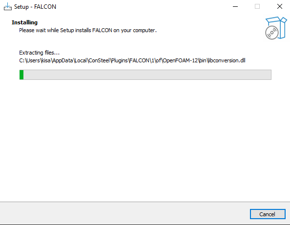
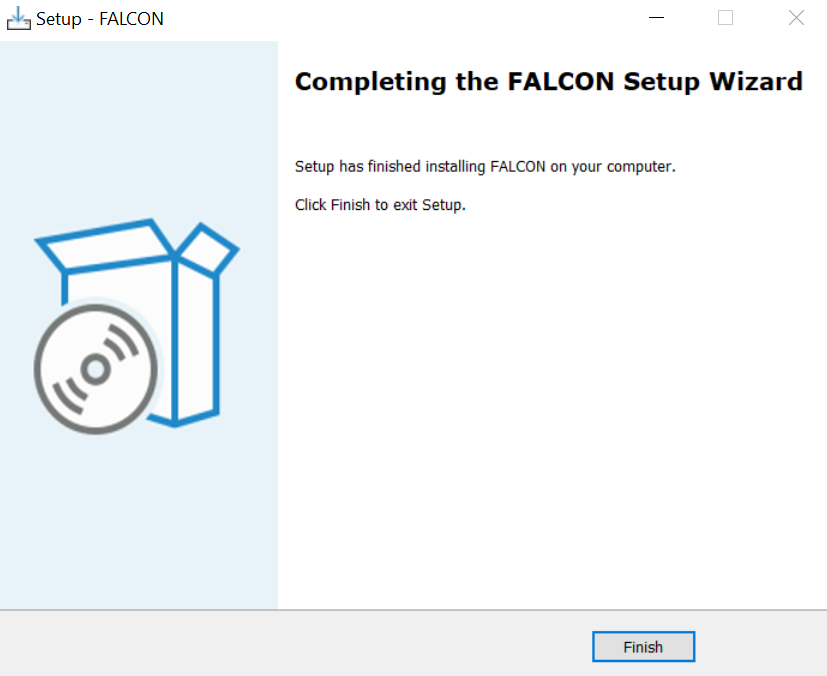

# FALCON telepítése és futtatása

A szélszimulációs funkció használatához a felhasználóknak először telepíteniük kell a **FALCON plugin-t**. Ez a bővítmény a Consteel weboldalán, a „Letöltések” menüpont alatt érhető el. A bővítmények kategóriájában a „Consteel 19” opciót kell kiválasztani, majd a FALCON bővítményt letölteni. A bővítmény a Consteel 18-tól kezdve kompatibilis.

### Licencszerződés

A telepítés megkezdéséhez el kell fogadni a licencszerződést.

### Telepítés

Ha a telepítés sikeres, két új **FALCON ikon** lesz elérhető a _Terhek_ fülön a Consteelen belül:

- **FALCON – Szél szimuláció** 
- **FALCON – Szél teher generálás szimulációs eredmények alapján** 

