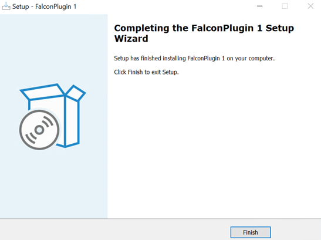
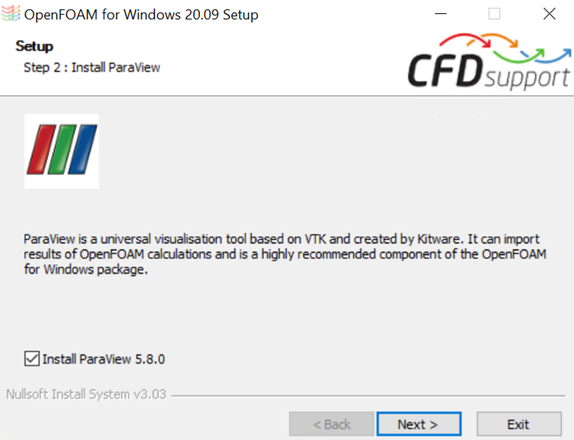

# FALCON telepítése és futtatása

A szélszimulációs funkció használatához a felhasználóknak először telepíteniük kell a **FALCON plugin-t**. Ez a bővítmény a Consteel weboldalán, a „Letöltések” menüpont alatt érhető el. A bővítmények kategóriájában a „Consteel 18” opciót kell kiválasztani, majd a FALCON bővítményt letölteni.

A bővítmény a Consteel 18-tól kezdve kompatibilis.

 
A .exe kiterjesztésű fájl letöltése után győződj meg róla, hogy bepipáltad az „OpenFOAM telepítése” jelölőnégyzetet, ha az előzőleg **nem** lett telepítve. Ezután kattints a „Tovább” gombra.

## Van OpenFOAM telepítve a számítógépedre?
### IGEN
*** 

Ha az OpenFOAM már telepítve van, de mégis bepipálod a jelölőnégyzetet, az alábbi üzenet jelenik meg:

"OpenFOAM telepítése már megtörtént az eszközén. Szeretné egy másik példányt telepíteni? Telepítse az OpenFOAM-ot."

Ha a Telepítés gombra kattintasz, egy új OpenFOAM példány lesz telepítve, ami **lassítani** fogja a telepítési folyamatot. Ajánlott a **Vissza** gombra kattintani, és eltávolítani a jelölést a telepítéshez.

- Kattints a **Tovább** gombra a Kiegészítő Feladatok kiválasztása ablakban.

- A "Készen áll a telepítésre" oldalon kattints a **Telepítés** gombra.

- Az utolsó ablakban, a FALCON Plugin 1 Telepítő varázsló befejezése oldalnál kattints a **Befejezés** gombra.

 

### NEM

*** 

Ha az OpenFOAM **nincs** telepítve, az alábbi üzenet jelenik meg:

"Nem található OpenFOAM az eszközén. A folytatáshoz először telepítenie kell. Telepítse az OpenFOAM-ot."

- **Ne fusson Consteel** a bővítmény telepítése közben. Ha a program fut, az alábbi üzenet jelenik meg:

"Az alábbi alkalmazások olyan fájlokat használnak, amelyeket a telepítő frissíteni szeretne. Ajánlott engedélyezni, hogy a telepítő automatikusan bezárja ezeket az alkalmazásokat. A telepítés befejezése után a telepítő megpróbálja újraindítani az alkalmazásokat."

- Kattints a **Telepítés** gombra a telepítés folytatásához.

- Az "Üdvözöljük az OpenFOAM Windows telepítőjében" ablakban kattints a **Tovább** gombra.

- A Kezdő lépések ablakban pipáld be az ,,Ez a funkció **kihagyása**" jelölőnégyzetet, majd kattints a **Tovább** gombra.

:::note
Az OpenFOAM Linuxon fejlesztett rendszer, amely érzékeny a kis- és nagybetűkre, míg a Windows alapértelmezetten nem érzékeny rá. Azok számára, akik az OpenFOAM további fejlesztését tervezik, szükséges a Windows beállításainak módosítása. Azonban a legtöbb felhasználó számára elegendő ezt a lépést kihagyni.
:::

 
- A következő hét ablakban kattints a **Tovább** és **Telepítés** gombra anélkül, hogy módosítanád az alapértelmezett beállításokat.

- Amikor a Microsoft MPI telepítő varázsló befejezése ablakhoz érsz, kattints a **Befejezés** gombra.

 

- A Microsoft MPI telepítése után, a **OK** gombra kattintva, a Cygwin és az OpenFOAM telepítésére van szükség, öt lépésben:

1. lépés: Az OpenFOAM telepítése

:::info
Az alábbi 4 lépést csak kutatási célokra ajánljuk; a szokásos mérnöki projektekhez a felhasználók kihagyhatják a ParaView, swak4Foam, PyFoam és Gnuplot telepítését.
:::

2. Lépés: A ParaView telepítése

   
3. lépés: A swak4Foam telepítése
4. lépés: A PyFoam telepítése
5. lépés: A Gnuplot telepítése

- Ezután ki kell választani a telepítés nyelvét. Kattints az **OK** gombra.

- A következő ablakban el kell fogadni az Licencszerződést. Kattints a **Tovább** gombra.

- Kattints a **Tovább** gombra az Információ ablakban.

- Válaszd ki a célmappát és a komponenseket, majd kattints a **Tovább** gombra.

- Válaszd ki a Start menü mappát, majd kattints a **Tovább** gombra.

- További feladatok választhatók, majd kattints a **Telepítés** gombra a Kész a telepítéshez ablakban.

- Kattints a **Tovább** gombra az Információ ablakban, majd kattintson a Befejezés gombra.
   
   
 

Ha a telepítés sikeres, két új FALCON ikon lesz elérhető a Teher fülön:

- FALCON – Szél szimuláció
- FALCON – Szélteher generálás szimulációs eredményekből 

