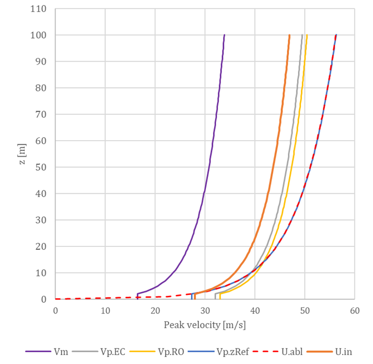
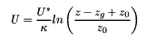
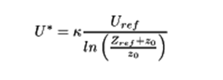
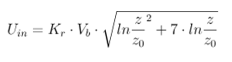
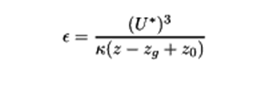
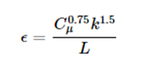

# Preprocessor

The preprocessor can be referred as an operational phase, or as a collection of methods with two main tasks. One is to convert the input geometry to a specific mesh format, which can be described as a traditional mesh with triangular or quadrilateral faces and vertices, but it is also possible to interpret a mesh with polygon faces (“Ngons”).

Nevertheless, for representation purposes a “Foam Mesh” can also be interpreted as a list of polylines. The other task is to generate a virtual wind tunnel, which consist of the wind profile according to the parameters, and geometrically by blocks (finite volume elements) and boundaries. Having these two it is possible to create the simulation case contents similar to the OpenFOAM hierarchy. The wind flow parameters are stored in “zero” folder, mesh generation both in “constant” and “system”, while solution and result query parameters in “system”.

 
_An overview of the preprocessor_

Although, the key feature of the preprocessor is the wind profile determination in the context of the Eurocode, which includes all the aspects presented in chapter 3.2.1.  The clear goal is to introduce a wind profile which produces the peak pressure profile obtained by the code. However, the definition of this profile is not straightforward. The figure 4-4 below shows the different approaches, where the Qp.EC function shows the general “goal” profile of Eurocode. But it could be important to consider the aspects of national annexes, for instance the Romanian standard (Qp.Ro) includes a specific approach by introducing a proportionality factor, β for the turbulence intensity. Another aspect is that the Eurocode generally neglects the 2nd order term of the turbulence intensity presented in chapter 3.2.1.2, considering that the error introduced by this approximation is below 3-4%. But if the peak pressure is calculated directly according to the peak velocity (QpEC.V and QpRO.V) the difference seems to be more significant.

 _Peak pressure profiles_

On top of it is important to be aware of the fact that OpenFOAM offers only a simplified logarithmic approach which is based the friction velocity U* calculated at a reference height, which results a slightly different velocity profile, U.abl, resulting a different pressure profile, Qp.abl which is practically similar to a pressure profile, calculated according to the properties (turbulence intensity, thereby the exposure factor) at a reference height, Qp.zRef.

_Peak velocity profiles for a terrain with category II_ 

The logarithmic profile evaluated by the atmospheric boundary layer approach of the OpenFOAM is according to the followings:

Therefore, it was necessary to develop a unique solution within OpenFOAM for the determination of the U.in as the inlet peak velocity profile, which produces the desired Qp.EC. This uses the following formula:

For an inlet wind profile using the k-ε turbulence model the initialization of the k and ε field values is also necessary. For this, there are also different approaches to consider. The basic atmospheric boundary layer of OpenFOAM calculates a constant value along the height automatically, according to:
 

However, the inlet turbulent kinetic energy is generally calculated based on the inlet reference velocity and the turbulence intensity, which is defined by Eurocode according to the terrain parameters:

Similarly for the inlet ε there is a default automatic way used by the OpenFOAM based on the friction velocity:

:::info
 And there is also an approach considering the turbulent length intensity which can be evaluated according to a Eurocode procedure:
:::

These approaches were compared, both for the mean velocity and the peak velocity profile, presented in Figure 4-6. The peak pressures are corresponding to the pressure values measured on the windward wall of a simple 8 m x 8 m x 8 m cuboid. The profile naming convection is the following: inlet velocity profile – inlet turbulent kinetic energy (automatic or calculated) – inlet turbulent dissipation rate (automatic or calculated).

_Peak pressures measured on a windward wall_