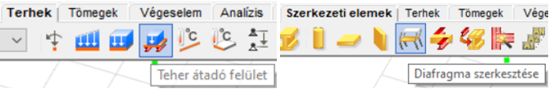
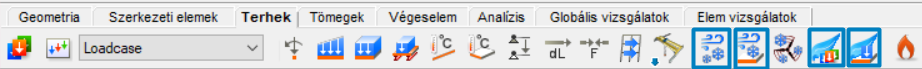
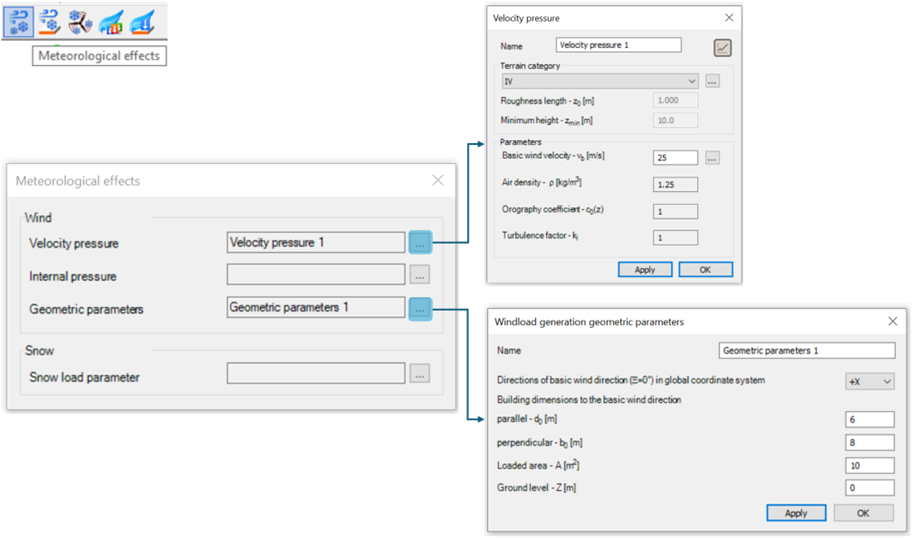
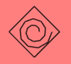

# Felhasználói felület

A szélszimulációs folyamat elkezdése előtt az első és legfontosabb lépés a **Teher átadó felületek** létrehozása, amelyeken a szimuláció végrehajtásra kerül.

A teher átadó felületet többféleképpen is létrehozhatod:

- A **Teher átadó felület** lehetőséggel a _Terhek fülön_
- **Diafragma** létrehozásával a _Szerkezeti elemek fülön_

A teher átadó felületek létrehozása után kezdődhet a szélszimulációs folyamat.

Minden **FALCON szélszimuláció**val kapcsolatos funkció a _Terhek fülön_ található.

### 1. Meteorológiai hatások

Az első lépés a **szélszimuláció** során a **meteorológiai hatások** meghatározása. Ehhez használd a speciálisan tervezett ikont a Terhek fülön.  
A szélterhelés szimulációhoz a **Torlónyomás** és a **Geometriai Paraméterek** meghatározása szükséges:

- **Torlónyomás**:
  - Beépítettségi osztály
  - Szélsebesség alapértéke
- **Szélteher generálás geometriai paraméterei**:
  - Az épület méretei a fő szélirányához képest

A meteorológiai hatásokkal kapcsolatos további információkért tekintsd meg a **Terhek fejezet**et a Consteel kézikönyvben.

### 2. Meteorológiai felületek

A következő lépés a **Meteorológiai Felület** meghatározása.

Ebben az ablakban visszatérhetsz az első lépéshez, ha rákattintasz a három pont ikonra a **Meteorológiai Hatások** mellett.

:::info
A **Szabványos felület** szekció nem befolyásolja a szélszimulációt; csupán a szabványos szélgenerálást szolgálja Eurocode szerint.
:::

A szélszimulációhoz használd az ablak utolsó szegmensét, a **Szimulációs felület**et, és válaszd ki a megfelelő felület kategóriát:

- **Általános** – a tervezett épület számára
- **Akadály** – bármely környező épület számára, amely modellezve van, és hatással lehet a szél szimulációra

A felület kategória kiválasztása után az összes releváns felületet ki kell jelölni. Ha a szimulációs felület helyesen van alkalmazva, az alábbi ikon jelenik meg a felületek közepén:

:::note
Az Általános felületek csak **teher átadó** felületekre alkalmazhatók, beleértve a **diafragmákat**.
:::
