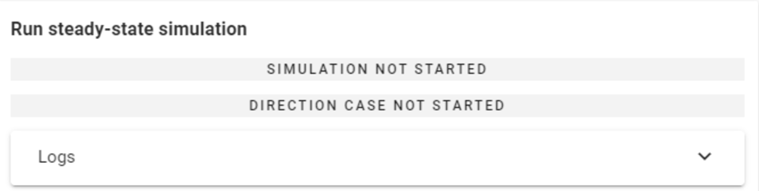

# Szélszimuláció

:::info

Ha zöld pipa jelenik meg a három pont ikon mellett, azt jelzi, hogy az előző lépések sikeresen befejeződtek, így folytathatod a szélszimulációs folyamatot.

Az Info gomb részletes információkat ad minden lépésről. A gomb megnyomásával megnyílik egy ablak, amely átfogó útmutatást tartalmaz.
:::

A harmadik lépés a szélszimuláció futtatása a FALCON-nal. Használd a **FALCON - Szél szimuláció** gombot a _Terhek fülön_, hogy megnyisd az ablakot.

Ez az ablak négy részre van bontva, amelyek végigvezetnek a beállításokon és a szimuláción:

#### A. Hatások és felületek

- **Meteorológiai hatás**: Ha előzőleg nem lett meghatározva, visszatérhetsz ehhez a beállításhoz a három pont gombra kattintva.

- **Szimulációs felületek**: Az alatta lévő szám azt jelzi, hány szimulációs felület van jelenleg elhelyezve a modellben. Ha nincs felület meghatározva, használd a három pont gombot a visszalépéshez és azok meghatározásához.

#### B. Szimulációs beállítások

- **Háló mérete a szimulációs felületen**: A szimulációs felületen alkalmazott háló méretének beállítása.
- **Háló mérete a szerkezeten**: Az automatikus hálógenerálás két hálót hoz létre:

    - **A végeselem háló (FEM)**, amelyet kifejezetten a utófeldolgozáshoz hoz létre a program, és csak az épülethez alkalmazza, amely sík felületekkel rendelkezik, amelyek alkalmasak a terhelések létrehozására.
    - **A véges térfogat háló (FVM)**, amelyet a szimulációs megoldó generál, és amely a teljes szimulációs tartományban poligonális felületeket tartalmaz, alkalmazkodva a szél irányához. Az FVM eredmények a FEM hálóra vetítődnek szimulációs célból.

- **Hálósűrítési tényező**: A finomítási tényező (r) növeli a cella éleinek méretét (c) a szimulációs tartomány határain, hogy gyorsítsa a számításokat azzal, hogy csökkenti a távolabbi részletezést az épülettől. A cellaméret a határokon kiszámítható a következőképpen:

  c = s × 2^r

  Itt az (s) a szerkezeten alkalmazott háló mérete, és minden finomítás a cellákat minden irányban felére csökkenti, létrehozva egy finomított hálót az épület közelében.

- **Részletes beállítások**: Az alapértelmezett beállítások általában megfelelőek, de szükség esetén módosíthatók, a három pont gombra kattintva:

  - **Hőmérséklet**: A szimulációhoz beállított környezeti hőmérséklet.
  - **Turbulencia modell**: A turbulencia hatásainak előrejelzése.
  - **Processzorok száma**: A párhuzamos szimulációkhoz használt processzorok száma.
  - **Iterációk száma**: Az iterációk számának meghatározása.
  - **Konvergencia kritériumok**: A kiszámított mezők konvergenciájának szabványai.
  - **Tartomány méret paraméterek**: A szimulációs tartomány méreteinek beállítása. Ez az éplet magasságának szorzásával történik minden irányban:
    - **Szélfelőli oldal** (w)
    - **Szélárnyékos oldal** (l)
    - **Oldal** (s)
    - **Csúcs** (t)

#### C. Szélirányok Θ₀-hoz képest
Ebben a szekcióban add meg az összes szélirányt az XY síkban Θ₀-hoz képest, legfeljebb 12 irány egyidejű megadásával. Minden új irányt írj be az input mezőbe, majd nyomd meg az **Enter** billentyűt.

A Θ₀ irány a szimulált szerkezet felülnézetben, a szél szimulációs irányaival együtt látható. A színes nyilak jelzik a szimulált szél irányát a szerkezethez képest.

#### D. Stacionárius szimuláció futtatása
Az utolsó részben a szimuláció állapota és az irány figyelemmel kísérhető:

A "Futtatás" gombra kattintás után két betöltési sáv jelenik meg, amelyek a szimulált szélirányokat és azok előrehaladási százalékát mutatják.

:::info
Amíg a szél szimulációk futnak, a Consteel teljes mértékben működőképes marad, így továbbra is dolgozhatsz.
:::

A szimuláció előrehaladásának nyomon követéséhez nyisd meg a **Napló** legördülő ablakot. A szimuláció bármikor leállítható a **Mégse** gombra kattintva.

