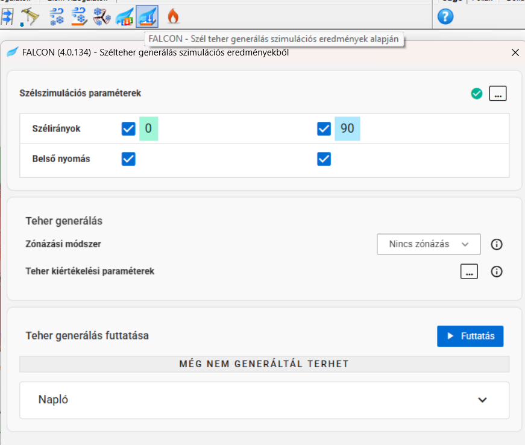
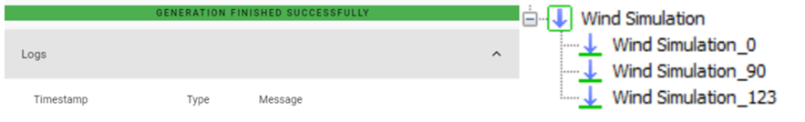

# Szélteher generálása a szimulációs eredményekből

Ebben az utolsó lépésben a FALCON a szimulációs eredményekből szélterheléseket generál, amelyek szokványos terhelésként használhatók a modellben. Az ablak végigvezet az szélterhelések generálásának lépésein:

### **A. Szélszimulációs paraméterek**: 
- Amennyiben a szélszimuláció nem fejeződött be, a három pont gombbal térj vissza az előző lépéshez és futtasd le azt.

### **B. Terhelés kiértékelése**: 
- A hálógenerálás során a véges térfogat háló további finomítást kap, biztosítva, hogy minden végeselemháló-felület legalább négy tárolt eredménnyel rendelkezzen. Ez lehetővé teszi különféle eredménykiértékelési módszerek alkalmazását a generált terhelések konvergenciájának ellenőrzéséhez és szükség szerinti konzervatív megközelítés hozzáadásához.

  #### **Zónázási módszer**
    - Az eredmények utófeldolgozásának módszere az egyenletes felületi terhelések generálásához.

    - A "nincs zónázás" opció lehetővé teszi a terhelések közvetlenül a végeselemhálón történő generálását.

    - A "globális" opció egyenlő intervallumokat hoz létre az eredménytartomány teljes szélességén a "szám" beállítás alapján, ennek megfelelően osztályozza a végeselemeket, és egyesíti azokat a zónázott terhelések generálásához.

    - A "kategorizált" opció automatikusan hozzárendeli a szimulációs felületeket az alábbi négy kategória egyikéhez a helyi normálvektoraik és a szélirány alapján: széliránynak kitett, szél alatt, oldalsó és tetőfelület. A "globális" opcióhoz hasonlóan zónázott terheléseket generál, amelyeket a kategóriától függően validált alapértelmezett beállítások segítségével értékelnek.

   #### **Terhelés kiértékelési paraméterek**

     - Paraméterek egy készlete, amelyeket a felületi terhelések meghatározásához használnak a végeselemhálóból, amely a szimuláció során kapott nyomási eredményeket tárolja.
     - A speciális beállítások ablak a három pont gomb segítségével nyitható meg:
       - **Teher érték definiálása** Ez a paraméter két dologra hat:

         - A hálógenerálás során a véges térfogat háló mindig extra finomítást kap, aminek eredménye, hogy minden végeselemháló-felület legalább 4 tárolt eredménnyel rendelkezik. Ez lehetővé teszi az eredmények többféle módon történő kiértékelését, a generált terhelések konvergenciájának ellenőrzését, valamint további konzervatív megközelítés hozzáadását.

         - A "globális" vagy "kategorizált" zónázási módszerek használatával történő zónázott terhelés-létrehozás során egy bizonyos intervallum átlagértéke vagy maximális értéke lesz használva a terhelési érték meghatározásához.
        
       -  **Külső nyomási tényező határértékek** fül a szélszívás és szélnyomás határértékeit tartalmazzák.

### **C. Teher generálás futtatása** 
- Nyomd meg a **Futtatás** gombot az ablak alján a terhelések generálásának megkezdéséhez.

Ha a szélterhelés generálása sikeresen befejeződik, új szélterhelési esetek jelennek meg a _Teheresetek és tehercsoportok_ szakaszban.
 

Minden szélterhelési eset a szimulációból generált megfelelő szélterheléseket fogja tartalmazni.