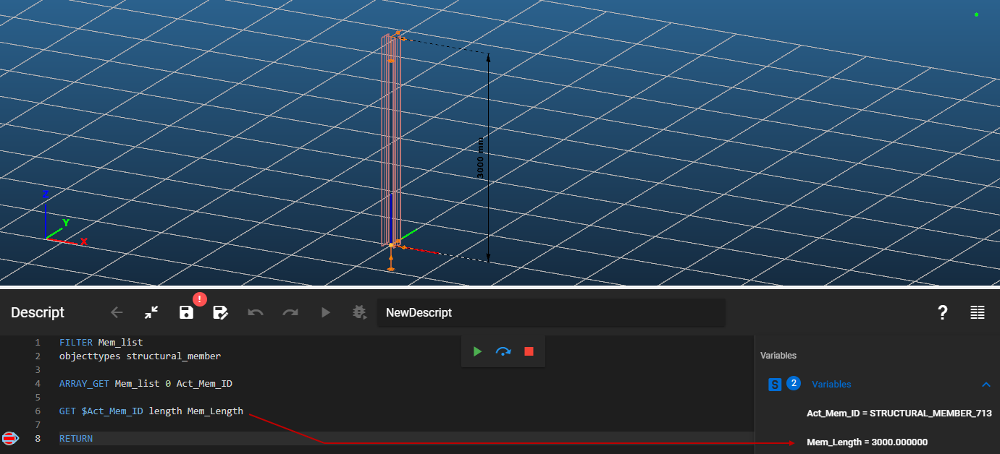

Gets an attribute value of an object.

### Syntax

**GET** \[Object ID] \[Object attribute] \[Output variable]

### Command parameters

| **Command parameter**                 | **Assignment** | **Value format**   | **Input options** |
| ------------------------------------- | -------------- | ------------------ | ----------------- |
| [Object ID](#object-ID)               | Required       | String             | Local, variable   |
| [Object attribute](#object-attribute) | Required       | Predefined strings | Local, variable   |
| [Output variable](#output-variable)   | Required       | String             | Local, variable   |

#### Object ID:

The ID of the object.

Object IDs from the following object types are accepted:

- Structural members tab:
  - [Section](#section)
  - [Structural member](#structural-member)
  - [Structural plate](#structural-plate)
  - [Steel material](#steel-material)
  - [Coated steel material](#coated-steel-material)
  - [Concrete material](#conctrete-material)
- Loads tab:
  - [Load case](#load-case)

#### Object attribute:

The requested object attribute. The available selection of object attributes depends on the object type, which is automatically determined based on the given object ID. The available object attributes can be found at the [detailed description of object](#detailed-description-of-object-types) types below.

In case we have an object ID, and don't know the type of the object it identifies, the type can also be queried with the _Object_Type_ attribute for every accepted object type.

Further information about object attributes can be found at the [CREATE](/docs/descript/command-reference/create/) and [SET](/docs/descript/command-reference/set/) commands.

#### Output variable:

The name of the variable that will store the retrieved value of the specified attribute.

### Sample code

**Command only:**

```
GET $Sec_ID0 Name Section_Name
```

**Member length with getting member ID:**

```
FILTER Mem_list
objecttypes structural_member

ARRAY_GET Mem_list 0 Act_Mem_ID

GET $Act_Mem_ID length Mem_Length
```

[](./img/Get_v01.png)

---

## Detailed description of object types

## Section

Available object attributes:

| **Object attribute name**                                                 | **Object attribute** (type this into Descript) |
| ------------------------------------------------------------------------- | ---------------------------------------------- |
| Name                                                                      | Name                                           |
| Material                                                                  | MaterialID                                     |
| Cross section area (A)                                                    | CrossSectionArea                               |
| Perimeter                                                                 | Perimeter                                      |
| Angle of principal axis (α) \[rad]                                        | AngleOfMainAxis                                |
| Centre of gravity Y (vs, section edit system translated to c.o.g.)        | CentreOfGravityInY                             |
| Centre of gravity Z (ws, section edit system translated to c.o.g.)        | CentreOfGravityInZ                             |
| Moment of inertia Y (IY, section edit system translated to c.o.g.)        | MomentOfInertiaY                               |
| Moment of inertia Z (IZ, section edit system translated to c.o.g.)        | MomentofInertiaZ                               |
| Moment of inertia YZ (IYZ, section edit system translated to c.o.g.)      | MomentOfInertiaYZ                              |
| Moment of inertia y (Iy, principal axis system)                           | MomentOfInertiaV                               |
| Moment of inertia z (Iz, principal axis system)                           | MomentOfInertiaW                               |
| Inertia radius Y (iY, section edit system translated to c.o.g.)           | InertiaRadiusY                                 |
| Inertia radius Z (iZ, section edit system translated to c.o.g.)           | InertiaRadiusZ                                 |
| Inertia radius y (iy, principal axis system)                              | InertiaRadiusV                                 |
| Inertia radius z (iz, principal axis system)                              | InertiaRadiusW                                 |
| Section modulus Y minimum (W1Y, section edit system translated to c.o.g.) | MinimumSectionModulusY                         |
| Section modulus Z minimum (W1Z, section edit system translated to c.o.g.) | MinimumSectionModulusZ                         |
| Section modulus y minimum (W1y, section edit system translated to c.o.g.) | MinimumSectionModulusV                         |
| Section modulus z minimum (W1z, section edit system translated to c.o.g.) | MinimumSectionModulusW                         |
| Section modulus Y maximum (W2Y, section edit system translated to c.o.g.) | MaximumSectionModulusY                         |
| Section modulus Z maximum (W2Z, section edit system translated to c.o.g.) | MaximumSectionModulusZ                         |
| Section modulus y maximum (W2y, section edit system translated to c.o.g.) | MaximumSectionModulusV                         |
| Section modulus z maximum (W2z, section edit system translated to c.o.g.) | MaximumSectionModulusW                         |
| Shear centre Y (y0, section edit system translated to c.o.g.)             | ShearCentreY                                   |
| Shear centre Z (z0, section edit system translated to c.o.g.)             | ShearCentreZ                                   |
| Shear centre y (y0, principal axis system)                                | ShearCentreV                                   |
| Shear centre z (z0, principal axis system)                                | ShearCentreW                                   |
| Warping static moment                                                     | WarpingStaticMoment                            |
| St. Venant torsional constant (It)                                        | TorsionalConstantX                             |
| Warping constant (Iw)                                                     | WarpingConstant                                |
| Shear area y (AsY)                                                        | ShearAreaY                                     |
| Shear area z (AsZ)                                                        | ShearAreaZ                                     |
| Ratio of shear area and total area Y (ρY)                                 | RhoY                                           |
| Ratio of shear area and total area Z (ρZ)                                 | RhoZ                                           |
| Static moment y (Y0, section edit system translated to c.o.g.)            | StaticMomentY                                  |
| Static moment z (Z0, section edit system translated to c.o.g.)            | StaticMomentZ                                  |
| Static moment y (Sy, principal axis system)                               | StaticMomentV                                  |
| Static moment z (Sz, principal axis system)                               | StaticMomentW                                  |
| Width of embed rectangle Y (section edit system)                          | WidthY                                         |
| Height of embed rectangle Z (section edit system)                         | WidthZ                                         |
| Type                                                                      | Type                                           |
| Section group                                                             | GroupName                                      |
| Comment                                                                   | Comment                                        |
| Origin                                                                    | Origin                                         |
| Parameters                                                                | Parameters                                     |

Explanation for the section Type, GroupName , Source and Parameters attributes:


### Sample code

**All available attributes + object creation:**

```
LOAD_SECTION_LIBRARY Sec_ID1 "HEA 200"

GET Sec_ID1 Name Name
GET Sec_ID1 MaterialID MaterialID
GET Sec_ID1 CrossSectionArea CrossSectionArea
GET Sec_ID1 Perimeter Perimeter
GET Sec_ID1 AngleOfMainAxis AngleOfMainAxis
GET Sec_ID1 CentreOfGravityInY CentreOfGravityInY
GET Sec_ID1 CentreOfGravityInZ CentreOfGravityInZ
GET Sec_ID1 MomentOfInertiaY MomentOfInertiaY
GET Sec_ID1 MomentofInertiaZ MomentofInertiaZ
GET Sec_ID1 MomentOfInertiaYZ MomentOfInertiaYZ
GET Sec_ID1 MomentOfInertiaV MomentOfInertiaV
GET Sec_ID1 MomentOfInertiaW MomentOfInertiaW
GET Sec_ID1 InertiaRadiusy InertiaRadiusY
GET Sec_ID1 InertiaRadiusz InertiaRadiusZ
GET Sec_ID1 InertiaRadiusv InertiaRadiusV
GET Sec_ID1 InertiaRadiusw InertiaRadiusW
GET Sec_ID1 MinimumSectionModulusY MinimumSectionModulusY
GET Sec_ID1 MinimumSectionModulusZ MinimumSectionModulusZ
GET Sec_ID1 MinimumSectionModulusV MinimumSectionModulusV
GET Sec_ID1 MinimumSectionModulusW MinimumSectionModulusW
GET Sec_ID1 MaximumSectionModulusY MaximumSectionModulusY
GET Sec_ID1 MaximumSectionModulusZ MaximumSectionModulusZ
GET Sec_ID1 MaximumSectionModulusV MaximumSectionModulusV
GET Sec_ID1 MaximumSectionModulusW MaximumSectionModulusW
GET Sec_ID1 ShearCentreY ShearCentreY
GET Sec_ID1 ShearCentreZ ShearCentreZ
GET Sec_ID1 ShearCentreV ShearCentreV
GET Sec_ID1 ShearCentreW ShearCentreW
GET Sec_ID1 TorsionalConstantX TorsionalConstantX
GET Sec_ID1 WarpingConstant WarpingConstant
GET Sec_ID1 ShearAreaY ShearAreaY
GET Sec_ID1 ShearAreaZ ShearAreaZ
GET Sec_ID1 RhoY RhoY
GET Sec_ID1 RhoZ RhoZ
GET Sec_ID1 StaticMomentY StaticMomentY
GET Sec_ID1 StaticMomentZ StaticMomentZ
GET Sec_ID1 StaticMomentV StaticMomentV
GET Sec_ID1 StaticMomentW StaticMomentW
GET Sec_ID1 WarpingStaticMoment WarpingStaticMoment
GET Sec_ID1 WidthY WidthY
GET Sec_ID1 WidthZ WidthZ
GET Sec_ID1 Type Type
GET Sec_ID1 GroupName GroupName
GET Sec_ID1 Comment Comment
GET Sec_ID1 Origin Origin
GET Sec_ID1 Parameters Parameters
```

## Structural member

Available object attributes:

| **Object attribute name**         | **Object attribute** (type this into Descript) |
| --------------------------------- | ---------------------------------------------- |
| Name                              | Name                                           |
| Material ID                       | MaterialID                                     |
| Section ID                        | SectionID                                      |
| Length                            | Length                                         |
| Release start point               | ReleaseID_A                                    |
| Release end point                 | ReleaseID_B                                    |
| Eccentricity - y                  | Eccentricity_y                                 |
| Eccentricity - z                  | Eccentricity_z                                 |
| Axial rotation                    | Rotation                                       |
| Initial bow imperfection L/y      | GeomImpV                                       |
| Initial bow imperfection L/z      | GeomImpW                                       |
| Finite element type               | Fe_Type                                        |
| Finite element generation type    | ConvergenceType                                |
| Number of finite elements         | Convergence                                    |
| Finite element size of the web    | AverageEdgeLength_Web                          |
| Finite element size of the flange | AverageEdgeLength_Flange                       |
| Type of the constraint elements   | ShellDOFConstraint                             |
| Line ID                           | Edge                                           |

### Sample code

**All available attributes + object creation:**

```
LOAD_SECTION_LIBRARY Sec_ID1 "HEA 200"

CREATE Mem_ID1 Structural_Member "HEA 200"
0 0 0
0 0 3000

GET Mem_ID1 Name Name
GET Mem_ID1 MaterialID MaterialID
GET Mem_ID1 SectionID SectionID
GET Mem_ID1 Length Length
GET Mem_ID1 Release_A Release_A
GET Mem_ID1 Release_B Release_B
GET Mem_ID1 Eccentricity_y Eccentricity_y
GET Mem_ID1 Eccentricity_z Eccentricity_z
GET Mem_ID1 Rotation Rotation
GET Mem_ID1 GeomImpV GeomImpV
GET Mem_ID1 GeomImpW GeomImpW
GET Mem_ID1 Fe_Type Fe_Type
GET Mem_ID1 ConvergenceType ConvergenceType
GET Mem_ID1 Convergence Convergence
GET Mem_ID1 AverageEdgeLength_Web AverageEdgeLength_Web
GET Mem_ID1 AverageEdgeLength_Flange AverageEdgeLength_Flange
GET Mem_ID1 ShellDOFConstraint ShellDOFConstraint
GET Mem_ID1 Edge Edge
```

## Structural plate

Available object attributes:

| **Object attribute name** | **Object attribute** (type this into Descript) |
| ------------------------- | ---------------------------------------------- |
| Name                      | Name                                           |
| Material ID               | MaterialID                                     |
| Thickness                 | Thickness                                      |
| Finite element size       | AverageEdgeLength                              |

### Sample code

**All available attributes + object creation:**

```
CREATE SPID1 Structural_Plate "C25/30 EN 1992-1-1:2010" 200 50
0 0 0
3000 0 0
3000 3000 0
0 3000 0

GET SPID1 Name Name
GET SPID1 MaterialID MaterialID
GET SPID1 Thickness Thickness
GET SPID1 AverageEdgeLength AverageEdgeLength
```

## Steel material

Available object attributes:

| **Object attribute name**             | **Object attribute** (type this into Descript) |
| ------------------------------------- | ---------------------------------------------- |
| Name                                  | Name                                           |
| Density                               | Density                                        |
| Elastic modulus                       | Elasticity                                     |
| Poisson factor                        | Poisson                                        |
| Thermal expansion coefficient         | Thermal                                        |
| Thermal expansion coefficient in fire | ThermalFi                                      |
| Yield strength 1                      | Fy1                                            |
| Yield strength 2                      | Fy2                                            |
| Ultimate strength 1                   | Fu1                                            |
| Ultimate strength 2                   | Fu2                                            |
| Thickness Y                           | ThicknessY                                     |
| Thickness U                           | ThicknessU                                     |

### Sample code

**All available attributes + object creation:**

```
CREATE Steel_Mat_ID1 Steel "Custom steel name" 7850 210000 0.3 0.000012 0.000014 235 215 360 360 40 40

GET Steel_Mat_ID1 Name Name
GET Steel_Mat_ID1 Density Density
GET Steel_Mat_ID1 Elasticity Elasticity
GET Steel_Mat_ID1 Poisson Poisson
GET Steel_Mat_ID1 Thermal Thermal
GET Steel_Mat_ID1 ThermalFi ThermalFi
GET Steel_Mat_ID1 Fy1 Fy1
GET Steel_Mat_ID1 Fy2 Fy2
GET Steel_Mat_ID1 Fu1 Fu1
GET Steel_Mat_ID1 Fu2 Fu2
GET Steel_Mat_ID1 ThicknessY ThicknessY
GET Steel_Mat_ID1 ThicknessU ThicknessU
```

## Coated steel material

Available object attributes:

| **Object attribute name**             | **Object attribute** (type this into Descript) |
| ------------------------------------- | ---------------------------------------------- |
| Name                                  | Name                                           |
| Density                               | Density                                        |
| Elastic modulus                       | Elasticity                                     |
| Poisson factor                        | Poisson                                        |
| Thermal expansion coefficient         | Thermal                                        |
| Thermal expansion coefficient in fire | ThermalFi                                      |
| Basic yield strength                  | Fyb                                            |
| Ultimate strength                     | Fu                                             |
| Coating thickness                     | CoatingThickness                               |

### Sample code

**All available attributes + object creation:**

```
CREATE CSteel_Mat_ID1 Coated_Steel "Custom coated steel name" 7850 210000 0.3 0.000012 0.000014 350 420 0.02

GET CSteel_Mat_ID1 Name Name
GET CSteel_Mat_ID1 Density Density
GET CSteel_Mat_ID1 Elasticity Elasticity
GET CSteel_Mat_ID1 Poisson Poisson
GET CSteel_Mat_ID1 Thermal Thermal
GET CSteel_Mat_ID1 ThermalFi ThermalFi
GET CSteel_Mat_ID1 Fyb Fyb
GET CSteel_Mat_ID1 Fu Fu
GET CSteel_Mat_ID1 CoatingThickness CoatingThickness
```

## Conctrete material

Available object attributes:

| **Object attribute name**             | **Object attribute** (type this into Descript) |
| ------------------------------------- | ---------------------------------------------- |
| Name                                  | Name                                           |
| Density                               | Density                                        |
| Secant modulus of elasticity          | Elasticity                                     |
| Compressive strength                  | Fck                                            |
| Characteristic tensile strength       | Fctk                                           |
| Final value of creep coefficient      | Creep                                          |
| Poisson factor                        | Poisson                                        |
| Thermal expansion coefficient         | Thermal                                        |
| Yield strain #1                       | EpsC0                                          |
| Ultimite strain #1                    | EpsCu0                                         |
| Compression strength reduction factor | Eta                                            |
| Yield strain #2                       | EpsC1                                          |
| Ultimite strain #2                    | EpsCu1                                         |
| Yield strain #3                       | EpsC2                                          |
| Ultimite strain #3                    | EpsCu2                                         |
| Exponent                              | Exp                                            |

### Sample code

**All available attributes + object creation:**

```
CREATE Concrete_Mat_ID1 Concrete "Custom concrete name" 2500 31476 25 1.8 2.6 2.35 0.2 0.00001 DiagramRectangle 0.0007 0.0035 1 0.002 0.0035 0.00175 0.0035 2

GET Concrete_Mat_ID1 Name Name
GET Concrete_Mat_ID1 Density Density
GET Concrete_Mat_ID1 Elasticity Elasticity
GET Concrete_Mat_ID1 Fck Fck
GET Concrete_Mat_ID1 Fctk Fctk
GET Concrete_Mat_ID1 Creep Creep
GET Concrete_Mat_ID1 Poisson Poisson
GET Concrete_Mat_ID1 Thermal Thermal
GET Concrete_Mat_ID1 EpsC0 EpsC0
GET Concrete_Mat_ID1 EpsCu0 EpsCu0
GET Concrete_Mat_ID1 Eta Eta
GET Concrete_Mat_ID1 EpsC1 EpsC1
GET Concrete_Mat_ID1 EpsCu1 EpsCu1
GET Concrete_Mat_ID1 EpsC2 EpsC2
GET Concrete_Mat_ID1 EpsCu2 EpsCu2
GET Concrete_Mat_ID1 Exp Exp
```

## Load case

Available object attributes:

| **Object attribute name**                                | **Object attribute** (type this into Descript) |
| -------------------------------------------------------- | ---------------------------------------------- |
| Name                                                     | Name                                           |
| Load group ID                                            | LoadGroupID                                    |
| Convert loads to mass                                    | ConvertToMass                                  |
| Can be favourable in the combination                     | CanBeFavourable                                |
| Can't be the main in persistent or transient combination | NotMainInTransientCmb                          |
| Can't be the main in accidental combination              | NotMainInAccidentalCmb                         |
| Calculation of loadcase                                  | Calculate                                      |

### Sample code

**All available attributes + object creation:**

```
CREATE LG_ID1 LoadGroup
Name "Variable (Descript)"
LoadGroupType LGType_EN_P

CREATE LCase_ID1 LoadCase
Name "Load case 1 (Descript)"
LoadGroupID LG_ID1

GET LCase_ID1 Name Name
GET LCase_ID1 LoadGroupID LoadGroupID
GET LCase_ID1 ConvertToMass ConvertToMass
GET LCase_ID1 CanBeFavourable CanBeFavourable
GET LCase_ID1 NotMainInTransientCmb NotMainInTransientCmb
GET LCase_ID1 NotMainInAccidentalCmb NotMainInAccidentalCmb
GET LCase_ID1 Calculate Calculate
```
