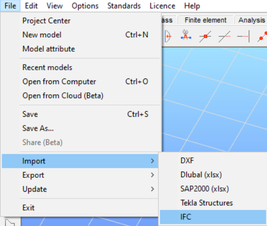
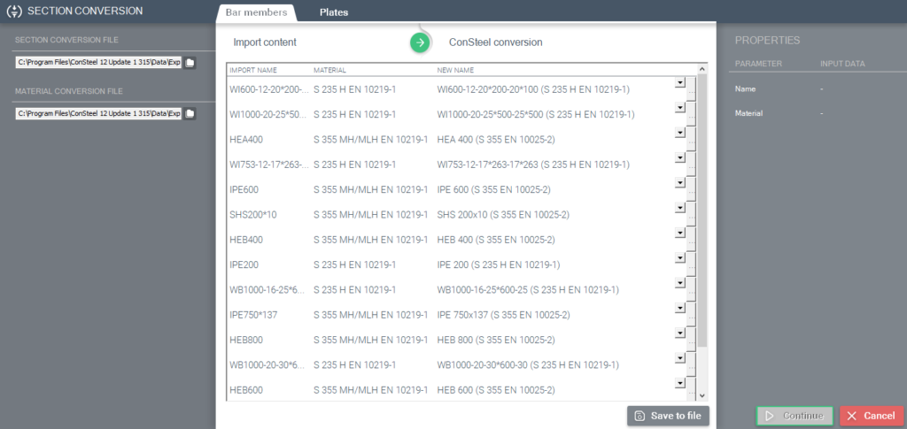
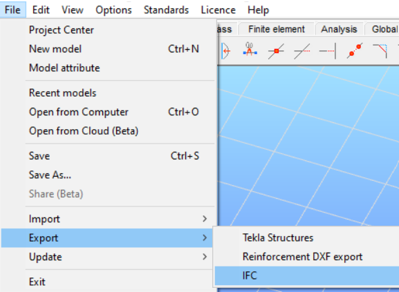

# IFC import and export

IFC is a global standard for data exchange in the building industries. IFC is both a common data model and an open file format. Building industry professionals can use IFC to share data regardless of what software application they use to get their job done.

<!-- /wp:paragraph -->

<!-- wp:paragraph -->

The IFC specification is developed and maintained by **_buildingSMART In_ ternational** as its "Data standard".

<!-- /wp:paragraph -->

<!-- wp:heading {"level":3} -->

### Import of IFC files

<!-- /wp:heading -->

<!-- wp:paragraph -->

The IFC import function of Consteel supports the importation of those ifc files, which were exported with the following format scheme:

<!-- /wp:paragraph -->

<!-- wp:list {"type":"I","className":"is-style-arrow"} -->

- IFC 2x3

<!-- /wp:list -->

<!-- wp:paragraph -->

The IFC import function can be initiated from the Import submenu of File menu, with the IFC button:

<!-- /wp:paragraph -->

<!-- wp:image {"align":"center","id":7541,"width":281,"height":212,"sizeSlug":"full","linkDestination":"media"} -->

<!-- /wp:image -->

<!-- wp:paragraph -->

After selecting the IFC function, the import dialogue will appear. The path of the ifc file which should be imported can be given directly, or it can be browsed with the folders button. At the scale options, scaling of the imported model can be adjusted. Origo of the placement can be defined if it is desired, but if it is not, Consteel will place the imported file into the global origo. For the plane of the placement the main planes, and user defined coordinate systems are also available to use.

<!-- /wp:paragraph -->

<!-- wp:image {"align":"center","id":7547,"width":258,"height":362,"sizeSlug":"full","linkDestination":"media"} -->

<!-- /wp:image -->

<!-- wp:paragraph -->

After clicking on the import button, the section conversion dialogue will appear, where section and material data from the ifc file can be assigned to Consteel sections and materials. Consteel will automatically try to assign sections to all members, using the section and material conversion table (located in the installation folder of Consteel), but manual assignment is also possivle. In the left column of the conversion table, section names from the ifc file can be seen, followed by the material names coming from the ifc file. The next column stands for the assigned Consteel sections and materials.

<!-- /wp:paragraph -->

<!-- wp:image {"id":7553,"sizeSlug":"large","linkDestination":"none"} -->

<!-- /wp:image -->

<!-- wp:paragraph -->

There is two possible for the assignment of sections:

<!-- /wp:paragraph -->

<!-- wp:list {"className":"is-style-arrow"} -->

- _Straightforward assignment_: In this case, the sections in the IFC file can be found in the conversion tables, and Consteel will automatically assign the correct section

- _Partially straightforward assignment_:

  - _„Standard macro sections” case_: If the section in the IFC file can not be found in the section conversion table, but the parameters of it fit a standard type of section (IPE for example), Consteel will create a so-called „standard macro section”, and assign it to the section from the IFC file.  
    If Consteel is not able to assign any standard macro section to a section, using the (…) button, sections can be loaded from the section library at any time
  - Macro section assignment: In case of sections, where the assignment can not be performed, Consteel will draw the shape of the section at the properties side of the dialogue, providing some guidance about the type of the section, so the correct macro section can be loaded from the section administrator, using the (…) button.

<!-- /wp:list -->

<!-- wp:paragraph -->

After the assignments of the sections are performed, the table can be saved into a user conversion file with the () button and can be used later at any time. By pressing the Continue button, the import process will be performed.

<!-- /wp:paragraph -->

<!-- wp:heading {"level":4} -->

#### Available objects for the import process

<!-- /wp:heading -->

<!-- wp:paragraph -->

**Steel members**

<!-- /wp:paragraph -->

<!-- wp:list {"ordered":true,"type":"I","className":"is-style-arrow"} -->

1. I profiles:

   1. Members in general positions, straight or curved, hot rolled sections with constant flange thickness symmetric I sections
   2. Members in general positions, straight or curved, welded sections with constant flange thickness symmetric I sections
   3. Members in general positions, straight or curved, welded sections with constant flange thickness asymmetric I sections
   4. Members in general positions, straight or curved, hot rolled sections with sloped flange symmetric I sections

2. H profiles:

   1. Members in general positions, straight or curved, hot rolled sections with constant flange thickness H sections
   2. Members in general positions, straight or curved, welded sections with constant flange thickness H sections

3. T profiles:

   1. Members in general positions, straight or curved hot rolled T sections
   2. Members in general positions, straight or curved welded T sections

4. U profiles:

   1. Members in general positions, straight or curved hot rolled U sections
   2. Members in general positions, straight or curved welded U sections
   3. Members in general positions, straight or curved hot rolled, sloped flange U sections

5. Hot rolled hollow sections:

   1. Members in general positions, straight or curved hot rolled hollow sections

6. Cold-formed hollow sections:

   1. Members in general positions, straight or curved cold-formed hollow sections

7. Hot rolled tube sections:

   1. Members in general positions, straight or curved hot rolled tube sections

8. Cold-formed tube sections:

   1. Members in general positions, straight or curved cold-formed tube sections

9. Hot rolled L profiles:

   1. Members in general positions, straight or curved hot rolled, equal or unequal flange length L sections

10. Cold-formed L profiles:

    1. Members in general positions, straight or curved cold-formed, equal or unequal flange length L sections

11. Cold-formed C profiles:

    1. Members in general position, straight or curved cold-formed C sections with edge
    2. Members in general position, straight or curved cold-formed C sections without edge
    3. Members in general position, straight or curved cold-formed C sections with edge and sloped flanges

12. Lindab C profiles:

    1. Members in general position, straight or curved cold-formed asymmetric C sections with edge

13. Welded C profiles:

    1. Members in general position, straight or curved welded C sections without edge

14. Cold-formed J profiles:

    1. Members in general position, straight or curved, cold-formed J sections

15. Cold-formed U profiles:

    1. Members in general position, straight or curved, cold-formed U sections

16. Cold-formed Z profiles:

    1. Members in general position, straight or curved cold-formed Z sections with edge
    2. Members in general position, straight or curved cold-formed Z sections without edge
    3. Members in general position, straight or curved cold-formed Z sections with edge and sloped flanges

17. Plate profiles:

    1. Members in general position, straight or curved plate sections

18. Box profiles:

    1. Members in general position, straight or curved welded box sections

19. Maltese/Half maltese cross profiles:

    1. Members in general position, straight or curved welded Maltese/half Maltese cross-sections

20. WQ profiles:

    1. Members on general position, straight or curved, welded WQ sections

<!-- /wp:list -->

<!-- wp:paragraph -->

**Reinforced concrete members**

<!-- /wp:paragraph -->

<!-- wp:list {"className":"is-style-arrow"} -->

- Members in general position, straight, T shaped sections
- Members in general position, straight, circle-shaped sections
- Members in general position, straight, hollow circle-shaped sections
- Members in general position, straight, rectangle-shaped sections
- Members in general position, straight, hollow rectangle shaped sections
- Members in general position, straight, trapezoid-shaped sections
- Members in general position, straight, I shaped sections

<!-- /wp:list -->

<!-- wp:paragraph -->

**Plates**

<!-- /wp:paragraph -->

<!-- wp:list {"className":"is-style-arrow"} -->

- Horizontally positioned rectangle plates without holes, with or without chamfer or rounding
- Horizontally positioned polygonal shaped plates without holes, with or without chamfer or rounding
- Horizontally positioned circle-shaped plates without holes, with or without chamfer or rounding
- Horizontally positioned rectangle plates with general (inside the plate) holes, with or without chamfer or rounding
- Horizontally positioned polygonal shaped plates with general (inside the plate) holes, with or without chamfer or rounding
- Horizontally positioned circle-shaped plates with general (inside the plate) holes, with or without chamfer or rounding

<!-- /wp:list -->

<!-- wp:paragraph -->

**Wall plates**

<!-- /wp:paragraph -->

<!-- wp:list {"className":"is-style-arrow"} -->

- Vertically positioned plates without holes, with or without chamfer or rounding

<!-- /wp:list -->

<!-- wp:heading {"level":3} -->

### Export of IFC files

<!-- /wp:heading -->

<!-- wp:paragraph -->

Members from Consteel can be exported from into ifc format, too. The export process uses the following file format:

<!-- /wp:paragraph -->

<!-- wp:list {"type":"I","className":"is-style-arrow"} -->

- IFC 2x3

<!-- /wp:list -->

<!-- wp:paragraph -->

To export a model to IFC format, press the IFC button in the Export submenu of File menu.

<!-- /wp:paragraph -->

<!-- wp:image {"align":"center","id":7561,"width":215,"height":134,"sizeSlug":"full","linkDestination":"media"} -->

<!-- /wp:image -->

<!-- wp:paragraph -->

After pressing the Export button, the IFC Export dialogue will appear, where the path of the saved file can be set, besides the scaling parameters and the planes of the exported model.  
Pressing the Export button again, will initiate the process, and the whole model will be exported.

<!-- /wp:paragraph -->

<!-- wp:image {"align":"center","id":7567,"width":258,"height":362,"sizeSlug":"full","linkDestination":"media"} -->

<!-- /wp:image -->

<!-- wp:heading {"level":4} -->

#### Available objects for the export process

<!-- /wp:heading -->

<!-- wp:paragraph -->

**Steel members**

<!-- /wp:paragraph -->

<!-- wp:list {"type":"I","className":"is-style-arrow"} -->

- I profiles:

  - Members in general positions, straight or curved, hot rolled sections with constant flange thickness symmetric I sections
  - Members in general positions, straight or curved, welded sections with constant flange thickness symmetric I sections
  - Members in general positions, straight or curved, welded sections with constant flange thickness asymmetric I sections
  - Members in general positions, straight or curved, hot rolled sections with sloped flange symmetric I sections

- H profiles:

  - Members in general positions, straight or curved, hot rolled sections with constant flange thickness H sections
  - Members in general positions, straight or curved, welded sections with constant flange thickness H sections

- T profiles:

  - Members in general positions, straight or curved hot rolled T sections
  - Members in general positions, straight or curved welded T sections

- U profiles:

  - Members in general positions, straight or curved hot rolled U sections
  - Members in general positions, straight or curved welded U sections
  - Members in general positions, straight or curved hot rolled, sloped flange U sections

- Hot rolled hollow sections:

  - Members in general positions, straight or curved hot rolled hollow sections

- Cold-formed hollow sections:

  - Members in general positions, straight or curved cold-formed hollow sections

- Hot rolled tube sections:

  - Members in general positions, straight or curved hot rolled tube sections

- Cold-formed tube sections:

  - Members in general positions, straight or curved cold formed tube sections

- Hot rolled L profiles:

  - Members in general positions, straight or curved hot rolled, equal or unequal flange length L sections

- Cold-formed L profiles:

  - Members in general positions, straight or curved cold-formed, equal or unequal flange length L sections

- Cold-formed C profiles:

  - Members in general position, straight or curved cold-formed C sections with edge
  - Members in general position, straight or curved cold-formed C sections without edge
  - Members in general position, straight or curved cold-formed C sections with edge and sloped flanges

- Lindab C profiles:

  - Members in general position, straight or curved cold-formed asymmetric C sections with edge

- Welded C profiles:

  - Members in general position, straight or curved welded C sections without edge

- Cold-formed J profiles:

  - Members in general position, straight or curved, cold-formed J sections

- Cold-formed U profiles:

  - Members in general position, straight or curved, cold-formed U sections

- Cold-formed Z profiles:

  - Members in general position, straight or curved cold-formed Z sections with edge
  - Members in general position, straight or curved cold-formed Z sections without edge
  - Members in general position, straight or curved cold-formed Z sections with edge and sloped flanges

- Plate profiles:

  - Members in general position, straight or curved plate sections

- Box profiles:

  - Members in general position, straight or curved welded box sections

- Maltese/Half maltese cross profiles:

  - Members in general position, straight or curved welded Maltese/half Maltese cross-sections

- WQ profiles:

  - Members on general position, straight or curved, welded WQ sections

<!-- /wp:list -->

<!-- wp:paragraph -->

**Reinforced concrete members**

<!-- /wp:paragraph -->

<!-- wp:list {"className":"is-style-arrow"} -->

- Members in general position, straight, T shaped sections
- Members in general position, straight, circle-shaped sections
- Members in general position, straight, hollow circle-shaped sections
- Members in general position, straight, rectangle-shaped sections
- Members in general position, straight, hollow rectangle shaped sections
- Members in general position, straight, trapezoid-shaped sections
- Members in general position, straight, I shaped sections

<!-- /wp:list -->

<!-- wp:paragraph -->

**Plates**

<!-- /wp:paragraph -->

<!-- wp:list {"className":"is-style-arrow"} -->

- Horizontally positioned rectangle plates without holes, with or without chamfer or rounding
- Horizontally positioned polygonal shaped plates without holes, with or without chamfer or rounding
- Horizontally positioned circle-shaped plates without holes, with or without chamfer or rounding
- Horizontally positioned rectangle plates with general (inside the plate) holes, with or without chamfer or rounding
- Horizontally positioned polygonal shaped plates with general (inside the plate) holes, with or without chamfer or rounding
- Horizontally positioned circle-shaped plates with general (inside the plate) holes, with or without chamfer or rounding

<!-- /wp:list -->

<!-- wp:paragraph -->

**Wall plates**

<!-- /wp:paragraph -->

<!-- wp:list {"className":"is-style-arrow"} -->

- Vertically positioned plates without holes, with or without chamfer or rounding

<!-- /wp:list -->
