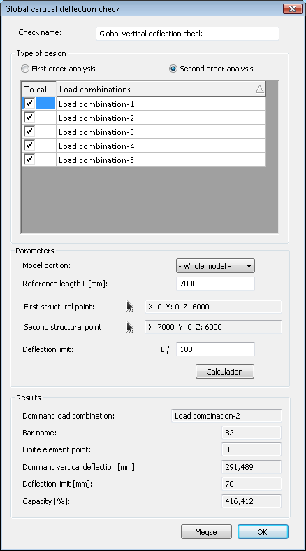

# Serviceability checks

<!-- /wp:paragraph -->

<!-- wp:heading {"level":3} -->

### Basics

<!-- /wp:heading -->

<!-- wp:paragraph -->

All serviceability-related functions can be found on the **Serviceability tab**. By clicking on the blue arrow icon a new dialog appears. The previously defined serviceability checks can be found and it is also possible to open or delete the selected checks.

In order to create a new serviceability check, the **New check** button is clicked. The following checks can be performed:

- Global horizontal deflection check

- Global vertical deflection check

- Local deflection check by members

- Relative deflection check for 2 points

### Global horizontal deflection check

A global horizontal deflection check can be used to check the biggest horizontal deflection in the model. First- or Second-order analysis can be selected just like the serviceability load combinations that need to be considered.

Reference height can be typed in or two points can be selected, and the program calculates the height distance between them. Check is done after clicking the **Calculation** button. The dominant member is automatically selected in the model space to make the interpretation easier.

### Global vertical deflection check

The global vertical deflection check works similarly to the global horizontal deflection check. There is just a minor difference which is the following: reference length has to be set instead of reference height. This can be set manually or by clicking two points on the model.

### Local deflection check by members

Local deflection check by members goes through all the beams in the model, checks the local deflection, and then selects the maximum. This check is suitable only for horizontal beams i.e. members in the XY plane.

Local deflection check by members is not adequate for cantilever beams just for beams supported by two other beams or supports on both ends.

## Relative deflection check for 2 points

A relative deflection check for 2 points can be used for two clicked points. The relative horizontal or vertical check can be selected and performed.

## Seismic interstorey drift verification

The prerequisite for performing the check is the existence of the levels defined in the model and the completion of the seismic analysis. The check calculates the horizontal displacements in both directions between all the established adjacent levels and displays the maximum of these displacements, together with the dominant load combination and the names of the levels.

