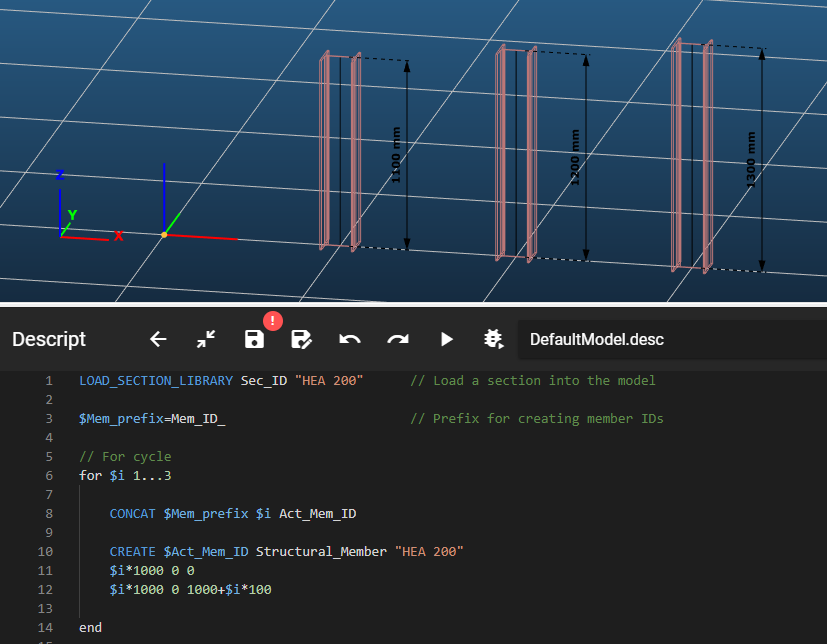

# Cycles

A cycle, or also called a loop, is a programming tool for cyclical code execution. Descript implements the for cycle for this purpose.

## For cycle syntax

**for** \[Running variable] \[Start value]...\[End value]  
&nbsp; &nbsp; &nbsp; &nbsp; // Place for the looped code  
**end**

### Syntax explanation

Any code that is put between the _for_ and the _end_ keywords constitutes the body of the for block and will be executed cyclically. The number of cycles is specified by the _Start_- and _End value_ parameters.

## Parameters

### Running variable
This variable is of integer type. Its starting value is given by the _Start value_ parameter, and it will increase by 1 in every subsequent loop, until it reaches the value of the _End value_ parameter. The running variable is usually named _\$i_ or _\$n_.

### Start value
The starting value of the _Running variable_.

### End value
The last value the _Running variable_ will have in the last cycle.

## Cycle block specific commands

The following commands are only valid within the body of a for loop:
### BREAK
Exits the for loop. In other words, it jumps to the execution of the next line after the _end_ keyword of the current for block.

### CONTINUE
Jumps to the next cycle within the for loop, without executing the rest of the for block's body. In other words, it jumps to the first line of the for block with the _Running variable_ increased by 1. If this would increase the _Running variable_ to be more then the _End value_, then it jumps out of the for block.

## Sample code

**For loop only:**

```
for $i 1...10

    // Place for the looped code

end
```

**Example:**

```
LOAD_SECTION_LIBRARY Sec_ID "HEA 200"      // Load a section into the model

$Mem_prefix=Mem_ID_                        // Prefix for creating member IDs

// For cycle
for $i 1...3

    CONCAT $Mem_prefix $i Act_Mem_ID

    CREATE $Act_Mem_ID Structural_Member "HEA 200"
    $i*1000 0 0
    $i*1000 0 1000+$i*100

end
```

Let's look at what happens here step-by-step:

- First we load a section into the model
- We create a variable named _\$Mem\_prefix_ for member ID generation
- Then we start the for cycle with the _Running parameter_ named _\$i_, _Start value_ of 1 and _End value_ of 3.  
This will run our code 3 times with _\$i_ getting the values 1, 2 and 3 assigned to it in each subsequent loop.
- Within the body of the for loop 
    - First we have a CONCAT command, that creates a member ID from the value of the _\$Mem\_prefix_ variable and the current value of _\$i_ and saves it into a variable named _\$Act_Mem_ID_, that will be used in the CREATE command.
    - Then we have a CREATE command that will create a structural member
    - The first line immediately after the CREATE command is the member's starting point's (x, y, z) coordinates, where x = _\$i_ * 1000
    - The second line immediately after the starting point's coordinates is the endpoint's (x, y, z) coordinates, where x is the same as in case of the starting point, and z = 1000 + _\$i_ * 100
- After these lines the _end_ keyword closes the body of the for loop

As a result we will have 3 vertical structural members created next to each other, with increasing height:

[](./img/Cycles_Example_1_v02.png)
