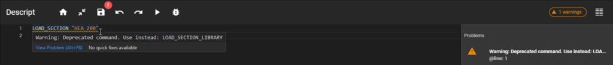
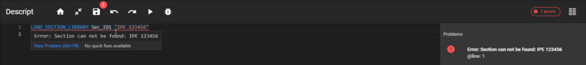
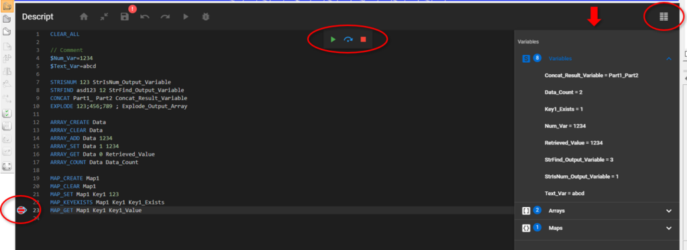

# Debugging

## Code check

Code check results are displayed after a script run is attempted and warnings or errors are found.

The code check differentiates 2 types of (potential) issues found in the code:

**Warning**: The code line that produces the warning is underlined with yellow. The warning message states the reason for the warning. Warnings do not prevent the code from running properly.

Warning messages are displayed if the "warnings" text is clicked on the right side, or if the mouse pointer is placed over the underlined row.

[](https://consteelsoftware.com/wp-content/uploads/2022/03/image-8.png)

**Error**: The code line that produces the error is underlined with red. The error message states the reason for the error. Errors prevent the code from running properly.

Error messages are displayed if the "errors" text is clicked on the right side, or if the mouse pointer is placed over the underlined row.

[](https://consteelsoftware.com/wp-content/uploads/2022/03/image-10.png)

## Debugging function

The debugging function can evaluate the written code step-by-step.

With this button  a script run can be started in debug mode. In this mode the execution of the code can be stopped at breakpoints. Breakpoints can be placed on the left side of the row numbers, next to rows that contain commands or variable definitions. Possible breakpoint positions are shown with an empty circle, if the mouse pointer is placed over one.

[](./img/wp-content-uploads-2022-03-image-11.png)

Clicking here will place a breakpoint. Breakpoints can also be removed similarly.

[](./img/wp-content-uploads-2022-03-image-5.png)

At this state, if a debug run is started, then the code execution will stop at the first breakpoint. While the code execution is stopped, the current state of the Consteel model and the data containers in the code can be viewed.

[](https://consteelsoftware.com/wp-content/uploads/2022/03/image-7.png)

On top of the breakpoint, an arrow shows that the code execution is stopped at that row. In this state, if the watch window is opened on the right, the current value of all data containers (variables, arrays, maps) are shown.

Some additional buttons also appear in the top middle part of the code input area with the following functions:

 Go to next breakpoint

 Go to next row

 Exit debug run

With the help of these debug controls the code execution can be followed step-by-step or even row-by-row if necessary, and potential bugs can be found. Breakpoints can also be added or removed during the debug run, while the code execution is stopped.

You can try out the debug functions on the code shown above. Just copy-paste it from here:

```
$Num_Var=1234
$Text_Var=abcd

STRISNUM 123 StrIsNum_Output_Variable
STRFIND asd123 12 StrFind_Output_Variable
CONCAT Part1_ Part2 Concat_Result_Variable
EXPLODE 123;456;789 ; Explode_Output_Array

ARRAY_CREATE Data
ARRAY_CLEAR Data
ARRAY_ADD Data 1234
ARRAY_SET Data 1 1234
ARRAY_GET Data 0 Retrieved_Value
ARRAY_COUNT Data Data_Count

MAP_CREATE Map1
MAP_CLEAR Map1
MAP_SET Map1 Key1 123
MAP_KEYEXISTS Map1 Key1 Key1_Exists
MAP_GET Map1 Key1 Key1_Value
```
