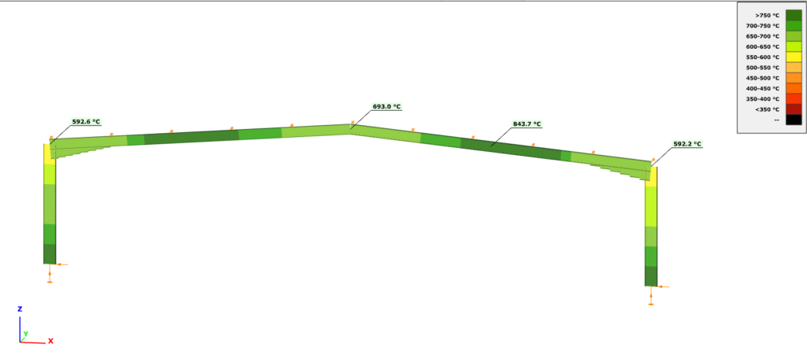

# Design

### Fire design on elevated temperature

<!-- /wp:heading -->

<!-- wp:paragraph {"align":"justify"} -->

_**Consteel**_ performs cross section resistance and buckling checks for all steel members which are subjected to fire effect by using the adequate formulas from the EuroCode 3 standard.

<!-- /wp:paragraph -->

<!-- wp:paragraph -->

**Classification of cross-section (EN 1993-1-2 4.2.2)**

<!-- /wp:paragraph -->

<!-- wp:paragraph {"align":"justify"} -->

Cross-sections are classified as for normal tempereature (EN 1993-1-1) but using the reduced value for ε.

<!-- /wp:paragraph -->

<!-- wp:paragraph {"editorskit":{"indent":40,"devices":false,"desktop":true,"tablet":true,"mobile":true,"loggedin":true,"loggedout":true,"acf_visibility":"","acf_field":"","acf_condition":"","acf_value":"","migrated":false,"unit_test":false}} -->

$\varepsilon = 0,85 \left [\dfrac {235} {f_y} \right ] ^{0,5}$

<!-- /wp:paragraph -->

<!-- wp:paragraph -->

**Tension (EN 1993-1-2 4.2.3.1)**

<!-- /wp:paragraph -->

<!-- wp:paragraph {"editorskit":{"indent":20,"devices":false,"desktop":true,"tablet":true,"mobile":true,"loggedin":true,"loggedout":true,"acf_visibility":"","acf_field":"","acf_condition":"","acf_value":"","migrated":false,"unit_test":false}} -->

Permanent temperature ((1))

<!-- /wp:paragraph -->

<!-- wp:paragraph {"editorskit":{"indent":40,"devices":false,"desktop":true,"tablet":true,"mobile":true,"loggedin":true,"loggedout":true,"acf_visibility":"","acf_field":"","acf_condition":"","acf_value":"","migrated":false,"unit_test":false}} -->

$N_{t,fi,\Theta,Rd} = k_{y,\Theta}\cdot \left [\dfrac {\gamma_{M,0}} {\gamma_{M,fi}} \right ]\cdot N_{pl,Rd}\qquad \qquad$ (Class 1-4)

Where  
$k_{y,\Theta}\qquad\qquad$ acc. to EN 1993-1-2 Table 3.1  
$N_{pl,Rd}\qquad\qquad$ the design resistance for normal temperature

<!-- /wp:paragraph -->

<!-- wp:paragraph {"editorskit":{"indent":20,"devices":false,"desktop":true,"tablet":true,"mobile":true,"loggedin":true,"loggedout":true,"acf_visibility":"","acf_field":"","acf_condition":"","acf_value":"","migrated":false,"unit_test":false}} -->

Varying temperature ((2))

<!-- /wp:paragraph -->

<!-- wp:paragraph {"editorskit":{"indent":40,"devices":false,"desktop":true,"tablet":true,"mobile":true,"loggedin":true,"loggedout":true,"acf_visibility":"","acf_field":"","acf_condition":"","acf_value":"","migrated":false,"unit_test":false}} -->

$N_{t,fi,t,Rd} = A_{non,t}\cdot \dfrac {f_y} {\gamma_{M,fi}}\qquad \qquad$ (Class 1-4)

<!-- /wp:paragraph -->

<!-- wp:paragraph -->

**Compression**  (Class 1-3: EN 1993-1-2 4.2.3.2, Class 4: + Annex E.2)

<!-- /wp:paragraph -->

<!-- wp:paragraph {"editorskit":{"indent":20,"devices":false,"desktop":true,"tablet":true,"mobile":true,"loggedin":true,"loggedout":true,"acf_visibility":"","acf_field":"","acf_condition":"","acf_value":"","migrated":false,"unit_test":false}} -->

Permanent temperature ((1))

<!-- /wp:paragraph -->

<!-- wp:paragraph {"editorskit":{"indent":40,"devices":false,"desktop":true,"tablet":true,"mobile":true,"loggedin":true,"loggedout":true,"acf_visibility":"","acf_field":"","acf_condition":"","acf_value":"","migrated":false,"unit_test":false}} -->

$N_{c,fi,t,Rd} = A\cdot \dfrac {k_{y,\Theta}\cdot f_y} {\gamma_{M,fi}}\qquad \qquad$ (Class 1-3)

$N_{c,fi,t,Rd} = A_{eff}\cdot \dfrac {k_{p0,2,\Theta}\cdot f_y} {\gamma_{M,fi}}\qquad \qquad$ (Class 4)

Where  
$k_{p0,2,\\Theta}\qquad \qquad$ acc. to EN 1993-1-2 Table 3.1

<!-- /wp:paragraph -->

<!-- wp:paragraph {"editorskit":{"indent":20,"devices":false,"desktop":true,"tablet":true,"mobile":true,"loggedin":true,"loggedout":true,"acf_visibility":"","acf_field":"","acf_condition":"","acf_value":"","migrated":false,"unit_test":false}} -->

Varying temperature ((6))

<!-- /wp:paragraph -->

<!-- wp:paragraph {"editorskit":{"indent":40,"devices":false,"desktop":true,"tablet":true,"mobile":true,"loggedin":true,"loggedout":true,"acf_visibility":"","acf_field":"","acf_condition":"","acf_value":"","migrated":false,"unit_test":false}} -->

Conservative way, case (1) where $\Theta_a = \Theta_{a,max}$

<!-- /wp:paragraph -->

<!-- wp:paragraph -->

**Bending (EN 1993-1-2 Class 1-2: 4.2.3.3; Class 3: 4.2.3.4; Class 4: + Annex E.2)**

<!-- /wp:paragraph -->

<!-- wp:paragraph {"editorskit":{"indent":20,"devices":false,"desktop":true,"tablet":true,"mobile":true,"loggedin":true,"loggedout":true,"acf_visibility":"","acf_field":"","acf_condition":"","acf_value":"","migrated":false,"unit_test":false}} -->

Permanent temperature ((1))

<!-- /wp:paragraph -->

<!-- wp:paragraph {"editorskit":{"indent":40,"devices":false,"desktop":true,"tablet":true,"mobile":true,"loggedin":true,"loggedout":true,"acf_visibility":"","acf_field":"","acf_condition":"","acf_value":"","migrated":false,"unit_test":false}} -->
Permanent temperature ((1))

$M_{fi,\Theta ,Rd} = k_{y,\Theta}\cdot \dfrac {\gamma_{M,0}} {\gamma_{M,fi}}\cdot M_{Rd}\qquad $

Where
$M_{Rd}=M_{pl.Rd}\qquad $ or in the case of shear: $M_{Rd}=M_{V.Rd}\qquad \qquad $  (Class 1-2)
$M_{Rd}=M_{el.Rd}\qquad $ or in the case of shear: $M_{Rd}=M_{V.Rd}\qquad \qquad $ (Class 3)
$M_{Rd}=M_{eff.Rd}\qquad \qquad \qquad \qquad \qquad \qquad \qquad \qquad \qquad \qquad $ (Class 4)
$k_{y,\Theta}\qquad \qquad$ acc. to EN 1993-1-2 Table 3.1

<!-- /wp:paragraph -->

<!-- wp:paragraph {"editorskit":{"indent":20,"devices":false,"desktop":true,"tablet":true,"mobile":true,"loggedin":true,"loggedout":true,"acf_visibility":"","acf_field":"","acf_condition":"","acf_value":"","migrated":false,"unit_test":false}} -->

Varying temperature ((2))

<!-- /wp:paragraph -->

<!-- wp:paragraph {"editorskit":{"indent":40,"devices":false,"desktop":true,"tablet":true,"mobile":true,"loggedin":true,"loggedout":true,"acf_visibility":"","acf_field":"","acf_condition":"","acf_value":"","migrated":false,"unit_test":false}} -->

$M_{fi,t,Rd} = W_{pl,non,t}\cdot \dfrac {f_y} {\gamma_{M,fi}}\qquad \qquad $ (Class 1-2)
$M_{fi,t,Rd} = k_{y,\Theta ,max}\cdot \dfrac {\gamma_{M,0}} {\gamma_{M,fi}}\cdot \dfrac {1} {\kappa_1\cdot \kappa_2}\qquad \qquad $ (Class 3)
$M_{fi,t,Rd} = k_{p0,2,\Theta ,max}\cdot \dfrac {\gamma_{M,0}} {\gamma_{M,fi}}\cdot \dfrac {1} {\kappa_1\cdot \kappa_2}\cdot M_{eff,Rd}\qquad \qquad $ (Class 4)

<!-- /wp:paragraph -->

<!-- wp:paragraph -->

**Shear (EN 1993-1-2 Class 1-2: 4.2.3.3(6); Class 3: 4.2.3.4(4); Class 4: + Annex E.2)**

<!-- /wp:paragraph -->

<!-- wp:paragraph {"editorskit":{"indent":20,"devices":false,"desktop":true,"tablet":true,"mobile":true,"loggedin":true,"loggedout":true,"acf_visibility":"","acf_field":"","acf_condition":"","acf_value":"","migrated":false,"unit_test":false}} -->

Permanent temperature

<!-- /wp:paragraph -->

<!-- wp:paragraph {"editorskit":{"indent":40,"devices":false,"desktop":true,"tablet":true,"mobile":true,"loggedin":true,"loggedout":true,"acf_visibility":"","acf_field":"","acf_condition":"","acf_value":"","migrated":false,"unit_test":false}} -->

$V_{fi,t,Rd} = k_{y,\Theta ,web}\cdot \dfrac {\gamma_{M,0}} {\gamma_{M,fi}}\cdot V_{Rd}\qquad \qquad $ (Class 1-4)

<!-- /wp:paragraph -->

<!-- wp:paragraph {"editorskit":{"indent":20,"devices":false,"desktop":true,"tablet":true,"mobile":true,"loggedin":true,"loggedout":true,"acf_visibility":"","acf_field":"","acf_condition":"","acf_value":"","migrated":false,"unit_test":false}} -->

Varying temperature

<!-- /wp:paragraph -->

<!-- wp:paragraph {"editorskit":{"indent":40,"devices":false,"desktop":true,"tablet":true,"mobile":true,"loggedin":true,"loggedout":true,"acf_visibility":"","acf_field":"","acf_condition":"","acf_value":"","migrated":false,"unit_test":false}} -->

$k_{y,\Theta ,web}\qquad \qquad $ the hottest point in the web

<!-- /wp:paragraph -->

<!-- wp:paragraph -->

**In case of complex internal forces _Consteel_ use the conservative interaction formula neglecting the effect of shear:**

<!-- /wp:paragraph -->

<!-- wp:paragraph {"editorskit":{"indent":40,"devices":false,"desktop":true,"tablet":true,"mobile":true,"loggedin":true,"loggedout":true,"acf_visibility":"","acf_field":"","acf_condition":"","acf_value":"","migrated":false,"unit_test":false}} -->

$\dfrac {N_{fi,Ed}} {N_{fi,\Theta ,Ed}}+\dfrac {M_{y,fi,Ed}} {M_{y,fi,\Theta ,Ed}}+\dfrac {M_{z,fi,Ed}} {M_{z,fi,\Theta ,Ed}}\leq 1\qquad \qquad $ 

<!-- /wp:paragraph -->

<!-- wp:paragraph -->

**Global stability resistance**

<!-- /wp:paragraph -->

<!-- wp:paragraph {"align":"justify"} -->

To calculate the global stability resistance for fire design situation, _Consteel_ uses EuroCode General method (EN 1993-1-1 6.3.4) as for normal temperature but using the proper buckling curves:

<!-- /wp:paragraph -->

<!-- wp:paragraph {"editorskit":{"indent":40,"devices":false,"desktop":true,"tablet":true,"mobile":true,"loggedin":true,"loggedout":true,"acf_visibility":"","acf_field":"","acf_condition":"","acf_value":"","migrated":false,"unit_test":false}} -->

For compression

<!-- /wp:paragraph -->

<!-- wp:paragraph {"editorskit":{"indent":40,"devices":false,"desktop":true,"tablet":true,"mobile":true,"loggedin":true,"loggedout":true,"acf_visibility":"","acf_field":"","acf_condition":"","acf_value":"","migrated":false,"unit_test":false}} -->

$\chi _{fi}=\dfrac {1}{\varphi_{\Theta}+\sqrt{\varphi_{\Theta}^2-\bar{\lambda}_{\Theta}^2}}$ 

For bending

$\chi _{LT,fi}=\dfrac {1}{\phi_{LT,\Theta ,com}+\sqrt{\phi_{LT,\Theta ,com}^2-\bar{\lambda}_{LT,\Theta ,com}^2}}$

<!-- /wp:paragraph -->

<!-- wp:paragraph {"editorskit":{"indent":40,"devices":false,"desktop":true,"tablet":true,"mobile":true,"loggedin":true,"loggedout":true,"acf_visibility":"","acf_field":"","acf_condition":"","acf_value":"","migrated":false,"unit_test":false}} -->

<!-- /wp:paragraph -->

<!-- wp:heading {"level":3} -->

### Critical temperature calculation

<!-- /wp:heading -->

<!-- wp:paragraph {"align":"justify"} -->

The critical temperature calculation can be activated in the design settings window. This option is only active if the following conditions are met

<!-- /wp:paragraph -->

<!-- wp:list {"type":"a"} -->

- at least one member with reactive fire protection
- at least one fire load case set to room temperature analysis
- at least one load combination with fire load case is selected for global design

<!-- /wp:list -->

<!-- wp:image {"align":"center","id":9402,"width":530,"height":370,"sizeSlug":"large","linkDestination":"media"} -->

<!-- /wp:image -->

<!-- wp:paragraph {"align":"justify"} -->

The results of the calculation can be queried in the **Design Parameters** drop-down menu. The results are displayed in a colored graphic. You can also open the **Section Module** from here by right-clicking on a given section, where the details of the critical temperature calculation can be found. The first line of the summary reads whether the profile should be protected or not, and the critical temperature field contains the relevant part of EC, the applied fire curve, the unprotected fire resistance time and temperature reached of the profile and the required fire resistance time.

<!-- /wp:paragraph -->

<!-- wp:image {"align":"center","id":9408,"width":822,"height":365,"sizeSlug":"large","linkDestination":"media"} -->

<!-- /wp:image -->

<!-- wp:image {"align":"center","id":9415,"width":530,"height":378,"sizeSlug":"large","linkDestination":"media"} -->

<!-- /wp:image -->

<!-- wp:paragraph -->

<!-- /wp:paragraph -->
